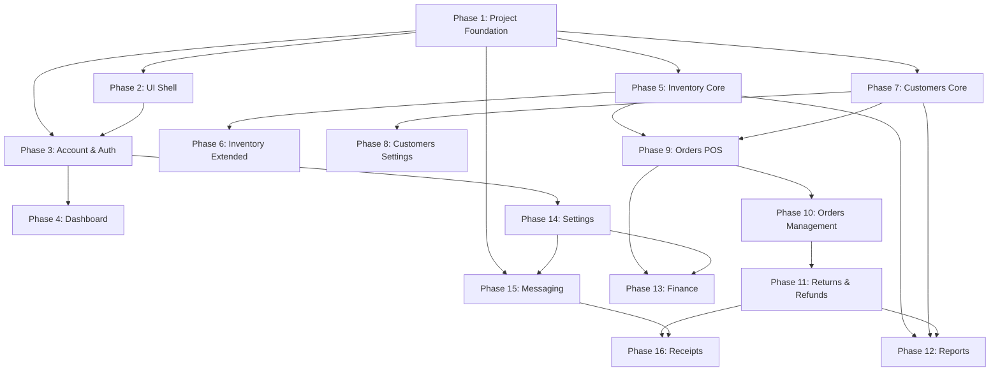

# AZ Books - Phase Overview Guide

## Project Summary
This document provides a comprehensive overview of the 16 phases required to build the complete AZ Books application. Each phase is designed to be implemented in logical order, with clear dependencies.

---

## Phase Execution Order

---

## Quick Reference Table

| Phase | Name | P4.md Section | Dependencies | Estimated Complexity |
|-------|------|---------------|--------------|---------------------|
| 1 | Project Foundation | 1.1-1.4 (Lines 6-51) | None | High |
| 2 | UI Shell & Navigation | 2.1-2.4 (Lines 54-125) | Phase 1 | Medium |
| 3 | Account & Authentication | 3.1 (Lines 130-138) | Phase 1, 2 | Medium |
| 4 | Dashboard App | 3.2 (Lines 140-158) | Phase 1-3 | Medium |
| 5 | Inventory Core | 3.3.1-3.3.5 (Lines 160-213) | Phase 1-3 | High |
| 6 | Inventory Extended | 3.3.6-3.3.9 (Lines 214-239) | Phase 5 | Medium |
| 7 | Customers Core | 3.4.1-3.4.4 (Lines 241-313) | Phase 1-3 | High |
| 8 | Customers Settings | 3.4.5-3.4.6 (Lines 315-330) | Phase 7 | Medium |
| 9 | Orders POS | 3.5.1 (Lines 333-371) | Phase 5, 7 | High |
| 10 | Orders Management | 3.5.2-3.5.3 (Lines 373-444) | Phase 9 | High |
| 11 | Returns & Refunds | 3.5.4-3.5.5 (Lines 446-461) | Phase 10 | Medium |
| 12 | Reports & Analytics | 3.6 (Lines 463-524) | Phase 5-11 | High |
| 13 | Finance App | 3.7 (Lines 526-697) | Phase 9-11, 14 | Very High |
| 14 | Settings App | 3.8 (Lines 699-776) | Phase 3 | High |
| 15 | Messaging System | 4.1-4.4 (Lines 780-817) | Phase 1, 14 | Medium |
| 16 | Receipts | 5.1-5.2 (Lines 820-843) | Phase 9-11, 15 | Medium |

---

## Phase Details Summary

### Foundation Layer (Phases 1-3)
These phases establish the core infrastructure that all other phases build upon.

| Phase | Description | Key Deliverables |
|-------|-------------|------------------|
| **[Phase 1](Phase_01_Project_Foundation.md)** | Project Foundation & Core Infrastructure | Django setup, PostgreSQL, PWA, Maps, DRF |
| **[Phase 2](Phase_02_UI_Shell_Navigation.md)** | UI Shell & Navigation Structure | Top bar, Bottom nav, Sidebar, Omni-search |
| **[Phase 3](Phase_03_Account_Authentication.md)** | Account & Authentication System | JWT auth, Login/Logout, Profile, Activity log |

### Core Applications (Phases 4-8)
These phases build the primary data management modules.

| Phase | Description | Key Deliverables |
|-------|-------------|------------------|
| **[Phase 4](Phase_04_Dashboard_App.md)** | Dashboard Application | Quick stats, Charts, Alerts, Quick actions |
| **[Phase 5](Phase_05_Inventory_Core.md)** | Inventory Management - Core | Products CRUD, AVCO costing, Stock history |
| **[Phase 6](Phase_06_Inventory_Extended.md)** | Inventory Management - Extended | Categories, Vendors, Stock adjustments |
| **[Phase 7](Phase_07_Customers_Core.md)** | Customer Management - Core | Customers CRUD, Addresses, Links, Wallet |
| **[Phase 8](Phase_08_Customers_Settings.md)** | Customer Settings | Schools, Classes, Divisions, Location tags |

### Order Processing (Phases 9-11)
These phases implement the complete order lifecycle.

| Phase | Description | Key Deliverables |
|-------|-------------|------------------|
| **[Phase 9](Phase_09_Orders_POS.md)** | Order Management - POS Interface | POS UI, Cart, Payments, Order creation |
| **[Phase 10](Phase_10_Orders_Management.md)** | Order Management - View & Status | Order list, Details, Status state machine |
| **[Phase 11](Phase_11_Orders_Returns_Refunds.md)** | Returns & Refunds | Return workflow, Stock restoration, Refunds |

### Business Intelligence & Administration (Phases 12-16)
These phases add reporting, finance, settings, and communication features.

| Phase | Description | Key Deliverables |
|-------|-------------|------------------|
| **[Phase 12](Phase_12_Reports_Analytics.md)** | Reporting & Analytics | Sales, Inventory, Customer reports, Export |
| **[Phase 13](Phase_13_Finance_App.md)** | Finance & Accounting | P&L, Expenses, Salaries, Lenders, Banking |
| **[Phase 14](Phase_14_Settings_App.md)** | Settings & Configuration | Store info, RBAC, Tax, Integrations, Backup |
| **[Phase 15](Phase_15_Messaging_System.md)** | Messaging System | Android gateway, SMS queue, Spintax |
| **[Phase 16](Phase_16_Receipts.md)** | Receipts & Messages | Public receipt view, PDF, Message templates |

---

## Recommended Implementation Approach

### Sprint 1: Foundation (Weeks 1-2)
- Phase 1: Project Foundation
- Phase 2: UI Shell & Navigation
- Phase 3: Account & Authentication

### Sprint 2: Core Data (Weeks 3-5)
- Phase 5: Inventory Core
- Phase 6: Inventory Extended
- Phase 7: Customers Core
- Phase 8: Customers Settings

### Sprint 3: Orders & POS (Weeks 6-8)
- Phase 9: Orders POS
- Phase 10: Orders Management
- Phase 11: Returns & Refunds
- Phase 4: Dashboard (can be done in parallel)

### Sprint 4: Settings & Finance (Weeks 9-11)
- Phase 14: Settings & Configuration
- Phase 13: Finance & Accounting

### Sprint 5: Reports & Communications (Weeks 12-14)
- Phase 12: Reports & Analytics
- Phase 15: Messaging System
- Phase 16: Receipts

---

## P4.md Section Coverage

| P4.md Section | Phase(s) |
|---------------|----------|
| 1. Core Technical Specifications | Phase 1 |
| 2. User Interface Structure | Phase 2 |
| 3.1 App: account | Phase 3 |
| 3.2 App: dashboard | Phase 4 |
| 3.3 App: inventory | Phases 5, 6 |
| 3.4 App: customers | Phases 7, 8 |
| 3.5 App: orders | Phases 9, 10, 11 |
| 3.6 App: reports | Phase 12 |
| 3.7 App: finance | Phase 13 |
| 3.8 App: settings | Phase 14 |
| 4. Messaging System | Phase 15 |
| 5. Receipt & Message Formats | Phase 16 |

---

## How to Use This Guide

1. **Start with Phase 1** - This sets up the entire project foundation
2. **Follow the dependency chain** - Each phase lists its dependencies
3. **Reference individual phase files** - Each phase has detailed objectives, deliverables, and success criteria
4. **Track progress** - Use the success criteria checkboxes in each phase document
5. **P4.md Reference** - Each phase includes the exact line numbers in P4.md for detailed requirements

> **Note**: All 844 lines of P4.md are covered across these 16 phases. No requirements have been omitted.
