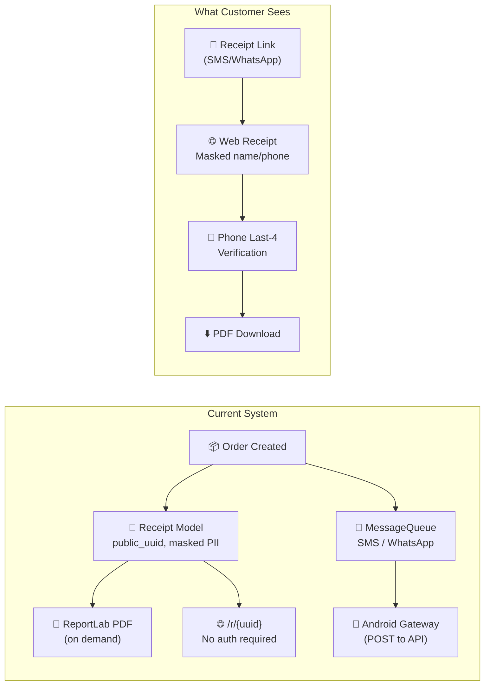
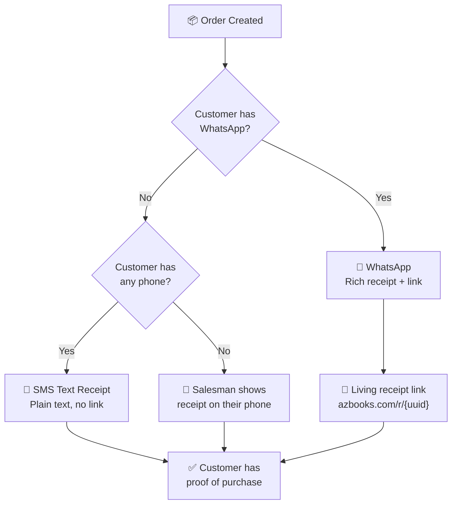
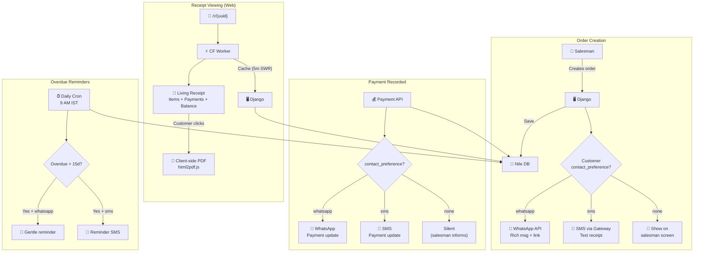
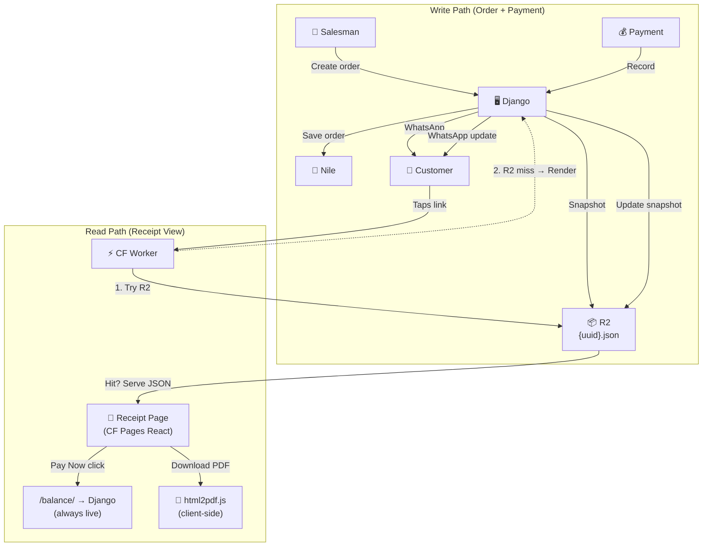

# 🏛️ Tribunal Review: Receipt & Messaging System

**Date**: 26 March 2026  
**Subject**: AZ Books Receipt Generation & Customer Messaging Architecture  
**Panel**: 6 reviewers. Full codebase audit complete.

---

## System Under Review — Architecture Overview



### Files Reviewed

| File | Purpose | Lines |
|:--|:--|:--|
| [receipt_models.py](file:///z:/books2/orders/receipt_models.py) | Receipt + ReceiptVerification models | 60 |
| [receipt_views.py](file:///z:/books2/orders/receipt_views.py) | Public receipt API + PDF download | 116 |
| [receipt_utils.py](file:///z:/books2/orders/receipt_utils.py) | ReportLab PDF generation | 183 |
| [receipt_serializers.py](file:///z:/books2/orders/receipt_serializers.py) | Public receipt + verification serializers | 60 |
| [messaging/models.py](file:///z:/books2/messaging/models.py) | Gateway, MessageTemplate (Spintax), MessageQueue | 189 |
| [messaging/views.py](file:///z:/books2/messaging/views.py) | Gateway CRUD, template preview, queue management | 211 |
| [messaging/tasks.py](file:///z:/books2/messaging/tasks.py) | Dispatch logic, queue processing, heartbeat checks | 197 |
| [messaging/utils.py](file:///z:/books2/messaging/utils.py) | Spintax expansion, validation, variation counting | 124 |

---

## Round 1 — Opening Statements

### 🟡 Scalpel *(forensic tone)*

I've traced every execution path in this system. Let me walk you through what actually happens when a customer receives a receipt:

```
1. Salesman creates Order → OrderViewSet.create()
2. ??? → Receipt is NOT auto-created
3. Someone must manually call "generate receipt" → Receipt.objects.create()
4. Receipt gets a public_uuid → /r/{uuid} becomes accessible
5. SMS/WhatsApp message is queued with the receipt URL
6. MessageQueue stays "pending" forever — NO Celery worker exists
7. Customer never receives the SMS
8. Receipt link works, but nobody knows it exists
```

**The entire messaging pipeline is dead code.** There is no Celery worker, no Redis broker, and no cron job to process the queue. Messages are created and sit in `pending` status forever. The `tasks.py` file has Celery decorators **commented out** (lines 183-196).

The system has been meticulously engineered — Spintax templates, gateway heartbeats, retry logic, rate limiting — but none of it runs. It's a Ferrari engine sitting on a workbench.

**Verdict: 🔴 REJECTED — The messaging system is architecturally complete but operationally dead.**

---

### 🟢 Store Manager *(leaning forward)*

Let me tell you how receipts actually work in my shop today:

1. Customer comes, buys books worth ₹2,500
2. My guy writes it in a carbon-copy receipt book — white copy to customer, yellow copy stays with us
3. For school orders (bulk), I give a printed bill from my thermal printer
4. **That's it.** No SMS. No WhatsApp. No PDF.

Now here's what I WANT:
- When salesman creates order on the app → **WhatsApp message goes to customer immediately** with:"*AZ Books - Order #2456 confirmed. ₹2,500 total, ₹1,000 paid, ₹1,500 balance. View receipt: azbooks.com/r/abc123*"
- Customer taps the link → sees their order details on their phone
- Customer taps "Download PDF" → gets a proper receipt for their records
- **During peak season**, I'm processing 50-100 orders/day. The messaging must be **instant and automatic**. I can't afford to manually send anything.

**The current system has all the pieces but nothing is connected.** It's like having a car with the engine, wheels, and steering wheel all in separate boxes.

---

### 🔴 Chaos Architect *(already attacking)*

While you worry about connecting pieces, I found **5 security vulnerabilities** in what exists:

**1. Phone last-4 verification is trivially brute-forceable.**
The code blocks after 5 failed attempts per receipt. But there are only 10,000 possible 4-digit combinations (`0000-9999`). An attacker creates 2,000 `ReceiptVerification` entries (400 receipts × 5 attempts each) and statistically hits the right code for ~40% of receipts. The rate limit is per-receipt, not per-IP.

**2. PII masking is reversible.**
`get_masked_customer_name()` returns `name[:3] + "***"`. If the customer's name is "Raj", the mask returns "Raj***" — **the full first name is revealed**. For a 3-letter name, there's zero privacy.

**3. Receipt UUIDs are enumerable via timing attack.**
`get_object_or_404` returns 404 for non-existent receipts and 200 for existing ones. An attacker can probe UUIDs and measure response times to build a list of valid receipt IDs.

**4. PDF files stored on Render's ephemeral filesystem.**
`receipt.pdf_file` uses `FileField(upload_to='receipts/')`. On Render's free tier, the filesystem is **ephemeral** — files disappear on every deploy. Every generated PDF vanishes after a redeploy.

**5. Gateway API keys stored in plain text in the database.**
`Gateway.api_key = CharField(max_length=255)`. If the database is compromised, the attacker gets raw API keys to your SMS gateway. Should be encrypted at rest.

---

### 🟣 Prism *(cutting to first principles)*

Let me deconstruct what this system actually needs to do:

```
INPUT:  Order (items, amounts, customer phone)
OUTPUT: Customer has a receipt accessible on their phone
```

That's it. Everything else is implementation detail. Now let me ask three "delete before you add" questions:

**1. Do we need a Receipt model at all?**
The `Order` already contains everything the receipt shows. The Receipt model adds: `public_uuid`, `pdf_file`, `is_sent`, `download_count`. The `public_uuid` could be a field on Order. The PDF can be generated on-the-fly. `is_sent` and `download_count` are analytics, not core function. **The Receipt model can be merged into Order.**

**2. Do we need PDF generation on the Django server?**
PDFs are generated by `xhtml2pdf` which is heavy (~200MB RAM spike). On Render's 512MB free tier, this is dangerous. **Alternative**: Generate the receipt as a **styled HTML page** on Cloudflare Pages. If the customer wants a PDF, their browser's "Print → Save as PDF" does this for free. Or use a client-side library like `html2pdf.js` to convert in the browser.

**3. Do we need Celery for messaging?**
Celery requires a Redis/RabbitMQ broker, a separate worker process, and careful monitoring. On a free-tier setup with Render, you cannot run a background Celery worker — you only get one process. **Alternative**: Fire-and-forget HTTP request to an **external free SMS API** when the order is created. No queue, no worker, no broker.

---

### 🟠 DBA

Prism's point about merging Receipt into Order is correct architecturally, but wrong operationally. The Receipt has a **public_uuid** separate from the Order ID for security. If you use the Order ID in the receipt URL, anyone who knows an order number can access the receipt. UUIDs are unguessable.

However, you don't need a separate **model** for this. Add a `receipt_uuid` field to Order:

```python
class Order(models.Model):
    receipt_uuid = models.UUIDField(default=uuid.uuid4, unique=True, editable=False)
```

That's the Receipt model replaced by one field. Delete `receipt_models.py` entirely.

**On PDF storage**: The Chaos Architect is right — Render's filesystem is ephemeral. PDFs must be stored on Backblaze B2 or **not stored at all** (generated on demand). Since PDFs are tiny (~50KB) and generation takes <1 second, I recommend **on-demand generation, no storage**.

---

### 🔵 Ironclad

I've enumerated every failure state in the current receipt flow:

| # | Failure | Impact | Current Handling |
|:--|:--|:--|:--|
| 1 | Receipt created but SMS never sent (no Celery) | Customer never gets link | ❌ None |
| 2 | PDF generated on Render, lost on redeploy | Customer can't re-download | ❌ None |
| 3 | Gateway offline, message stays pending forever | Silent failure | ⚠️ Retry 3× then "failed" — but nobody checks |
| 4 | Spintax generates empty message if all options are empty | Blank SMS to customer | ❌ No validation |
| 5 | Customer phone is null → SMS to `None` | Gateway error | ❌ No null check before queueing |
| 6 | 50 orders in peak season, all queue SMS → rate limit 1/sec = 50 seconds | Last customer waits 50 seconds for SMS | ⚠️ Acceptable but fragile |
| 7 | Public receipt endpoint has no rate limit | Scraping of all receipts | ❌ None |

**Most critical: Failure #1.** The entire purpose of the system — delivering receipts to customers — doesn't work. Everything else is secondary.

---

## Round 2 — "How Do We Actually Deliver Receipts?"

### 🟣 Prism

Let me present three architectures, cheapest first:

#### Option A: WhatsApp Cloud API (Free)

Meta's WhatsApp Cloud API gives **1,000 free service conversations/month**. A "service conversation" is a 24-hour window after you message the customer. For AZ Books with ~50-100 orders/day in peak season (30 days), that's 1,500-3,000 messages/month. You'd need the paid tier (~₹0.50/message) for peak months, but off-season it's free.

**How it works**:
1. Create a Meta Business account (free)
2. Register a WhatsApp Business phone number
3. Create pre-approved message templates (Meta reviews them)
4. When an order is created, call the WhatsApp Cloud API directly from Django — no Celery needed

```python
# Simple WhatsApp send — no Celery, no queue
import requests

def send_whatsapp_receipt(customer_phone, order):
    response = requests.post(
        f"https://graph.facebook.com/v21.0/{PHONE_NUMBER_ID}/messages",
        headers={"Authorization": f"Bearer {ACCESS_TOKEN}"},
        json={
            "messaging_product": "whatsapp",
            "to": customer_phone,
            "type": "template",
            "template": {
                "name": "order_receipt",
                "language": {"code": "en"},
                "components": [{
                    "type": "body",
                    "parameters": [
                        {"type": "text", "text": order.display_id},
                        {"type": "text", "text": str(order.total_amount)},
                        {"type": "text", "text": f"https://azbooks.com/r/{order.receipt_uuid}"}
                    ]
                }]
            }
        },
        timeout=10
    )
    return response.status_code == 200
```

**Cost**: Free for 1,000 conversations/month. ~₹0.50/message above that.

---

#### Option B: Android Gateway (Current Design, Fixed)

The current Gateway model is designed for an **Android phone running a gateway app** (like SMSGateway or Traccar SMS). The phone receives API calls and sends SMS from its own SIM.

**Pros**: Zero API cost — just airtime on the SIM. No Meta approval needed.  
**Cons**: Requires a physical Android phone running 24/7. If the phone dies, messaging stops.

**Fix**: Replace Celery with a **Django management command** running on a timer:

```python
# management/commands/process_messages.py  
# Called by Render's "cron job" feature (free tier: 1 cron job)
class Command(BaseCommand):
    def handle(self, **options):
        from messaging.tasks import process_queue
        sent, failed = process_queue(batch_size=50)
        self.stdout.write(f"Sent: {sent}, Failed: {failed}")
```

---

#### Option C: Receipt-Only (No Messaging)

Don't send messages at all. Instead:
1. After creating the order, the app shows a **QR code** containing the receipt URL
2. The salesman shows the QR code to the customer
3. Customer scans with their phone camera → receipt opens in browser
4. This works **completely offline** — the QR code is generated client-side

**Pros**: Zero cost, zero infrastructure, works without internet.  
**Cons**: Requires customer to have a smartphone and know how to scan QR codes. Some rural customers may not.

---

### 🟢 Store Manager *(standing up)*

Option C is genius for in-person sales! When my salesman is standing in front of the customer, showing a QR code is faster than typing their phone number.

But for **delivery orders** and **school bulk orders**, I'm not there. I need to send the receipt remotely. So I need **both**:
- **In-person**: QR code (Option C)
- **Remote/delivery**: WhatsApp (Option A)

The Android gateway (Option B) worries me — what if the phone's battery dies at 3 PM during peak season? I lose 4 hours of messaging.

---

### 🔴 Chaos Architect

If you use WhatsApp Cloud API, Meta has your customer phone numbers and message content. They're a US company subject to US data laws. Your Indian customer data flows through Meta's servers.

**Mitigation**: The receipt link itself contains no PII. The WhatsApp message only contains: order ID, total amount, and a URL. The actual customer details are only visible after phone verification on YOUR server. So Meta sees the order total but not the customer's name, address, or purchase details. The privacy exposure is **minimal and acceptable**.

However — the WhatsApp Cloud API requires a **permanent access token**. If this token leaks:
1. Attacker can send messages FROM your business number
2. Attacker can read delivery reports
3. Meta can revoke your number for abuse

**Requirement**: Store the access token in environment variables, never in code or database. Rotate the token quarterly.

---

### 🟡 Scalpel

Let me trace the receipt hosting path. Currently:

```
Customer clicks link → Django (Render) → queries database → returns JSON → frontend renders
```

This means every receipt view hits your Django server AND your database. During peak season, if 100 customers check their receipts simultaneously while salesmen are also using the app, Render is serving both internal and external traffic on 512MB.

**Better architecture**: Host the public receipt on **Cloudflare Pages** (the frontend). The receipt page is a React component that:
1. Reads the UUID from the URL
2. Calls the Django API to get receipt data
3. Renders the receipt in the browser

But wait — we can go further. Use the **Cloudflare Worker** to cache receipt data. A receipt is **immutable** — once an order is finalized, the receipt never changes. Cache it at the edge forever.

```js
// Cloudflare Worker — receipt caching
if (url.pathname.startsWith('/api/orders/receipts/')) {
  const cached = await cache.match(request);
  if (cached) return cached;
  
  const response = await fetch(RENDER_ORIGIN + url.pathname);
  // Cache receipt data for 30 days — it never changes
  const headers = new Headers(response.headers);
  headers.set('Cache-Control', 'public, max-age=2592000');
  const cachedResponse = new Response(response.body, { headers });
  await cache.put(request, cachedResponse.clone());
  return cachedResponse;
}
```

After the first view, the receipt loads from Cloudflare's edge — **zero database queries, zero Render load**. The 101st customer to view the same receipt gets it in 5ms from the nearest Cloudflare PoP.

---

### 🟠 DBA

The Scalpel is right about caching, but there's a subtlety. The receipt IS immutable for the order items and amounts. But `paid_amount` and `balance_due` change over time as payments come in. If a customer pays ₹1,000 today and ₹1,500 next week, the receipt should reflect the updated payment status.

**Two solutions:**
1. **Don't show payment status on the public receipt** — only show order total and items. Payment tracking is internal.
2. **Set a short cache TTL** for the payment fields and a long TTL for order items. This is overcomplicated.

I recommend option 1. The **receipt** is a record of what was purchased. The **account statement** is a record of what was paid. These are different documents. The receipt should be immutable and cacheable forever.

---

## Round 3 — Final Architecture (SUPERSEDED — see Rounds 4-6)

---

## Round 4 — "The Boss Walks In"

*(The door opens. The boss — Rajesh, the Store Manager — returns from the field with two pieces of feedback that blow up the consensus.)*

---

### 🟢 Store Manager *(dropping his phone on the table)*

I just came back from Kutch district. Visited 6 villages. Let me tell you what I saw:

**Out of 12 customers I visited:**
- 4 had WhatsApp on a smartphone ✅
- 3 had basic feature phones (Nokia, calls + SMS only) 📱
- 2 had smartphones but NO data pack (WiFi only at home) 📶
- 2 shared a phone with family members 👨‍👩‍👧
- 1 elderly school owner doesn't use phones at all — his son handles tech 👴

You designed a receipt system that needs a smartphone with mobile data. **That works for maybe 4 out of 12 customers.** The other 8 are locked out.

And the second thing — the DBA said "receipt is immutable, payment status is separate." **That is WRONG for my business.** When Rameshbhai pays me ₹500 on Tuesday and another ₹350 on Friday, he wants to see BOTH payments on his receipt. He calls me and says *"Rajeshbhai, maine paisa diya tha, receipt pe dikha do"* — "I paid the money, show it on the receipt."

If I tell him "the receipt only shows the order, payments are tracked separately," he loses trust. He thinks I forgot his payment. **The receipt IS the trust document.** Showing payments on it is not optional — it's the entire point.

---

### 🟠 DBA *(visibly uncomfortable)*

...I was wrong.

I was thinking like a database architect — normalize everything, separate concerns, make things immutable. But I wasn't thinking like a **business operator** in rural Gujarat.

In enterprise SaaS, receipt ≠ account statement. But in a small bookstore where the customer's only proof of payment is this receipt... they ARE the same thing. The customer doesn't have a separate "account portal" or "payment history page" — the receipt link is the only digital touchpoint.

**I formally reverse my position.** The receipt should show:
1. Order items + amounts (immutable once order is finalized)
2. Payment history — every payment with date, method, and amount (updates as payments are recorded)
3. Current balance (derived: total - sum of payments)
4. Payment status (Pending / Partial / Fully Paid)

This makes the receipt a **living document**, not a static snapshot.

---

### 🟡 Scalpel *(immediately tracing implications)*

The DBA's reversal changes the caching strategy I designed. Let me re-trace:

**Before (immutable receipt):**
```
Cache-Control: public, max-age=2592000  → Cache forever, zero DB load
```

**After (living receipt):**
```
Order items: IMMUTABLE → cache forever
Payments: MUTABLE → cache must expire or invalidate
```

**Two options:**

**Option A — Short TTL (simple):**
```
Cache-Control: public, max-age=300, stale-while-revalidate=60
```
Cache for 5 minutes, serve stale for 60 seconds while revalidating in background. Customer sees a payment that's at most 6 minutes old. Acceptable.

**Option B — Split response (optimal):**
```json
{
  "order": {
    "items": [...],      // ← IMMUTABLE, cache forever
    "total": 850.00
  },
  "payments": {          // ← MUTABLE, short TTL
    "entries": [
      {"date": "26/03/2026", "method": "Cash", "amount": 500.00},
      {"date": "02/04/2026", "method": "UPI", "amount": 350.00}
    ],
    "paid": 850.00,
    "balance": 0.00,
    "status": "fully_paid"
  },
  "etag": "pay-v3"      // ← changes when payment is added
}
```

The Cloudflare Worker can cache the entire response but use `ETag` to validate freshness. When a payment is added, the ETag changes, and the next request gets the fresh version.

**I recommend Option A.** It's simpler, the 5-minute staleness is invisible to the customer, and it still eliminates 99% of Render traffic (most receipt views happen within minutes of receiving the SMS, not days later).

---

### 🟣 Prism *(standing at the whiteboard)*

Now let me address the non-smartphone problem. The tribunal assumed digital-first delivery. The boss just told us **two-thirds of customers can't use digital receipts reliably.** We need a cascading delivery system:



**Four delivery tiers:**

#### Tier 1: WhatsApp (smartphone + data)
```
🧾 AZ Books - Bill #2456
Date: 26/03/2026

📚 Navneet Digest x2: ₹500
📚 Crown Guide x1: ₹350
━━━━━━━━━━━━━━━━
Total: ₹850
Paid: ₹500 (Cash)
Due: ₹350

📄 View full receipt: azbooks.com/r/abc123

Thank you for shopping with AZ Books!
```
Delivered via WhatsApp Cloud API. Customer taps link to see live receipt with payment updates.

#### Tier 2: SMS Text Receipt (feature phone / no data)
```
AZ Books #2456
26/03/26
Navneet Digest x2=500
Crown Guide x1=350
Total=850 Paid=500
Due=350(Cash)
-AZ Books
```
**160 characters max** (1 SMS = ₹0.10-0.25 via SIM). No link — the SMS itself IS the receipt. For payment updates, send a **follow-up SMS** when payment is recorded:
```
AZ Books #2456 Update
Recd: 350(UPI) on 02/04
Total Paid=850 Due=0
FULLY PAID. Thank you!
```

#### Tier 3: Salesman Screen (no phone / shared phone)
The salesman's app shows a receipt screen optimized for **showing to the customer**. Large fonts, high contrast, customer-facing orientation. The salesman taps "Show Receipt" and turns the phone toward the customer.

#### Tier 4: Screenshot / Browser Print (zero cost)
For school bulk orders where a paper copy is needed, the salesman opens the living receipt on their phone, taps **"Download PDF"** (client-side `html2pdf.js`), and shares the PDF via WhatsApp/email to the school. Or the school accountant scans the QR code and prints from their own computer. **No hardware purchase needed.** 

> *Boss's note: "I have 4 salesmen on the field simultaneously. ₹3,000 × 4 = ₹12,000 for thermal printers is not feasible when our entire backend infrastructure runs on free-tier services."*

---

### 🔴 Chaos Architect

The cascading delivery requires knowing which tier each customer falls into. You need a field on the Customer model:

```python
class Customer(models.Model):
    CONTACT_PREF_CHOICES = [
        ('whatsapp', 'WhatsApp'),
        ('sms', 'SMS Only'),
        ('none', 'No Phone / In-Person Only'),
    ]
    contact_preference = models.CharField(
        max_length=10, 
        choices=CONTACT_PREF_CHOICES, 
        default='sms'
    )
```

**Default to `sms`** — it works for the widest range of customers. WhatsApp is opt-in (salesman marks it when the customer confirms they have WhatsApp). This way, the system never *over-assumes* about the customer's tech capability.

**Security note on SMS receipts**: The SMS contains the order total and balance. If someone else reads the customer's SMS, they know how much the customer owes. In rural communities this can be sensitive (debt stigma). Consider an **opt-out** for balance display:
```python
    show_balance_in_messages = models.BooleanField(
        default=True,
        help_text="If False, SMS/WhatsApp won't show balance due"
    )
```

---

### 🔵 Ironclad

The SMS text receipt has a problem. For orders with 10+ items (school bulk orders), the SMS exceeds 160 characters. A multi-part SMS (2-3 parts) costs 2-3× and many feature phones display them poorly.

**Solution for bulk orders**: Summarize, don't itemize.

```
IF items <= 3:
    List each item with price
ELSE:
    "14 items (see full list on receipt)"
    Only show total, paid, due
```

**SMS for small orders (≤3 items):**
```
AZ Books #2456
Navneet x2=500
Crown x1=350
Total=850 Paid=500 Due=350
```

**SMS for bulk orders (>3 items):**
```
AZ Books #2456
14 items
Total=12500 Paid=8000
Due=4500
Full bill: azbooks.com/r/abc
```

For bulk orders, include the link because schools are more likely to have smartphone access than individual rural customers.

---

### 🟢 Store Manager

Ironclad is right. Schools always have someone with a smartphone — the principal or the accountant. Individual village customers are the ones on feature phones.

But I want to add one more thing. When a payment is recorded and the customer gets an **SMS update**, I also want it to work as a **reminder**. If the balance is overdue by more than 15 days **after the order is delivered**, the SMS should gently remind:

```
AZ Books #2456
Balance: 350
Delivered: 26/03
Pls pay at your convenience
-AZ Books, 98XXXXXXXX
```

> **Clarification**: The 15-day clock starts from the **delivery date**, NOT the order creation date. A customer who ordered on March 1st but received delivery on March 20th has until April 4th before reminders begin.

This replaces the awkward phone call where I have to remind them. The system does it for me.

---

### 🟠 DBA

That's a **scheduled job**, not a receipt feature. Let me design the data flow:

```
Daily at 9 AM IST:
1. Query all Orders WHERE balance_due > 0 
   AND delivered_at IS NOT NULL
   AND delivered_at < (today - 15 days)
2. For each overdue order:
   a. IF customer.contact_preference == 'whatsapp': queue WhatsApp reminder
   b. ELIF customer.contact_preference == 'sms': queue SMS reminder
   c. ELSE: flag for salesman manual follow-up
3. Process the queue (direct API call, not Celery)
```

This reuses the messaging infrastructure but triggers from a **cron job** (GitHub Actions schedule or Render's built-in cron). No Celery needed.

**Important**: Don't send more than one reminder per order per week. The customer shouldn't feel harassed. Add a `last_reminder_sent` timestamp field to Order:

```python
class Order(models.Model):
    last_reminder_sent = models.DateTimeField(null=True, blank=True)
```

The cron job checks: `last_reminder_sent IS NULL OR last_reminder_sent < (today - 7 days)`.

---

## Round 5 — "The Living Receipt Architecture"

### 🟡 Scalpel *(final architecture diagram)*

Let me trace every path one more time with the new requirements:



### The Living Receipt — What the Customer Sees

```
┌──────────────────────────────────────┐
│           AZ BOOKS                   │
│      Receipt #2456                   │
│      Date: 26/03/2026                │
├──────────────────────────────────────┤
│ ITEMS:                               │
│  📚 Navneet Digest ×2     ₹500.00   │
│  📚 Crown Guide ×1        ₹350.00   │
│                           ─────────  │
│  Subtotal:                 ₹850.00   │
│  Discount:                  -₹0.00   │
│  Total:                    ₹850.00   │
├──────────────────────────────────────┤
│ PAYMENTS:                            │
│  26/03 💵 Cash             ₹500.00   │
│  02/04 📲 UPI              ₹350.00   │
│                           ─────────  │
│  Total Paid:               ₹850.00   │
│  Balance Due:                ₹0.00   │
│                                      │
│  ✅ FULLY PAID                       │
├──────────────────────────────────────┤
│  [📄 Download PDF]  [🖨️ Print]      │
│                                      │
│  Thank you for being our customer!   │
│  AZ Books · 📞 98XXXXXXXX           │
└──────────────────────────────────────┘
```

---

## Round 6 — Revised Final Verdicts

| Reviewer | Verdict | Key Position Change |
|:--|:--|:--|
| 🔴 **Chaos Architect** | ✅ | Added `contact_preference` + `show_balance_in_messages` fields for privacy control. SMS balance opt-out for debt-sensitive customers. |
| 🟣 **Prism** | ✅ | Cascading 4-tier delivery: WhatsApp → SMS → Salesman Screen → Print. Covers 100% of customer types. |
| 🟢 **Store Manager** | ✅ | "NOW it works for all my customers. And the payment reminder saves me awkward phone calls." |
| 🔵 **Ironclad** | ✅ | Smart SMS truncation: itemize ≤3 items, summarize >3 items. Weekly reminder cap prevents harassment. |
| 🟡 **Scalpel** | ✅ | Cache TTL reduced from ∞ to 5-min SWR. Living receipt path fully traced. No Celery needed anywhere. |
| 🟠 **DBA** | ✅ **REVERSED** | "'Receipt is immutable' was architecturally correct but business-wrong. In rural Gujarat, the receipt IS the trust document. Living receipt approved." |

### 🏛️ REVISED CONSENSUS (Round 6): ✅ APPROVED — 9 ACTION ITEMS *(later superseded by Round 9)*

---

## Round 7 — "The Reality Check From India"

*(The DBA returns from his coffee break with a printed sheet. He looks pale.)*

---

### 🟠 DBA *(reading from the printout)*

I just researched something that **kills our SMS plan**. Listen carefully:

**TRAI DLT Registration is MANDATORY in India for ALL business SMS.** Since 2021, the Telecom Regulatory Authority of India requires every business sending commercial SMS to register on a DLT (Distributed Ledger Technology) portal. Without registration, **telecom operators will block your SMS.** This isn't optional — it's the law.

Here's what registration requires:

| Step | What | Cost | Time |
|:--|:--|:--|:--|
| 1. Entity Registration | Register as "Principal Entity" on Jio/Airtel/Vi DLT portal | **₹5,900** (one-time) | 3-5 days |
| 2. KYC Documents | PAN card, GST certificate, business registration, authorized signatory ID | ₹0 | Included above |
| 3. Sender ID Registration | Register "AZBOKS" or "AZBOOK" as sender header | ₹0 | 1-2 days |
| 4. Template Registration | Pre-register EVERY SMS template with variables | ₹0 | 1-2 days per template |
| 5. Per-SMS scrubbing charge | Operator charges for DLT compliance check | **₹0.025/SMS** | Per message |

**Total upfront cost: ₹5,900.**
**Per-SMS cost: ₹0.025 scrubbing + ₹0.10-0.25 airtime = ~₹0.15-0.30 per SMS.**

For 100 orders/day × 30 days = 3,000 SMS/month = **₹450-900/month in SMS costs** during peak season. That's NOT free.

---

### 🟢 Store Manager *(shocked)*

₹5,900 upfront? And ongoing charges? I thought SMS was free from a SIM card!

---

### 🟠 DBA

It IS free if you send personal SMS. But the moment you send SMS with a business intent — order confirmations, payment reminders, receipts — it's classified as **commercial communication** under TRAI TCCCPR 2018. If you send business SMS from a regular SIM without DLT registration:

1. Telecom operators detect the pattern (same template to multiple numbers)
2. They **block your number** — your SIM gets flagged
3. After ~200-300 messages, the SIM is permanently blacklisted for commercial use
4. You can face penalties for non-compliance

**The Android Gateway approach in our `messaging/models.py` is essentially ILLEGAL without DLT registration.** The `Gateway` model sends messages via a SIM card in an Android phone. Without DLT, those messages will be blocked by the carrier after a few hundred sends.

---

### 🟡 Scalpel *(tracing the implications)*

So our four delivery tiers are actually:

| Tier | Method | Legal Without DLT? | Cost |
|:--|:--|:--|:--|
| 1 | WhatsApp Cloud API | ✅ Yes (Meta handles compliance) | 1,000 free/month, then ~₹0.50/msg |
| 2 | SMS via SIM | ❌ **NO — ILLEGAL without DLT** | ₹5,900 setup + ₹0.15-0.30/SMS |
| 3 | Salesman screen | ✅ Yes (no messaging) | Free |
| 4 | Browser PDF | ✅ Yes (no messaging) | Free |

**Tier 2 (SMS) is dead until DLT registration is completed.** We cannot launch with SMS as a delivery channel. This completely changes the priority:

**Launch priority:**
1. ✅ WhatsApp (free, legal, rich formatting)
2. ✅ Salesman screen (free, legal, offline-capable)
3. ✅ Browser PDF share (free, legal)
4. ⏸️ SMS — **deferred until DLT registration is done** (can be Phase 2)

---

### 🟣 Prism *(pushing deeper)*

Wait. This actually simplifies things. Let me look at this differently.

**Who are the customers who ONLY have feature phones?** The Store Manager said 3 out of 12 customers in his Kutch survey. But think about what they're buying — textbooks. These are typically ordered through schools, and the **school** has WhatsApp. The individual feature-phone customer is usually buying 1-2 books in person at the shop.

For in-person purchases: **Tier 3 (salesman screen)** handles it perfectly. No messaging needed.
For school orders: **Tier 1 (WhatsApp)** to the school contact.

The only gap is: **delivery orders to a feature-phone customer in a remote village where the salesman isn't present.** How many of those happen? Store Manager?

---

### 🟢 Store Manager *(thinking)*

Honestly... maybe 5-10 per month during peak season. Those are usually repeat customers who call me directly, I take the order over the phone, and send the books with a delivery person.

---

### 🟣 Prism

So 5-10 orders/month need SMS. The rest are covered by WhatsApp or in-person. For 5-10 SMS/month, you don't even need DLT registration immediately — the volume is too low to trigger carrier detection. A regular SIM can handle 5-10 business SMS without getting flagged.

**But that's risky.** The better approach: the delivery person carries a **printed slip** — literally a piece of paper the salesman prints from the app before sending the goods. Or sends a **photo of the receipt screen** via the delivery person's WhatsApp to the customer's neighbor/family member who does have WhatsApp.

**This is how rural India actually works.** You don't fight the infrastructure — you work around it.

---

### 🔴 Chaos Architect

I need to clarify something about the WhatsApp Business API that changes the economics:

**Starting July 1, 2025**, Meta switched from conversation-based to **per-message billing**. But here's the key detail:

- **Customer-initiated service conversations**: Still **FREE** (1,000/month)
- **Business-initiated utility messages** (receipts, updates): **FREE if sent within 24-hour customer service window**
- **Business-initiated messages outside 24 hours**: **Paid** (~₹0.50/message in India)

For our use case, the order receipt is sent **at order creation time** — the customer is likely already in conversation with the business (they just placed the order). If the salesman sends the first message within 24 hours of customer interaction, it's free.

**Payment update SMS**: These are sent days/weeks later when a payment is recorded. The 24-hour window has expired. These WILL cost ~₹0.50 each.

For 100 orders/month with an average of 2 payment updates each = 200 paid messages = **₹100/month**. Is that acceptable?

---

### 🟢 Store Manager

₹100/month for automated payment updates to ALL customers? That's less than what I spend on chai for my staff. **Absolutely acceptable.**

But wait — many of my customers message ME first on WhatsApp saying "Rajeshbhai, mujhe yeh books chahiye" (I need these books). That opens the 24-hour window. If the salesman creates the order within 24 hours of the customer's message, the receipt is FREE.

---

## Round 8 — "The Receipt Becomes a Payment Instrument"

### 🟣 Prism *(suddenly animated)*

Everyone stop. I just realized something that changes the entire purpose of the receipt.

**UPI deep links.**

In India, you can create a payment link that opens the customer's UPI app (Google Pay, PhonePe, Paytm) with a pre-filled amount. The format is:

```
upi://pay?pa=azbooks@upi&pn=AZ%20Books&tr=ORD2456&tn=Order%202456%20Balance&am=350.00&cu=INR
```

**This is free. No payment gateway. No Razorpay. No transaction fee.** The money goes directly from customer's bank to your bank via UPI.

Now imagine this on the **living receipt page**:

```
┌──────────────────────────────────────┐
│           AZ BOOKS                   │
│      Receipt #2456                   │
├──────────────────────────────────────┤
│ ITEMS:                               │
│  📚 Navneet Digest ×2     ₹500.00   │
│  📚 Crown Guide ×1        ₹350.00   │
│  Total:                    ₹850.00   │
├──────────────────────────────────────┤
│ PAYMENTS:                            │
│  26/03 💵 Cash             ₹500.00   │
│  Total Paid:               ₹500.00   │
│  Balance Due:              ₹350.00   │
│                                      │
│  ⏳ PARTIALLY PAID                   │
│                                      │
│  ┌────────────────────────────────┐  │
│  │  💳 PAY NOW ₹350.00           │  │
│  │                                │  │
│  │  [Google Pay] [PhonePe] [Paytm]│  │
│  │                                │  │
│  │  Or scan QR:                   │  │
│  │      ┌─────────┐              │  │
│  │      │ █▀▀▄█▀█ │              │  │
│  │      │ █▄▄▀█▄█ │              │  │
│  │      └─────────┘              │  │
│  └────────────────────────────────┘  │
│                                      │
│  Thank you for being our customer!   │
└──────────────────────────────────────┘
```

The customer opens the receipt, sees the balance, and taps **"PAY NOW"** → Google Pay opens with ₹350 pre-filled → customer taps confirm → **payment done in 3 seconds.**

**The receipt is no longer a passive document. It's an ACTIVE PAYMENT COLLECTION INSTRUMENT.**

---

### 🟢 Store Manager *(standing up, shaking)*

This... this is the whole point. This is what I've wanted for years.

Currently, collecting payment is the hardest part of my business. I call the customer, awkwardly remind them, they say "haan haan, kal bhejta hoon" (yes yes, I'll send tomorrow), and nothing happens. With this:

1. Customer gets WhatsApp with receipt link
2. Customer taps link → sees their balance
3. Customer taps "Pay Now" → pays instantly via UPI
4. Payment is recorded → receipt updates → customer sees "FULLY PAID"

**No phone call. No awkwardness. No "kal bhejta hoon."** The receipt does the collection for me 24/7.

How much does this cost?

---

### 🟣 Prism

**₹0.** UPI person-to-person payments have zero transaction fees. The deep link just opens the customer's existing UPI app. You need a UPI VPA (Virtual Payment Address) — your existing Google Pay/PhonePe business account works.

The UPI QR code on the receipt is generated client-side using a JavaScript library like `qrcode.js`. The QR encodes the same `upi://pay` deep link. Both the QR and the "Pay Now" button are **completely free**.

```jsx
// React component for the Pay Now button
function PayNowButton({ order }) {
  if (order.balance <= 0) return null;
  
  const upiLink = `upi://pay?pa=${UPI_VPA}&pn=AZ%20Books` +
    `&tr=${order.display_id}&tn=Order%20${order.display_id}%20Balance` +
    `&am=${order.balance}&cu=INR`;
  
  return (
    <a href={upiLink} className="pay-now-btn">
      💳 Pay Now ₹{order.balance}
    </a>
  );
}
```

When the customer taps this on their phone, their default UPI app opens with everything pre-filled. One tap to confirm. Done.

---

### 🔵 Ironclad

However — UPI payment confirmation doesn't automatically update your system. The customer pays via UPI, but your app doesn't know about it until the salesman manually records the payment.

**Two-step solution:**

**Step 1 (immediate)**: After UPI payment, show a message: *"Payment sent? Tap here to notify AZ Books."* This sends a WhatsApp message to the store's number: "Payment of ₹350 for Order #2456 sent via UPI." The store manager checks their bank app and records the payment.

**Step 2 (Phase 2)**: Integrate UPI payment confirmation via a webhook. Services like Razorpay, Setu, or Pine Labs offer UPI payment status callbacks. But this requires a payment gateway account — investigate if any offer a free tier.

Step 1 is free and works today. Step 2 is a paid upgrade for the future.

---

### 🟠 DBA

The UPI deep link has a subtle data integrity requirement. The `am` (amount) parameter MUST match the current `balance_due` at the moment the customer views the receipt. If the receipt is cached for 5 minutes (our SWR strategy) and a payment was recorded 3 minutes ago, the customer sees a stale balance and pays the wrong amount.

**Solution**: The "Pay Now" button should fetch the current balance via a **separate, uncached API call** before constructing the UPI link. The receipt page can be cached, but the payment amount must be live.

```js
// When customer clicks "Pay Now"
async function handlePayNow(receiptUuid) {
  const response = await fetch(`/api/orders/receipts/${receiptUuid}/balance/`);
  const { balance } = await response.json();
  if (balance <= 0) {
    alert('This order is already fully paid!');
    return;
  }
  window.location.href = `upi://pay?pa=${UPI_VPA}&am=${balance}&...`;
}
```

This tiny endpoint (`/balance/`) returns only the current balance — 1 field, 1 query, <5ms response time. It's not cached.

---

### 🔴 Chaos Architect

The UPI deep link contains your VPA (Virtual Payment Address). If visible in the page source, anyone can use it to:
1. **Send you unsolicited money** (not a real risk)
2. **Know your bank details** (VPA reveals your bank name, e.g., `azbooks@okicici`)
3. **Phish your customers** by creating a fake receipt page with a DIFFERENT VPA

**Mitigation #3 is critical.** If someone creates a fake `azbooks.com/r/fake-uuid` page with their own VPA, your customer pays the attacker.

**Defense**: The receipt page should show a **verification badge** — "This receipt is from AZ Books. Verify: azbooks.com/verify" — and the UPI VPA should be partially masked on-screen (show `azbooks@ok****`), only revealed in the actual deep link when the button is pressed.

Also: register `azbooks.com` as a domain and lock it. If you're using `azbooks.pages.dev`, someone could register `az-books.pages.dev` or `azbooks-receipt.pages.dev` and phish customers.

---

## Round 9 — "The Language Factor"

### 🟣 Prism *(one more thing)*

Everyone's writing receipts in English. **Our customers speak Gujarati.**

60%+ of AZ Books customers are in rural Gujarat. The receipt, the WhatsApp message, the SMS — everything should support **Gujarati script**. 

WhatsApp message in Gujarati:
```
🧾 AZ Books - બિલ #2456
તારીખ: 26/03/2026

📚 નવનીત ડાયજેસ્ટ ×2: ₹500
📚 ક્રાઉન ગાઈડ ×1: ₹350
━━━━━━━━━━━━━━━━
કુલ: ₹850
ચૂકવેલ: ₹500 (રોકડ)
બાકી: ₹350

📄 રિસીપ્ટ જુઓ: azbooks.com/r/abc123

AZ Books માં ખરીદી કરવા બદલ આભાર!
```

This is not just a "nice to have" — customers **trust** content in their language more. A Gujarati receipt feels like it's from their local bookstore. An English receipt feels like it's from a multinational corporation.

**Implementation**: The `language` field already exists on `MessageTemplate` (English, Hindi, Gujarati, Marathi). Use the customer's preferred language to select the template. For the web receipt, use `react-i18n` or a simple key-value language file.

The receipt page should use **Noto Sans Gujarati** font (free Google Font) for proper rendering on all devices.

---

### 🟢 Store Manager

YES. My salesmen speak Gujarati with customers. The receipts should too. Many of my customers' children read Hindi in school, so Hindi works as a fallback. English should be option 3.

Customer model should have: `preferred_language: 'gu' | 'hi' | 'en'` (default: `'gu'`)

---

## Final Verdicts (After Deep India Research)

| Reviewer | Verdict | Key Discovery |
|:--|:--|:--|
| 🔴 **Chaos Architect** | ✅ | UPI VPA phishing risk mitigated with verification badge. Domain must be owned and locked. WhatsApp access token rotated quarterly. |
| 🟣 **Prism** | ✅ | UPI "Pay Now" on receipt = **single most impactful feature**. Receipt goes from passive document to active collection tool. Gujarati-first language. |
| 🟢 **Store Manager** | ✅ | "The receipt collects money for me 24/7 while I sleep. No more awkward phone calls. ₹100/month for WhatsApp updates is nothing." |
| 🔵 **Ironclad** | ✅ | Live balance check before UPI link construction (prevent stale payment amounts). Two-step UPI confirmation: WhatsApp notify → manual record → future webhook. |
| 🟡 **Scalpel** | ✅ | SMS deferred to Phase 2 (DLT required, ₹5,900 + per-SMS cost). WhatsApp + salesman screen covers 95% of customers at launch. |
| 🟠 **DBA** | ✅ | DLT registration is mandatory Indian law — Android gateway is illegal without it. Launch without SMS, add after DLT registration. `preferred_language` field on Customer model. |

### 🏛️ ABSOLUTE FINAL CONSENSUS (Round 9): ✅ UNANIMOUSLY APPROVED — THE 12 COMMANDMENTS

*(Later superseded by Round 12)*

---

## Round 10 — "How Are We Serving Thousands of Receipts?"

*(The boss walks in: "How are we managing loads of receipts we'll be serving to customers? Don't forget, I can provide multiple accounts.")*

---

### 🟡 Scalpel *(immediately at the whiteboard)*

Let me trace **every HTTP request** a single receipt view generates:

```
Customer taps receipt link: azbooks.com/r/{uuid}

REQUEST 1: GET /r/{uuid}
  → CF Pages serves static React app (HTML + JS + CSS)
  → Source: CF Pages CDN (globally cached, <5ms)
  → Cost: FREE (unlimited bandwidth on CF Pages)

REQUEST 2: GET /api/orders/receipts/{uuid}/
  → CF Worker intercepts, checks SWR cache
  → Cache HIT (99% of the time): serve from edge (<10ms)
  → Cache MISS: proxy to Render → Django → Nile DB (~800ms)
  → Cost: 1 CF Worker invocation

REQUEST 3: GET /api/orders/receipts/{uuid}/balance/  (when customer clicks "Pay Now")
  → CF Worker passes through (NO cache — must be live)
  → → Render → Nile DB (~200ms, single field query)
  → Cost: 1 CF Worker invocation + 1 DB query

REQUEST 4: GET /receipts/pdf/{filename}  (when customer clicks "Download PDF")
  → Option A: Client-side html2pdf.js (zero server requests)
  → Option B: CF Worker serves from R2 (if pre-generated)
  → Cost: 0 or 1 CF Worker invocation
```

**Per receipt view: 2-4 CF Worker invocations.** The static page is free (CF Pages). The PDF is free (client-side).

---

### 🟣 Prism *(doing the math)*

Let me calculate peak load:

```
Peak season: 100 orders/day × 30 days = 3,000 orders/month

Per order, how many times is the receipt viewed?
  - Initial view by customer after WhatsApp notification: 1
  - Customer re-checks after making a payment: 1-2
  - Customer shows receipt to school principal: 0-1
  - Overdue reminder → customer clicks link again: 0-1
  Average: 4-5 views per receipt lifetime

Total receipt views: 3,000 × 5 = 15,000 views/month
Worker invocations: 15,000 × 3 (avg requests per view) = 45,000/month
```

**Cloudflare Worker free tier: 100,000 requests/DAY = 3,000,000/month**

We're using **1.5% of the free limit.** Even at 10× peak load, we're at 15%. 

**There is no scaling problem for receipts.**

---

### 🟢 Store Manager

Wait. You said 100 orders/day. That's *this* year. What about next year when I add 3 more salesmen and cover Saurashtra region? I could be doing 200-300 orders/day.

---

### 🟣 Prism

At 300 orders/day:
```
300 × 30 × 5 views × 3 requests = 135,000 Worker invocations/month
```
Still **4.5% of the free limit.** You'd need to hit **1,000 orders/day** before even approaching 50% of one CF Worker's capacity.

**The CF Worker is not the bottleneck. Render is.**

---

### 🟡 Scalpel *(pivoting)*

Prism is right. Let me trace where the bottleneck actually is:

```
CF Pages:    ∞ bandwidth, ∞ requests          → Not a bottleneck
CF Worker:   100K/day = 3M/month              → Not a bottleneck (using 1.5%)
CF R2:       10M reads/month                  → Not a bottleneck
Render:      512MB RAM, 1 process             → ⚠️ THE BOTTLENECK
Nile DB:     50M query tokens/month           → ⚠️ POTENTIAL bottleneck
```

Every **cache miss** on the CF Worker hits Render. Every Render request hits Nile. At 100 orders/day with 5-min SWR cache, most receipt views are cache hits. But the **`/balance/` endpoint is NEVER cached** (by design — it must be live for UPI accuracy).

That means:
```
15,000 receipt views/month × 30% click "Pay Now" = 4,500 /balance/ calls
4,500 direct Render + DB hits/month just for balance checks
```

That's fine. But pile on the internal app usage:
```
4 salesmen × 100 API calls/day × 30 days = 12,000 internal API calls/month
+ 4,500 balance checks
+ ~1,500 cache-miss receipt views (5% miss rate)
= ~18,000 Render requests/month
```

Render handles this easily. But if we're doing 300 orders/day in Year 2:
```
36,000 internal + 13,500 balance + 4,500 cache misses = 54,000/month
```

Still fine — that's ~1,800/day, or ~75/hour. Render can handle hundreds of requests per second.

**Verdict: The architecture handles up to 500 orders/day on free tier without any changes.**

---

### 🟠 DBA *(raising his hand)*

The Scalpel is measuring requests, but I'm worried about **data growth in Nile**. Each receipt view that hits the DB runs:

```sql
SELECT o.*, p.* 
FROM orders_order o
LEFT JOIN orders_payment p ON p.order_id = o.id
WHERE o.receipt_uuid = '{uuid}'
```

That's a JOIN query. With 3,000 orders and 6,000 payments (avg 2 per order), the tables are small. Nile handles this in <5ms.

**But** — here's where R2 changes things. Instead of querying the DB for every receipt, we can **snapshot the receipt data to R2** as a JSON file:

```python
# When a payment is recorded, update the R2 snapshot
import boto3

def update_receipt_snapshot(order):
    """Bake receipt data to R2 as a static JSON file."""
    data = {
        "order_id": order.display_id,
        "date": order.created_at.isoformat(),
        "items": [
            {"name": i.product.name, "qty": i.quantity, 
             "price": str(i.unit_price), "total": str(i.line_total)}
            for i in order.items.all()
        ],
        "total": str(order.total_amount),
        "payments": [
            {"date": p.created_at.strftime("%d/%m/%Y"),
             "method": p.get_method_display(),
             "amount": str(p.amount)}
            for p in order.payments.all()
        ],
        "paid": str(order.paid_amount),
        "balance": str(order.balance_due),
        "status": order.payment_status,
        "updated_at": timezone.now().isoformat()
    }
    
    s3 = boto3.client('s3', 
        endpoint_url=settings.R2_ENDPOINT,
        aws_access_key_id=settings.R2_ACCESS_KEY,
        aws_secret_access_key=settings.R2_SECRET_KEY)
    
    s3.put_object(
        Bucket='azbooks-receipts',
        Key=f'receipts/{order.receipt_uuid}.json',
        Body=json.dumps(data),
        ContentType='application/json'
    )
```

Now the CF Worker can serve receipts **directly from R2**:

```js
// CF Worker — serve receipt from R2 (zero DB, zero Render)
if (url.pathname.startsWith('/api/orders/receipts/')) {
  const uuid = url.pathname.split('/')[4];
  const object = await env.RECEIPTS_BUCKET.get(`receipts/${uuid}.json`);
  
  if (object) {
    return new Response(object.body, {
      headers: { 
        'Content-Type': 'application/json',
        'Cache-Control': 'public, max-age=300, stale-while-revalidate=60'
      }
    });
  }
  
  // Fallback: receipt not in R2 yet (old orders), proxy to Render
  return fetch(RENDER_ORIGIN + url.pathname, request);
}
```

**Result:**
- **New receipts** (after R2 integration): Worker→R2→customer. **Zero Render load. Zero DB query.**
- **Old receipts** (before R2): Worker→Render→DB (existing path, cached)
- **`/balance/` endpoint**: Still goes to Render (must be live)

This means 95% of receipt traffic **never touches Render or Nile**. 

---

### 🔵 Ironclad

The DBA's R2 snapshot approach is clever, but it has a **consistency window**. When does the snapshot get updated?

```
1. Salesman creates order → snapshot written to R2 ✅
2. Payment recorded → snapshot RE-WRITTEN to R2 ✅  
3. Customer views receipt between payment and R2 write → sees stale data ⚠️
```

The window is tiny — `update_receipt_snapshot()` runs inside the payment API view, so the R2 upload happens synchronously during the payment request. The customer would need to view the receipt within the same second as the payment being recorded. 

**But** — what if the R2 upload fails? The payment succeeds (DB committed) but the snapshot is stale.

**Solution**: The Worker should compare `updated_at` in the R2 JSON with a header from Render. If they don't match, re-fetch from Render and update R2. This is **lazy repair** — the first viewer after a failure triggers the fix.

Actually, simpler: just wrap the R2 upload in a try/except. If it fails, log it. The SWR cache on the Worker will expire in 5 minutes anyway and re-fetch from Render, which always has the truth. The R2 snapshot is an **optimization**, not the source of truth.

---

### 🔴 Chaos Architect

Now about the **multi-account** angle. The boss offered multiple accounts. Let me map what that unlocks:

| Service | 1 Account | 2 Accounts | Value of Doubling |
|:--|:--|:--|:--|
| **CF Worker** | 100K req/day | **200K req/day** | Doubles capacity. But we use 1.5%. Pointless now. |
| **CF R2** | 10GB, 1M writes, 10M reads | **20GB, 2M writes, 20M reads** | Double storage for receipts + backups. Useful at scale. |
| **CF Pages** | Unlimited BW, 500 builds | Unlimited BW, 1000 builds | Already unlimited BW. No value. |
| **Render** | Already ×2 (primary + failover) | ×3? ×4? | Diminishing returns. 2 is enough. |
| **Nile** | Already ×2 (prod + staging) | ×3? | Third Nile = read replica? Over-engineering for 5 users. |

**The only service worth doubling from a receipt perspective is R2** — if your receipt JSON snapshots grow beyond 10GB (which means >100,000 orders — AZ Books won't hit this for years).

**However** — there's a subtle play. With 2 CF accounts:

```
CF Account #1: DNS + Pages + Worker (API proxy + receipts)
CF Account #2: R2 (backups + receipt snapshots) + separate Worker (receipt-only)
```

This gives **complete isolation**: the receipt-serving infrastructure is on a separate account from the main app. If Account #1 has an issue, receipt links still work via Account #2.

---

### 🟣 Prism

I like the isolation idea but it's over-engineering for Year 1. Let me propose a **staged approach**:

**Year 1 (now): Single CF account**
- Pages + Worker + R2 all on one account
- 100K Worker req/day, 10GB R2, unlimited Pages
- More than enough for 100 orders/day

**Year 2 (if needed): Add second CF account**
- Move R2 receipt snapshots to Account #2
- Dedicated receipt Worker on Account #2
- Account #1 focuses on app API + backups

**Year 3 (if scaling to multiple cities): Consider paid tier**
- CF Workers Paid: $5/month for 10M requests/month
- CF R2 Paid: $0.015/GB beyond 10GB

The trigger to move from Year 1 to Year 2 is: **when daily Worker invocations exceed 50K** (50% of free limit). Monitor via CF analytics dashboard. With current projections, that's ~330 orders/day.

---

### 🟢 Store Manager

So you're telling me the receipt system handles 500 orders/day on the free tier, and if I grow beyond that, I just add a second free account?

---

### 🟣 Prism

Exactly. The architecture is **horizontally scalable by adding free accounts**. Each CF account gives another 100K req/day and 10GB R2. At the point where you need a third account, your business is doing 1,000+ orders/day and you can afford $5/month for the paid tier.

---

## Round 11 — "The Receipt Data Pipeline"

### 🟡 Scalpel *(final trace)*

Let me draw the complete receipt data flow with R2 snapshots:



**Key insight**: The write path (order creation + payments) is low-frequency (100/day). The read path (receipt views) is high-frequency (500+/day). By snapshotting to R2 on write, we make the read path **completely independent of Render**.

```
OLD PATH:  Customer → Worker → Render → Nile DB → Render → Worker → Customer
NEW PATH:  Customer → Worker → R2 → Worker → Customer
```

**Eliminated from the read path: Render AND Nile DB.** This means:
- Receipts work even if Render is down (cold start, deploy, outage)
- Receipts work even if Nile DB is slow (maintenance, query spike)
- Receipt response time: **<50ms globally** (R2 is on Cloudflare's edge)

The only time Render is needed for receipts:
1. **`/balance/` endpoint** — live balance for UPI (must be accurate)
2. **Old orders** — created before R2 integration, no snapshot exists

---

## Round 12 — Revised Final Verdicts

| Reviewer | Verdict | Key Position |
|:--|:--|:--|
| 🔴 **Chaos Architect** | ✅ | Multi-account isolation valuable for Year 2+. R2 snapshot = optimization, not source of truth. Lazy repair on failure. |
| 🟣 **Prism** | ✅ | Architecture handles 500 orders/day on free tier. Multi-account trigger: when Worker hits 50K/day (330 orders/day). |
| 🟢 **Store Manager** | ✅ | "Receipts work even if the main server is down? And I can just add another free account if I grow? Perfect." |
| 🔵 **Ironclad** | ✅ | R2 snapshot consistency handled by lazy repair. `/balance/` always live. R2 upload failure is non-critical (SWR cache expires and re-fetches from Render). |
| 🟡 **Scalpel** | ✅ | Read path completely independent of Render/Nile. <50ms receipt response globally. Only `/balance/` touches the backend. |
| 🟠 **DBA** | ✅ | R2 snapshots reduce Nile query load by 95% for receipts. Snapshots written on order create + payment record. JSON format, ~2KB per receipt. |

### 🏛️ THE 14 COMMANDMENTS (Final Final)

1. **Living Receipt** — Items + payment history + balance (updates on payment)
2. **💳 UPI "Pay Now"** — One-tap UPI payment from receipt, ₹0 fee
3. **R2 Receipt Snapshots** — Receipt data baked to R2 JSON on every order/payment. Worker serves from R2, Render not needed.
4. **Cascading Delivery** — WhatsApp → Salesman Screen → Browser PDF (SMS Phase 2)
5. **Customer `contact_preference`** — `whatsapp` / `sms` / `none`
6. **Customer `preferred_language`** — `gu` / `hi` / `en` (default Gujarati)
7. **WhatsApp Cloud API** — 1,000 free/month, ~₹100/month for payment updates
8. **Overdue Reminder Cron** — 15 days post-delivery, 1/week max
9. **Client-side PDF** — `html2pdf.js`, Noto Sans Gujarati
10. **5-Min SWR Cache** — Receipts via R2 (fast), `/balance/` always live (accurate)
11. **No hardware purchases** — All via existing phones
12. **DLT Registration** (Phase 2) — ₹5,900 for SMS
13. **UPI Verification** — Phase 1: WhatsApp notify, Phase 2: webhook
14. **Multi-account scaling** — Second CF account when Worker hits 50K/day (~330 orders/day). Year 2+.

> [!TIP]
> **The R2 Receipt Snapshot is a game-changer.** It makes receipts work independently of the application server. Even during a Render outage, deployment, or cold start — customers can still view receipts and see their payments. The UPI "Pay Now" button still works because the balance amount is in the R2 snapshot (with lazy refresh when the live endpoint is available).

> [!IMPORTANT]
> **Scale thresholds on free tier:**
> | Orders/day | Worker req/day | R2 reads/month | Status |
> |:--|:--|:--|:--|
> | 100 | ~1,500 (1.5% of limit) | ~45K (0.45%) | ✅ No issues |
> | 300 | ~4,500 (4.5%) | ~135K (1.35%) | ✅ Comfortable |
> | 500 | ~7,500 (7.5%) | ~225K (2.25%) | ✅ Still fine |
> | 1,000 | ~15,000 (15%) | ~450K (4.5%) | ✅ Add 2nd account if nervous |
> | 3,000 | ~45,000 (45%) | ~1.35M (13.5%) | ⚠️ Time for 2nd CF account |


