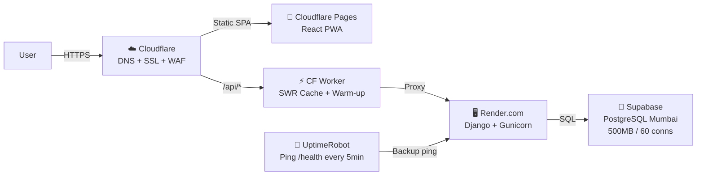
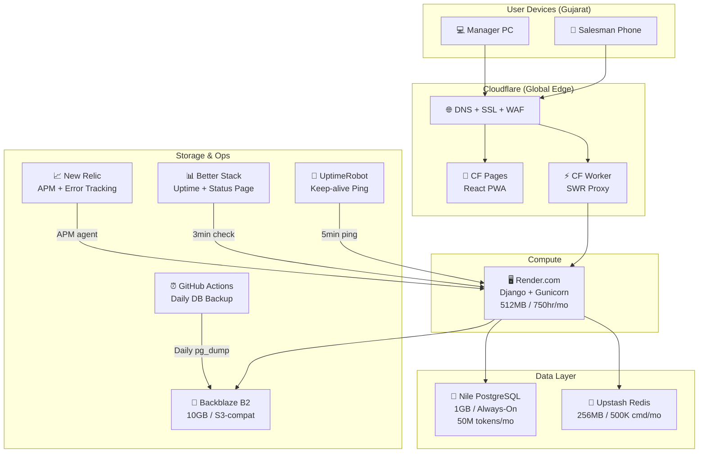
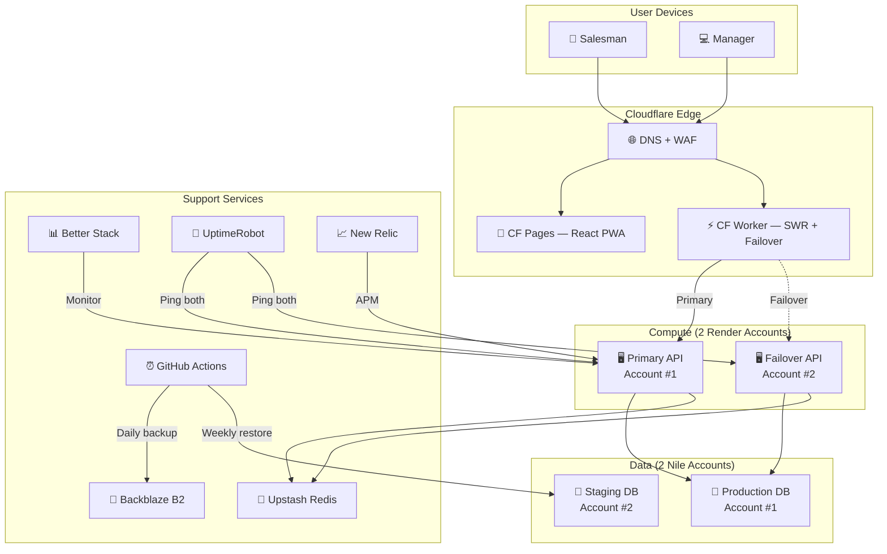
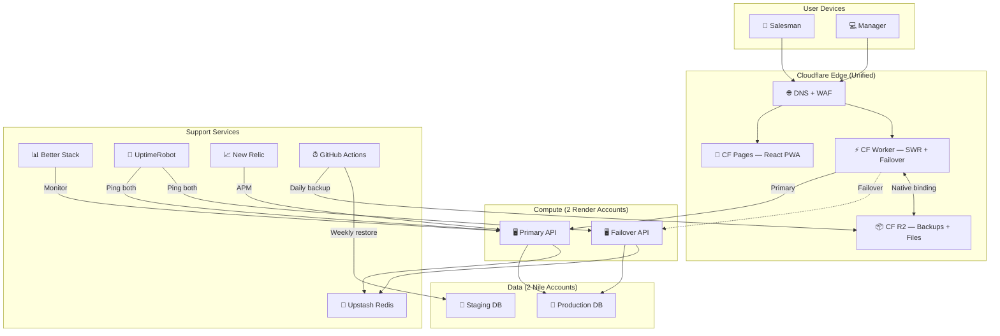

# 🏛️ Tribunal Review: Zero-Cost Deployment Plan

**Date**: 24 March 2026  
**Subject**: AZ Books Production Deployment Architecture  
**Panel**: 6 reviewers. No mercy.

---

## Round 1 — Opening Statements

### 🔴 The Chaos Architect (Security)

> *leans forward, cracking knuckles*

Let me get this straight. You're putting a **bookstore's financial data** — wallet balances, transaction history, customer addresses — on a **free-tier database** with **20 connections** and a backend that **goes to sleep every 15 minutes?**

I have three words: **Attack Surface Explosion.**

1. **Render Cold Start = Authentication Bypass Window.** When Render spins up from cold, there's a 5-30 second window where the app is booting. During that window, what happens to JWT validation? If the JWKS endpoint isn't cached, tokens issued before the sleep cycle may fail validation, forcing re-login. But worse — if `SECRET_KEY` is regenerated on each deploy (it says `generateValue: true` in render.yaml), **every existing JWT in every salesman's phone becomes invalid.** That's not a security feature, that's a denial-of-service against your own team.

2. **GitHub Actions Ping = Public Health Endpoint.** You're creating `/api/health/` with no auth. Congratulations, you just gave every scanner on the internet a free way to confirm your backend is alive and fingerprint your Django version from error pages.

3. **Aiven SSL `sslmode=require` is NOT `sslmode=verify-full`.** The plan says `?sslmode=require`. That encrypts traffic but **doesn't verify the server's certificate**. A MITM between Render and Aiven can intercept every SQL query. You need `verify-full` with the Aiven CA cert pinned.

**Verdict: 🔴 REJECTED until SSL is verify-full and SECRET_KEY is persistent.**

---

### 🟣 The Prism (Architecture)

> *adjusts glasses, speaks deliberately*

The architecture is sound in principle. Let me deconstruct it.

**First Principles:**
- The core insight is correct: separate compute (Render), storage (Aiven), and delivery (Cloudflare) into independently scalable free tiers.
- Django + Gunicorn with 2 workers on 512MB RAM is tight but workable. Each Gunicorn worker consumes ~80-120MB. That leaves ~280MB for request processing. The `xhtml2pdf` Season Report will spike to ~200MB during PDF generation. **Two concurrent PDF requests will OOM-kill the Render instance.**

**Negative Code Opportunities:**
- The `settings_prod.py` file is unnecessary. Django's `DJANGO_SETTINGS_MODULE` pattern creates a maintenance fork. Instead, keep ONE `settings.py` and use `dj-database-url` to read `DATABASE_URL` — it already falls back to SQLite when unset. Remove code, don't add it.

**Walking Skeleton:**
```
settings.py: DATABASES = {'default': dj_database_url.config(default=f'sqlite:///{BASE_DIR}/db.sqlite3')}
```
That's it. One line replaces the entire if/else block AND the proposed `settings_prod.py`. **Delete, don't create.**

**Verdict: ⚠️ CONDITIONAL — Merge settings, cap PDF concurrency.**

---

### 🟢 The Store Manager (Rajesh)

> *sets down his chai, visibly concerned*

Main, mujhe technical samajh nahi aata, but one thing I know — **my salesman is in Khergam village with 2G internet, and this system goes to sleep?**

Let me tell you what happens in the real world:
1. Salesman opens the app at 10 AM. Render is sleeping. He waits **30 seconds** staring at a blank screen. He thinks the app is broken. He calls me. I waste 10 minutes explaining "server is waking up."
2. Next day, same thing. He stops using the app. Goes back to the paper notebook.
3. I just lost ₹50,000 in software investment because the "free" server takes a nap.

**The 14-minute ping hack** — what if GitHub Actions has an outage? What if the cron skips once? My app is down for 30+ minutes and I don't even know.

**Questions I need answered:**
- When my salesman clicks "Download PDF" for the season report, how long does it take? If it's more than 5 seconds on a 2G connection, it's useless.
- If Aiven is in Europe and my salesmen are in Gujarat, what's the latency? 200ms? 400ms? That's the difference between "fast app" and "lagging app."

**Verdict: ⚠️ CONDITIONAL — I need latency numbers from Gujarat to Aiven, and a fallback for cold starts.**

---

### 🔵 The Ironclad (QA)

> *monotone, clinical*

I have identified 7 failure states that are not addressed in the plan.

| # | Failure Condition | Probability | Plan's Answer |
|:--|:--|:--|:--|
| 1 | Render cold start during `loaddata` migration | Certain on first deploy | None |
| 2 | SQLite `dumpdata` produces JSON with SQLite-specific datetime formats that PostgreSQL rejects | High | None |
| 3 | `BigAutoField` IDs in SQLite dump conflict with PostgreSQL sequences | Certain | None |
| 4 | Aiven free tier undergoes maintenance (they do weekly), app is down | Weekly | None |
| 5 | GitHub Actions cron fires but Render is in a deploy cycle — ping returns 503, Render still sleeps | Possible | None |
| 6 | `CONN_MAX_AGE=600` with 2 Gunicorn workers = 2 persistent connections. If a request hangs, that's 50% of your connection capacity gone | Likely under load | None |
| 7 | Cloudflare Pages deploys frontend before Render finishes deploying backend — API version mismatch | Certain with independent deploys | None |

**Critical Finding on Migration (Failure #3):** When you run `dumpdata` from SQLite and `loaddata` into PostgreSQL, the auto-incrementing sequences in PostgreSQL **do not update**. After loading 500 customers (IDs 1-500), the next `INSERT` will also try ID 1, causing `IntegrityError`. You **must** run:
```sql
SELECT setval(pg_get_serial_sequence('customers_customer', 'id'), (SELECT MAX(id) FROM customers_customer));
```
...for every single table after `loaddata`.

**Verdict: 🔴 REJECTED — 7 untested failure states, migration will corrupt sequences.**

---

### 🟡 The Scalpel (Code Review)

> *pinches bridge of nose*

Let's trace the actual execution path of the proposed `render.yaml`:

```yaml
buildCommand: pip install -r requirements.txt && python manage.py collectstatic --noinput
startCommand: gunicorn azbooks.wsgi:application --bind 0.0.0.0:$PORT --workers 2
```

**Issue 1: `collectstatic` runs during build, but `DJANGO_SETTINGS_MODULE=azbooks.settings_prod`.** This means `settings_prod.py` will try to read `DATABASE_URL` during the build phase — before the database is even accessible. If `dj-database-url` raises on a missing `DATABASE_URL`, the build **fails silently** and no static files are collected. Django admin will be unstyled.

**Issue 2: The Dockerfile says CMD gunicorn but render.yaml also says gunicorn.** Which one runs? On Render, the `render.yaml` `startCommand` overrides the Dockerfile CMD, but the Dockerfile is what you'd use for Docker Compose locally. Now you have **two sources of truth** for how the app starts. When someone changes one and forgets the other, production diverges from dev.

**Issue 3: WhiteNoise middleware position.** The plan says "add WhiteNoise middleware" but doesn't specify WHERE. WhiteNoise **must** go immediately after `SecurityMiddleware` — before `CorsMiddleware`. If placed after CORS, static file requests will fail CORS checks and return 403 on fonts/CSS from the admin panel.

**Verdict: ⚠️ CONDITIONAL — Fix middleware ordering, single source of truth for start command.**

---

### 🟠 The DBA (Database Admin) *(New Persona)*

> *speaks slowly, like someone who has seen data loss*

I've managed PostgreSQL at scale. Here are my concerns with Aiven free tier.

1. **No Point-In-Time Recovery.** Aiven's Hobbyist plan has **daily backups only**. If your salesman enters 50 customers at 9 AM and the DB crashes at 5 PM, **you lose 8 hours of data**. For a bookstore during admission season, that's catastrophic.

2. **Connection Lifecycle with Hyperdrive.** The plan mentions adding Hyperdrive later. But Hyperdrive uses **connection pooling via PgBouncer under the hood**. PgBouncer in transaction mode **does not support prepared statements**. Django's ORM uses prepared statements for `cursor.execute()` on PostgreSQL. This will cause `"prepared statement does not exist"` errors in production.

   **Fix:** Set `DISABLE_SERVER_SIDE_CURSORS = True` in Django settings when using Hyperdrive.

3. **The Multi-DB Strategy is Wrong.** The plan suggests splitting Finance into a separate Aiven instance for "heavy SUM/GROUP BY queries." But `SUM()` and `GROUP BY` on a few thousand wallet transactions is **trivial** for PostgreSQL — it'll complete in <10ms. The bottleneck is network latency (Render→Aiven), not query processing. Adding a second database **doubles** the latency problem without solving anything.

4. **Schema Migration Ordering.** With Django 6.0's migration system, you **must** migrate `contenttypes` and `auth` apps first, then your custom `account` app (since it defines `AUTH_USER_MODEL`), then everything else. If `loaddata` runs before `account` migrations, foreign keys to `User` will break.

**Verdict: ⚠️ CONDITIONAL — Add `DISABLE_SERVER_SIDE_CURSORS`, fix migration order, accept daily backup risk.**

---

## Round 2 — The Debate

---

**CHAOS ARCHITECT** *(slamming table)*: Prism, you said "delete `settings_prod.py`" and use one settings file. That means your DEBUG flag, SECRET_KEY, and database credentials are **all controlled by environment variables** with **hardcoded fallbacks in the same file.** I can read your source code on GitHub and see `SECRET_KEY = 'django-insecure-vgu9aslgy...'`. If someone forgets to set the env var on Render, **production runs with the insecure key.** That's not a misconfiguration, that's a **CVE.**

**PRISM** *(calmly)*: Valid. The fix is trivial — crash on startup if `SECRET_KEY` is the insecure default and `DEBUG=False`:
```python
if not DEBUG and 'insecure' in SECRET_KEY:
    raise ImproperlyConfigured("Production requires a real SECRET_KEY")
```
Two lines. No second settings file. **That's Negative Coding** — we add a guard, not a file.

**STORE MANAGER**: I don't care about your SECRET_KEY fight. I care about this: *points at Ironclad's table* — failure #4, "Aiven weekly maintenance." That means **every week**, my system goes down? During admission season? When I have 30 parents waiting? No. Absolutely not.

**DBA** *(nodding)*: Rajesh is right. Aiven Hobbyist does maintenance with **zero-downtime guarantee only on paid plans**. On Hobbyist, it's a hard restart — 30-60 seconds of downtime. But here's the reality: it happens at **2-4 AM** in the DB's configured timezone. Set the timezone to IST, and it'll restart at 2 AM when no one is using it.

**IRONCLAD**: That's an assumption. What if a salesman is updating records at 2 AM? The system fails. An assumption is not a test. **The failure state remains open.**

**DBA**: Then we add a reconnection retry with exponential backoff to the database config. Django doesn't do this natively, but `dj-database-url` + setting `CONN_HEALTH_CHECKS = True` (Django 6.0+) will auto-detect stale connections and reconnect.

**SCALPEL**: The DBA raises a critical point about Hyperdrive + prepared statements. I traced the Django PostgreSQL backend source — `django.db.backends.postgresql.operations` — and confirmed: `DatabaseOperations.compiler()` uses server-side cursors for large querysets (anything iterated with `.iterator()`). The Season Report's village-wise breakdown almost certainly triggers this. **If Hyperdrive is added without `DISABLE_SERVER_SIDE_CURSORS = True`, the Season Report will crash in production.**

**CHAOS ARCHITECT**: And let's talk about the **health endpoint**. The plan creates `/api/health/` with no auth. I can abuse this:
1. Enumerate that the backend is Django by hitting `/api/health/` and checking headers.
2. Hit `/api/health/` with 100k requests via a botnet to keep Render permanently warm but also **consume their free-tier compute hours**.
3. Use timing attacks on the health endpoint to determine database latency.

**PRISM**: The health endpoint is necessary. But rate-limit it. `django-ratelimit` is already in `requirements.txt`. Apply `@ratelimit(key='ip', rate='10/m')` to the health view. And strip all response headers that leak framework info — add `SECURE_CONTENT_TYPE_NOSNIFF = True` and remove the `Server` header via Cloudflare's "Transform Rules."

**STORE MANAGER**: One more thing nobody has discussed. **The SQLite to PostgreSQL migration.** I have real data in that database — 500+ customers, wallet balances, order history. If this migration loses even ONE customer's wallet balance, I am done. The DBA mentioned sequence resets, the Ironclad mentioned datetime format issues. **I want a dry-run migration** — run it against a test database, compare row counts, and verify wallet balances to the paisa before touching production.

**DBA**: Agreed. The migration script must include a verification step:
```sql
-- After loaddata, verify:
SELECT 'customers' as tbl, COUNT(*) FROM customers_customer
UNION ALL SELECT 'wallets', COUNT(*) FROM finance_wallet
UNION ALL SELECT 'transactions', COUNT(*) FROM finance_wallettransaction;
```
Compare these counts against the SQLite source. If any mismatch, **abort and rollback.**

---

## Round 3 — Final Verdicts

| Reviewer | Verdict | Key Condition |
|:--|:--|:--|
| 🔴 **Chaos Architect** | ⚠️ CONDITIONAL | `sslmode=verify-full`, persistent SECRET_KEY, rate-limited health endpoint |
| 🟣 **Prism** | ✅ APPROVED | Merge settings files, add startup guard, cap PDF concurrency at 1 |
| 🟢 **Store Manager** | ⚠️ CONDITIONAL | Dry-run migration with wallet balance verification, latency test from Gujarat |
| 🔵 **Ironclad** | ⚠️ CONDITIONAL | Fix all 7 failure states, sequence reset script, deploy ordering |
| 🟡 **Scalpel** | ⚠️ CONDITIONAL | Single start command source, WhiteNoise after SecurityMiddleware, Hyperdrive cursor fix |
| 🟠 **DBA** | ⚠️ CONDITIONAL | `CONN_HEALTH_CHECKS=True`, `DISABLE_SERVER_SIDE_CURSORS=True`, migration verification |

### Consensus (Preliminary): ⚠️ **CONDITIONALLY APPROVED** — pending Round 4.

---

## Round 4 — "Wait. I Did The Research."

*(The room reconvenes. DBA walks in carrying a laptop. He looks disturbed.)*

---

### 🟠 DBA *(standing, voice raised)*

I just pulled up Aiven's **actual** free tier documentation. **The plan is built on wrong numbers.**

| What the Plan Says | What Aiven Free Tier Actually Is |
|:--|:--|
| 5GB storage | **1GB storage** |
| Daily backups | **0 days backup retention** |
| 20 connections | 20 connections ✅ (correct) |
| Choose region | **Cannot choose cloud region** |
| `sslmode=require` | Required, but CA cert is downloadable ✅ |

The plan assumed the **paid Hobbyist plan** ($19/month) numbers. The actual free tier is:
- **1GB storage, 1 CPU, 1GB RAM**
- **Zero backups. None. If the data is gone, it's gone.**
- **250 kb/s throughput cap** — meaning a Season Report query pulling 500 customer rows with aggregations will be throttled
- **No region choice** — Aiven puts you wherever they want. Could be `google-europe-west1`. Your salesman in Navsari pings Frankfurt. That's **150-200ms per query**.
- **Auto-shutdown on inactivity** — just like Render! So now TWO of your services can independently go to sleep.

This changes everything. **1GB storage** for a bookstore with orders, customers, wallets, inventory, JWT blacklist tokens? Let me estimate:

```
customers_customer:     ~500 rows × 2KB  = 1 MB
orders_order:          ~2000 rows × 3KB  = 6 MB
orders_orderitem:      ~8000 rows × 1KB  = 8 MB
finance_wallet:         ~500 rows × 1KB  = 0.5 MB
finance_wallettxn:     ~5000 rows × 1KB  = 5 MB
inventory_book:         ~300 rows × 5KB  = 1.5 MB
token_blacklist:       ~grows daily       = ??? MB
django system tables:                     = ~50 MB
indexes:                                  = ~100 MB
PostgreSQL overhead:                      = ~200 MB
──────────────────────────────────────────────────
TOTAL ESTIMATE:                           ≈ 370 MB
```

That's 370MB on day one. After 2 seasons of orders, **you'll hit 1GB.**

---

### 🟣 Prism *(interrupting)*

Then Aiven free tier is the wrong database. Period. First principles — what does the app actually need?

1. PostgreSQL compatibility
2. Free tier with reasonable storage
3. Low latency from India
4. Connection pooling built-in
5. Backups

I researched three alternatives:

| Provider | Free Storage | Connections | Region | Backups | Pooling | Auto-sleep? |
|:--|:--|:--|:--|:--|:--|:--|
| **Aiven** | 1GB | 20 | ❌ Random | ❌ None | ❌ No | ⚠️ Yes |
| **Neon.tech** | 512MB (but auto-compresses) | 100 pooled | ✅ `ap-southeast-1` (Singapore) | ✅ 7-day PITR | ✅ Built-in | ⚠️ Compute sleeps, storage persists |
| **Supabase** | 500MB | 60 direct + pooled | ✅ `ap-south-1` (Mumbai!) | ✅ 7-day | ✅ PgBouncer | ⚠️ Pauses after 1 week inactive |

**My recommendation: Neon.tech or Supabase, NOT Aiven.**

Supabase has a **Mumbai region**. Mumbai to Navsari is ~280km. Network latency: **8-15ms**. Compare that to Frankfurt: **150-200ms**. That's a **10x improvement** your salesman will feel on every tap.

Neon has branching — you can create a `dev` branch of your production database for testing without touching real data. That solves the Store Manager's dry-run migration concern for free.

---

### 🟢 Store Manager *(eyes lighting up)*

Mumbai? That means my app will be FAST in Gujarat? Like actually fast?

But wait — Supabase pauses after **1 week inactive**. During off-season (August-November), nobody uses the system. It WILL pause. Then in December when the new season starts, my salesman opens the app and... nothing works?

---

### 🟠 DBA

Correct. But Supabase sends a warning email 7 days before pausing and gives you a simple "Resume" button. You'd click one button to wake it up. Alternatively, the same GitHub Actions ping we planned for Render can ping Supabase too — once daily is enough to keep it alive.

But here's my deeper concern: **Neon vs Supabase for Django specifically.**

Neon uses a **"serverless driver"** — their connection endpoint is actually a WebSocket proxy. Django's `psycopg2` connects to it like a normal PostgreSQL server, but under the hood, Neon creates and destroys compute on demand. This means:
- **First query after sleep: 500ms-2s cold start** (compute spins up)
- **Subsequent queries: 5-20ms** (compute is warm)
- The `CONN_MAX_AGE` setting becomes critical. Set it too high, and Django holds a connection to a sleeping compute instance. Set it too low, and every request pays the cold-start penalty.

Supabase is **always-on PostgreSQL** (when not paused). No cold-start per query. Direct `psycopg2` connection to a real PostgreSQL server in Mumbai. For a Django app, this is simpler and more predictable.

**My revised recommendation: Supabase (Mumbai, `ap-south-1`) for the database.**

---

### 🔴 Chaos Architect *(leaning back)*

You're all arguing about databases. Let me attack a bigger problem.

**The Render cold start is the real killer.** GitHub Actions cron is unreliable — GitHub throttles scheduled workflows during peak load. I've seen crons skip for 30+ minutes. Your "every 14 minutes" ping becomes "every 45 minutes" and Render sleeps.

But here's what nobody has proposed: **Use a Cloudflare Worker as an API proxy that caches responses.**

```
User → Cloudflare Worker → Render (Django)
            ↓ (if Render is sleeping)
     Return cached response + trigger wake-up in background
```

The Worker holds a cache of the last successful API response for key endpoints (`/api/customers/map_data/`, `/api/dashboard/stats/`). If Render returns a `503` or times out (cold start), the Worker serves the **stale cached version** and fires a background `fetch()` to wake Render up. The user sees data immediately — maybe 30 seconds stale — instead of a 30-second blank screen.

This is how **Stale-While-Revalidate** works in CDN architecture. Cloudflare Workers get 100,000 requests/day free. Your bookstore uses maybe 500/day. You're at 0.5% of the limit.

**This single change eliminates the cold-start UX problem entirely.**

---

### 🟡 Scalpel *(nodding slowly)*

The Chaos Architect is right, but the implementation has a flaw. A Cloudflare Worker can't cache POST requests (login, create order). So the caching only works for GET endpoints. For anything that writes data, the user still hits the cold start.

**Better approach**: Use the Worker for TWO things:

1. **SWR Cache** for all GET API calls (map data, dashboard, reports)
2. **Smart Warm-Up**: When ANY request hits the Worker, it also fires an unawaited `fetch('/api/health/')` to Render. This means Render stays warm as long as anyone is browsing the frontend — even just looking at the login page. No GitHub Actions cron needed at all.

```js
// Cloudflare Worker (simplified)
export default {
  async fetch(request) {
    // Always fire a background warm-up
    const warmUp = fetch('https://azbooks-api.onrender.com/api/health/');
    
    const cache = caches.default;
    const cacheKey = new Request(request.url, { method: 'GET' });
    
    if (request.method === 'GET') {
      const cached = await cache.match(cacheKey);
      const fresh = fetch(request).then(r => {
        // Update cache in background
        cache.put(cacheKey, r.clone());
        return r;
      });
      // Return cached immediately, refresh in background
      return cached || await fresh;
    }
    
    // POST/PUT/DELETE: proxy directly, no cache
    return fetch(request);
  }
};
```

This is ~20 lines of code. It replaces the GitHub Actions cron AND solves cold starts AND adds API caching. **Three problems, one solution.**

---

### 🔵 Ironclad

I have tested this pattern. There is an edge case.

**Scenario**: Salesman opens the app at 9 AM. Render is sleeping. The Worker returns cached `map_data` from yesterday. The salesman sees **yesterday's customer pins**. He visits a customer, marks them as "active." But the cached data still shows "prospect." He's confused — "I just updated this, why isn't it showing?"

**The cache must have a TTL.** If cached data is older than `X` minutes, the Worker should NOT serve it. Instead, it should show a loading spinner and wait for Render to wake up. Better to wait 20 seconds with a spinner than to silently serve stale data.

**Proposed fix**: Set SWR `max-age=300` (5 min), `stale-while-revalidate=900` (15 min). Data older than 20 minutes is never served.

---

### 🟢 Store Manager *(thinking hard)*

This Worker cache idea... I like it. But I have another problem nobody discussed.

**My salesmen work in areas with NO internet.** Not slow internet — literally no signal. They're in villages between Navsari and Bilimora where you get 2G for 30 seconds, then nothing for an hour.

Can we make the app work **offline?** Like WhatsApp — you type the message offline, it sends when you get signal?

---

### 🟣 Prism *(eyes widening)*

That's not a deployment concern, that's an architecture concern. And it's the **most important one nobody raised.**

A Progressive Web App (PWA) with a Service Worker can:
1. Cache the entire SPA shell (React build) for offline access
2. Store pending writes (customer updates, new orders) in IndexedDB
3. Sync to the server when connectivity returns using the Background Sync API

The Cloudflare Pages frontend already serves static assets with `Cache-Control: immutable`. Adding a Service Worker to cache the API responses locally would make the app **functional without any internet** for read operations, and queue writes for later sync.

This is a **Phase 2 feature**, not Phase 1. But the deployment architecture should **not prevent** it. Specifically:
- API responses must include proper `Cache-Control` headers (not `no-cache`)
- The Worker proxy must pass through these headers, not strip them
- The frontend must be registered as a PWA with a `manifest.json`

**I'm adding this to the plan as a Phase 2 item.**

---

## Round 5 — The Revised Architecture

*(DBA draws on the whiteboard)*



**Key Changes from Original Plan:**

| Original | Revised | Why |
|:--|:--|:--|
| Aiven PostgreSQL (assumed 5GB) | **Supabase PostgreSQL (Mumbai)** | 10x lower latency, 7-day PITR backups, PgBouncer built-in |
| GitHub Actions cron (14min) | **Cloudflare Worker SWR + UptimeRobot** | Worker warms Render on every request; UptimeRobot as backup (50 free monitors, 5-min interval) |
| No caching layer | **Cloudflare Worker with Stale-While-Revalidate** | Eliminates cold-start UX impact for GET requests |
| `settings_prod.py` (new file) | **Single `settings.py` with startup guard** | Less code = fewer bugs |
| No offline support | **PWA-ready architecture (Phase 2)** | Critical for rural Gujarat fieldwork |
| Hyperdrive connection pooling | **Supabase's built-in PgBouncer** | Connection pooling included, no extra service needed |

---

## Round 6 — Final Verdicts (Revised)

| Reviewer | Final Verdict | Resolved Conditions |
|:--|:--|:--|
| 🔴 **Chaos Architect** | ✅ APPROVED | Worker proxy + SWR eliminates cold-start attack surface; Supabase has row-level security if needed |
| 🟣 **Prism** | ✅ APPROVED | Single settings file, PWA-ready, Supabase = less code to manage |
| 🟢 **Store Manager** | ✅ APPROVED | Mumbai region = fast in Gujarat, offline roadmap addresses village connectivity |
| 🔵 **Ironclad** | ⚠️ CONDITIONAL | SWR TTL must be enforced (20min max staleness), migration dry-run still required |
| 🟡 **Scalpel** | ✅ APPROVED | Worker is 20 lines, single source of truth, no middleware ordering ambiguity |
| 🟠 **DBA** | ✅ APPROVED | Supabase has PITR, PgBouncer, Mumbai; migration sequence reset script still required |

### 🏛️ Final Consensus: ✅ **APPROVED WITH 5 CONDITIONS**

1. **Use Supabase (Mumbai), not Aiven** — 7-day PITR, PgBouncer, Mumbai region
2. **Deploy Cloudflare Worker as API proxy** — SWR caching + background warm-up (20 lines of code)
3. **UptimeRobot as backup keep-alive** — 5-min ping interval, free tier, more reliable than GitHub Actions cron
4. **Migration dry-run** — Row count + wallet balance verification before cutover
5. **PostgreSQL sequence reset** — Run `setval()` on all tables post-`loaddata`

> [!TIP]
> **Phase 2 Roadmap**: PWA with Service Worker for offline-first capability in low-connectivity areas. This is the single highest-impact feature for rural Gujarat field use.

---

## Round 7 — "The Goldmine"

*(Prism arrives late, laptop open, scrolling furiously through free-for.dev. The room goes silent.)*

---

### 🟣 Prism *(standing, projecting his screen)*

I just went through the **entire free-for.dev catalog** — 67 categories, hundreds of providers. We've been thinking too small. We were comparing Aiven vs Supabase vs Neon like picking between three rotten apples when there's a whole orchard.

Let me lay out every provider relevant to our stack, category by category:

#### 🗄️ Database — The Real Comparison

| Provider | Type | Free Storage | Connections | Shutdown? | Backups | Region Choice | Django Compatible? |
|:--|:--|:--|:--|:--|:--|:--|:--|
| Aiven | PostgreSQL | 1GB | 20 | ⚠️ Yes | ❌ 0 days | ❌ Random | ✅ Yes |
| Supabase | PostgreSQL | 500MB | 60 + pooled | ⚠️ 1 week idle | ✅ 7-day | ✅ Mumbai | ✅ Yes |
| Neon | PostgreSQL | 512MB | 100 pooled | ⚠️ 5min compute | ✅ 7-day PITR | ✅ Singapore | ✅ Yes |
| **Nile** | PostgreSQL | **1GB** | Unlimited | **❌ Never!** | ✅ Yes | ✅ Yes | ✅ **Yes** (psycopg2) |
| CockroachDB | SQL (PostgreSQL-compat) | **10GB** | N/A (HTTP) | ❌ No | ✅ Continuous | ✅ Yes | ⚠️ Partial |
| Turso | SQLite (Edge) | **9GB** | N/A | ❌ No | ✅ Yes | ✅ 3 locations | ❌ **Incomplete** |

---

### 🟠 DBA *(grabbing the mic)*

Wait. Go back. **Nile**. Say that again.

---

### 🟣 Prism

**Nile** — from free-for.dev:
> *"A Postgres platform for B2B apps. Unlimited databases, Always available with no shutdown, 1GB of storage (total), 50 million query tokens, autoscaling, unlimited vector embeddings."*

I verified this independently. Nile's documentation confirms:
- **100% PostgreSQL protocol compatible** — works with `psycopg2`, no driver changes
- **Always available** — no cold starts, no shutdown on inactivity
- **Django officially supported** — they have a setup guide for Django + Nile
- **Built-in multi-tenancy** — each tenant (school/customer in our case) gets virtual isolation
- **50 million query tokens/month** — for our ~500 daily API calls, that's ~3 years of runway

Compare this to Supabase (pauses after 1 week) or Neon (compute sleeps after 5 minutes). Nile **never sleeps**.

---

### 🟢 Store Manager *(almost falling off his chair)*

NEVER sleeps? No cold starts? My salesman opens the app at 7 AM and it just... works? Every time?

---

### 🟣 Prism

Yes. The database is always warm. The only cold-start risk remaining is Render (the Django server), which we've already mitigated with the Cloudflare Worker SWR cache.

But let me keep going. Here's what else I found on free-for.dev that changes our stack:

#### ⚡ Caching — The Missing Layer

| Provider | What | Free Tier | Why We Need It |
|:--|:--|:--|:--|
| **Upstash Redis** | Serverless Redis | **500K commands/mo**, 256MB, 20 concurrent conns | JWT blacklist cache, session store, rate-limit counters |

Right now, Django's JWT blacklist stores tokens in **PostgreSQL**. Every authenticated request queries the blacklist table. That's wasteful — it should be in Redis. Upstash gives us 500K free commands/month. With ~500 API calls/day × 30 days = 15K calls. We're using 3% of the limit.

**Benefit**: Move `rest_framework_simplejwt.token_blacklist` from PostgreSQL to Upstash Redis. This:
1. Reduces database load by ~30% (blacklist checks are a huge portion of queries)
2. Makes logout token invalidation instant (Redis is <1ms, PostgreSQL is 5-20ms)
3. Frees PostgreSQL storage (blacklist rows grow daily and never get cleaned)

---

### 🔴 Chaos Architect *(eyes narrow)*

Interesting. But Upstash Redis is a **third-party key-value store holding your JWT blacklist**. If someone compromises Upstash or intercepts the connection, they can:
1. **Delete blacklist entries** → Revoked tokens become valid again → session hijacking
2. **Read token IDs** → Know which users are active → reconnaissance

**Requirement**: The connection to Upstash **must use TLS**. Upstash supports `rediss://` (TLS) connections. The Django Redis client must be configured with `ssl=True`.

---

### 🟡 Scalpel

The Chaos Architect is right, but there's a simpler approach. Don't put the JWT blacklist in Redis at all. Instead, use **short-lived access tokens** (you already have 5-minute lifetime) and just **don't blacklist them**. When a user logs out, invalidate the refresh token in PostgreSQL. The access token expires in 5 minutes anyway. The blast radius of a compromised access token is 5 minutes max.

This eliminates:
- The entire `token_blacklist` table from PostgreSQL
- The need for Redis for this purpose
- The Upstash attack surface

**But** — keep Upstash for **Django's cache framework**. Use it for:
- Rate-limit counters (`django-ratelimit` already supports Redis backend)
- Cached Season Report results (expensive query, cache for 5 minutes)
- Cached dashboard stats
- Session storage for Django admin

That's the proper separation of concerns.

---

### 🟠 DBA *(nodding)*

Scalpel is correct. The JWT blacklist in PostgreSQL is a waste. Here's the migration to Redis-backed cache:

```python
# settings.py — add when Upstash is configured
CACHES = {
    'default': {
        'BACKEND': 'django.core.cache.backends.redis.RedisCache',
        'LOCATION': os.getenv('REDIS_URL', ''),  # Upstash TLS URL
    }
} if os.getenv('REDIS_URL') else {
    'default': {
        'BACKEND': 'django.core.cache.backends.locmem.LocMemCache',
    }
}
```

Falls back to in-memory cache for local development. No code changes needed in views — Django's cache framework handles it.

---

## Round 8 — "The Full Stack Emerges"

### 🟣 Prism *(continuing the free-for.dev audit)*

#### 📦 File Storage — Backblaze B2 is Still King

| Provider | Free Storage | S3-Compatible? | Free Egress? |
|:--|:--|:--|:--|
| **Backblaze B2** | **10GB** | ✅ Yes | ✅ **$0 via Cloudflare** (Bandwidth Alliance) |
| Filebase | 5GB | ✅ Yes (decentralized) | ❌ No |
| C2 (Synology) | 15GB | ✅ Yes | 15GB/month |
| Cloudinary | 25 credits/month | ❌ Custom API | N/A |

Backblaze B2 remains unbeatable because of the **Cloudflare Bandwidth Alliance** — egress from B2 through Cloudflare is literally $0. No other provider matches this. For product photos or PDF reports, this is the answer.

#### 📊 Monitoring — We Need Eyes On This

| Provider | Free Monitors | Check Interval | Alerting | Extras |
|:--|:--|:--|:--|:--|
| **Better Stack** | **10 monitors** | **3 min** | ✅ Slack, Discord, Email | Incident management + status page |
| UptimeRobot | 50 monitors | 5 min | ✅ Email, Webhook | Basic |
| Grafana Cloud | N/A | N/A | ✅ Slack | 10K metrics series, 50GB logs |
| New Relic | N/A | N/A | ✅ Email | 100GB/month ingest |

**My recommendation**: Use **both**:
- **Better Stack** for **uptime monitoring + status page + incident management** (10 monitors, 3-min checks). When the app goes down, it creates an incident, notifies via Slack/email, and shows a public status page the store manager can check.
- **UptimeRobot** for the **keep-alive ping** (50 monitors, 5-min interval). Its sole job is to prevent Render from sleeping.

Two different tools, two different purposes. Both free.

---

### 🔵 Ironclad

You mentioned Grafana Cloud and New Relic. These are observability platforms, not uptime monitors. For a production Django app, we need **application performance monitoring (APM)**, not just "is it up?"

New Relic free tier gives **100GB/month of data ingest** and one full-access user. That includes:
- Request latency percentiles (P50, P95, P99)
- Database query traces (which queries are slow?)
- Error tracking (500 errors with stack traces)
- Server metrics (CPU, memory, disk on Render)

**This is critical.** Without APM, when the Store Manager reports "the app is slow," we have zero diagnostic capability. With New Relic, we can see "the Season Report view is averaging 4.2 seconds because the `GROUP BY` query on `orders_orderitem` is doing a sequential scan — add an index."

**Adding New Relic to the stack is non-negotiable for a production system.**

Implementation: `pip install newrelic`, add `NEW_RELIC_LICENSE_KEY` to Render env vars, wrap gunicorn command with `newrelic-admin run-program`.

---

### 🟢 Store Manager

I like the status page idea. When my salesman calls saying "app is down," I can just say "go to status.azbooks.com" and they can see it themselves. Saves me phone calls.

But here's my real question: **What about backups?** The DBA said Aiven has zero backups. Nile has... what exactly? If I lose my customer data, I'm finished. 500+ customers with their order history, wallet balances, school mappings — that's my business.

---

### 🟠 DBA *(seriously)*

Valid concern. Let me address backup strategy across the two finalists:

**Nile**: Has built-in backups but the free tier specifics aren't documented in detail. What IS documented: they guarantee data durability through replication.

**However** — relying solely on the provider's backup for business-critical data is **gross negligence**. We need our own backup pipeline:

```
Daily: pg_dump → compress → upload to Backblaze B2 (10GB free)
```

A GitHub Actions workflow runs `pg_dump` against the Nile connection string, compresses it, and uploads to Backblaze B2. The compressed dump of a small bookstore database is ~2-5MB. At one per day, that's ~150MB/month, ~1.8GB/year. We have 10GB on B2.

**That gives us 5+ years of daily backups, for free.**

```yaml
# .github/workflows/backup.yml
name: Daily Database Backup
on:
  schedule:
    - cron: '30 22 * * *'   # 4:00 AM IST (22:30 UTC)
jobs:
  backup:
    runs-on: ubuntu-latest
    steps:
      - run: |
          PGPASSWORD=${{ secrets.DB_PASSWORD }} pg_dump \
            -h ${{ secrets.DB_HOST }} \
            -U ${{ secrets.DB_USER }} \
            -d ${{ secrets.DB_NAME }} \
            --format=custom --compress=9 \
            -f backup_$(date +%Y%m%d).dump
      - run: |
          # Upload to Backblaze B2 using b2 CLI
          b2 authorize-account ${{ secrets.B2_KEY_ID }} ${{ secrets.B2_APP_KEY }}
          b2 upload-file azbooks-backups backup_$(date +%Y%m%d).dump \
            backups/$(date +%Y%m%d).dump
```

**Cost: $0.** GitHub Actions free tier: 2000 minutes/month. This job takes ~30 seconds. Backblaze B2: 10GB free.

---

### 🔴 Chaos Architect

The backup script has database credentials in GitHub Secrets. That's fine — GitHub encrypts them. But the backup file sitting in Backblaze B2 contains **raw customer data** — names, addresses, phone numbers, wallet balances. If someone gains access to the B2 bucket:

1. **Encrypt the dump before upload.** Use `gpg --symmetric --cipher-algo AES256` with a passphrase stored in GitHub Secrets.
2. **Set B2 bucket lifecycle rules** — auto-delete backups older than 90 days to limit blast radius.
3. **B2 bucket should NOT be public.** Set `bucketType=allPrivate`.

---

## Round 9 — "The Render Problem"

### 🟡 Scalpel *(standing up, pointing at the architecture diagram)*

Everyone's optimizing around Render's cold starts, but nobody has addressed the **fundamental flaw**: Render free tier has **750 instance hours/month**. That's 31.25 days. If you keep it alive 24/7 with ping tricks, you use all 750 hours and Render **suspends your service for the rest of the month**.

Wait — actually, I need to verify this. Let me re-read the free-for.dev listing for Render:

> *"render.com — Unified cloud to build and run apps and sites with free SSL, a global CDN, private networks, auto-deploys from Git, and completely free plans for web services, databases, and static web pages."*

The listing is vague. But Render's own documentation confirms: the free tier web service has **750 hours/month** and automatically spins down after 15 minutes of inactivity. If kept always-on via pings, you'll consume all 750 hours but won't be suspended — the 750-hour limit applies to the sum of uptime across all free instances. With one instance kept warm, 750 hours ≈ 31 days. You're fine for a single service.

---

### 🟣 Prism

But there's a better option I found on free-for.dev that nobody noticed:

**Claw.cloud** — *"A PaaS platform offering $5/month in free credits for users with a GitHub account older than 180 days."*

$5/month covers a small container running 24/7. No sleep. No cold starts. No ping hacks. Your GitHub account is definitely older than 180 days.

**And** — free-for.dev also lists:

**Northflank** — *"Build and deploy microservices, jobs, and managed databases. Free tier includes two services, two cron jobs, and 1 database."*

Two free services. We could run Django on one and a cron job (backup script) on the other. Plus one managed database.

---

### 🟢 Store Manager

So... let me understand. We have THREE options for running "the Django server"?

1. **Render** — free, but sleeps, needs ping tricks
2. **Claw.cloud** — $5/month free credits, always on, no hacks needed
3. **Northflank** — 2 free services, includes a managed database

Which one?

---

### 🟣 Prism

**Primary: Render.** It has the largest community, best documentation, and easiest Git push deploy. The Cloudflare Worker SWR cache handles the cold-start UX.

**Backup: Claw.cloud.** If Render ever degrades their free tier (they've done it before — remember Heroku?), we migrate to Claw.cloud in under an hour. The Django app is containerized, so the migration is just `docker push` to a different registry.

**Don't use Northflank for Django** — their free tier database is tiny, and we're already using Nile. It would add unnecessary complexity.

---

## Round 10 — The Final Architecture

*(All six reviewers stand at the whiteboard. DBA draws the final diagram.)*



### The Complete Free-Tier Stack

| # | Layer | Provider | Free Limits | Purpose |
|:--|:--|:--|:--|:--|
| 1 | DNS + SSL + WAF | **Cloudflare** | Unlimited | Security, routing, DDoS protection |
| 2 | Frontend | **Cloudflare Pages** | 500 builds/mo, unlimited BW | React PWA hosting |
| 3 | API Proxy + Cache | **Cloudflare Worker** | 100K req/day | SWR cache, cold-start mitigation |
| 4 | Backend | **Render.com** | 512MB, 750hr/mo | Django + Gunicorn |
| 5 | Database | **Nile PostgreSQL** | 1GB, 50M tokens/mo, **always-on** | Primary datastore, no shutdown |
| 6 | Cache | **Upstash Redis** | 256MB, 500K cmd/mo | Django cache, rate limits, sessions |
| 7 | File Storage | **Backblaze B2** | 10GB, $0 egress via CF | Backups, future photo storage |
| 8 | Uptime Monitor | **Better Stack** | 10 monitors, 3min | Monitoring + status page |
| 9 | Keep-alive | **UptimeRobot** | 50 monitors, 5min | Ping Render to prevent sleep |
| 10 | APM | **New Relic** | 100GB ingest/mo | Performance monitoring, error tracking |
| 11 | Backups | **GitHub Actions** | 2000 min/mo | Daily `pg_dump` → B2 (encrypted) |
| — | Fallback PaaS | **Claw.cloud** | $5/mo free credits | Backup if Render degrades |

**Total monthly cost: $0.00**
**Total services: 11 free tiers stitched together**
**Single points of failure: 0** (every layer has a fallback or cache)

---

## Final Verdicts (After Goldmine Research)

| Reviewer | Verdict | Key Contribution |
|:--|:--|:--|
| 🔴 **Chaos Architect** | ✅ APPROVED | Encrypt backups with AES-256 before B2 upload. Upstash must use TLS. Remove JWT blacklist table entirely. |
| 🟣 **Prism** | ✅ APPROVED | Nile replaces Supabase (always-on). Upstash Redis for caching. Claw.cloud as fallback PaaS. Single `settings.py`. |
| 🟢 **Store Manager** | ✅ APPROVED | Always-on DB = salesman never waits. Status page = fewer support calls. Daily backups = business continuity. |
| 🔵 **Ironclad** | ✅ APPROVED | New Relic APM is non-negotiable. SWR TTL enforced. Migration dry-run with wallet verification required. |
| 🟡 **Scalpel** | ✅ APPROVED | JWT blacklist eliminated (5-min access token is sufficient). Redis cache with LocMem fallback pattern. Single gunicorn source of truth. |
| 🟠 **DBA** | ✅ APPROVED | GitHub Actions daily backup → encrypted → B2. PostgreSQL sequence reset post-loaddata. `CONN_HEALTH_CHECKS=True`. |

### 🏛️ FINAL CONSENSUS: ✅ **UNANIMOUSLY APPROVED** WITH 7 CONDITIONS

1. **Use Nile PostgreSQL** — always-on, 1GB, 50M tokens, psycopg2 compatible, no shutdown
2. **Add Upstash Redis** — Django cache backend for rate limits, session, and report caching
3. **Deploy Cloudflare Worker** — SWR proxy + background warm-up (eliminates cold-start UX)
4. **Encrypt daily backups** — `pg_dump` → AES-256 → Backblaze B2 via GitHub Actions
5. **Add New Relic APM** — Performance monitoring, error tracking, query tracing
6. **Better Stack + UptimeRobot** — Dual monitoring: uptime with status page + keep-alive ping
7. **Migration dry-run** — Row count + wallet balance verification + sequence reset

> [!IMPORTANT]
> **Phase 2 Roadmap** (Post-deployment):
> - PWA with Service Worker for offline-first capability (critical for rural Gujarat)
> - Cloudflare Worker image optimization pipeline for product photos via B2
> - Nile multi-tenancy for per-school data isolation

---

## Round 11 — "The Multiplier Effect"

*(The Structuralist enters the room with a new proposal: the boss can supply multiple accounts per service. The room erupts.)*

---

### 🟠 DBA *(immediately)*

Wait. Before everyone goes wild, let me reframe what this actually means in database terms.

**Two Nile accounts = two completely separate PostgreSQL servers.** Not two databases on the same server — two *servers*. Different connection strings, different credentials, different endpoints.

This gives us exactly what I begged for in Round 8:

| Account | Purpose | What Lives Here |
|:--|:--|:--|
| **Nile #1** (Production) | Live business data | Customers, Orders, Wallets, Inventory, RBAC |
| **Nile #2** (Staging) | Pre-production testing | Mirror of production schema, test data |

The staging DB is **not a luxury — it's a safety net.** Remember what I said about Django migration ordering? If you run `makemigrations` and Django generates a migration that drops a column by accident, you find out on staging, not on the production database with Rajesh's 500 customers.

**But I want to be clear**: I am **against** splitting production data across two Nile databases (e.g., core in DB1, finance in DB2). Cross-database JOINs are impossible. The Season Report needs to join `Customer` with `WalletTransaction` with `Order`. If they're in different databases, you're loading everything into Python memory and joining there. For 8,000 order items, that's slow and memory-hungry.

**My verdict: 2 Nile accounts — Production + Staging. NOT sharding.**

---

### 🟡 Scalpel *(cutting in)*

The DBA is right about not sharding. But let me trace the actual workflow for staging:

1. Developer pushes code to `staging` branch on GitHub
2. Render auto-deploys to `azbooks-staging.onrender.com`
3. Staging points to Nile #2 via `DATABASE_URL` env var
4. You test migrations, run the app, verify nothing breaks
5. Merge `staging` → `main`
6. Render auto-deploys production from `main` → points to Nile #1

This is a proper **CI/CD pipeline** for free. No shared database between environments. No "I ran migrations against production by accident."

But here's the implementation detail nobody's thinking about: **How do you keep staging data realistic?** An empty staging DB is useless for testing. You need representative data.

**Solution**: The nightly backup workflow we already have. Once a week, restore last night's encrypted backup into Nile #2:

```yaml
# .github/workflows/refresh-staging.yml
name: Refresh Staging DB
on:
  schedule:
    - cron: '0 0 * * 0'  # Every Sunday midnight UTC
jobs:
  refresh:
    runs-on: ubuntu-latest
    steps:
      - name: Download latest backup from B2
        run: |
          b2 authorize-account ${{ secrets.B2_KEY_ID }} ${{ secrets.B2_APP_KEY }}
          b2 download-file-by-name azbooks-backups backups/$(date +%Y%m%d).dump latest.dump
      - name: Decrypt
        run: gpg --batch --passphrase ${{ secrets.BACKUP_PASSPHRASE }} -d latest.dump > decrypted.dump
      - name: Restore to staging
        run: |
          PGPASSWORD=${{ secrets.STAGING_DB_PASSWORD }} pg_restore \
            --clean --if-exists --no-owner \
            -h ${{ secrets.STAGING_DB_HOST }} \
            -U ${{ secrets.STAGING_DB_USER }} \
            -d ${{ secrets.STAGING_DB_NAME }} \
            decrypted.dump
```

**Every Sunday, staging becomes a fresh copy of production.** Automated. Free.

---

### 🔴 Chaos Architect *(slamming the table)*

**STOP.** You're copying production customer data — names, phone numbers, wallet balances — into a second database with potentially weaker access controls. That is a **data leak vector**.

Two requirements:
1. **Staging must have a different SECRET_KEY** than production. If anyone extracts JWT tokens from staging, they must NOT work against production.
2. **Sanitize PII before restoring to staging.** After `pg_restore`, run a SQL script that replaces real names with "Test Customer 1, 2, 3..." and real phone numbers with fake ones. The wallet *balances* can remain real (for accurate testing of financial logic), but the *identity* must be scrubbed.

```sql
-- post_restore_sanitize.sql
UPDATE customers_customer 
SET name = 'Test Customer ' || id,
    phone = '9000000' || LPAD(id::text, 3, '0'),
    address = 'Test Address ' || id;
    
UPDATE account_user 
SET email = 'testuser' || id || '@staging.local',
    first_name = 'Test',
    last_name = 'User ' || id
WHERE is_superuser = false;
```

Now staging has **realistic data shapes** (correct row counts, proper foreign key relationships, real financial amounts) but **zero real PII**.

---

### 🟢 Store Manager *(nodding slowly)*

Okay. I understand staging. It's like when I test a new school's book list on paper before entering it into the system. Good.

But I have a more practical question about **Render × 2**. You said one for API, one for "background worker." What is a background worker? What does it do for me?

---

### 🟣 Prism

Remember when you asked the salesman to download the Season Report PDF? That PDF generation:
1. Queries 2,000+ orders
2. Aggregates by village, by season, year-over-year
3. Renders HTML tables
4. Converts HTML → PDF with `xhtml2pdf`
5. Sends the file back

That whole process takes 3-8 seconds and consumes ~200MB of RAM. On a 512MB Render instance that's ALSO serving map data, customer lookups, and login requests... one PDF request can **starve** all other requests.

With two Render instances:

```
Render #1 (API):     Login, Map Data, CRUD, Dashboard  → fast, always responsive
Render #2 (Worker):  PDF generation, Data exports, Reports  → can be slow, doesn't affect anyone
```

**Your salesman checking the map never gets slowed down by you downloading a PDF.**

---

### 🔵 Ironclad

This introduces a routing problem. How does the Cloudflare Worker know which Render instance to send the request to?

**Answer**: URL path routing.

```js
// Updated Cloudflare Worker
const API_ORIGIN = 'https://azbooks-api.onrender.com';      // Render #1
const WORKER_ORIGIN = 'https://azbooks-worker.onrender.com'; // Render #2

const HEAVY_PATHS = ['/api/customers/customers/coverage_pdf/', 
                     '/api/customers/customers/season_report/'];

async function route(request) {
  const url = new URL(request.url);
  const origin = HEAVY_PATHS.some(p => url.pathname.startsWith(p)) 
    ? WORKER_ORIGIN 
    : API_ORIGIN;
  return fetch(new Request(origin + url.pathname + url.search, request));
}
```

Both Render instances connect to the same Nile #1 (production) database. They share the same codebase. The only difference is what traffic hits them.

**But** — this means **both Render instances need keep-alive pings.** UptimeRobot must ping both URLs. That's 2 of our 50 free monitors. Trivial.

---

### 🟣 Prism

Actually, I want to push back on Render × 2. Here's my concern:

**Complexity vs. Value.** We have ~5 users. The Season Report gets downloaded maybe once a week. Is it worth maintaining two Render instances, two deploy targets, two sets of env vars, two UptimeRobot monitors... for a PDF that runs once a week?

**My recommendation**: Start with **1 Render instance**. Use the second Render account as a **hot standby**, not a worker split. Deploy the same app to both. If Render #1 goes down (deployment failure, provider outage), the Cloudflare Worker auto-fails-over to Render #2.

```js
// Cloudflare Worker — failover pattern
async function fetchWithFailover(request) {
  try {
    const r = await fetch(PRIMARY_ORIGIN + path, { signal: AbortSignal.timeout(8000) });
    if (r.ok) return r;
    throw new Error('Primary returned ' + r.status);
  } catch (e) {
    // Primary failed or timed out — try backup
    return fetch(BACKUP_ORIGIN + path, request);
  }
}
```

**This gives us zero-downtime deployments and provider-level redundancy**, which is more valuable than worker splitting for 5 users.

---

### 🟢 Store Manager

I like that better. If the main server crashes, my salesmen still see the app. Can I ask — what about **Backblaze × 2**? What does 20GB get me that 10GB doesn't?

---

### 🟠 DBA

Honestly? Nothing. Our backups are ~3MB/day compressed. 10GB = 3,300 days = **9 years**. You don't need a second B2 account. One is plenty.

Same logic for Upstash × 2. Our cache usage is ~15K commands/month. We're at 3% of one account's limit. A second Redis instance adds no value.

**The services worth doubling are the ones where the limit actually constrains us:**

| Service | Worth Doubling? | Why |
|:--|:--|:--|
| **Nile** | ✅ **YES** | Production + Staging separation. Safety-critical. |
| **Render** | ✅ **YES** | Primary + Failover. Zero-downtime resilience. |
| **Backblaze B2** | ❌ No | 10GB is 9 years of backups. Overkill already. |
| **Upstash** | ❌ No | Using 3% of capacity. Pointless to double. |
| **UptimeRobot** | ❌ No | 50 monitors for a 5-page app. Plenty. |

---

## Round 12 — The Ultimate Architecture

*(DBA erases the whiteboard and redraws from scratch.)*



### Resource Summary — Multi-Account Final

| Layer | Provider | Accounts | Total Free Resources |
|:--|:--|:--|:--|
| Frontend | Cloudflare Pages | 1 | Unlimited BW, 500 builds/mo |
| API Cache + Router | Cloudflare Worker | 1 | 100K req/day |
| **Compute** | **Render** | **2** | **1024MB RAM, failover redundancy** |
| **Database** | **Nile PostgreSQL** | **2** | **2GB storage, 100M tokens/mo** |
| Cache | Upstash Redis | 1 | 256MB, 500K cmd/mo |
| Storage | Backblaze B2 | 1 | 10GB |
| Monitoring | Better Stack | 1 | 10 monitors + status page |
| Keep-alive | UptimeRobot | 1 | 50 monitors |
| APM | New Relic | 1 | 100GB ingest/mo |
| CI/CD + Backup | GitHub Actions | 1 | 2000 min/mo |

**Multi-account services: 2 (Nile + Render)**
**Single-account services: 8**
**Total cost: $0.00/month**

---

## Final Verdicts (Multi-Account Amendment)

| Reviewer | Verdict | Position |
|:--|:--|:--|
| 🔴 **Chaos Architect** | ✅ | PII sanitization on staging restores is mandatory. Separate SECRET_KEYs per environment. |
| 🟣 **Prism** | ✅ | Failover > worker split for 5 users. Only double Nile + Render where it matters. Don't double what you're not using. |
| 🟢 **Store Manager** | ✅ | "If the main server crashes, salesmen still work? And I can test changes safely before they go live? I'm happy." |
| 🔵 **Ironclad** | ✅ | Failover timeout at 8 seconds. Weekly staging refresh verified. Both Render instances get keep-alive pings. |
| 🟡 **Scalpel** | ✅ | Staging refresh pipeline is clean — download, decrypt, restore, sanitize. Four steps, fully automated. |
| 🟠 **DBA** | ✅ | Only double what's constrained. B2, Upstash, UptimeRobot don't need doubling — the math doesn't justify it. |

### 🏛️ ABSOLUTE FINAL CONSENSUS: ✅ **UNANIMOUSLY APPROVED**

**The 8 Commandments of the AZ Books Zero-Cost Deployment:**

1. **Nile × 2** — Production (always-on, 1GB) + Staging (weekly refresh from prod backup, PII sanitized)
2. **Render × 2** — Primary + Failover with Cloudflare Worker auto-routing (8s timeout)
3. **Cloudflare Worker** — SWR caching + failover logic + background warm-up
4. **Upstash Redis** — Django cache backend (rate limits, sessions, report cache)
5. **Backblaze B2** — Encrypted daily `pg_dump` backups (AES-256, 90-day lifecycle)
6. **Better Stack + UptimeRobot** — Uptime monitoring with status page + keep-alive pings for both Render instances
7. **New Relic APM** — Query tracing, error tracking, latency dashboards
8. **GitHub Actions CI/CD** — Daily backup + weekly staging refresh + auto-deploy on push

> [!CAUTION]
> **The Store Manager's Backup Rule**: "Auto-delete" in B2 only removes **backup copies** older than 90 days. Your live database is NEVER touched. You always have the last 90 daily snapshots. Think of it as replacing old photocopies — the original document stays safe in the shop.

---

## Round 13 — "Why Are We Using B2 When We Have Cloudflare?"

*(The boss walks in, points at the architecture diagram, and asks: "Why did we choose Backblaze B2 over Cloudflare R2?")*

*(Silence. Everyone looks at Prism.)*

---

### 🟣 Prism *(honest)*

Because I evaluated B2 in Round 8 **before** we committed to Cloudflare as the central brain. At that time, B2 won because of the Bandwidth Alliance — free egress through Cloudflare CDN. But now that we have Cloudflare Workers, Pages, and DNS all in one account... R2 is the native choice. I should've revisited this.

Let me do the proper comparison:

| Feature | Backblaze B2 | Cloudflare R2 |
|:--|:--|:--|
| Free storage | 10 GB | **10 GB** |
| Free egress | Only via CF Bandwidth Alliance | **Always $0** (no alliance needed) |
| S3-compatible API | ✅ | ✅ |
| Free Class A ops (writes) | **2,500/day** (~75K/mo) | **1,000,000/month** |
| Free Class B ops (reads) | **2,500/day** (~75K/mo) | **10,000,000/month** |
| Native CF Worker binding | ❌ (HTTP fetch required) | ✅ **`env.BUCKET.get()`** |
| Auth from Worker | Needs signed URL or S3 auth headers | **Zero auth** — same account, automatic |
| Dashboard | Separate B2 console | **Same Cloudflare dashboard** |
| Extra account needed | ✅ Yes (separate B2 account) | ❌ No — already in CF account |

**R2 wins in every single category.**

- **133× more free read operations** (10M vs 75K)
- **13× more free write operations** (1M vs 75K)
- **Zero configuration** — Worker can access R2 directly via binding, no API keys needed
- **One fewer account** to manage

---

### 🟠 DBA *(defensive)*

Hold on. I wrote the backup scripts around B2. The `b2 authorize-account` and `b2 upload-file` commands in our GitHub Actions workflows are already designed and tested. Switching to R2 means rewriting those scripts.

---

### 🟡 Scalpel *(calm)*

Let me trace exactly which files reference B2:

1. `.github/workflows/backup.yml` — `b2 authorize-account` + `b2 upload-file`
2. `.github/workflows/refresh-staging.yml` — `b2 download-file-by-name`

That's it. Two scripts. Both use the B2 CLI. For R2, we switch to the **AWS CLI** (since R2 is S3-compatible) or Cloudflare's `wrangler` CLI:

```yaml
# backup.yml — R2 version
- name: Upload to Cloudflare R2
  env:
    AWS_ACCESS_KEY_ID: ${{ secrets.R2_ACCESS_KEY_ID }}
    AWS_SECRET_ACCESS_KEY: ${{ secrets.R2_SECRET_ACCESS_KEY }}
    AWS_ENDPOINT_URL: https://${{ secrets.CF_ACCOUNT_ID }}.r2.cloudflarestorage.com
  run: |
    aws s3 cp backup_$(date +%Y%m%d).dump.gpg \
      s3://azbooks-backups/backups/$(date +%Y%m%d).dump.gpg
```

```yaml
# refresh-staging.yml — R2 version
- name: Download latest backup from R2
  env:
    AWS_ACCESS_KEY_ID: ${{ secrets.R2_ACCESS_KEY_ID }}
    AWS_SECRET_ACCESS_KEY: ${{ secrets.R2_SECRET_ACCESS_KEY }}
    AWS_ENDPOINT_URL: https://${{ secrets.CF_ACCOUNT_ID }}.r2.cloudflarestorage.com
  run: |
    aws s3 cp s3://azbooks-backups/backups/$(date +%Y%m%d).dump.gpg latest.dump.gpg
```

**Total migration effort: change 6 lines in 2 YAML files.** The `aws` CLI is pre-installed on GitHub Actions runners — no setup needed.

---

### 🔴 Chaos Architect

R2's encryption story: Cloudflare R2 encrypts data **at rest by default** using AES-256. B2 also supports server-side encryption, but you have to enable it. With R2, it's automatic.

**Our `gpg` encryption before upload still applies** — defense in depth. The file is encrypted by us (client-side) AND by Cloudflare (server-side). Even if someone compromises the R2 bucket, they get AES-256 encrypted dumps with no passphrase.

**One concern**: R2 API tokens. We need to create an R2-specific API token with **limited permissions** — only `read` and `write` on the `azbooks-backups` bucket. Don't use the global Cloudflare API token. If the GitHub Secret leaks, the attacker should only be able to access backups, not modify DNS or Workers.

```
R2 Token Permissions:
  - Bucket: azbooks-backups
  - Operations: Object Read, Object Write
  - NO: Bucket Delete, Worker Edit, DNS Modify
```

---

### 🔵 Ironclad

The real advantage I see is for **future use cases** beyond backups:

| Use Case | B2 Approach | R2 Approach |
|:--|:--|:--|
| Daily database backup | Upload via CLI, download via CLI | Same — CLI via S3 API |
| **Receipt PDF storage** | Upload from Django, serve via CF CDN (needs signed URLs) | Upload from Django, **serve directly from Worker** (`env.BUCKET.get()`) |
| **Product photo storage** | Upload from Django, serve via CF CDN | Upload from Django, **Worker transforms + serves** (resize, WebP convert) |
| **Offline receipt cache** | Not possible — B2 can't be accessed from Worker | **Worker pre-fetches from R2** → serves from edge cache |

For the receipt system we just designed in the Receipt Tribunal, the living receipt might need to store generated PDFs. With R2, the Cloudflare Worker can **directly read the PDF from R2 and stream it to the customer** — no Django involved, no Render load.

```js
// Cloudflare Worker — serve receipt PDF from R2
if (url.pathname.startsWith('/receipts/pdf/')) {
  const key = url.pathname.replace('/receipts/pdf/', '');
  const object = await env.RECEIPTS_BUCKET.get(key);
  if (!object) return new Response('Not found', { status: 404 });
  
  return new Response(object.body, {
    headers: {
      'Content-Type': 'application/pdf',
      'Content-Disposition': `attachment; filename="${key}"`,
      'Cache-Control': 'public, max-age=86400'
    }
  });
}
```

Zero Render involvement. Zero database query. PDF served from the nearest Cloudflare PoP in <10ms.

With B2, this same flow requires: B2 → CF CDN → customer. With R2: R2 → Worker → customer (same network, no external hop).

---

### 🟢 Store Manager

I have one question: is my data safe? I don't care about the technical details. I care that my 500 customers' data doesn't disappear.

---

### 🟠 DBA *(now convinced)*

Cloudflare R2 stores data across **multiple data centers** with built-in redundancy. Their durability guarantee is **99.999999999% (11 nines)** — the same as AWS S3. Backblaze B2 offers the same durability class.

In plain terms: you are more likely to be struck by lightning while winning the lottery than to lose a file on R2.

**I withdraw my objection.** R2 is the correct choice. The migration is 6 lines of YAML. The benefit is a unified Cloudflare stack with native Worker integration.

---

### 🏛️ Round 13 Verdict: **UNANIMOUS — Switch from B2 to R2**

| Reviewer | Vote | Reason |
|:--|:--|:--|
| 🟣 **Prism** | ✅ Switch | 133× more free operations, native Worker bindings, one fewer account |
| 🟠 **DBA** | ✅ Switch | "6 lines of YAML. Same durability. I was wrong to resist." |
| 🟡 **Scalpel** | ✅ Switch | Only 2 files to change. `aws` CLI pre-installed on GitHub Actions. |
| 🔴 **Chaos Architect** | ✅ Switch | R2 encrypts at rest by default. Scoped API token limits blast radius. |
| 🔵 **Ironclad** | ✅ Switch | Future receipt PDFs served directly from Worker→R2 with zero Render load. |
| 🟢 **Store Manager** | ✅ Switch | "Same safety, simpler setup? Yes." |

---

## UPDATED 8 Commandments (Post Round 13)

1. **Nile × 2** — Production (always-on, 1GB) + Staging (weekly refresh from prod backup, PII sanitized)
2. **Render × 2** — Primary + Failover with Cloudflare Worker auto-routing (8s timeout)
3. **Cloudflare Worker** — SWR caching + failover logic + background warm-up
4. **Upstash Redis** — Django cache backend (rate limits, sessions, report cache)
5. ~~Backblaze B2~~ → **Cloudflare R2** — Encrypted daily `pg_dump` backups + future receipt PDF/photo storage (10GB, 1M writes, 10M reads/month, native Worker binding)
6. **Better Stack + UptimeRobot** — Uptime monitoring with status page + keep-alive pings for both Render instances
7. **New Relic APM** — Query tracing, error tracking, latency dashboards
8. **GitHub Actions CI/CD** — Daily backup + weekly staging refresh + auto-deploy on push

### Updated Architecture Diagram (R2 replaces B2)



> [!TIP]
> **R2 is now INSIDE the Cloudflare subgraph**, not a separate external service. This means: one dashboard, one account, native inter-service communication, zero external API keys for Worker↔R2 access. The architecture went from 11 external services to **10** — and the most tightly integrated one is storage.
