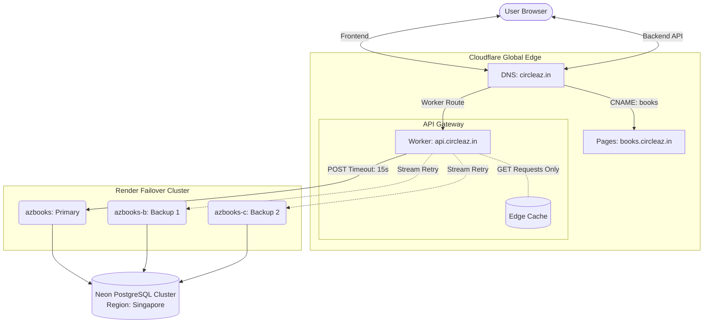
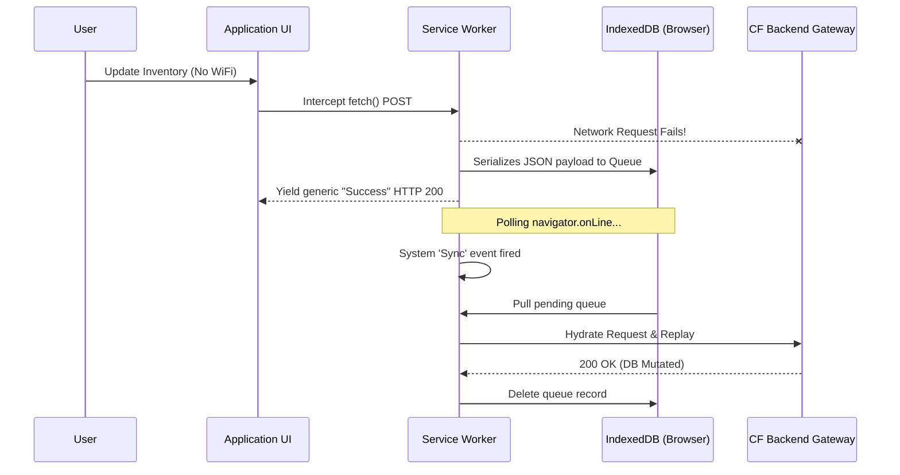

# AZ Books — DevOps Architecture & Handoff Manual

> **Document Status:** Live source of truth.
> **Date:** April 2026
> **Architecture Scope:** Global Edge (Cloudflare) + Failover Backends (Render) + Serverless DB (Neon)

This document is the rigid architectural map of AZ Books in production. It dictates the exact flow of data, build pipelines, and strict security thresholds. **Never guess the architecture—refer to this map.**

---

## 1. Network Topology & Traffic Flow

AZ Books abandons single-server fragility in favor of a Multi-Render Failover cluster masked behind a custom Cloudflare Worker API Gateway. 



### Critical Flow Mechanics
* **API Routing Mismatch Limit:** Render's default routing relies on `Host` headers. Because the CF Worker alters the request to hit `.onrender.com` URLs, the CF worker *must* inject `X-Forwarded-Host: api.circleaz.in`. Django relies entirely on this header to validate CSRF tokens.
* **Host Header Poisoning Defense:** Because `USE_X_FORWARDED_HOST = True` is active, Django will blindly trust the origin header. To prevent attacks where a malicious actor bypasses Cloudflare and hits `.onrender.com` directly with a spoofed header, `ALLOWED_HOSTS` is strictly hardcoded to the three exact Render subdomains. A wildcard `.onrender.com` is absolutely forbidden.
* **Worker Fallback Behavior:** The Worker `backendRequest` buffers POST data (`bodyBuffer = await request.clone().arrayBuffer()`). If a Render instance fails to return a `200 OK` within `15,000ms`, the Worker throws a synthetic AbortError and attempts to stream the identical `bodyBuffer` to the next Render deployment.
* **Edge SWR Cache:** GET responses (not matching `/admin/` or `/token/`) are cached in Cloudflare limits. `CACHE_MAX_AGE=60`, `CACHE_SWR_TTL=3600`. Do not modify cached responses locally; invalidate via Worker redeploy.

---

## 2. CI/CD Pipeline & Build Matrix

The architecture employs an asymmetrical deployment matrix split between Cloudflare and Render infrastructure.

```mermaid
graph LR
    GH[(GitHub Repo: main)]
    
    subgraph Edge Deployment
        GH -->|Webhooks| WebBuild[CF Pages Build]
        GH -.->|Manual Trigger| CFRoot[CF Worker Deploy<br>npx wrangler deploy]
    end
    
    subgraph Backend Cluster Rollout
        GH -->|Auto Deploy Phase 1| R1[Render: azbooks]
        GH -->|Auto Deploy Phase 2| R2[Render: azbooks-b]
        GH -->|Auto Deploy Phase 3| R3[Render: azbooks-c]
    end
    
    subgraph Ephemeral Runners (GH Actions)
        GHAction1[daily_backup.yml]
        GHAction2[overdue_reminders.yml]
        GHAction1 -->|pg_dump - 08:00 UTC| R2Buck[(Cloudflare R2 Bucket)]
        GHAction2 -->|SMTP| Customer
    end
```

### Build Constraints & Warnings
> **Cloudflare Worker Deploy Pathing:** The CF Worker cannot be built automatically from the repository root directory (`/`). GitHub integration will fail. You must CD into `/worker` and execute `npx wrangler deploy` manually, or explicitly lock the Root Directory build step to `/worker`.
>
> **Node.js 24 Actions Deprecation:** Older GitHub Actions natively target Node.js 20 runtimes. We explicitly use `checkout@v5` and `setup-python@v6` (or higher) to natively compile against Node 24 and prevent runner depreciation failures. Beware of copy-pasting older action versions into new workflows (do not use the `FORCE_JAVASCRIPT_ACTIONS_TO_NODE24` band-aid).
>
> **System Build Libraries (Cairo):** The Render `Dockerfile` leverages `python:3.13-slim` but executes PDF generation via `xhtml2pdf`. The `pycairo` module **will fail to build** during `pip install` without OS-level C libraries. `gcc`, `libcairo2-dev`, and `pkg-config` must violently remain inside the Dockerfile `apt-get` command.

---

## 3. Environment & Security Variables Registry

To ensure no "lost state" failures during handoff, here is the master map of where environmental secrets live. **If an environment variable goes missing, check this table before debugging.**

| Component Scope | Secret Name | Value Example / Details | Location Stored |
| --- | --- | --- | --- |
| **Django Backend** | `DATABASE_URL` | `postgres://user:pass...` *(Pooler enabled)* | All 3 Render Dashboards |
| **Django Backend** | `SECRET_KEY` | *(Must NOT contain 'insecure' string)* | All 3 Render Dashboards |
| **Django Backend** | `CSRF_TRUSTED_ORIGINS` | `https://api.circleaz.in,...` | All 3 Render Dashboards |
| **Django Backend** | `USE_X_FORWARDED_HOST` | `True` *(Code-level constant)* | `settings.py` |
| **GitHub Actions** | `DB_HOST`, `DB_NAME` | Sourced from Neon | GH Repository Secrets |
| **GitHub Actions** | `DB_USER`, `DB_PASSWORD` | Sourced from Neon | GH Repository Secrets |
| **GitHub Actions** | `BACKUP_ENCRYPT_KEY` | Symmetric AES key for DB dumps | GH Repository Secrets |
| **GitHub Actions** | `R2_BACKUP_*` (3 keys)| S3-compatible R2 credentials | GH Repository Secrets |
| **React Frontend** | `VITE_API_URL` | `https://api.circleaz.in` | CF Pages Build Settings |

*(Note: WhatsApp Business API tokens are pending hardware SIM activation and are currently untracked.)*

---

## 4. PWA Offline-First Architecture

The React Front-End uses Google Workbox to implement guaranteed eventual-consistency when network partitions occur.



> **UI Lifecycle Routing:** Because cacheable states bypass Django entirely, developers must track `location.key` via React Router hooks (`useLocation`) to ensure that React forces localized state refreshes when a user navigates between pages immediately after triggering an asynchronous Workbox background sync queue execution.
