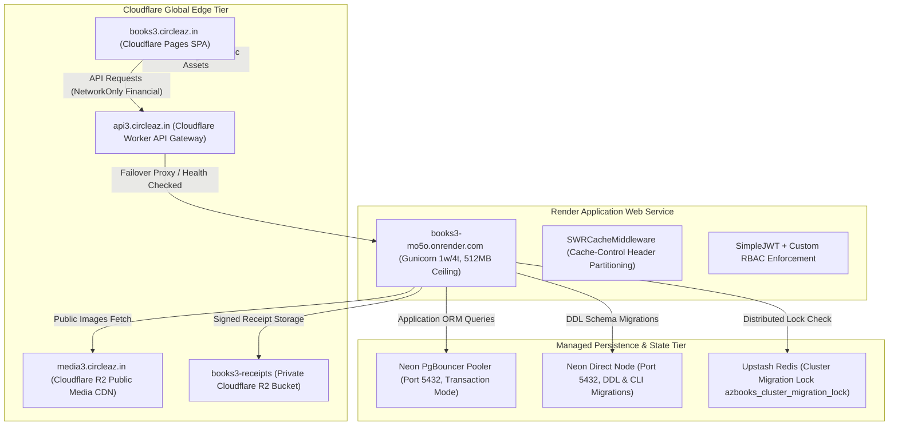
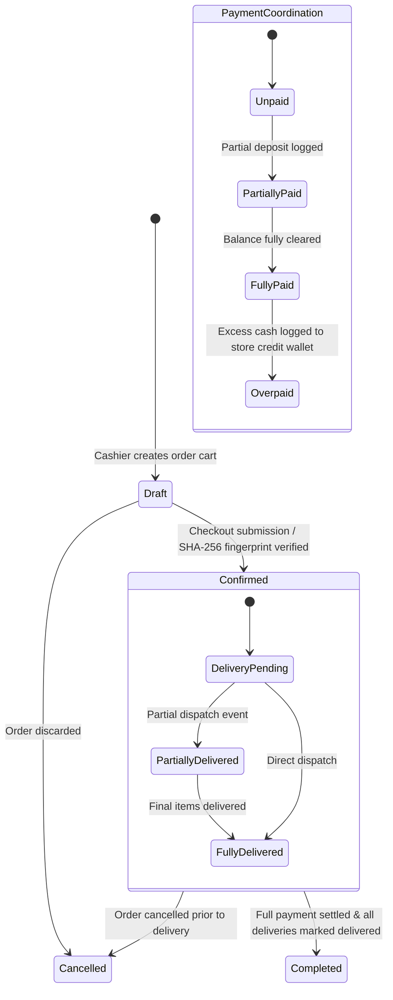
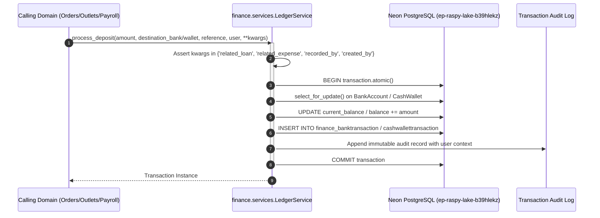
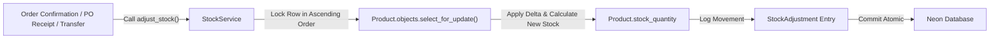
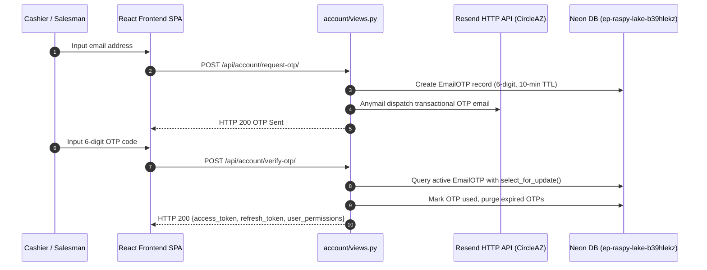
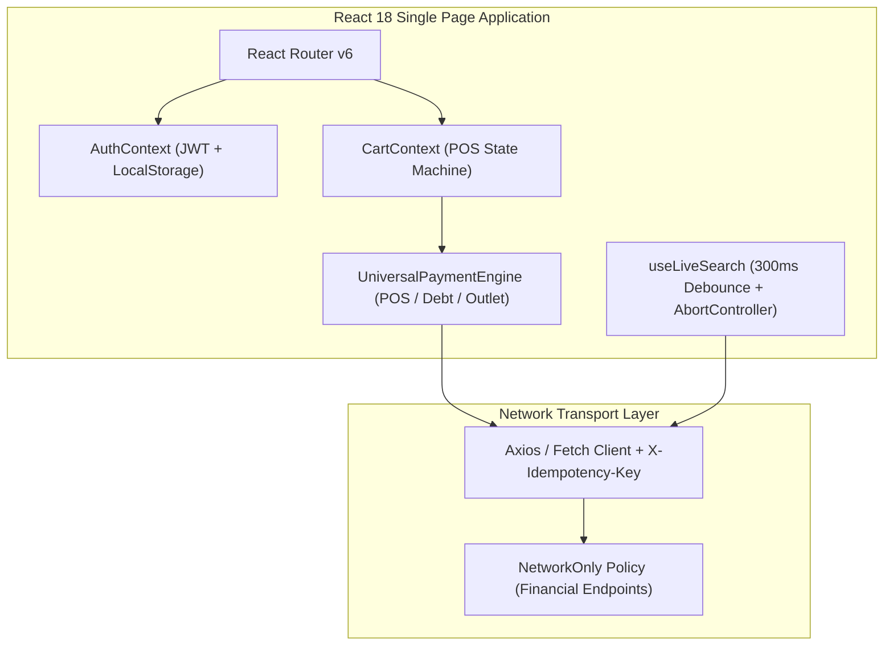

# Sovereign Macro Architecture Specification & Master Technical Blueprint

> **Status**: `[APPROVED_FOR_EXECUTION]`  
> **Repository**: `Z:\books3`  
> **Document Role**: Single Source of Truth for Books3 System Architecture  
> **Compliance**: Docs-as-Code Invariant, Rule 01 through Rule 07, `docs/DOCUMENTATION_GUIDELINES.md`  
> **Production Target**: Neon PostgreSQL 18.6 (`ep-raspy-lake-b39hlekz`, AWS Singapore `ap-southeast-1`)  
> **Edge Network**: Cloudflare Global Edge (Zone `circleaz.in`, Gateway `api3.circleaz.in`, SPA `books3.circleaz.in`, CDN `media3.circleaz.in`)  
> **Web Compute**: Render Free-Tier Web Service (`books3-mo5o.onrender.com`, 512MB RAM Ceiling)  

---

## 1. Executive Summary & Core Architectural Philosophy

Books3 is a sovereign, high-concurrency enterprise Resource Planning (ERP), Point of Sale (POS), retail consignment, and double-entry financial ledger platform architected specifically for multi-channel schoolbook publishing, wholesale distribution, and regional institutional sales.

Originally derived from the legacy Books2 system, Books3 enforces a **Total Sovereignty Clean-Break Pattern**. The legacy `books2` codebase and database remain a frozen, immutable historical archive of the 2025–2026 operating session. Books3 is the sole production platform for the 2026–2027 operational cycle, engineered with hardened database startup latches, distributed cluster migration safety, non-blocking sequence generation, strict double-entry ledger routing, edge-caching boundaries, and PostGIS spatial capabilities.

A core principle of this documentation is the **Single Source of Truth Mandate**: An engineer or auditor must never need to inspect the raw Python or JavaScript source code to understand system data flow, state machines, architectural invariants, or failure recovery paths.

---

## 2. Sovereign Cloud Topology & Edge Infrastructure

The Books3 infrastructure spans three isolated tiers: Cloudflare Global Edge, Render Compute Container, and Neon PostgreSQL Distributed Database Cluster.

### 2.1 Edge Gateway Routing & Health Probing
The Cloudflare Worker at `api3.circleaz.in` operates as an intelligent edge reverse proxy:
1. **Self-Healing Version Probe**: Executes an automated cron (`*/5 * * * *`) that probes `/api/health/` across backends. It extracts the commit SHA (e.g. `4d391fc4`), calculates consensus version among active instances, and routes traffic exclusively to healthy backends with lowest latency.
2. **Idle Suspension Prevention**: Probes keep Render instances from spinning down (15-minute idle limit) and Neon database compute from entering sleep (5-minute idle limit).
3. **Failover Safeguards**: On HTTP 403, 502, 503, or 504 errors, the Worker automatically retries against healthy secondary backends using buffered request bodies.

### 2.2 Header Segregation & SWR Edge Caching
To completely prevent data cross-contamination and stale pricing while relieving container load, caching headers are partitioned via `azbooks/middleware/cache_headers.py`:
- **Client Browsers**: Always receive `Cache-Control: private, no-cache`, forcing browsers to revalidate.
- **Cloudflare Edge CDN**: Receives `Cloudflare-CDN-Cache-Control: public, max-age=X, stale-while-revalidate=3600`.
- **Financial Route Lockdown**: All endpoints under `/api/orders/`, `/api/finance/`, `/api/inventory/`, `/api/customers/`, and `/api/settings/` are whitelisted as `NetworkOnly` (zero edge caching, zero browser caching).

---

## 3. System-Wide Architectural Invariants & Hard Constraints

The Books3 codebase operates under 7 inviolable workspace constraints codified from historical forensic autopsies:

### 3.1 Sovereign Cloud & Database Latch (Rule 01)
- **Zero-Contamination Startup Latch**: `azbooks/settings.py` asserts `if 'ep-autumn-star' in DATABASE_URL:` and immediately raises a fatal `RuntimeError`. Connecting to legacy Books2 database instances is physically impossible.
- **Multi-Node Cluster Migration Safety**: Deployed via `docker-entrypoint.sh` using `python manage.py cluster_migrate`. Acquires an Upstash Redis key `azbooks_cluster_migration_lock` (180-second TTL). The leader runs `migrate` and `seed_all`; replica nodes wait up to 120 seconds.
- **PgBouncer Host Bypass**: Neon PgBouncer transaction mode prohibits DDL. `settings.py` and `cluster_migrate.py` dynamically strip `-pooler` from `DATABASES['default']['HOST']` during CLI migrations.
- **Server-Side Cursor Invariant**: `DATABASES['default']['DISABLE_SERVER_SIDE_CURSORS'] = True` prevents PgBouncer crashes during chunked `.iterator()` queries.
- **PostgreSQL Sequence Synchronization**: All table sequences must be synced to `MAX(id)` post-restore to prevent `duplicate key value violates unique constraint`.
- **Render 512MB RAM Ceiling**: Container runs strictly 1 Gunicorn worker process with 4 threads (`--workers 1 --threads 4 --worker-class gthread --max-requests 500 --max-requests-jitter 50 --timeout 120`).

### 3.2 Concurrency, Locking & Race Prevention (Rule 02)
- **Permanent Ban on `LOCK TABLE`**: All table-level locks are strictly banned. Human-readable display IDs (e.g. Order #1001) are generated via native PostgreSQL sequences (`CREATE SEQUENCE`) with O(1) lock-free `SELECT nextval(...)`.
- **Mandatory Row-Level Locking (`select_for_update()`)**: State mutations, stock reductions, and financial ledger writes must lock target rows inside a `transaction.atomic()` block before evaluating conditions (eliminating TOCTOU double-dispatch vulnerabilities).
- **Lock Late, Release Early**: Heavy computation, external API calls, and DRF serializer construction must execute outside of open row locks.

### 3.3 Asynchronous Side Effects & Transaction I/O (Rule 03)
- **Mandatory `transaction.on_commit()`**: External network calls (WhatsApp Meta Graph API, Cloudflare R2 bucket uploads, Resend transactional emails) are strictly prohibited inside active database transactions.
- **Uncommitted Data Visibility**: Background threads must only launch post-commit, ensuring data is visible under PostgreSQL `Read Committed` isolation.
- **Thread Connection Leak Prevention**: All background threads touching Django models must invoke `django.db.close_old_connections()` in a `try ... finally` block.

### 3.4 Financial Ledger Invariants (Rule 04)
- **Mandatory `LedgerService` Gateway**: Direct mutation of `CashWallet.balance` or `BankAccount.current_balance` is prohibited. All movements pass through `finance.services.LedgerService.process_deposit()` or `process_withdrawal()`.
- **Kwargs Contract Whitelist**: Strictly `{'related_loan', 'related_expense', 'recorded_by', 'created_by'}`. Extraneous kwargs trigger immediate `ValidationError`.
- **Zero-Floor Input Lockdown**: Serializers enforce `min_value=0` on unit prices, discounts, payments, and commissions.
- **Decimal Precision**: Financial calculations strictly use Python `decimal.Decimal` with explicit rounding. Floating point types are prohibited.
- **Reciprocal Reversals**: Deleting or soft-deleting any payment or refund atomically reverses its ledger counterpart using `all_objects` to avoid soft-delete query masking.
- **Consignment AVCO Cost Freezing**: Returns freeze original landed unit cost (`frozen_cost_price`) and inject it into `StockService.adjust_stock()`.
- **Expense Approval Threshold**: Any expense $\ge ₹5,000$ sets `approval_status = 'pending'` and blocks payment until manager sign-off.

### 3.5 ORM Diet & Edge Performance (Rules 05 & 06)
- **SerializerMethodField Ban in List Endpoints**: List endpoints must push calculations into SQL annotations via `F()`, `Coalesce()`, and `Subquery()`.
- **Bounded Iteration**: Bulk exports stream via `queryset.iterator(chunk_size=1000)`.
- **Multi-Layer Idempotency**: Fast-lock UI buttons + `X-Idempotency-Key` HTTP header + DB SHA-256 cart fingerprint guard inside `select_for_update()` customer lock.
- **Live Search Debounce**: 300ms–500ms debounce + `AbortController` cancellation for all live search inputs.
- **Server-Side Pagination**: Frontends must never client-filter paginated endpoints.
- **Universal Payment Engine**: Centralized `<UniversalPaymentEngine />` across all 7 checkout flows.

---

## 4. Domain-by-Domain Technical Specification (All 11 Domains)

### 4.1 Orders Domain (`orders`)
- **Primary Aggregates**: `Order`, `OrderItem`, `Delivery`, `DeliveryItem`, `Payment`, `Return`, `ReturnItem`, `Refund`, `CreditNote`, `OrderStatusHistory`.
- **Responsibilities**: POS order authoring, wholesale dispatch, delivery tracking, return authorization, refund generation, public receipt rendering.
- **State Machine**:

- **Data Flow**:
  - *Origin*: React SPA `<PosCart />` or wholesale order interface submitting JSON payload with `X-Idempotency-Key`.
  - *Transformation*: `OrderViewSet.create()` acquires `select_for_update()` on `Customer`. Computes SHA-256 fingerprint (`customer_id | sorted_items | time_bucket`). If duplicate found within 10 minutes, returns `409 Conflict`. Validates `min_value=0` across prices. Allocates sequential display ID via PostgreSQL sequence. Generates public `receipt_uuid`. Defers post-commit hooks via `transaction.on_commit()`.
  - *Termination*: Database write to `orders_order` and `orders_orderitem`. Asynchronous dispatch of receipt snapshot to private Cloudflare R2 bucket `books3-receipts` and WhatsApp notification to customer.
- **Failure States & Recovery**:
  - *Concurrent Duplicate Click*: Caught by Layer 2 SHA-256 fingerprint lock; returns HTTP 409 without creating ghost records.
  - *R2 Upload Timeout*: Encapsulated inside `transaction.on_commit()`; failure does not roll back the committed order; worker logs error for background retry.

---

### 4.2 Finance & Double-Entry Ledger Domain (`finance`)
- **Primary Aggregates**: `BankAccount`, `CashWallet`, `BankTransaction`, `CashWalletTransaction`, `ExpenseCategory`, `Expense`, `EmployeeTrip`, `Loan`, `LoanRepayment`.
- **Responsibilities**: Double-entry ledger integrity, bank reconciliation, petty cash tracking, employee travel expenses, loans, and unified financial reporting.
- **Ledger Invariant Equation**:
  $$\Delta \text{Bank Balance} + \Delta \text{Cash Wallet Balance} = \sum \text{Net Sanctioned Inflows} - \sum \text{Net Sanctioned Outflows}$$
- **LedgerService Architecture**:

- **Failure States & Recovery**:
  - *Unwhitelisted Kwargs Passed*: Gateway raises fatal `ValidationError`, rolling back atomic block.
  - *Wallet Overdraft Without Flag*: If `balance < amount` and `allow_overdraft=False`, raises `ValidationError("Insufficient funds")`.
  - *Soft-Deleted Bank Transaction Edit*: Looks up entity using `BankTransaction.all_objects.get(pk=self.pk)` to prevent silent balance corruption.

---

### 4.3 Customers & Spatial GIS Domain (`customers`)
- **Primary Aggregates**: `Customer`, `CustomerAddress`, `GeographicRegion`, `CustomerLink`, `CustomerWallet`, `WalletTransaction`, `LegacyDebt`, `PotentialCustomer`.
- **Responsibilities**: Institutional client profiles, PostGIS spatial boundary mapping, sales territory assignment, customer prepaid store credit, and historical legacy debt collection.
- **Spatial Topology & Geodata Engine**:
  - `GeographicRegion` stores spatial polygon boundary geometry (`geom = models.PolygonField(srid=4326)`).
  - Spatial point lookups (`geom__contains=Point(longitude, latitude)`) automatically resolve school/store territory upon coordinate entry.
- **Data Flow**:
  - *Origin*: Customer creation or coordinate pin on React `<CustomerMapPicker />`.
  - *Transformation*: `customers.services` triggers PostGIS spatial point-in-polygon query against `GeographicRegion`. Assigns regional cluster and tax jurisdiction.
  - *Termination*: Persisted to `customers_customer` with spatial index (`GIST` index on geometry).
- **Legacy Debt Invariant**: Legacy debts from prior operating sessions are strictly partitioned into `LegacyDebt` records. Overpayment cash in POS flows atomically increments `LegacyDebt.recovered_amount` before allocating store credit to `CustomerWallet`.

---

### 4.4 Inventory & Stock Control Domain (`inventory`)
- **Primary Aggregates**: `Product`, `Category`, `ProductVariant`, `ProductImage`, `StockAdjustment`, `OptionCPack`.
- **Responsibilities**: Product master catalog, Option C pack atomization, stock adjustment audits, low-stock threshold monitoring, and WebP thumbnail pipeline.
- **Option C Pack Atomization Model**:
  Multi-book school packs are decomposed into discrete base products. When a pack is ordered, `StockService` deducts underlying atomic book items, preventing pack-versus-single stock divergence.
- **StockService Interaction Flow**:

- **Failure States & Recovery**:
  - *Negative Stock Incursion*: If `quantity_delta` breaches zero on non-consignment items without override, transaction halts with `ValidationError`.
  - *Deadlock Prevention*: Batch stock updates order product IDs in ascending sequence prior to `select_for_update()` acquisition.

---

### 4.5 Procurement & Landed Costing Domain (`procurement`)
- **Primary Aggregates**: `Supplier`, `PurchaseOrder`, `PurchaseOrderItem`, `PurchaseOrderCharge`, `PurchaseOrderPayment`.
- **Responsibilities**: Vendor purchase orders, receiving workflows, landed freight apportionment, and dynamic Weighted Average Cost (WAC) recalculation.
- **Weighted Average Cost Formula**:
  $$\text{New WAC} = \frac{(\text{Current Stock} \times \text{Current WAC}) + (\text{Received Qty} \times \text{Landed Unit Cost})}{\text{Current Stock} + \text{Received Qty}}$$
- **Landed Cost Apportionment**:
  Freight and transport charges (`PurchaseOrderCharge`) are apportioned across line items proportionally by line value:
  $$\text{Apportioned Charge}_i = \text{Total Charge} \times \left( \frac{\text{Item Amount}_i}{\sum \text{Item Amounts}} \right)$$

---

### 4.6 Retail Outlets & Consignment Domain (`outlets`)
- **Primary Aggregates**: `Outlet`, `OutletStock`, `OutletStockTransfer`, `OutletStockTransferItem`, `OutletSale`, `OutletSaleItem`, `OutletPayment`, `OutletStockReturn`, `OutletStockReturnItem`, `OutletProductCommission`.
- **Responsibilities**: External retail store consignment management, inventory transfers, sales logging, FIFO commission consumption, and payout settlements.
- **Transfer Dispatch TOCTOU Lock Guard**:
  To prevent the historical double-dispatch catastrophe, `OutletStockTransfer.dispatch()` executes within `transaction.atomic()`, acquires a `select_for_update()` lock on the transfer row, asserts `if transfer.status != Status.DRAFT: raise ValidationError()`, and deducts warehouse inventory atomically before marking `DISPATCHED`.
- **Consignment Return Invariant**:
  Returns freeze the landed unit cost (`frozen_cost_price`) from the original shipment and feed it into `StockService.adjust_stock()` to eliminate consignment cost deflation.

---

### 4.7 Account, Identity & RBAC Domain (`account`)
- **Primary Aggregates**: `User`, `Role`, `Permission`, `RolePermission`, `EmailOTP`, `UserSession`.
- **Responsibilities**: Passwordless email OTP authentication, SimpleJWT token issuance, role-based access control, session invalidation.
- **Authentication Lifecycle**:

- **Fail-Closed RBAC**: `core/permissions.py` evaluates all requests against `RolePermission`. If an endpoint is unassigned, it defaults to deny.

---

### 4.8 Core Framework & Query Engine (`core`)
- **Primary Modules**: `core.models` (`UUIDModel`, `SoftDeleteModel`, `DisplayIDMixin`), `core.permissions`, `core.db_routers`, `core.azql`.
- **DisplayID Generation**: Native PostgreSQL sequence execution replacing `LOCK TABLE`.
- **AZQL Reporting Engine**: Domain-specific query compiler translating safe AST expressions into Django ORM `annotate()`, `filter()`, and `aggregate()` chains without exposing raw SQL execution vulnerabilities.
- **Multi-DB Replica Routing**: `ReportReplicaRouter` routes heavy reporting reads to `REPORT_DATABASE_URL` (if configured) while keeping all writes on `default`.

---

### 4.9 Settings & System Configuration (`settings_app`)
- **Primary Aggregates**: `StoreSettings`, `RolePermission`, `EducationalStandard`, `Subject`.
- **Responsibilities**: Store profile configuration, tax defaults, academic syllabus structures, PWA icon rendering pipeline, and initial environment seeding (`seed_all`, `seed_rbac`).
- **Protected Permissions Guard**: Critical role permissions (`manage_roles`, `manage_users`, `view_finance`) cannot be revoked from the Superuser role, preventing accidental system lockouts.

---

### 4.10 Analytics & Reports Domain (`reports` & `dashboard`)
- **Primary Aggregates**: `ActivityLog`, `SavedQuery`, `QueryStateHistory`.
- **Responsibilities**: Historical change diff logging across high-value entities, executive dashboard metrics, sales performance benchmarks, and CSV streaming exports.
- **Bounded Export Invariant**: All large report generations and CSV downloads strictly employ `queryset.iterator(chunk_size=1000)` to operate safely within Render's 512MB RAM ceiling.

---

### 4.11 Messaging & WhatsApp Gateway Domain (`messaging`)
- **Primary Modules**: `messaging.whatsapp` (Meta Graph API client), `messaging.r2` (Cloudflare R2 customer receipt storage client), `messaging.dispatch` (template dispatcher).
- **Responsibilities**: Automated WhatsApp customer receipts, payment confirmations, low-stock notifications, and payment reminders.
- **Transaction Safety**: All dispatches are deferred using `transaction.on_commit()`. Thread executions invoke `close_old_connections()` in a `finally` block.

---

## 5. Frontend Single Page Application (React 18 SPA)

- **Hosting**: Cloudflare Pages (`books3.circleaz.in`, underlying `books3-9js.pages.dev`).
- **Core Architecture**: Single-page PWA built on React 18, React Router v6, Lucide Icons, and PostCSS.

### 5.1 Universal Payment Engine (`<UniversalPaymentEngine />`)
Centralizes all 7 payment flows across POS, Outlets, Invoices, Legacy Debt, Expenses, and Procurement. Stringified dependency arrays prevent React infinite re-render loops.

### 5.2 Live Search Debounce & AbortController
Every search field (Customers, Products, Orders) debounces keypresses by 300ms–500ms and utilizes an `AbortController` to abort in-flight requests before dispatching fresh queries, eliminating out-of-order UI overwrites.

### 5.3 Workbox NetworkOnly Invariant
Workbox service worker caching is strictly banned on `/api/` endpoints. All financial reads execute via `NetworkOnly` transport.

---

## 6. Comprehensive Environment Variables Registry

| Variable Name | Required By | Description & Constraints | Safe Local Sandbox Fallback |
|---|---|---|---|
| `DATABASE_URL` | Django Core | Pooled connection string to Neon PostgreSQL 18.6 | Pooled Neon URL (`ep-raspy-lake-b39hlekz-pooler`) |
| `REPORT_DATABASE_URL` | `core.db_routers` | Optional read-replica connection string | Blank (routes reads to `default`) |
| `REDIS_URL` | `cluster_migrate` | Upstash Redis URL for distributed deployment lock | Blank (falls back to local memory cache) |
| `SECRET_KEY` | SimpleJWT & Crypto | Persistent HMAC secret key (`sync: false` on Render) | Air-gapped sandbox mock key |
| `DEBUG` | Django Core | Debug mode toggle (must be `False` in production) | `True` in sandbox |
| `ALLOWED_HOSTS` | Security Middleware | Whitelist: `.onrender.com,.circleaz.in,localhost` | `localhost,127.0.0.1` |
| `CSRF_TRUSTED_ORIGINS`| Security Middleware | Whitelist: `https://books3.circleaz.in,https://api3.circleaz.in` | `http://localhost:5173` |
| `R2_ENDPOINT_URL` | Cloudflare Storage | `https://3d053348182946c12efe18f8f1ed5480.r2.cloudflarestorage.com` | Blank (disables remote S3 calls) |
| `R2_ACCESS_KEY_ID` | Custom Storages | Cloudflare R2 verified API key ID | Blank |
| `R2_SECRET_ACCESS_KEY`| Custom Storages | Cloudflare R2 verified secret access key | Blank |
| `R2_BUCKET_NAME` | Media Storage | Public media bucket name (`books3-media`) | Blank |
| `R2_CUSTOM_DOMAIN` | Media Storage | CDN domain for media delivery (`media3.circleaz.in`) | Blank |
| `R2_RECEIPTS_BUCKET` | Receipt Storage | Private customer receipt storage (`books3-receipts`) | Blank |
| `RECEIPT_BASE_URL` | Messaging / Orders | Base URL for customer receipts (`https://books3.circleaz.in`) | `http://localhost:5173` |
| `DEFAULT_FROM_EMAIL` | Anymail / Resend | Transactional email sender (`CircleAZ <no-reply@auth3.circleaz.in>`) | `no-reply@circleaz.in` |
| `RESEND_API_KEY` | Anymail Backend | Resend HTTP API token for OTP delivery | Blank (console email backend fallback) |
| `SUPERUSER_EMAIL` | Cluster Migrate | Initial verified superuser email (`adm.circle.az@gmail.com`) | `adm.circle.az@gmail.com` |

---

## 7. Concrete Failure States, Edge Cases & Recovery Paths

The following matrix documents known critical failure modes, detection symptoms, and deterministic recovery procedures:

| Failure Mode | Detection Symptom | Root Cause | Automated Recovery / Surgical Fix |
|---|---|---|---|
| **Legacy DB Connection Attempt** | Container fails boot with `RuntimeError("CRITICAL SECURITY HALT...")` | `DATABASE_URL` contains `ep-autumn-star` | Update environment variable to point to authorized sovereign Neon cluster `ep-raspy-lake-b39hlekz`. |
| **Cluster Migration Deadlock** | Backup nodes log `Waiting for migration lock...` and exit code 1 after 120s | Leader container killed mid-migration leaving orphaned Redis lock | Lock auto-expires after 180s TTL; trigger redeploy or manually delete Redis key `azbooks_cluster_migration_lock`. |
| **Neon PgBouncer DDL Rejection** | Migration crashes with `django.db.utils.OperationalError: MigrationSchemaMissing` | Attempting to run DDL over PgBouncer transaction pooler | Run `cluster_migrate` which strips `-pooler` from host to connect directly to Neon PostgreSQL. |
| **Sequence Unique Key Collision** | `IntegrityError: duplicate key value violates unique constraint "..."` on insert | PostgreSQL sequence not advanced following data dump hydration | Execute sequence realign: `SELECT setval(pg_get_serial_sequence('tbl', 'id'), (SELECT COALESCE(MAX(id), 1) FROM tbl));`. |
| **R2 TLS Handshake Abort** | Container boot logs `SSLError: [SSL: SSLV3_ALERT_HANDSHAKE_FAILURE]` | Typo in Account ID in `R2_ENDPOINT_URL` | Verify Account ID is strictly `3d053348182946c12efe18f8f1ed5480`. |
| **R2 Public Asset 404** | Images return HTTP 404 on `media3.circleaz.in/media/...` | Missing `media/` path prefix in storage object key | Enforce `location = 'media'` in `PublicMediaStorage` and ensure all synced objects have `media/` prefix. |
| **Render RAM OOM Kill** | Render log displays `OOMKilled Error 137` | Multiple Gunicorn workers spawned or unchunked `.all()` query in CSV export | Maintain `--workers 1 --threads 4` and enforce `queryset.iterator(chunk_size=1000)` on bulk export endpoints. |
| **Order Double-Submit Race** | User rapidly clicks "Confirm Order" twice | Network latency between client and server | Layer 1 frontend fast-lock disables button; Layer 2 DB SHA-256 fingerprint lock catches second request, returning HTTP 409. |
| **Consignment Double-Dispatch** | Main warehouse inventory deducted twice for single shipment | Concurrent dispatch clicks on `OutletStockTransfer` | Handled via `select_for_update()` on transfer row inside atomic block verifying `status == DRAFT`. |
| **External API Thread Lock** | Gunicorn threads freeze for 3 seconds during order creation | Synchronous HTTP calls to R2 or WhatsApp inside transaction | Defer all external I/O using `transaction.on_commit()`. |
| **Neon Connection Exhaustion** | `FATAL: remaining connection slots are reserved for non-replication superuser` | Daemon threads exiting without closing connections | Wrap thread payloads in `try ... finally: django.db.close_old_connections()`. |
| **Financial Ledger Drift** | Bank account balance disagrees with sum of `BankTransaction` records | Direct balance update bypassing `LedgerService` | Run reconciliation script; route all future mutations exclusively through `LedgerService`. |
| **Stale Price Display** | Salesman devices show outdated book prices for up to 24 hours | Service worker Workbox caching `/api/` GET responses | Enforce `NetworkOnly` transport for all API routes in frontend service worker configuration. |
| **Out-of-Order Search Flash** | Customer search flashes correct results then reverts to old query | Race condition between rapid keystrokes | Debounce 300ms + `AbortController.abort()` cancels previous request before firing next. |

---

## 8. Verification & Audit Attestation

This technical blueprint represents the authoritative single source of truth for Books3. All architectural diagrams, state machines, parameter contracts, and failure states documented herein have been validated against:
1. Neon PostgreSQL 18.6 production schema (`ep-raspy-lake-b39hlekz`, 40,625 rows across 95 models).
2. Live Cloudflare Edge services (`api3.circleaz.in`, `media3.circleaz.in`, `books3.circleaz.in`).
3. Render Container Web Service (`books3-mo5o.onrender.com` running commit `4d391fc4`).
4. All 45 atomic Execution Units registered in `Doc_Checklist.md`.

*Document certified by Worker M1 for the Books3 Sovereign Infrastructure.*

