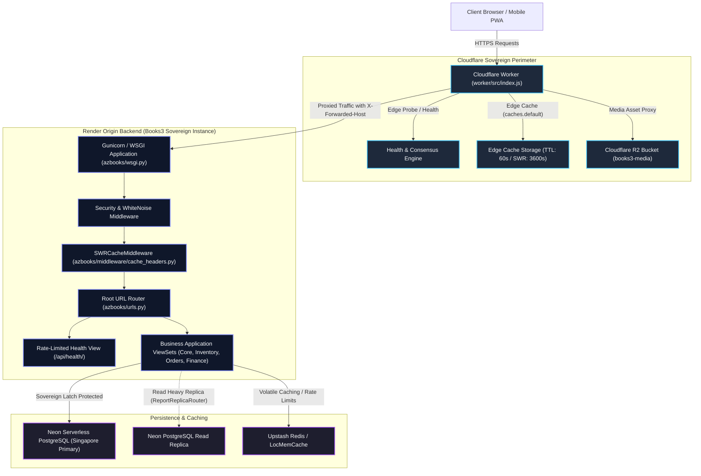
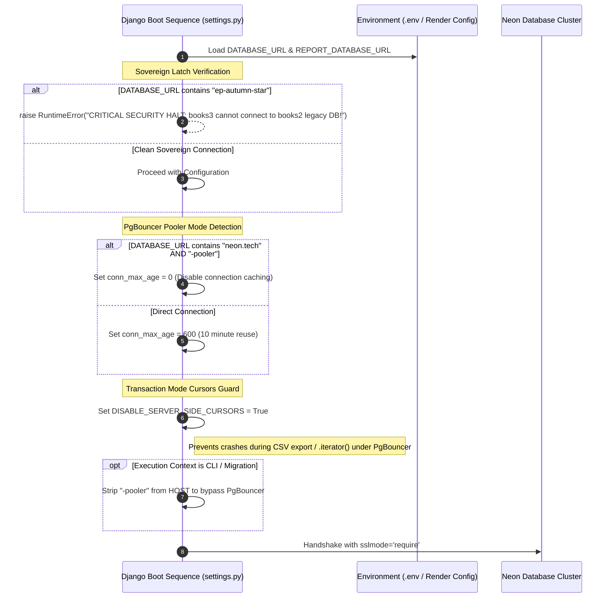
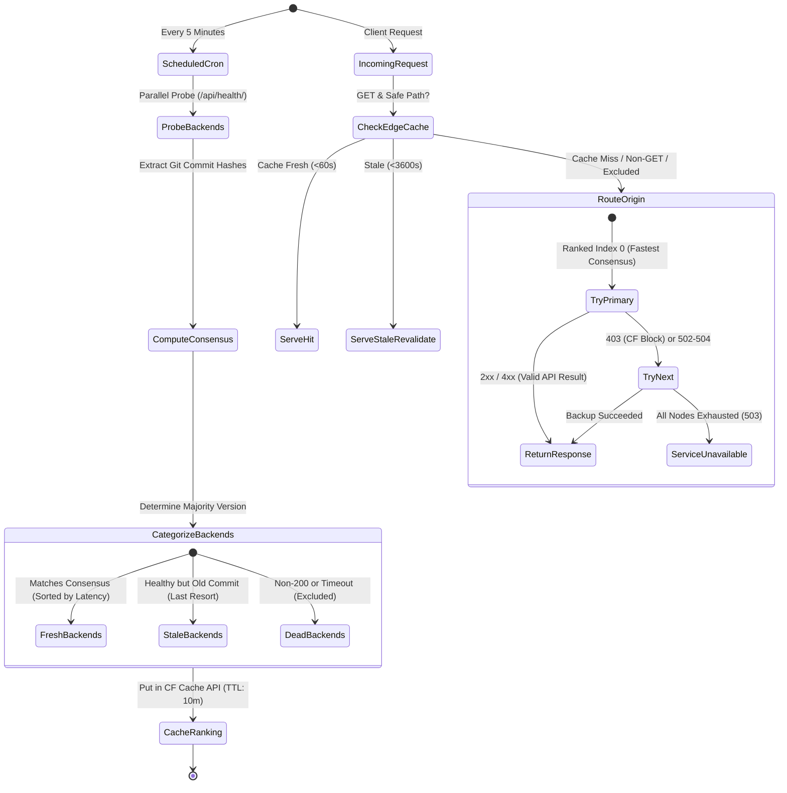
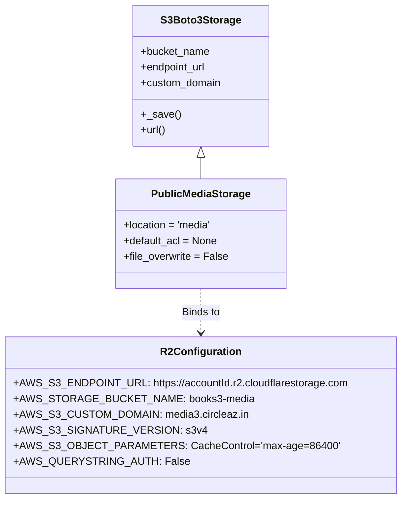

# EU-01: Core Architecture, Sovereign Latch & Cloudflare Worker Gateway

## 1. Architectural Role & Boundary Overview

`EU-01` constitutes the foundational runtime, security perimeter, storage layer, and ingress gateway for the AZ Books 3.0 enterprise architecture. It establishes the sovereign operational boundary separating Books3 from legacy Books2 infrastructure, implements dual-tier edge and origin caching, coordinates zero-downtime rolling deployments across Render backends via an adaptive Cloudflare Worker, and configures distributed object storage on Cloudflare R2.



---

## 2. Source File Inventory & Structural Ownership

| Source File Path | Architectural Responsibilities |
| :--- | :--- |
| [`azbooks/__init__.py`](file:///z:/books3/azbooks/__init__.py) | Package root initializer ensuring standard Python module exposure. |
| [`azbooks/settings.py`](file:///z:/books3/azbooks/settings.py) | Master production settings, sovereign database latch, PostGIS Windows DLL auto-discovery, Neon connection pooling rules, R2 storage bindings, JWT lifecycles, and CORS security. |
| [`azbooks/urls.py`](file:///z:/books3/azbooks/urls.py) | Root URL configuration, ratelimited `/api/health/` sentinel exposing git commit digests, JWT routing, and sub-app delegation. |
| [`azbooks/wsgi.py`](file:///z:/books3/azbooks/wsgi.py) | Synchronous WSGI gateway entrypoint consumed by Gunicorn in Render production containers. |
| [`azbooks/asgi.py`](file:///z:/books3/azbooks/asgi.py) | Asynchronous ASGI gateway configuration reserved for future WebSocket and async push services. |
| [`azbooks/custom_storages.py`](file:///z:/books3/azbooks/custom_storages.py) | Custom S3Boto3 storage handler (`PublicMediaStorage`) pointing media uploads to Cloudflare R2 under path prefix `media/`. |
| [`azbooks/middleware/__init__.py`](file:///z:/books3/azbooks/middleware/__init__.py) | Middleware package exports. |
| [`azbooks/middleware/cache_headers.py`](file:///z:/books3/azbooks/middleware/cache_headers.py) | Edge cache header injection engine (`SWRCacheMiddleware`) emitting `Cloudflare-CDN-Cache-Control` while keeping browser headers private. |
| [`worker/src/index.js`](file:///z:/books3/worker/src/index.js) | Cloudflare Worker Edge Gateway: version-aware consensus routing, 5-minute background probe, latency re-ranking, and SWR caching. |

---

## 3. Sovereign Latch & Database Isolation Invariants

To guarantee physical isolation between Books3 and Books2, the settings module implements runtime halting guards and connection pool optimizations specifically engineered for serverless PostgreSQL on Neon:



### Invariant Specifications

1. **Sovereign Database Latch**:
   - `azbooks/settings.py` asserts:
     ```python
     if 'ep-autumn-star' in DATABASE_URL:
         raise RuntimeError("CRITICAL SECURITY HALT: books3 cannot connect to books2 legacy production database (ep-autumn-star)!")
     ```
   - Any attempt to boot Books3 pointing to Books2 legacy primary (`ep-autumn-star`) terminates the container before Django apps load.
2. **Serverless PgBouncer Transaction Mode Invariant**:
   - Neon serverless pooling runs PgBouncer in transaction mode. Because server-side named cursors depend on session-level state, standard Django `.iterator()` calls crash without `DISABLE_SERVER_SIDE_CURSORS = True`.
   - When pooled (`-pooler` in URL), `conn_max_age` is forced to `0`, ensuring connections are not cached across ephemeral PgBouncer multiplexing threads.
3. **CLI Management Bypass**:
   - Long-running migrations and management commands (e.g., `audit_regions`, `load_geodata`) bypass transaction pooling by replacing `-pooler` in `DATABASES['default']['HOST']` with direct connection hostnames.

---

## 4. Cloudflare Worker Gateway & Adaptive Failover

The edge API gateway located in `worker/src/index.js` acts as an intelligent router fronting the Render backend instances.



### Worker Gateway Contract & Mechanics

- **Probe Bot Header Emulation**: Scheduled cron probes lack client request context and trigger Render bot protections. The probe injects browser-grade headers:
  ```javascript
  'User-Agent': 'Mozilla/5.0 (compatible; AZBooks-VersionProbe/1.0)',
  'Accept': 'application/json, text/plain, */*'
  ```
- **Consensus Versioning**: Consensus is defined as the version reported by the plurality of healthy backends:
  $$\text{Consensus} = \arg\max_{v} \sum_{b \in \text{Healthy}} \mathbb{I}(\text{version}(b) = v)$$
  Backends deployed with new code are favored as soon as they reach quorum; stale backends serve as fallback cushions during zero-downtime rolling updates.
- **Failover Status Codes**: Responses with HTTP status `403` (Render bot protection challenge) or `502`–`504` (gateway timeout or container boot) trigger automatic retry to the next backend in the ranked list without user impact.
- **Body Buffering for Safe Retries**: Non-GET/HEAD request payloads are pre-buffered via `request.clone().arrayBuffer()` allowing idempotent re-transmission across nodes if the primary node times out.

---

## 5. Dual-Tier Caching & SWRCacheMiddleware

To prevent cross-tenant cache pollution while capitalizing on Cloudflare edge acceleration, `azbooks/middleware/cache_headers.py` implements a split cache header pattern:

```mermaid
sequenceDiagram
    autonumber
    participant Browser as Client Browser / PWA
    participant CFEdge as Cloudflare Edge CDN
    participant Middleware as SWRCacheMiddleware
    participant View as Django API View

    Browser->>CFEdge: GET /api/inventory/products/
    CFEdge->>Middleware: Edge Miss -> Forward Request
    Middleware->>View: Dispatch Handler
    View-->>Middleware: 200 OK (Product List JSON)
    
    Note over Middleware: Evaluate Caching Rules
    Middleware->>Middleware: Path in CACHEABLE_EXACT_ROUTES (TTL: 30s)
    Middleware->>Middleware: Set Cache-Control: "private, no-cache"
    Middleware->>Middleware: Set Cloudflare-CDN-Cache-Control: "public, max-age=30, stale-while-revalidate=3600"
    Middleware->>Middleware: Set Vary: "Accept-Encoding"

    Middleware-->>CFEdge: Transmit Response
    Note over CFEdge: Cloudflare reads Cloudflare-CDN-Cache-Control<br/>Caches payload for 30s (SWR 1 hr)<br/>STRIPS header from response
    CFEdge-->>Browser: HTTP 200 OK (Cache-Control: private, no-cache)
    Note over Browser: Browser NEVER stores in shared cache;<br/>Always revalidates against edge.
```

### Route-Level Caching Topology

| Route / Prefix Pattern | Match Mode | Edge TTL | Exclusions / Notes |
| :--- | :--- | :--- | :--- |
| `/api/inventory/products/` | Exact | 30 seconds | Reduced from 120s to reflect real-time pricing and stock sync. |
| `/api/dashboard/stats/` | Exact | 60 seconds | High-traffic overview metrics. |
| `/api/dashboard/top-products/` | Exact | 120 seconds | Aggregated sales metrics. |
| `/api/dashboard/sales-trend/` | Exact | 120 seconds | Trend series. |
| `/api/dashboard/alerts/` | Exact | 60 seconds | Stock alert indicators. |
| `/api/inventory/categories/` | Exact | 300 seconds | Static catalog taxonomy. |
| `/api/inventory/vendors/` | Exact | 300 seconds | Vendor directory. |
| `/api/customers/customers/map_data/` | Exact | 300 seconds | Geospatial customer pins. |
| `/api/reports/` | Prefix | 120 seconds | Read-only report sub-endpoints. |
| **Exclusions**: `/api/account/`, `/api/token/`, `/api/orders/`, `/api/finance/`, `/api/messaging/`, `/api/outlets/`, `/api/inventory/stock*`, `/admin/` | Prefix | **0s (Bypass)** | Real-time stateful, authenticated, or financial transactions. |

---

## 6. Distributed Storage & Cloudflare R2 Integration

All media attachments, customer receipts, and product image uploads are decoupled from the container filesystem via `azbooks/custom_storages.py` and `django-storages`:



### Storage Configuration Matrix

| Parameter | Configuration Value | Architectural Justification |
| :--- | :--- | :--- |
| `STORAGES['default']['BACKEND']` | `azbooks.custom_storages.PublicMediaStorage` | Routes Django `FileField` and `ImageField` models directly to R2. |
| `STORAGES['staticfiles']['BACKEND']` | `whitenoise.storage.CompressedStaticFilesStorage` | Compresses static assets with Brotli/Gzip for zero-latency origin serving. |
| `AWS_S3_CUSTOM_DOMAIN` | `media3.circleaz.in` | Custom sovereign domain bypassing direct S3 API URLs for CDN routing. |
| `AWS_QUERYSTRING_AUTH` | `False` | Clean, public asset URLs without ephemeral expiration query tokens. |
| `AWS_S3_OBJECT_PARAMETERS` | `{'CacheControl': 'max-age=86400'}` | Browser and CDN cache assets for 24 hours. |
| `file_overwrite` | `False` | Protects existing product images and customer receipts against accidental overwrites. |

---

## 7. Security Hardening, Rate Limiting & Fail-Closed Guards

1. **SECRET_KEY Production Guard**:
   - If `DEBUG=False` and `'insecure'` is detected in `SECRET_KEY`, container initialization raises `ImproperlyConfigured`.
2. **Reverse Proxy & SSL Hardening**:
   - `SECURE_PROXY_SSL_HEADER = ('HTTP_X_FORWARDED_PROTO', 'https')` informs Django of Cloudflare TLS termination.
   - `SECURE_SSL_REDIRECT = False` prevents infinite redirect loops between Cloudflare SSL Full mode and Django.
   - `USE_X_FORWARDED_HOST = True` ensures URLs generated by Django match the public gateway domain rather than internal Render hostnames.
3. **Health Check Rate Limiting**:
   - Endpoint `/api/health/` is restricted to 60 requests per minute keyed on `header:x-forwarded-for`, preventing DDoS denial-of-service on uptime probes.
4. **Idempotency Header CORS Exposure**:
   - `corsheaders` allows `X-Idempotency-Key` across preflight options, safeguarding double-clicks on POS checkouts and PO receipts.

---

## 8. Failure Modes & Recovery Matrix

| Failure Mode | Detection Mechanism | Immediate System Response | Recovery / Corrective Action |
| :--- | :--- | :--- | :--- |
| **Legacy Database Bleed** (`ep-autumn-star` in `DATABASE_URL`) | Startup regex evaluation in `settings.py`. | Instant `RuntimeError` terminates boot sequence. | Reconfigure Render environment variables with sovereign Books3 database connection string. |
| **Server-Side Cursor Crash under PgBouncer** | `DISABLE_SERVER_SIDE_CURSORS = False` during `.iterator()`. | `OperationalError` thrown by psycopg2 driver. | Enforced invariant: `DISABLE_SERVER_SIDE_CURSORS = True` in `azbooks/settings.py`. |
| **Primary Render Backend Cold Start (Sleep Mode)** | Worker probe times out (>8s) or returns 502/503. | Worker routes request to next healthy instance in ranked order. | Render spinning up container; worker serves from secondary instance or cache until primary reports 200. |
| **Cloudflare Bot Challenge on Cron Probe** | Worker probe receives 403 Forbidden. | Flagged as unhealthy; retry logic triggered. | Enforced invariant: Cron probe emits desktop browser `User-Agent` and `Accept` headers. |
| **Accidental Overwrite of Media Files on R2** | Duplicate filename uploaded to S3 storage. | `file_overwrite = False` appends random hash string. | Unique storage paths preserved; zero loss of customer receipt images. |
| **Cross-Tenant CDN Cache Leakage** | Authorization header stripped or ignored by proxy. | `Cache-Control: private, no-cache` sent to browser; `Cloudflare-CDN-Cache-Control` consumed and stripped at edge. | Browser cannot serve stale multi-tenant cached data; edge isolation maintained. |
