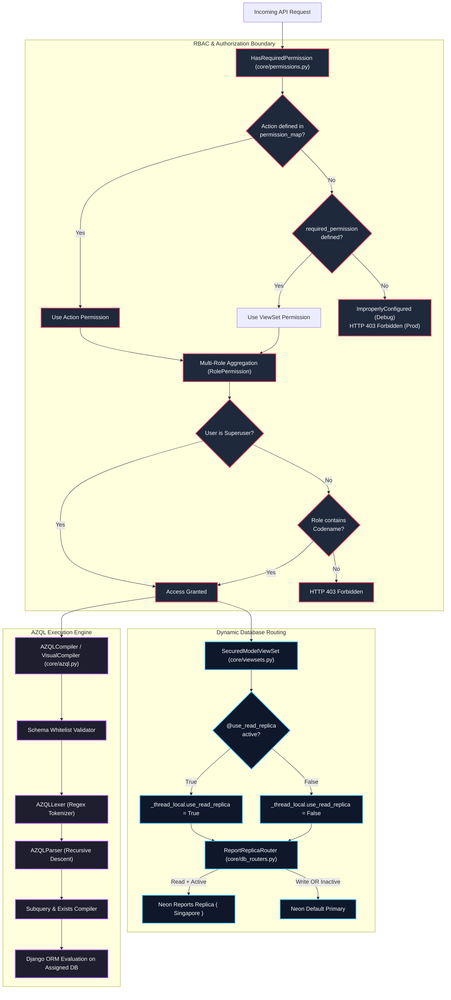
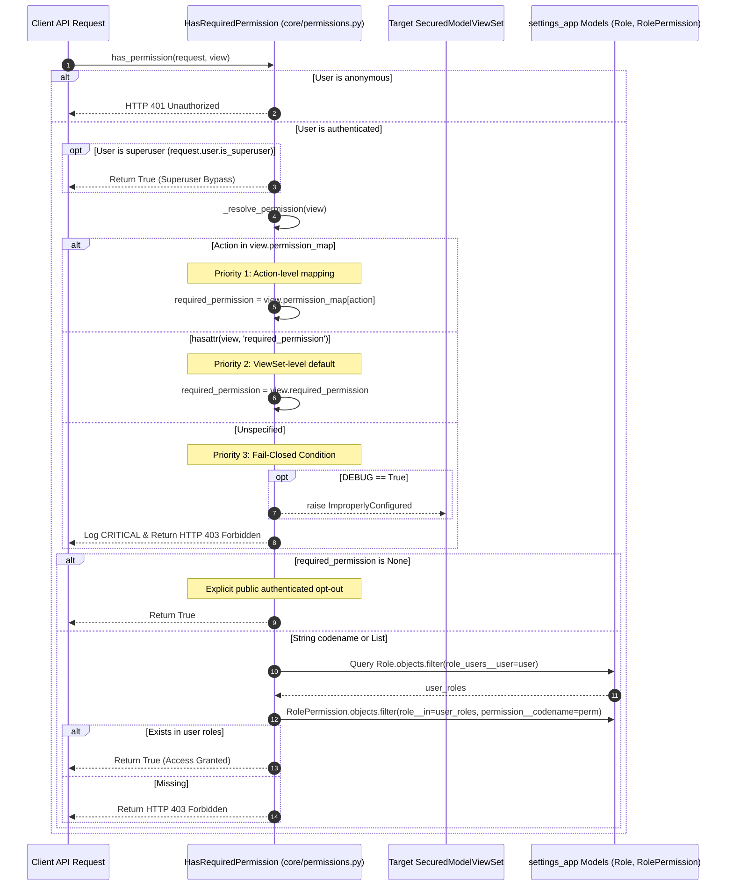
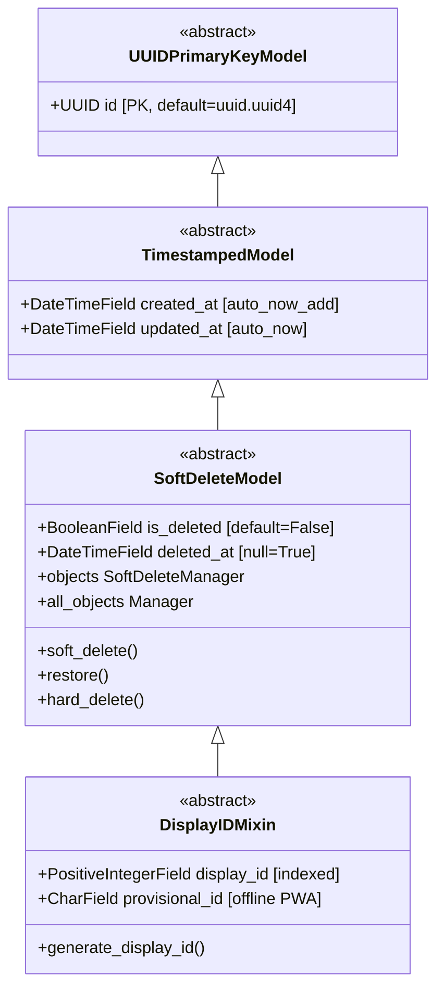
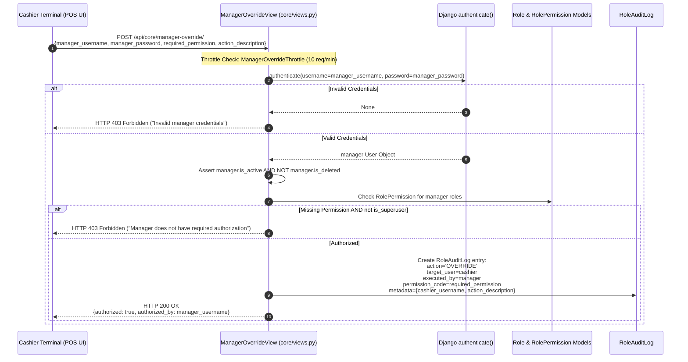
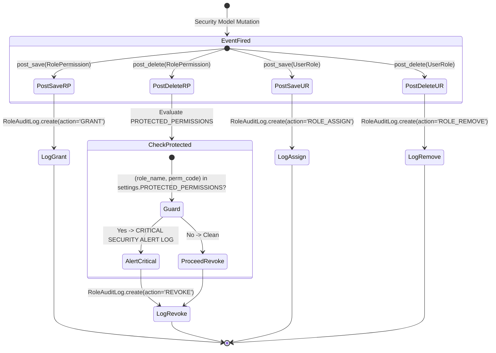

# EU-02: Core Permissions, Multi-DB Routing & AZQL Query Engine

## 1. Architectural Role & Boundary Overview

`EU-02` serves as the operational substrate of the Books3 backend, providing three foundational systems:
1. **The Fail-Closed RBAC Engine & Base Models**: Enforcing declarative role-based access control across all ViewSets, managing UUID primary keys, soft-deletion semantics, and concurrency-safe display IDs via PostgreSQL transaction advisory locks.
2. **Dynamic Multi-Database Routing**: Isolating analytical queries from transaction processing through thread-local database routing to the Neon reporting replica.
3. **The AZQL (AZBooks Query Language) Compiler Engine**: A recursive-descent lexer, parser, and Django ORM compiler enabling arbitrary multi-table filtering, temporal inspection (`WAS EVER` via historical tables), existential relational matching (`HAS_ANY`, `HAS_ALL`, `HAS_NONE`), macro expansion (`@Today - N`, `@Me`), and JSON AST query generation without Cartesian explosions.



---

## 2. Source File Inventory & Structural Ownership

| Source File Path | Architectural Responsibilities |
| :--- | :--- |
| [`core/__init__.py`](file:///z:/books3/core/__init__.py) | Package initialization. |
| [`core/apps.py`](file:///z:/books3/core/apps.py) | Application configuration and signal auto-registration. |
| [`core/models.py`](file:///z:/books3/core/models.py) | Abstract model architecture: `UUIDPrimaryKeyModel`, `TimestampedModel`, `SoftDeleteModel` with dual managers, and `DisplayIDMixin` with PostgreSQL advisory locking. |
| [`core/permissions.py`](file:///z:/books3/core/permissions.py) | Fail-closed RBAC engine (`HasRequiredPermission`) and 1-hour session-cached elevated OTP permission (`HasElevatedAuth`). |
| [`core/signals.py`](file:///z:/books3/core/signals.py) | Audit log triggers logging role assignment, permission grant/revoke, and protected permission deletion alerts. |
| [`core/db_routers.py`](file:///z:/books3/core/db_routers.py) | Thread-local read-replica router (`ReportReplicaRouter`) and function/method execution decorator (`@use_read_replica`). |
| [`core/views.py`](file:///z:/books3/core/views.py) | Cashier POS bypass endpoint (`ManagerOverrideView`) with per-user throttling (`10/min`) and audit logging. |
| [`core/viewsets.py`](file:///z:/books3/core/viewsets.py) | Enterprise base ViewSets (`SecuredModelViewSet`, `SecuredReadOnlyModelViewSet`) enforcing mandatory permission attributes. |
| [`core/azql.py`](file:///z:/books3/core/azql.py) | Complete AZQL Lexer, Parser, ORM Compiler, and Visual QueryBuilder JSON AST translator. |
| [`core/urls.py`](file:///z:/books3/core/urls.py) | URL routing for manager override actions. |

---

## 3. RBAC Resolution Engine & Fail-Closed Hierarchy

All API endpoints in Books3 inherit from `SecuredModelViewSet` and enforce authorization through `HasRequiredPermission`. The authorization pipeline executes a strict three-tier resolution hierarchy:



### Elevated Authentication Barrier (`HasElevatedAuth`)

For sensitive security operations (such as `/api/account/change-password/` or critical audit modifications), ViewSets enforce `HasElevatedAuth`.
- **Mechanism**: Inspects the volatile Redis cache for key `elevated_auth_{user.id}`.
- **Enforcement**: If the key is absent or expired, the permission class raises `PermissionDenied` with an explicit machine-readable code:
  ```json
  {
    "code": "requires_elevated_otp",
    "message": "High-risk action requires OTP verification.",
    "detail": "High-risk action requires OTP verification."
  }
  ```
  The React frontend interceptor detects this payload, opens an inline OTP prompt, verifies the code via `/api/account/verify-elevated-otp/`, and retries the request seamlessly upon granting a 1-hour cache TTL.

---

## 4. Multi-Database Routing & Analytical Offloading

To ensure reporting queries and complex ledger aggregations do not degrade online transaction processing (OLTP) performance on the primary database, `EU-02` implements dynamic thread-local routing:

```mermaid
sequenceDiagram
    autonumber
    participant Client as Analytics / Reporting Consumer
    participant View as Decorated View / Method (@use_read_replica)
    participant Thread as Thread-Local State (_thread_local)
    participant Router as ReportReplicaRouter (core/db_routers.py)
    participant DB as Neon Postgres (Singapore)

    Client->>View: GET /api/reports/sales-summary/
    View->>Thread: setattr(_thread_local, 'use_read_replica', True)
    
    rect rgb(20, 30, 45)
        Note over View,DB: Query Execution Context
        View->>Router: db_for_read(model)
        alt settings.IS_TESTING == True
            Router-->>View: Return 'default' (Test Isolation)
        else Thread has use_read_replica = True
            Router-->>View: Return 'reports' (Replica Offload)
        else Standard Request
            Router-->>View: Return 'default' (Primary)
        end
        View->>DB: Execute Query on Selected Engine
    end

    View->>Thread: setattr(_thread_local, 'use_read_replica', False) (finally block)
    View-->>Client: 200 OK (Report Data)
```



### Routing Invariants & Migration Security

1. **Write Isolation Invariant**: `db_for_write` unconditionally returns `'default'`, ensuring zero write traffic reaches the read-only replica.
2. **Schema Migration Lockdown**: `allow_migrate` returns strictly `db == 'default'`. Django schema migrations are forbidden from executing against the replica.
3. **Cross-Database Relations**: `allow_relation` permits model foreign keys between databases because the primary and replica are identical Neon logical copies.
4. **Test Suite Isolation**: When `IS_TESTING = True` (or `test` in `sys.argv`), the router short-circuits to `'default'` with `DATABASES['reports']['TEST'] = {'MIRROR': 'default'}`, eliminating test database creation deadlocks.

---

## 5. Base Models & Advisory Lock Sequence

All domain models inherit from abstract classes in `core/models.py`:



### Display ID PostgreSQL Advisory Lock Protocol

To eliminate race conditions when generating sequential, human-readable numbers (`1001`, `1002`...) under concurrent high-throughput POS checkouts, `DisplayIDMixin` implements a table-scoped transaction advisory lock:

```mermaid
sequenceDiagram
    autonumber
    participant Model as Domain Model Instance (e.g. Order / PO)
    participant Save as save() Method
    participant Advisory as Postgres pg_advisory_xact_lock
    participant Table as Database Table

    Model->>Save: save() called with display_id=None
    Save->>Save: generate_display_id()
    
    rect rgb(30, 20, 35)
        Note over Save,Table: Atomic Transaction Block
        Save->>Save: Compute lock_id = crc32(table_name.encode('utf-8')) % 2147483648
        Save->>Advisory: SELECT pg_advisory_xact_lock(lock_id)
        Note over Advisory: Locks ONLY display_id generation for this specific table.<br/>Does NOT block normal INSERTs, UPDATEs, or SELECTs!
        
        Save->>Table: SELECT MAX(display_id) FROM table
        Table-->>Save: max_id
        alt max_id is None
            Save->>Save: self.display_id = 1000 (DISPLAY_ID_START)
        else max_id exists
            Save->>Save: self.display_id = max_id + 1
        end
        Save->>Save: Clear provisional_id (PWA offline sync resolved)
    end
    
    Note over Advisory: Lock automatically released at end of transaction
    Save->>Table: INSERT into table with assigned display_id
```



---

## 6. AZQL Query Engine & AST Compilation Architecture

`core/azql.py` provides a domain-specific query engine and AST compiler designed for advanced search, automated reporting, and React QueryBuilder translation.

```mermaid
flowchart TD
    RawQuery["AZQL Raw String / Visual AST Payload"] --> Dispatcher{"Input Type"}
    
    Dispatcher -->|Text String| Lexer["AZQLLexer (core/azql.py)"]
    Dispatcher -->|JSON AST| Visual["VisualCompiler.compile()"]
    
    subgraph "AZQL Text Pipeline"
        Lexer --> Tokens["Token Stream: LPAREN, FIELD, OPERATOR, MACRO, VALUE"]
        Tokens --> Parser["AZQLParser (Recursive Descent Parser)"]
        Parser --> ASTGrammar["parse_or() -> parse_and() -> parse_primary()"]
    end

    subgraph "Relational Compilation & Safety"
        ASTGrammar --> Validate["validate_relation_path() vs SCHEMA_WHITELIST"]
        Visual --> Validate
        
        Validate --> OpMatch{"Operator Evaluation"}
        OpMatch -->|WAS EVER| HistoryCompile["compile_was_ever() -> Model.history.filter()"]
        OpMatch -->|HAS_ANY / ALL / NONE| Quantifier["compile_relation_filter() -> Exists() / ~Exists()"]
        OpMatch -->|@Today / @Me| MacroResolve["resolve_macro() -> timezone.now() / request.user"]
        OpMatch -->|Standard = > < LIKE| SubqueryGen["compile_subquery_relation_lookup()"]
    end

    SubqueryGen --> ORM["Django Q & Exists Subqueries"]
    HistoryCompile --> ORM
    Quantifier --> ORM
    MacroResolve --> ORM
```

### Supported Token Grammar & Lexer Specifications

| Token Kind | Regex Pattern | Purpose / Example |
| :--- | :--- | :--- |
| `WAS_EVER` | `\bWAS\s+EVER\b\|\bEVER\b` | Temporal lookup inspecting audit tables: `[order_status] WAS EVER 'cancelled'`. |
| `HAS_ANY` | `\bHAS_ANY\b\|\bHAS\s+ANY\b` | Relational existential check: `[~orders] HAS_ANY ([total] > 1000)`. |
| `HAS_ALL` | `\bHAS_ALL\b\|\bHAS\s+ALL\b` | Universal quantifier: `[~items] HAS_ALL ([confirmed_quantity] > 0)`. |
| `HAS_NONE` | `\bHAS_NONE\b\|\bHAS\s+NONE\b` | Negative quantifier: `[~orders] HAS_NONE ([payment_status] = 'unpaid')`. |
| `MACRO` | `@[a-zA-Z_]+(?:\s*[-\+]\s*\d+)?` | Dynamic evaluation: `@Today - 7`, `@Today + 30`, `@Me`. |
| `OPERATOR` | `!= \| <= \| >= \| = \| < \| > \| LIKE \| IN \| CONTAINS` | Standard SQL comparison operators. |
| `FIELD` | `\[~?[a-zA-Z_0-9\.]+\]` | Whitelisted fields and subquery relations (`~orders`, `addresses__region__name`). |

### Universal Quantifier Compilation Invariant

To evaluate `HAS_ALL` without SQL Cartesian joins, AZQL implements the classical mathematical equivalence $\forall x. P(x) \iff \neg \exists x. \neg P(x)$:
```python
# For HAS_ALL: find if there exists ANY related record that VIOLATES the condition
anti_qs = sub_qs.exclude(inner_q)
return ~Exists(anti_qs)
```
If no record violates the condition, all records satisfy it. This guarantees $O(1)$ query memory overhead.

---

## 7. Manager Override & POS Bypass Protocol

When a POS cashier encounters a privileged action (such as discounting beyond limit, selling custom non-catalog items, or refunding), `core/views.py` exposes `ManagerOverrideView`:



---

## 8. Signal-Driven Audit Logging & Protected Permissions

`core/signals.py` hooks into database write events on security models to record immutable audit entries in `RoleAuditLog`:



### Immutable Security Constraints (`PROTECTED_PERMISSIONS`)

Defined in `azbooks/settings.py` as an immutable frozen set:
```python
PROTECTED_PERMISSIONS = frozenset([
    ('Admin', 'settings.manage_roles'),
    ('Admin', 'settings.manage_users'),
])
```
This invariant prevents administrative self-bricking, ensuring that an admin can never inadvertently or maliciously revoke the permissions required to administer the role system.

---

## 9. Failure Modes & Recovery Matrix

| Failure Mode | Detection Mechanism | Immediate System Response | Recovery / Corrective Action |
| :--- | :--- | :--- | :--- |
| **Missing Permission Definition on ViewSet** | `HasRequiredPermission._resolve_permission()` encounters empty string. | In DEBUG: raises `ImproperlyConfigured`. In PROD: logs `CRITICAL` alert and returns `403 Forbidden`. | Define `required_permission = 'domain.codename'` or `permission_map = {...}` on the ViewSet. |
| **Concurrent Display ID Collision** | Multiple simultaneous checkouts execute `generate_display_id()`. | `pg_advisory_xact_lock` serializes MAX() computation across threads without table locking. | Transparent transaction serialization; no collision, gapless ID sequence maintained. |
| **Illegal AZQL Field Injection / SQLi Attempt** | Unwhitelisted column supplied in raw AZQL query string. | `validate_relation_path()` returns `False`; raises `ValidationError`. | Query halted before SQL generation; returns 400 Bad Request to client with exact offending field path. |
| **Reporting Query Exhausting Connection Pool** | Heavy analytical aggregation executed against primary database. | Worker threads blocked; latency alerts trigger. | Apply `@use_read_replica` decorator to the view/action to offload execution to `reports` database replica. |
| **Brute Force Manager Override Attacks** | Repeated credential guessing via `/api/core/manager-override/`. | `ManagerOverrideThrottle` triggers at >10 attempts/min per client IP. | Returns HTTP 429 Too Many Requests; logs audit alert with source IP and targeted manager username. |
| **Revocation of Protected Admin Permissions** | Delete signal caught in `core/signals.py`. | Emits `CRITICAL` security audit log; signal execution alerts operations. | `PROTECTED_PERMISSIONS` check warns administrators; database restores permission assignment. |
