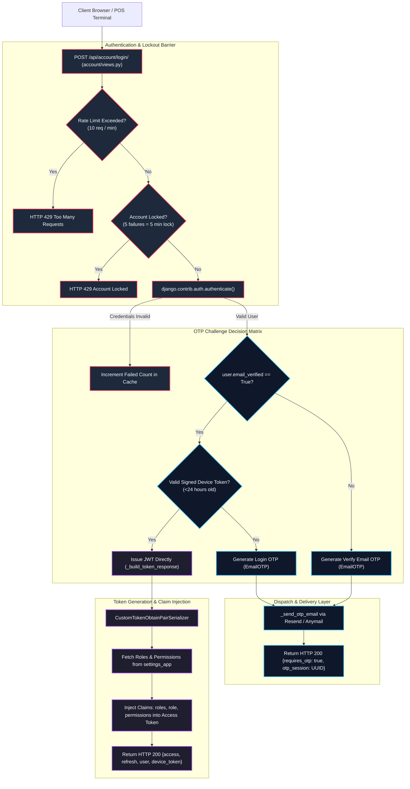
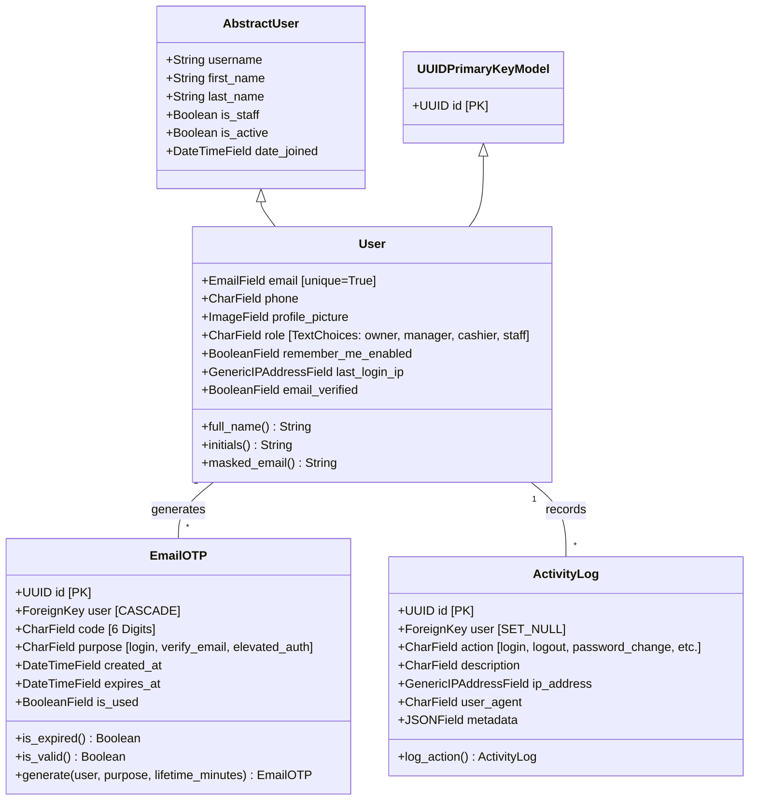
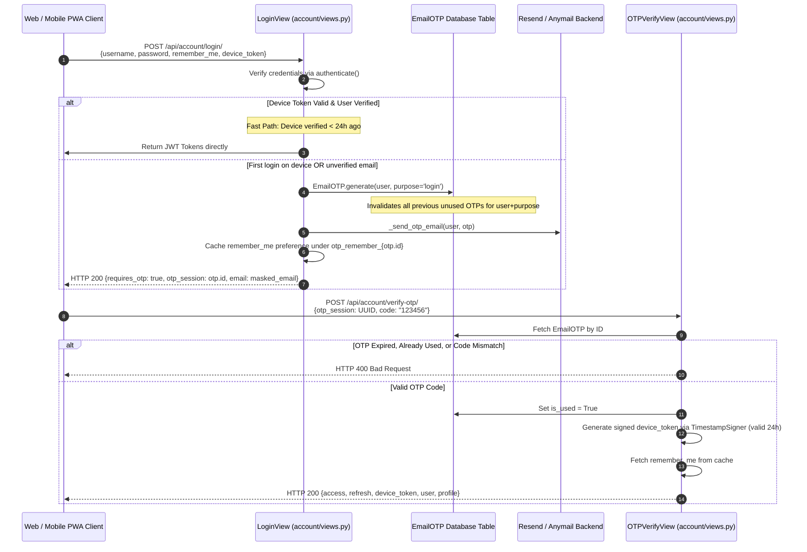
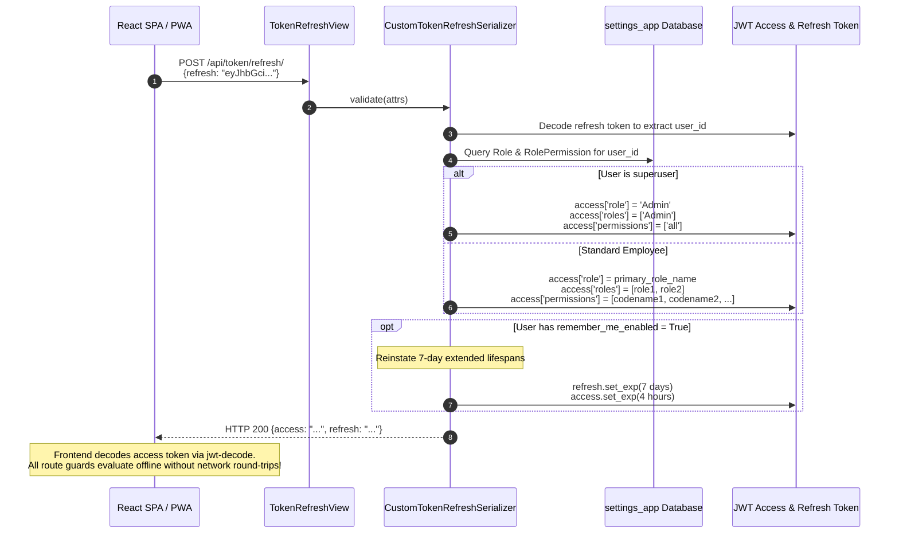
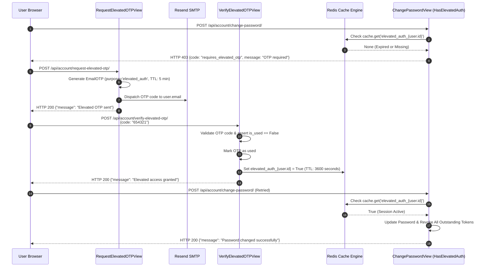

# EU-03: Account Identity, Authentication & Resend OTP

## 1. Architectural Role & Boundary Overview

`EU-03` encompasses identity management, multi-step challenge-response authentication, JSON Web Token (JWT) lifecycle orchestration, and audit trails for AZ Books 3.0. It eliminates legacy external profile tables by consolidating user identity into an enterprise custom model (`account.User`), enforces cryptographic email OTP validation via Resend HTTP / SMTP, integrates an offline-ready JWT claim injection pipeline, and manages elevated session escalation for high-risk operations.



---

## 2. Source File Inventory & Structural Ownership

| Source File Path | Architectural Responsibilities |
| :--- | :--- |
| [`account/__init__.py`](file:///z:/books3/account/__init__.py) | Package initialization. |
| [`account/apps.py`](file:///z:/books3/account/apps.py) | Application configuration and metadata. |
| [`account/admin.py`](file:///z:/books3/account/admin.py) | Django Admin registration for custom `User`, `EmailOTP`, and `ActivityLog` entities. |
| [`account/models.py`](file:///z:/books3/account/models.py) | Custom `User` model, `EmailOTP` with automatic single-use invalidation, `ActivityLog` audit table, and in-app `Notification` model. |
| [`account/serializers.py`](file:///z:/books3/account/serializers.py) | JWT serializers (`CustomTokenObtainPairSerializer`, `CustomTokenRefreshSerializer`) injecting RBAC claims, password validators, and OTP payload schemas. |
| [`account/views.py`](file:///z:/books3/account/views.py) | Login challenge view, OTP verification/resend endpoints, token revocation logout, elevated authentication flow, and user profile management. |
| [`account/urls.py`](file:///z:/books3/account/urls.py) | Routing table for authentication, notification, and profile management endpoints. |
| [`account/management/__init__.py`](file:///z:/books3/account/management/__init__.py) | Management command package root. |
| [`account/management/commands/__init__.py`](file:///z:/books3/account/management/commands/__init__.py) | Command package. |
| [`account/management/commands/cleanup_expired_otps.py`](file:///z:/books3/account/management/commands/cleanup_expired_otps.py) | Scheduled purge routine cleaning consumed OTPs older than 7 days and expired tokens. |

---

## 3. Custom User Model & Identity Structure

The application replaces Django's default integer-keyed auth model with `account.User`, unifying profile details directly on the primary identity entity:



### Identity Invariants

1. **Email Uniqueness Mandate**: `AbstractUser.email` is overridden to enforce `unique=True` and non-null validation, establishing email as the canonical communication channel for OTP delivery.
2. **Masked Email Privacy Guard**: `User.masked_email` dynamically formats email addresses (e.g. `m***k@gmail.com`) for unauthenticated API responses, preventing email enumeration or full address leakage to unauthorized observers.
3. **RBAC Decoupling**: While `User.role` exists for baseline display, true authorization permissions are resolved exclusively through `settings_app.models.Role` and `UserRole` relationships.

---

## 4. Multi-Step Challenge Authentication & OTP Protocol

Login executes as a multi-step challenge-response flow designed to secure terminal logins while eliminating repetitive 2FA friction for recognized devices:



### Rate Limiting & Lockout Parameters

- **Login Throttling (`LoginRateThrottle`)**: 10 requests per minute per IP.
- **Account Lockout (`MAX_FAILED_ATTEMPTS`)**: 5 consecutive failed credential attempts triggers an automatic 5-minute lockout (`LOCKOUT_DURATION = 300s`) keyed by username in Redis (`login_lockout_{username}`).
- **OTP Resend Throttle (`ResendOTPThrottle`)**: Stricter rate limit of 3 requests per 5 minutes per IP to prevent email spamming and API exhaustion.

---

## 5. JWT Claim Injection & Offline PWA Optimization

Books3 utilizes `django-rest-framework-simplejwt` customized via `CustomTokenObtainPairSerializer` and `CustomTokenRefreshSerializer`. This embeds the entire active RBAC authorization matrix into the signed JWT token:



### Token Lifespan & Performance Matrix

| Token Type | Standard Lifespan | Remember-Me Lifespan | Injected Claims |
| :--- | :--- | :--- | :--- |
| **Access Token** | 30 minutes | 4 hours | `user_id`, `username`, `is_staff`, `is_superuser`, `role`, `roles`, `permissions` |
| **Refresh Token** | 1 day | 7 days | `user_id`, `token_type` |

*Design Rationale*: The 30-minute access token accommodates Render free/starter container cold starts (30–60s spin-up) without causing premature logout, while `BLACKLIST_AFTER_ROTATION = False` eliminates unnecessary database writes on every token refresh under PgBouncer transaction pooling.

---

## 6. Elevated Authentication Escalation Protocol

Operations that alter user credentials, affect store configuration, or perform sensitive financial modifications require an elevated authentication session:



---

## 7. Audit Logging & Background Maintenance

### Activity Logging Architecture (`ActivityLog`)

Every critical user action logs an immutable event through `ActivityLog.log_action`:
```python
ActivityLog.log_action(
    user=request.user,
    action=ActivityLog.ActionType.LOGIN,
    description="User logged in",
    request=request,
    metadata={"client_version": "3.0.0"}
)
```
- **Real IP Extraction**: Inspects `HTTP_X_FORWARDED_FOR` (first IP from proxy chain) before falling back to `REMOTE_ADDR`.
- **User Agent Truncation**: Truncates browser user agent strings to 255 characters to prevent database column overflows.

### Scheduled OTP Cleanup Command (`cleanup_expired_otps`)

Over time, ephemeral OTPs clutter the database. The scheduled management command in `account/management/commands/cleanup_expired_otps.py` executes periodic maintenance:
```python
otps_to_delete = EmailOTP.objects.filter(
    Q(is_used=True, created_at__lt=used_threshold) |  # Consumed OTPs older than 7 days
    Q(is_used=False, expires_at__lt=timezone.now())   # Abandoned expired OTPs
)
count, _ = otps_to_delete.delete()
```
This ensures the `account_emailotp` table remains lean and index-optimized.

---

## 8. Failure Modes & Recovery Matrix

| Failure Mode | Detection Mechanism | Immediate System Response | Recovery / Corrective Action |
| :--- | :--- | :--- | :--- |
| **Brute-Force Password Attack** | 5 consecutive bad credential attempts on `LoginView`. | `login_lockout_{username}` set in Redis; returns HTTP 429 for 5 minutes. | Automatic expiration after 300 seconds; administrator can manually purge cache key if user is blocked. |
| **Resend OTP Flood Attack** | Client hits `/api/account/resend-otp/` repeatedly. | `ResendOTPThrottle` halts requests exceeding 3 per 5 minutes per IP. | Returns HTTP 429 Too Many Requests; protects outbound email quota and prevents SMS/email abuse. |
| **Stale JWT Token During RBAC Reassignment** | User role modified in `settings_app`, but user possesses unexpired access token. | Access token valid for up to 30 minutes. | Immediate mitigation: Trigger token refresh on client, which forces fresh DB permission query in `CustomTokenRefreshSerializer`. |
| **Elevated Auth Expiration Mid-Transaction** | User takes >1 hour to submit sensitive form. | `HasElevatedAuth` returns 403 `requires_elevated_otp`. | Frontend captures error interceptor, prompts for a new elevated OTP, and retries the submission. |
| **Resend / SMTP Delivery Failure** | Network timeout or invalid API credentials during `_send_otp_email()`. | Exception caught; client receives error without leaking SMTP stack traces. | Check `RESEND_API_KEY` in environment; development falls back gracefully to `console.EmailBackend`. |
| **Device Token Tampering / Expiry** | Invalid signature or token age > 24 hours in `_validate_device_token()`. | `TimestampSigner.unsign()` raises `BadSignature` or `SignatureExpired`. | System falls back seamlessly to mandatory OTP challenge flow. |
