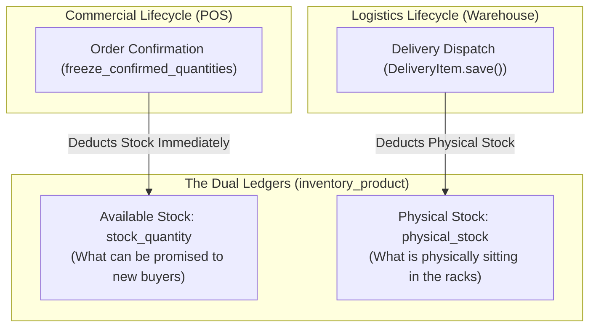
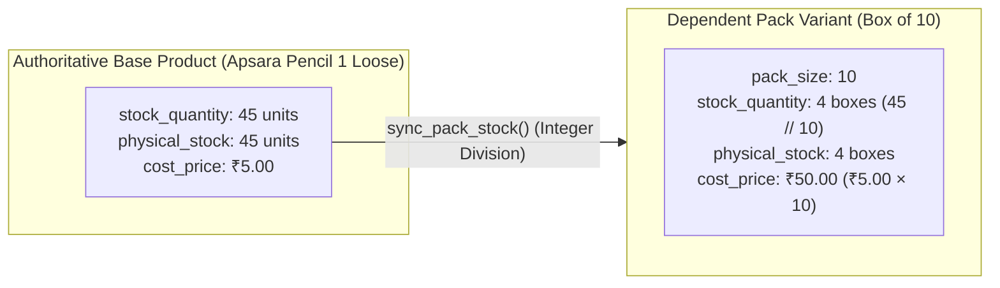
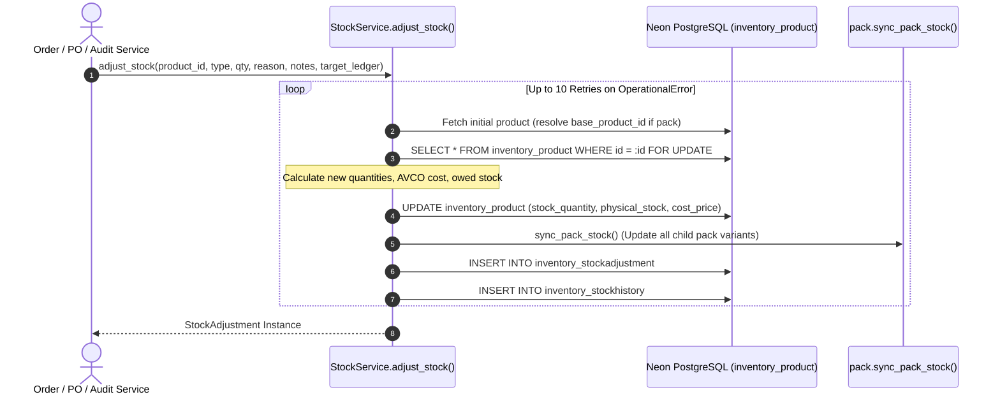
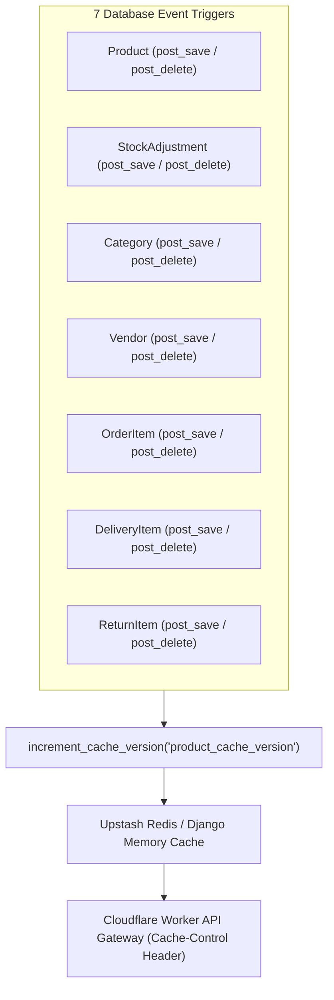

# EU-04: Inventory Master Models, Pack Atomization & StockService

> **Document Role**: Authoritative Technical Wiki Specification for Execution Unit `EU-04`  
> **Domain**: Inventory Dual-Ledger, Base-Unit Pack Atomization, AVCO Costing & StockService  
> **Source Files**: 10 production files (`inventory/models.py`, `inventory/services.py`, `inventory/signals.py`, `inventory/management/commands/`, etc.)  
> **Compliance**: Rule 01 (Sovereign Latch), Rule 02 (Concurrency & Row-Locking), Rule 03 (Async I/O), Rule 04 (Ledger Invariants), Rule 05 (ORM Diet), Rule 06 (Frontend/API Contracts), Rule 07 (Docs-as-Code)  
> **Database Targets**: Neon PostgreSQL 18.6 (`inventory_product`, `inventory_category`, `inventory_vendor`, `inventory_tag`, `inventory_stockadjustment`, `inventory_stockhistory`, `inventory_productimage`)

---

## 1. Executive Summary & Architectural Scope

Execution Unit `EU-04` governs the core physical asset tracking, inventory valuation, and catalog relationship structures of Books3. 

Historically, multi-channel wholesale and retail book operations suffered from severe stock degradation: cashiers broke open unbroken cartons to sell single loose items, resulting in negative catalog drift, stock desynchronization, and inaccurate landed cost averages. `EU-04` permanently neutralizes these failure vectors through two foundational architectural engines:
1. **The Dual-Ledger System**: A strict mathematical partition between **Available Stock** (deducted upon commercial order confirmation) and **Physical Stock** (deducted upon physical delivery handover).
2. **Option C Base-Unit Atomization**: A parent-child catalog architecture where multipacks do not hold independent stock pools, but derive their availability dynamically from base loose units via integer division.
3. **`StockService`**: The centralized, pessimistic-locked transaction gateway governing all inventory mutations, retry loops, and Weighted Average Cost (AVCO) calculations.

### Member Files Index

| # | File Path | Architectural Responsibility |
|---|---|---|
| 1 | [`inventory/__init__.py`](file:///z:/books3/inventory/__init__.py) | Package initialization and module exposure |
| 2 | [`inventory/apps.py`](file:///z:/books3/inventory/apps.py) | Django AppConfig registering cache invalidation signals on startup |
| 3 | [`inventory/admin.py`](file:///z:/books3/inventory/admin.py) | Django administrative interfaces for Catalog, Vendors, and Stock Audit records |
| 4 | [`inventory/models.py`](file:///z:/books3/inventory/models.py) | Product, Category, Vendor, StockAdjustment, and StockHistory models |
| 5 | [`inventory/services.py`](file:///z:/books3/inventory/services.py) | The centralized `StockService` gateway, lock retry loops, and AVCO math |
| 6 | [`inventory/signals.py`](file:///z:/books3/inventory/signals.py) | Real-time `product_cache_version` cache busting pipeline |
| 7 | [`inventory/management/__init__.py`](file:///z:/books3/inventory/management/__init__.py) | Management command package initialization |
| 8 | [`inventory/management/commands/__init__.py`](file:///z:/books3/inventory/management/commands/__init__.py) | Command package initialization |
| 9 | [`inventory/management/commands/run_option_c_migration.py`](file:///z:/books3/inventory/management/commands/run_option_c_migration.py) | Production migration script mapping loose units to Option C pack variants |
| 10 | [`inventory/management/commands/migrate_packs.py`](file:///z:/books3/inventory/management/commands/migrate_packs.py) | Operational command consolidating historical pack stock into base products |

---

## 2. The Dual-Ledger Invariant Architecture

To eliminate discrepancies between what salesmen can sell and what sits physically on the warehouse pallets, the `Product` model separates inventory into two independent counters:



### The Fundamental Mathematical Guarantee

At any given second in production, the system enforces:
$$\text{Available Stock} = \text{Physical Stock} - \text{Owed Quantity}$$

Where:
$$\text{Owed Quantity} = \sum_{\text{Active Orders}} \left( Q_{\text{confirmed}} - Q_{\text{delivered}} \right)$$
*(Active Orders are defined as `order_status IN ('confirmed', 'completed')` and `cancellation_status IN ('na', 'pending')` per `orders/constants.py`)*.

### Physical Audit Reconciliation Mechanics (`adjustment_type == 'set'`)

When warehouse auditors perform physical stock-takes, they count physical boxes on shelves. `StockService.adjust_stock(adjustment_type='set', target_ledger='physical')` guarantees that taking an audit never wipes out active unfulfilled customer deliveries:
1. Reads input count as \(\text{new\_physical}\).
2. Calculates live \(\text{owed\_quantity}\) from active order line items (including all child pack variants).
3. Automatically derives:
   $$\text{new\_available} = \text{new\_physical} - \text{owed\_quantity}$$
4. Updates both columns atomically in Neon PostgreSQL.

---

## 3. Option C Base-Unit Atomization

Under Option C, unbroken multipacks (e.g. "Box of 10 Apsara Pencils", "Carton of 20 Pens") are modeled as **dependent pack variants** pointing to an authoritative base single unit (`base_product`).



### Pack Variant Invariants (`inventory/models.py`)

1. **Integer Division Floor**:
   $$\text{pack.stock\_quantity} = \left\lfloor \frac{\text{base.stock\_quantity}}{\text{pack.pack\_size}} \right\rfloor$$
   $$\text{pack.physical\_stock} = \left\lfloor \frac{\text{base.physical\_stock}}{\text{pack.pack\_size}} \right\rfloor$$
   *Note: If base stock is 45 and pack size is 10, the system displays 4 packs available. The 5 remaining loose units can only be sold as individual pieces.*
2. **Cost Price Propagation**:
   $$\text{pack.cost\_price} = \text{base.cost\_price} \times \text{pack.pack\_size}$$
   Pack cost is mathematically tethered to base unit cost. Selling price remains completely independent to allow volume discounting.
3. **Absolute Set Prohibition**:
   Attempting to call `StockService.adjust_stock(adjustment_type='set')` on a product where `is_pack=True` immediately raises a fatal `ValueError`. Auditors must adjust the base product directly.
4. **Topological Lock Order (Deadlock Prevention)**:
   When `StockService` receives an adjustment for a pack variant, it resolves `base_product_id` **before** acquiring database locks. All concurrent processes lock the Base Product row first, preventing cross-row transaction deadlocks.

---

## 4. `StockService` Transaction Gateway & Lock Retries

`StockService` ([`inventory/services.py`](file:///z:/books3/inventory/services.py)) is the single authorized entry point for stock mutations.



### Concurrency Lock Retries
To tolerate momentary row locks during high-throughput POS checkouts:
- `MAX_RETRIES = 10`
- `RETRY_DELAY = 0.2` seconds with linear multiplier:
  $$\text{delay}_i = 0.2 \times (i + 1) \quad \text{seconds}$$

### Target Ledger Filtering Options

| `target_ledger` Argument | Mutated Column | Typical Caller |
|---|---|---|
| `'available'` | `stock_quantity` | POS order confirmation / order cancellation |
| `'physical'` | `physical_stock` | Delivery dispatch handover / return received |
| `'both'` | `stock_quantity` AND `physical_stock` | Purchase Order reception / physical audit set |

---

## 5. Weighted Average Cost (AVCO) Engine

When new inventory arrives via procurement or audit corrections (`adjustment_type == 'increase'`), `StockService` recalculates the product's `cost_price`:

### Standard AVCO Formula (\(\text{current\_stock} \ge 0\))

$$\text{new\_cost} = \frac{\left( Q_{\text{current}} \times C_{\text{current}} \right) + \left( Q_{\text{incoming}} \times C_{\text{incoming}} \right)}{Q_{\text{current}} + Q_{\text{incoming}}}$$

### Negative Stock Baseline Reset Algorithm (\(\text{current\_stock} < 0\))

When physical stock was sold into the negative before the purchase order was logged:
```python
if product.stock_quantity < 0:
    if new_quantity > 0:
        # Stock transitioned from negative to positive.
        # Establish incoming cost as the clean baseline for positive units.
        new_cost_price = unit_cost
    else:
        # Still negative or zero. Incoming stock merely fills the historical hole.
        # Cost price is preserved to avoid WAC distortion.
        pass
```

### Audit Correction Invariant (Rule 04)
Increasing stock via reason `'audit_correction'` **must explicitly specify `unit_cost`**. Attempting to increase stock without a unit cost basis raises an immediate `ValidationError`.

---

## 6. Real-Time Cache Busting Pipeline (`inventory/signals.py`)

Books3 utilizes edge caching via Cloudflare Workers and client-side SWR caching. To prevent stale catalog views across salesman mobile terminals, `inventory/signals.py` maintains an atomic cache version counter:



When any trigger fires:
1. `cache.incr('product_cache_version')` executes atomically.
2. Next API response attaches the new version token in its response payload/headers.
3. Client SPA and Cloudflare Worker evict the cached catalog snapshot and request fresh data.

---

## 7. Forensic Failure Modes & Poka-Yoke Mitigations

| Failure Mode | Root Cause | Blast Radius | Enforced Poka-Yoke Mitigation |
|---|---|---|---|
| **Rogue Pack Stock Inflation** | Direct stock adjustment on a pack product creates duplicate inventory | Base stock and pack stock diverge, inflating warehouse asset balance | `StockService` rejects absolute `set` adjustments on pack products (`ValueError`). |
| **Audit Count Delivery Wipeout** | Physical audit overwriting available stock without subtracting owed items | Delivered orders go negative; confirmed customer orders cannot be fulfilled | `StockService` calculates `owed_quantity` from active orders and computes `available = physical - owed`. |
| **Deadlock on Simultaneous Pack/Base Mutation** | Worker 1 locks Pack \(\to\) Base; Worker 2 locks Base \(\to\) Pack | Database transactions freeze, throwing 500 errors to cashiers | `StockService` resolves pack to `base_product_id` *before* acquiring locks, establishing consistent lock order. |
| **Ghost Asset Value Creation on Returns** | Customer returns item, and stock is restored at *current* (inflated) catalog price | Gross profit and inventory balance are falsely inflated | `ReturnItem.restore_stock()` passes original sale `unit_cost=self.order_item.cost_price`. |
| **Cache Invalidation Storm on Bulk Import** | Bulk importing 500 items fires 500 individual `post_save` signals | Redis/cache lock exhaustion and CPU spikes | Bulk import scripts use `bulk_create()`, which bypasses Django model signals. |

---

## 8. Historical Migration Artifacts Reference

| Command Path | Operational Context | Safety Status |
|---|---|---|
| [`inventory/management/commands/run_option_c_migration.py`](file:///z:/books3/inventory/management/commands/run_option_c_migration.py) | Migrated initial 4 historical pack pairs (Apsara pencils, Saino Misti, XO pens, Covers) into Option C base/variant links. Supports `--dry-run`. | Archived historical migration command. |
| [`inventory/management/commands/migrate_packs.py`](file:///z:/books3/inventory/management/commands/migrate_packs.py) | General consolidation command transferring standalone pack stocks into base product inventory. | Archived operational tooling. |
