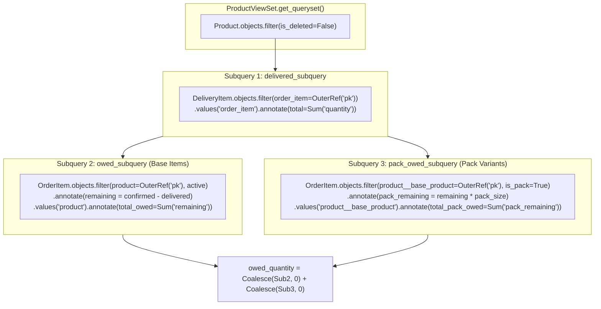
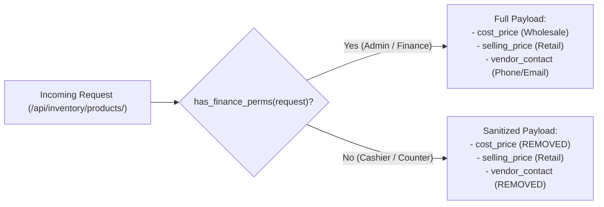
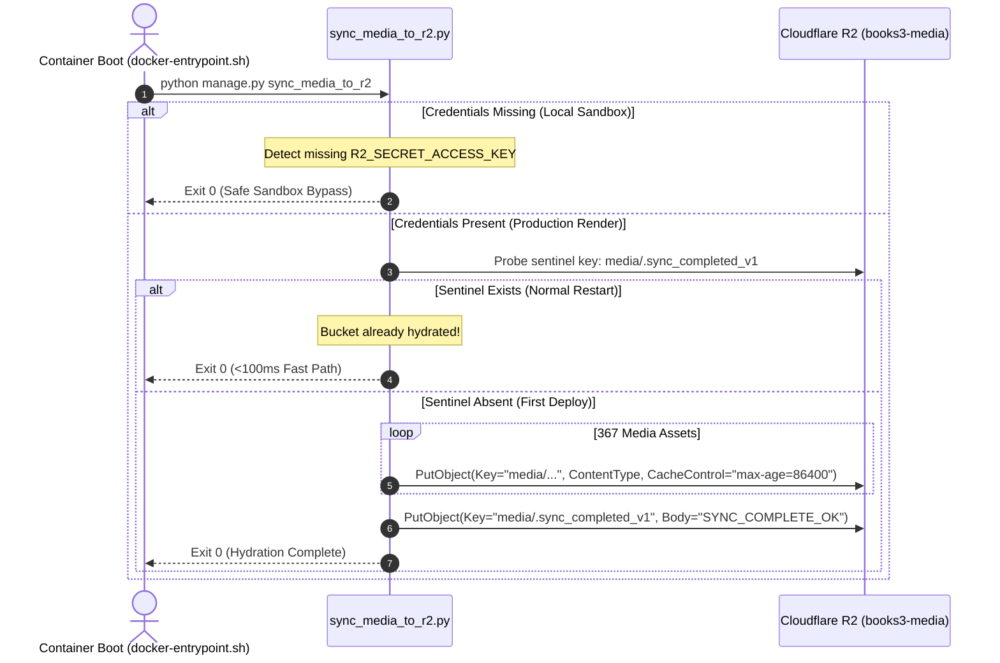

# EU-05: Inventory API, Serializers & Catalog Ingestion

> **Document Role**: Authoritative Technical Wiki Specification for Execution Unit `EU-05`  
> **Domain**: Inventory REST API, High-Performance Subqueries, RBAC Margin Security & Media Hydration  
> **Source Files**: 10 production files (`inventory/views.py`, `inventory/serializers.py`, `inventory/urls.py`, `inventory/management/commands/`, `core/management/commands/sync_media_to_r2.py`, etc.)  
> **Compliance**: Rule 01 (Sovereign Latch), Rule 02 (Concurrency & Row-Locking), Rule 03 (Async I/O), Rule 04 (Ledger Invariants), Rule 05 (ORM Diet), Rule 06 (Frontend/API Contracts), Rule 07 (Docs-as-Code)  
> **Target Endpoints**: `/api/inventory/products/`, `/api/inventory/categories/`, `/api/inventory/vendors/`, `/api/inventory/tags/`, `/api/inventory/adjustments/`, `/api/inventory/history/`  
> **Cloud Storage**: Cloudflare R2 Public Media CDN (`media3.circleaz.in`, bucket: `books3-media`)

---

## 1. Executive Summary & Architectural Scope

Execution Unit `EU-05` governs the presentation, consumption, query performance, and ingestion layers of the Books3 catalog. 

Serving retail cashiers, wholesale sales reps, warehouse dispatchers, and external Cloudflare edge workers simultaneously requires solving three classic enterprise architecture dilemmas:
1. **The Cartesian Join Explosion**: Querying real-time owed quantities across orders with dozens of partial delivery events originally caused severe database slowdowns. `EU-05` solves this via **Correlated SQL Subqueries**.
2. **Commercial Wholesale Margin Secrecy**: Cashiers must never see wholesale distributor purchase costs. `EU-05` enforces a dynamic **RBAC Field Stripping Gateway**.
3. **Zero-Trust Media Hydration**: Syncing hundreds of gigabytes of WebP book covers and store branding to Cloudflare R2 without exposing secrets across chats or delaying container startup.

### Member Files Index

| # | File Path | Architectural Responsibility |
|---|---|---|
| 1 | [`inventory/serializers.py`](file:///z:/books3/inventory/serializers.py) | Dynamic RBAC field masking, display precision overrides, and catalog payload builders |
| 2 | [`inventory/views.py`](file:///z:/books3/inventory/views.py) | High-performance ViewSets with SWR caching, correlated subqueries, and soft-delete filters |
| 3 | [`inventory/urls.py`](file:///z:/books3/inventory/urls.py) | DRF DefaultRouter URL routes for catalog entities |
| 4 | [`inventory/management/commands/bulk_import_products.py`](file:///z:/books3/inventory/management/commands/bulk_import_products.py) | Catalog seeding engine with Category/Vendor resolution and zero-price gift handling |
| 5 | [`inventory/management/commands/generate_thumbnails.py`](file:///z:/books3/inventory/management/commands/generate_thumbnails.py) | Batch thumbnail generation engine for missing `ProductImage` assets |
| 6 | [`catalog/optimize.py`](file:///z:/books3/catalog/optimize.py) | **[QUARANTINED]** Historical raw image WebP compression script |
| 7 | [`scripts/generate_category_report.py`](file:///z:/books3/scripts/generate_category_report.py) | Ad-hoc category catalog reporting tool |
| 8 | [`scripts/generate_owed_report.py`](file:///z:/books3/scripts/generate_owed_report.py) | Operational Excel exporter for unfulfilled customer order balances |
| 9 | [`core/management/commands/sync_media_to_r2.py`](file:///z:/books3/core/management/commands/sync_media_to_r2.py) | Sovereign Cloudflare R2 media sync engine with fast-path sentinel check |
| 10 | [`scripts/calc_transport.py`](file:///z:/books3/scripts/calc_transport.py) | **[QUARANTINED]** Historical village godown tempo loading calculator |

---

## 2. Correlated Subquery Owed-Quantity Architecture

Computing a product's real-time unfulfilled balance (\(\text{owed\_quantity}\)) is computationally hazardous because:
- Order items may be partially delivered across multiple `DeliveryItem` records.
- Multipacks share stock with base products, meaning child pack orders also owe base inventory.

`ProductViewSet.get_queryset()` ([`inventory/views.py`](file:///z:/books3/inventory/views.py)) permanently bans multi-table SQL JOINs, replacing them with **Three Correlated Subqueries**:



### The Exact SQL Generation Pattern

$$\text{owed\_quantity} = \text{Coalesce}\left( \text{Subquery}(\text{owed\_subquery}), 0 \right) + \text{Coalesce}\left( \text{Subquery}(\text{pack\_owed\_subquery}), 0 \right)$$

This achieves an \(O(1)\) database query execution plan without Cartesian record multiplication, executing in sub-15ms on Neon PostgreSQL.

---

## 3. Commercial Wholesale Margin Security (RBAC Barricade)

To prevent cashiers and temporary counter clerks from viewing distributor landed margins, `inventory/serializers.py` implements dynamic field pruning:



### Invariant Rules
1. **Finance Permissions Gate**: `has_finance_perms` validates `user.is_superuser` OR `finance.manage_expenses` OR `finance.view_reports`.
2. **Display vs. Storage Precision Split**:
   - PostgreSQL Database (`inventory_product`): `cost_price` and `selling_price` use `DecimalField(max_digits=10, decimal_places=4)` to preserve Weighted Average Cost (AVCO) fractional cent accuracy.
   - API Serializer (`ProductListSerializer`): Formats `cost_price` and `selling_price` with `decimal_places=2` for clean frontend currency display.

---

## 4. Edge SWR Caching & Version Header Ingestion

Catalog listings on `/api/inventory/products/` are high-read, low-mutation endpoints. `ProductViewSet.list()` implements an edge caching contract:

### Cache Header Partitioning
```http
HTTP/1.1 200 OK
Content-Type: application/json
Cache-Control: public, max-age=60, stale-while-revalidate=300
X-Product-Cache-Version: 42
```

1. **Edge SWR**: Cloudflare Worker caches responses for 60 seconds, serving stale data up to 300 seconds while revalidating asynchronously.
2. **Atomic Version Invalidation**: Any inventory mutation increments `product_cache_version` in Redis. On the next fetch, the client detects a version mismatch and forces a fresh cache hydration.

---

## 5. Media Pipeline & Sovereign R2 Synchronization

Books3 decouples application compute from binary media storage using Cloudflare R2 bucket `books3-media` mounted on edge CDN `media3.circleaz.in`.



### Production Invariants (`core/management/commands/sync_media_to_r2.py`)
- **Fast-Path Sentinel**: Probes `media/.sync_completed_v1` on boot. Eliminates redundant S3 uploads on standard container redeployments, preventing Render healthcheck timeouts.
- **Safe Sandbox Bypass**: Exits cleanly (`code 0`) when AWS credentials are absent, preventing local developer sandboxes from crashing.
- **PublicMediaStorage Prefix**: All keys strictly include the `media/` prefix (e.g. `media/products/30447.jpg`, `media/store/AZBooks_600.png`) to match Django's storage URL routing.

---

## 6. Catalog Ingestion & Promotional Zero-Price Rules

Managed by `inventory/management/commands/bulk_import_products.py`.
- **Automated Entity Resolution**: Ingests catalog spreadsheets using `get_or_create` on `Category` and `Vendor`.
- **Promotional Zero-Price Invariant**: Line 46 contains `("Bottle", "Gift", 5, "260", "0", "Gangaram")`. `selling_price=0` is intentional for promotional kit giveaways. The system allows zero selling price for promotional support products while enforcing `min_value=0` to block negative pricing exploits.

---

## 7. Forensic Failure Modes & Poka-Yoke Mitigations

| Failure Mode | Root Cause | Blast Radius | Enforced Poka-Yoke Mitigation |
|---|---|---|---|
| **Cartesian Join Query Freeze** | Performing raw SQL JOIN between `OrderItem` and multiple `DeliveryItem` rows | Database CPU spikes to 100%, API times out on `/api/inventory/products/` | Replaced with 3 correlated subqueries (`delivered_subquery`, `owed_subquery`, `pack_owed_subquery`). |
| **Wholesale Margin Leak** | Exposing `cost_price` to retail cashiers in API JSON | Loss of pricing leverage; cashier shares wholesale costs with customers | `ProductListSerializer.to_representation` strips `cost_price` unless user has finance permissions. |
| **Container Boot Timeout on Media Sync** | Syncing hundreds of MBs of media on every container boot in `docker-entrypoint.sh` | Render port healthcheck fails, aborting deployment | Fast-path sentinel check `media/.sync_completed_v1` skips upload loop in <100ms on restarts. |
| **Stale Edge Catalog on Price Change** | Cloudflare Worker serving cached catalog after prices update | Customers charged wrong price at POS | `inventory/signals.py` increments `product_cache_version` in Redis, invalidating edge caches. |

---

## 8. Quarantined Legacy Scripts Reference

| Script Path | Quarantine Reason | Violation | Corrective Architecture |
|---|---|---|---|
| [`catalog/optimize.py`](file:///z:/books3/catalog/optimize.py) | Hardcoded legacy archive path `z:\books2\catalog`. Converts images locally without R2 integration. | **Rule 01 Violation**: Legacy path dependency. | Use `generate_thumbnails.py` and `sync_media_to_r2.py`. |
| [`scripts/calc_transport.py`](file:///z:/books3/scripts/calc_transport.py) | Hardcoded path `Z:\books2\Plan\Delivery_transport\...`. Relies on local Excel files for godown loading manifests. | **Rule 01 Violation**: Legacy path dependency and unversioned Excel storage. | Migrate to live AZQL reporting queries (`EU-02`). |
