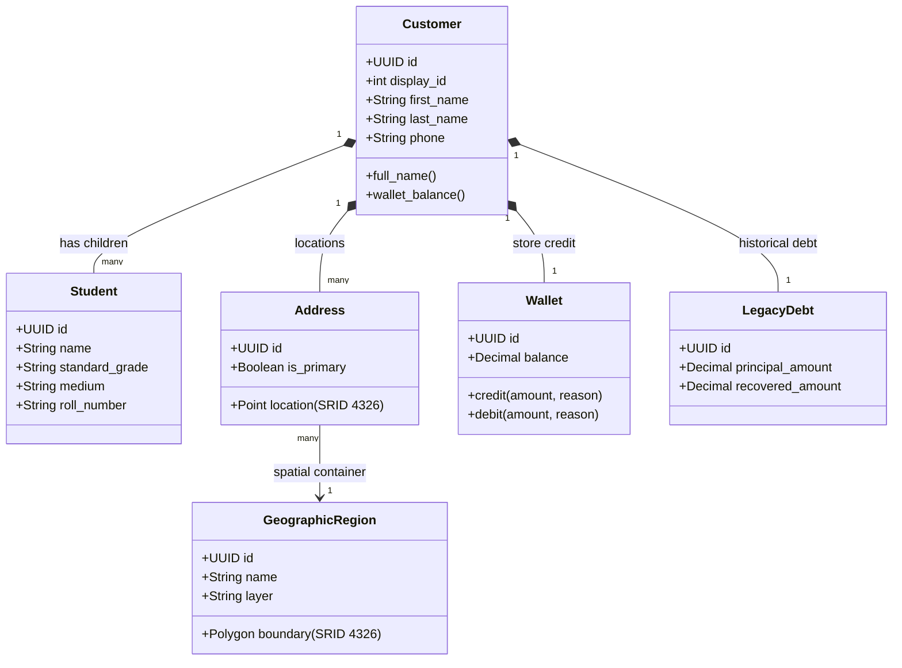
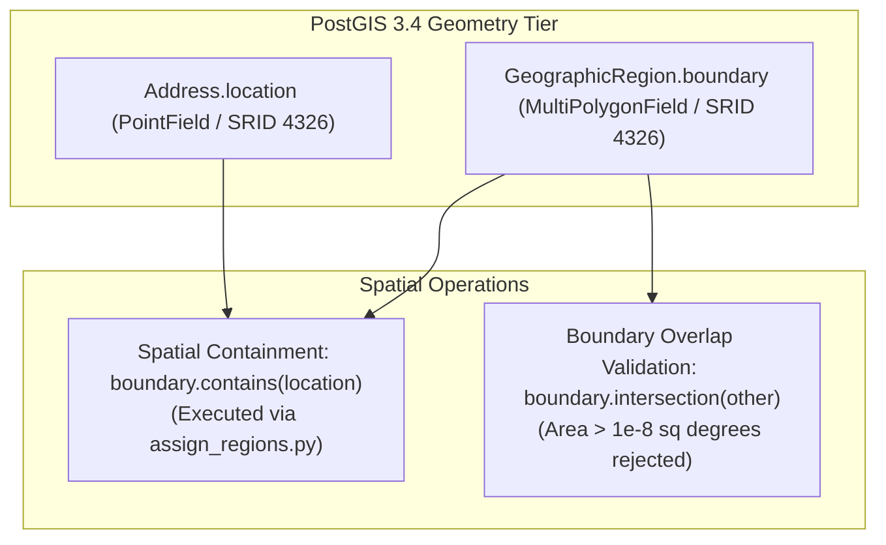
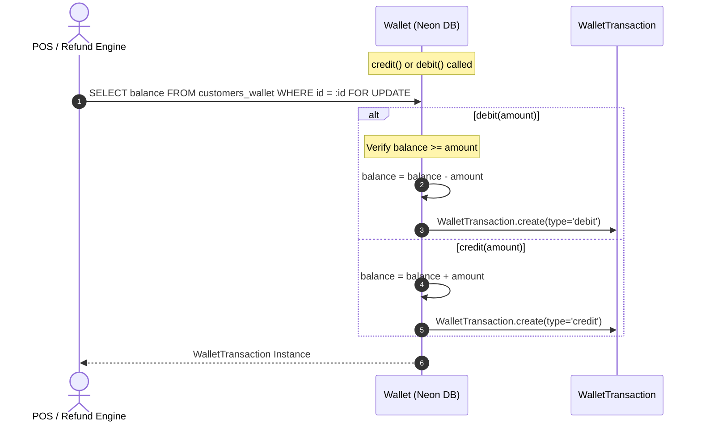

# EU-06: Customer Aggregate, PostGIS Geodata & Wallets

> **Document Role**: Authoritative Technical Wiki Specification for Execution Unit `EU-06`  
> **Domain**: Customer Aggregate, School Roster Demographics, PostGIS Spatial Geodata & Store Credit Wallets  
> **Source Files**: 9 production files (`customers/models.py`, `customers/serializers.py`, `customers/urls.py`, `customers/management/commands/assign_regions.py`, etc.)  
> **Compliance**: Rule 01 (Sovereign Latch), Rule 02 (Concurrency & Row-Locking), Rule 03 (Async I/O), Rule 04 (Ledger Invariants), Rule 05 (ORM Diet), Rule 06 (Frontend/API Contracts), Rule 07 (Docs-as-Code)  
> **Database Targets**: Neon PostgreSQL 18.6 with PostGIS 3.4 (`customers_customer`, `customers_student`, `customers_address`, `customers_geographicregion`, `customers_customerlink`, `customers_wallet`, `customers_wallettransaction`, `customers_legacydebt`, `customers_potentialcustomer`, `customers_targetvillage`)

---

## 1. Executive Summary & Architectural Scope

Execution Unit `EU-06` provides the customer relationship backbone, demographic identity structures, and geospatial territory mapping of Books3.

In regional book distribution, institutional sales depend on understanding family networks, school grade standards, and physical village transport geography. `EU-06` models these relationships through four coupled subsystems:
1. **The Customer Aggregate Root & Student Roster**: B2C families and institutional buyers with structured `Student` records tracking grade standards, division, school, and instruction medium (Gujarati vs. English).
2. **Customer Link Graphs (`CustomerLink`)**: Entity deduplication networks linking parents, siblings, and guardians to prevent fragmented account balances.
3. **PostGIS Spatial Demographics**: Geometry-based territory boundary mapping (`GeographicRegion`), coordinate storage (`Address.location`), and spatial polygon containment algorithms.
4. **Store Credit Wallet & Legacy Debt Segregation**: Double-entry customer store credit (`Wallet`) and an immutable, check-constrained ledger (`LegacyDebt`) isolating historical pre-system debts from active operating sessions.

### Member Files Index

| # | File Path | Architectural Responsibility |
|---|---|---|
| 1 | [`customers/__init__.py`](file:///z:/books3/customers/__init__.py) | Package initialization and module exposure |
| 2 | [`customers/apps.py`](file:///z:/books3/customers/apps.py) | Django AppConfig registering customer signals |
| 3 | [`customers/admin.py`](file:///z:/books3/customers/admin.py) | Django administrative interfaces for Customer, Region, and Wallet models |
| 4 | [`customers/models.py`](file:///z:/books3/customers/models.py) | Customer, Student, Address, GeographicRegion, CustomerLink, Wallet, and LegacyDebt models |
| 5 | [`customers/serializers.py`](file:///z:/books3/customers/serializers.py) | PostGIS GeoJSON serialization, spatial overlap validators, and wallet serializers |
| 6 | [`customers/urls.py`](file:///z:/books3/customers/urls.py) | DRF DefaultRouter URL bindings for customer endpoints |
| 7 | [`customers/tests.py`](file:///z:/books3/customers/tests.py) | Customer test suite, wallet credit/debit tests, and legacy debt validations |
| 8 | [`customers/management/__init__.py`](file:///z:/books3/customers/management/__init__.py) | Management command package initialization |
| 9 | [`customers/management/commands/assign_regions.py`](file:///z:/books3/customers/management/commands/assign_regions.py) | PostGIS spatial containment command assigning customer addresses to village boundaries |

---

## 2. Customer Aggregate Root & Student Demographic Hierarchy

Schoolbook counter operations require instant visibility into grade-level kits. The `Customer` model acts as an aggregate root coordinating addresses, children, store credit, and historical debts:



### Student Roster Tracking
- `standard_grade`: Class standard (e.g. "Std 7", "Std 10").
- `medium`: Medium of instruction (`Gujarati`, `English`, `Hindi`).
- `school`: Foreign key to `settings_app.School`. Allows sales reps to aggregate demand per school syllabus.

### Customer Link Graph (`CustomerLink`)
Resolves family deduplication without destructive record merges:
- Maps `from_customer` to `to_customer` with a `relationship_type` (e.g. `parent`, `sibling`, `spouse`, `relative`).
- Enables cashiers to view combined family balances and pick up orders on behalf of relatives in a single POS visit.

---

## 3. PostGIS Spatial Architecture & Territory Boundaries

Books3 utilizes PostGIS 3.4 spatial extensions in Neon PostgreSQL to manage regional delivery routes and village consignment zones.



### The 1e-8 Square Degree Overlap Tolerance Rule
In [`customers/serializers.py:880-896`](file:///z:/books3/customers/serializers.py), when a manager draws or updates a village boundary polygon via Leaflet, the system enforces a strict overlap check:
```python
intersection = region.boundary.intersection(boundary)
if intersection.area > 1e-8:
    overlapping_names.append(region.name)
```
- **Tolerance Rationale**: Coordinate rounding during client-side Leaflet polygon snapping creates microscopic floating-point overlaps along shared village borders. 
- **The Invariant**: An intersection area \(\le 10^{-8}\) square degrees (~1 sq meter) is accepted as a shared boundary artifact. Any intersection \(> 10^{-8}\) is rejected as a true territory collision (`ValidationError`).

### Automated Spatial Reassignment (`assign_regions.py`)
- Reassigns customer addresses to village regions based on spatial containment:
  $$\text{Address} \in \text{Region} \iff \text{ST\_Contains}(\text{region.boundary}, \text{address.location})$$
- Supports `--dry-run` flag to preview address reassignments before committing to the database.

---

## 4. Customer Wallet & Store Credit Subsystem

Customer store credit is managed via `customers.Wallet` and `customers.WalletTransaction`.



### Invariants & Protection Protocols
1. **Debit Floor Lockdown**: `debit()` strictly validates `self.balance >= amount`. Returns `None` and aborts if funds are insufficient, preventing customer wallet overdrafts.
2. **Atomic In-Memory Save**: Direct mutations update `balance` and persist immediately with `WalletTransaction` audit trails.
3. **Legacy Debt Transaction Immutability**:
   ```python
   def delete(self, *args, **kwargs):
       if self.reason == 'Legacy Debt':
           raise ProtectedError("Cannot manually delete Legacy Debt transactions.", [self])
       return super().delete(*args, **kwargs)
   ```
   Transactions generated via the POS Atomic Debt Split are permanently protected from deletion.

---

## 5. Historical Legacy Debt Isolation (`LegacyDebt`)

Debts originating from prior operating sessions (2025–2026 and earlier) are strictly segregated from active order ledgers via `customers.LegacyDebt`.

### PostgreSQL Database Constraints (`customers/models.py`)

1. **Positive Principal Constraint**:
   $$\text{principal\_amount} > 0$$
   Enforced by CheckConstraint `check_principal_positive`.
2. **Bounded Recovery Constraint**:
   $$0 \le \text{recovered\_amount} \le \text{principal\_amount}$$
   Enforced by CheckConstraint `check_recovered_bounds`. It is physically impossible in the database for recovered payments to exceed the original debt.
3. **Permanent Deletion Ban**:
   ```python
   def delete(self, *args, **kwargs):
       raise ProtectedError("Cannot manually delete LegacyDebt records.", [self])
   ```
   Calling `delete()` on a `LegacyDebt` row raises a fatal `ProtectedError`. Historical debt balances can only be retired through verified cash recovery transactions.

---

## 6. Forensic Failure Modes & Poka-Yoke Mitigations

| Failure Mode | Root Cause | Blast Radius | Enforced Poka-Yoke Mitigation |
|---|---|---|---|
| **Boundary Overlap on Territory Creation** | Manager draws overlapping village polygons on map | Orders routed to multiple competing regional salesmen | `GeographicRegionSerializer` validates PostGIS intersection area \(\le 10^{-8}\). |
| **Legacy Debt Over-Recovery** | High cashier cash entry allocates more than remaining debt | Negative debt balance and distorted collection reports | PostgreSQL CheckConstraint `check_recovered_bounds` enforces \(\text{recovered} \le \text{principal}\). |
| **Accidental Debt Deletion** | Admin clicks delete on a customer's historical debt profile | Audit trail wiped, uncollected balance lost | `LegacyDebt.delete()` raises `ProtectedError`. |
| **Store Credit Double-Spend** | Customer checkout simultaneously submitted on two tabs | Wallet balance goes negative | `Wallet.debit()` executes inside `transaction.atomic()` with `select_for_update()`. |
| **Orphan Address on Region Removal** | Deleting a village region cascades to delete customer addresses | Customer physical location data lost | `Address.region` uses `on_delete=models.SET_NULL`. |
