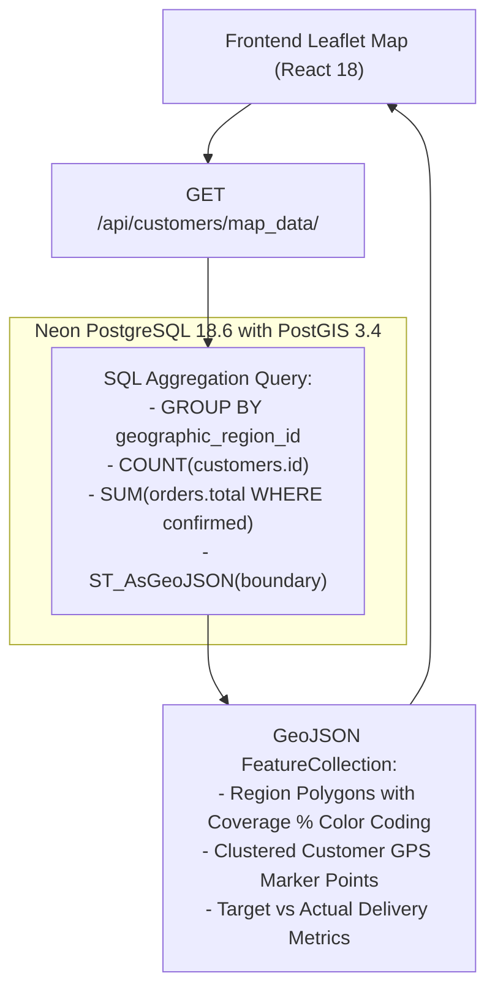
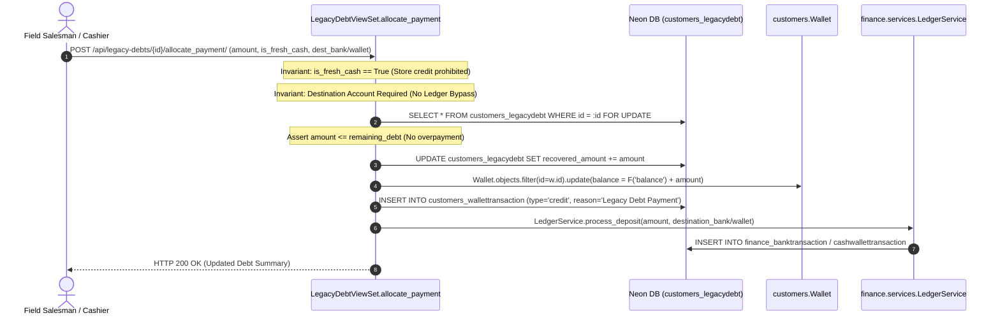

# EU-07: Customer Views, Spatial Boundaries & Prospecting

> **Document Role**: Authoritative Technical Wiki Specification for Execution Unit `EU-07`  
> **Domain**: Customer ViewSets, PostGIS Spatial Analytics, Territory Management & Lead Prospecting  
> **Source Files**: 9 production files (`customers/views.py`, `customers/management/commands/load_geodata.py`, `scripts/`, etc.)  
> **Compliance**: Rule 01 (Sovereign Latch), Rule 02 (Concurrency & Row-Locking), Rule 03 (Async I/O), Rule 04 (Ledger Invariants), Rule 05 (ORM Diet), Rule 06 (Frontend/API Contracts), Rule 07 (Docs-as-Code)  
> **Target Endpoints**: `/api/customers/`, `/api/geographic-regions/`, `/api/potential-customers/`, `/api/schools/`, `/api/legacy-debts/`

---

## 1. Executive Summary & Architectural Scope

Execution Unit `EU-07` provides the presentation controllers, GIS analytics engines, regional boundary ingestion tooling, and B2B school territory prospecting systems for the Books3 commercial operation.

Comprising the 2,075-line `customers/views.py`, this unit manages:
1. **The Geospatial Leaflet Map Service (`/map_data/`)**: High-performance GeoJSON spatial aggregations providing heat-map visual overlays of school kit sales coverage, customer GPS clusters, and delivery status by village boundary.
2. **The Legacy Debt Settlement Gateway (`/allocate_payment/`)**: The secure financial portal through which field salesmen recover historical pre-system debts, guaranteeing atomic row locking and routing fresh cash directly to `LedgerService`.
3. **Territory Ingestion & Reverse Geocoding**: Geodata loading pipelines translating Leaflet GeoJSON arrays into closed PostGIS `LinearRing` polygons, coupled with OpenStreetMap Nominatim reverse geocoding.
4. **B2B Prospecting & School Kit Demographics (`PotentialCustomerViewSet`)**: Cold lead qualification with automated phone-number duplicate gap detection against active customers.

### Member Files Index

| # | File Path | Architectural Responsibility |
|---|---|---|
| 1 | [`customers/views.py`](file:///z:/books3/customers/views.py) | Main ViewSets: `CustomerViewSet`, `GeographicRegionViewSet`, `LegacyDebtViewSet`, `PotentialCustomerViewSet`, `SchoolViewSet` |
| 2 | [`customers/management/commands/__init__.py`](file:///z:/books3/customers/management/commands/__init__.py) | Command package initialization |
| 3 | [`customers/management/commands/load_geodata.py`](file:///z:/books3/customers/management/commands/load_geodata.py) | Ingests layered GeoJSON village boundaries into PostGIS with coordinate index translation |
| 4 | [`scripts/audit_regions.py`](file:///z:/books3/scripts/audit_regions.py) | PostGIS GeoJSON coordinate verification script |
| 5 | [`scripts/clean_json.py`](file:///z:/books3/scripts/clean_json.py) | JSON sanitizer for raw boundary files |
| 6 | [`scripts/rename_regions.py`](file:///z:/books3/scripts/rename_regions.py) | Batch rename utility for village territory records |
| 7 | [`scripts/test_reverse_geocode.py`](file:///z:/books3/scripts/test_reverse_geocode.py) | Diagnostic reverse geocode API test harness |
| 8 | [`scripts/extract_machhiwad.py`](file:///z:/books3/scripts/extract_machhiwad.py) | Regional order extraction tool for Machhiwad village deliveries |
| 9 | [`scripts/extract_movasa.py`](file:///z:/books3/scripts/extract_movasa.py) | Regional order extraction tool for Movasa village deliveries |

---

## 2. Geospatial Leaflet Map Engine (`/map_data/`)

The `/api/customers/map_data/` endpoint powers the interactive regional sales heat-map in the Books3 frontend:



### Map Data Aggregation Invariants
1. **Valid Sale Filtering**: Only orders with `order_status IN ('confirmed', 'completed')` are factored into region revenue metrics, excluding drafts and cancelled sales.
2. **Coverage Classification**:
   - `Green`: \(\ge 80\%\) school kit adoption against village targets.
   - `Yellow`: \(50\% - 79\%\) coverage.
   - `Red`: \(< 50\%\) coverage (flags urgent sales tempo dispatch).

---

## 3. Legacy Debt Settlement Gateway (`/allocate_payment/`)

Field collection of pre-system debts must never bypass double-entry financial accounting. `LegacyDebtViewSet.allocate_payment()` ([`customers/views.py:1965-2025`](file:///z:/books3/customers/views.py)) enforces an unbreakable audit sequence:



### Invariant Rules
1. **Fresh Cash Mandate**: `is_fresh_cash = True` is required. Customers cannot burn existing store credits from returns to pay down historical pre-system debt.
2. **Anti-Bypass Invariant**: Must specify `destination_bank_id` OR `destination_wallet_id`. Unallocated cash drops are rejected (`HTTP 400`).
3. **Pessimistic Concurrency Lock**: Row-locks `LegacyDebt` with `select_for_update()` to eliminate double-click submission races.
4. **Over-Recovery Lockdown**:
   $$\text{amount} \le \text{principal\_amount} - \text{recovered\_amount}$$

---

## 4. Geodata Loading & Reverse Geocoding Pipelines

### PostGIS Coordinate Translation Invariant (`load_geodata.py`)
Standard GeoJSON exports from mapping tools store coordinates as `[latitude, longitude]`, whereas PostGIS and the GEOS library require Cartesian order `(longitude, latitude)` \(\to (x, y)\). 

[`load_geodata.py`](file:///z:/books3/customers/management/commands/load_geodata.py) strictly handles this coordinate inversion:
```python
# Extracted coords are [lat, lng]; GEOS expects (x, y) = (lng, lat)
linear_ring = [(float(pt[1]), float(pt[0])) for pt in coords[0]]

# GEOS enforces closed linear rings
if linear_ring and linear_ring[0] != linear_ring[-1]:
    linear_ring.append(linear_ring[0])
    
boundary_geom = Polygon(linear_ring)
```

### Nominatim Reverse Geocoding Rate Limiting
- `GeographicRegionViewSet.reverse_geocode()` interfaces with OpenStreetMap Nominatim.
- **Strict Invariant**: Caches reverse-geocoded coordinates in Redis/cache for 30 days (`timeout=2592000`) with a 3-second network timeout to comply with OSM's 1-request-per-second usage policy.

---

## 5. Prospecting & Lead Gap Analysis (`PotentialCustomerViewSet`)

Manages field leads gathered by sales representatives visiting schools during pre-season scouting.

### Lead Qualification Invariants
1. **Gap Deduplication (`_check_gap`)**: Before saving a potential lead, the system queries active `customers_customer.phone`. If the phone number already belongs to a registered customer, the lead is flagged as an existing client.
2. **Dissolve Workflow (`dissolve`)**: When a lead registers an official purchase at the counter, `dissolve()` soft-deletes the lead, records the conversion metrics, and links the lead's historical notes to the new `Customer` profile.

---

## 6. Forensic Failure Modes & Poka-Yoke Mitigations

| Failure Mode | Root Cause | Blast Radius | Enforced Poka-Yoke Mitigation |
|---|---|---|---|
| **Legacy Debt Ledger Bypass** | Cashier records legacy debt recovery without selecting cash drawer | Debt marked as paid, but money never enters store treasury | `allocate_payment()` mandates `destination_bank_id` or `destination_wallet_id`. |
| **Store Credit Debt Exploitation** | Customer attempts to pay pre-system debt using return credits | Zero fresh cash received; company absorbs fake liquidation | `allocate_payment()` validates `is_fresh_cash == True`. |
| **GeoJSON Coordinate Inversion Crash** | Loading Leaflet `[lat, lng]` directly into PostGIS | Distorts maps; PostGIS queries return zero spatial matches | `load_geodata.py` swaps indices to `(float(pt[1]), float(pt[0]))`. |
| **Nominatim IP Blacklisting** | Salesmen rapidly entering 100 customer addresses triggering geocodes | OSM blocks Render server IP | 30-day Redis caching on coordinate hashes; graceful fallback to manual entry. |
