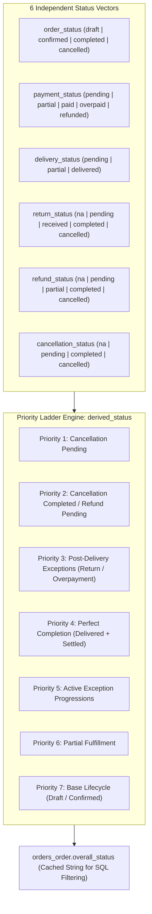
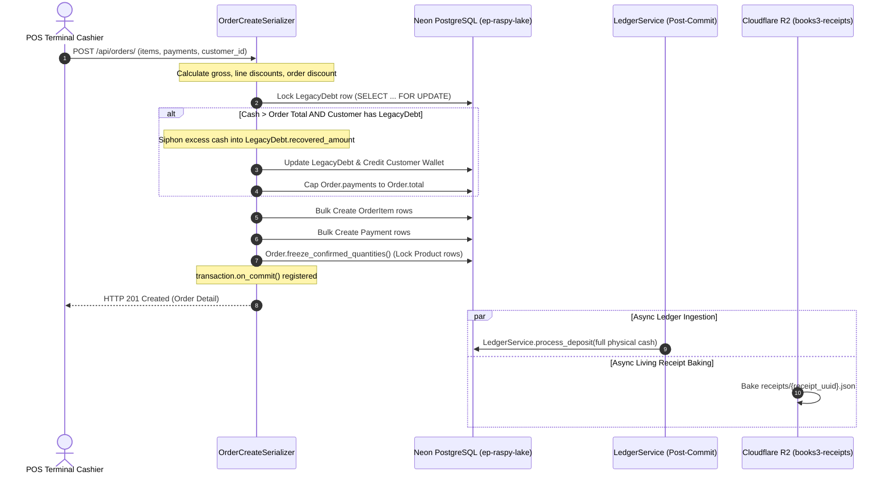
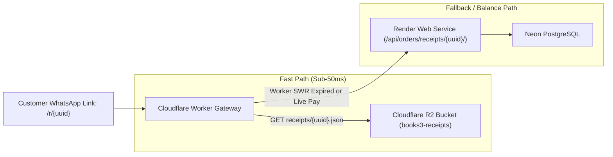

# EU-08: Order Aggregate, Receipts & Cloud Storage Integration

> **Document Role**: Authoritative Technical Wiki Specification for Execution Unit `EU-08`  
> **Domain**: Orders, Fulfillment, Living Receipts & Cloud Storage  
> **Source Files**: 10 production files (`orders/`, `messaging/r2.py`)  
> **Compliance**: Rule 01 (Sovereign Latch), Rule 02 (Concurrency), Rule 03 (Async I/O), Rule 04 (Ledger Invariants), Rule 05 (ORM Diet), Rule 06 (Frontend/API Contracts), Rule 07 (Docs-as-Code)  
> **Database Targets**: Neon PostgreSQL 18.6 (`orders_order`, `orders_orderitem`, `orders_payment`, `orders_delivery`, `orders_deliveryitem`, `orders_return`, `orders_returnitem`, `orders_refund`, `orders_creditnote`, `orders_orderstatushistory`)  
> **Cloud Storage**: Cloudflare R2 Private Bucket (`books3-receipts`)

---

## 1. Executive Summary & Architectural Scope

Execution Unit `EU-08` constitutes the primary transactional heartbeat of the Books3 enterprise ERP. It encompasses the aggregate root `Order` model, the line-item inventory reservation mechanics, the partial fulfillment delivery engine, multi-channel payment allocation, customer return workflows, financial refund reversibility, public living receipts, and asynchronous Cloudflare R2 JSON snapshot serialization.

Unlike conventional e-commerce platforms that rely on a single linear status enum, Books3 implements a **Decoupled 6-Vector Status Architecture** wherein payment, delivery, order lifecycle, returns, refunds, and cancellations are tracked independently and synthesized into a deterministic, human-readable overall status via a strict priority ladder.

### Member Files Index

| # | File Path | Architectural Responsibility |
|---|---|---|
| 1 | [`orders/__init__.py`](file:///z:/books3/orders/__init__.py) | Package initialization and app module exposure |
| 2 | [`orders/apps.py`](file:///z:/books3/orders/apps.py) | Django AppConfig declaring signal registration on startup |
| 3 | [`orders/admin.py`](file:///z:/books3/orders/admin.py) | Administrative interfaces for Order, OrderItem, and Payment |
| 4 | [`orders/constants.py`](file:///z:/books3/orders/constants.py) | Central commercial constants (`VALID_SALE_STATUSES`, `BUSINESS_TIMEZONE`) |
| 5 | [`orders/models.py`](file:///z:/books3/orders/models.py) | Core aggregate models, 6 status vectors, stock deduction, and ledger reversals |
| 6 | [`orders/serializers.py`](file:///z:/books3/orders/serializers.py) | POS creation, atomic legacy debt splitting, zero-floor validators, and detail serializers |
| 7 | [`orders/signals.py`](file:///z:/books3/orders/signals.py) | Reactive status and total recalculations on item/payment/refund modifications |
| 8 | [`orders/receipt_serializers.py`](file:///z:/books3/orders/receipt_serializers.py) | Living receipt payload builders with customer PII data masking |
| 9 | [`orders/receipt_views.py`](file:///z:/books3/orders/receipt_views.py) | Public capability-token API endpoints with SWR and no-cache header partitioning |
| 10 | [`messaging/r2.py`](file:///z:/books3/messaging/r2.py) | Asynchronous Cloudflare R2 JSON snapshot baking engine |

---

## 2. Decoupled 6-Vector Status Architecture

The `Order` model rejects single-column status tracking. Physical fulfillment and financial settlement occur along independent temporal timelines (e.g. an order can be fully delivered weeks before it is fully paid).



### Transition Matrix & State Machine

`payment_status` and `delivery_status` are **strictly read-only / auto-computed**. They cannot be transitioned via API or manual assignment. Attempting to manually mutate them raises a fatal `ValidationError`.

| Status Vector | Valid From | Legal Next States | Invariant / Transition Trigger |
|---|---|---|---|
| `order_status` | `draft` | `confirmed`, `cancelled` | First payment recorded or cashier confirmation |
| `order_status` | `confirmed` | `completed`, `cancelled` | Auto-transitions to `completed` upon `delivery_status == 'delivered'` |
| `order_status` | `completed` | *Terminal* | Immutable. Post-completion issues must use Return/Refund workflows |
| `order_status` | `cancelled` | *Terminal* | Immutable. Stock and payments reversed |
| `payment_status` | *Any* | Auto-computed | \(\text{net\_paid} = \sum \text{payments} - \sum \text{completed\_refunds}\) compared against \(\text{effective\_total}\) |
| `delivery_status` | *Any* | Auto-computed | Computed from sum of `DeliveryItem.quantity` vs confirmed items |
| `cancellation_status`| `na` | `pending` | Cashier requests cancellation on undelivered order |
| `cancellation_status`| `pending` | `completed`, `cancelled` | Manager approval (`completed`) or rejection (`cancelled` \(\to\) `na`) |
| `return_status` | `na` | `pending` | Customer return initiated |
| `return_status` | `pending` | `received`, `cancelled` | Warehouse verifies returned goods |
| `return_status` | `received` | `completed` | Stock restored via `StockService` with original `cost_price` |
| `refund_status` | `na` | `pending` | Refund requested |
| `refund_status` | `pending` | `partial`, `completed`, `cancelled` | Multi-method payout through `LedgerService` |

### Core Mathematical Invariants in `Order.save()`

1. **Delivery-Completion Coupling**:
   $$\text{delivery\_status} = \text{'delivered'} \implies \text{order\_status} = \text{'completed'} \quad \land \quad \text{delivered\_at} = \text{now}()$$
2. **Premature Completion Auto-Correction**:
   If an external caller attempts to set `order_status = 'completed'` while `delivery_status != 'delivered'`, the model auto-corrects `order_status` to `'confirmed'`. It is physically impossible to complete an order without recorded delivery.
3. **Cancellation Terminal Override**:
   $$\text{cancellation\_status} = \text{'completed'} \implies \text{order\_status} = \text{'cancelled'}$$

---

## 3. POS Atomic Split & Legacy Debt Allocation Engine

When an order is created at the POS via `OrderCreateSerializer.create()`, customer cash inflows often exceed the order total due to historical outstanding balances. Books3 implements an **Atomic POS Payment Split** inside a database transaction:



### The Siphoning Algorithm

Given total incoming payment \(\mathcal{P}\) and computed order total \(\mathcal{T}\):
$$\text{excess} = \max(0, \mathcal{P} - \mathcal{T})$$

If \(\text{excess} > 0\) and customer has `LegacyDebt` with \(\text{remaining\_debt} > 0\):
1. Compute legacy debt allocation:
   $$\mathcal{D}_{\text{alloc}} = \min(\text{excess}, \text{remaining\_debt})$$
2. **Fresh Cash Invariant**: Store credit cannot pay legacy debt.
   $$\mathcal{D}_{\text{alloc}} \le \sum \text{payments}_{\text{method} \neq \text{'Customer Wallet'}}$$
3. Siphon \(\mathcal{D}_{\text{alloc}}\) from cash/bank payment line items.
4. Record `WalletTransaction` (`transaction_type='credit'`) on customer wallet.
5. Pass **full physical cash** (not reduced amount) to deferred ledger deposits so `LedgerService` registers the complete physical currency intake in the store cash drawer or bank account.

---

## 4. Inventory Allocation & Option C Pack Atomization

Inventory reservation occurs via `Order.freeze_confirmed_quantities()`. Books3 utilizes **Option C Pack Atomization**, where multipacks (e.g. "Box of 12 Pens") do not maintain independent physical inventory pools; they are broken down into base product units.

### The 5-Query High-Performance Batch Deduction

Legacy implementations executed \(6 \times N\) queries during order confirmation. EU-08 enforces an aggregated \(O(1)\) batch query pattern:

1. **Bulk Freeze**: Freezes `confirmed_quantity = quantity` across all unconfirmed items via `OrderItem.objects.bulk_update(items, ['confirmed_quantity'])` (1 query).
2. **Pack Translation Aggregation**:
   $$\text{qty\_by\_product}[P_{\text{base}}] = \sum (\text{item.quantity} \times \text{pack\_size})$$
3. **Pessimistic Row Locking**:
   ```sql
   SELECT * FROM inventory_product 
   WHERE id IN (...) 
   FOR UPDATE;
   ```
4. **Bulk Stock Mutation**:
   $$\text{stock\_quantity}_{\text{new}} = \text{stock\_quantity}_{\text{current}} - \text{qty}_{\text{aggregated}}$$
   Executed via `Product.objects.bulk_update(products, ['stock_quantity'])` (1 query).
5. **Pack Variant Synchronization**: Explicit invocation of `product.sync_pack_stock()` per mutated base item.
6. **Audit Trail Bulk Ingestion**: Bulk creates `StockAdjustment` and `StockHistory` audit records (2 queries).

Total database queries: exactly 5, regardless of line-item count.

---

## 5. Living Receipt & Cloudflare R2 Snapshot Engine

Public receipts do not expose database auto-increment IDs. Access is authorized via a cryptographic capability token: `Order.receipt_uuid` (`UUIDv4`).



### Dual-Path Public Endpoints

| Endpoint | View Class | Cache Header Policy | Purpose |
|---|---|---|---|
| `GET /api/orders/receipts/{uuid}/` | `PublicReceiptView` | `public, max-age=60` | Full living receipt (items, store metadata, payments). Cached at edge. |
| `GET /api/orders/receipts/{uuid}/balance/` | `ReceiptBalanceView` | `no-store, no-cache, must-revalidate, max-age=0` | Live balance check for UPI Pay Now button. **Strictly uncached** to prevent double-payment. |

### R2 JSON Baking Invariants (`messaging/r2.py`)

- **Asynchronous Execution**: R2 snapshot generation runs via `transaction.on_commit()` in a background daemon thread with explicit `close_old_connections()` cleanup.
- **Customer PII Masking**:
  - Name: Masked after 3 characters (e.g., `"MUK***"`).
  - Phone: First 2 and last 2 digits exposed (e.g., `"98****10"`).
- **Sovereign Bucket Binding**:
  - Bucket name: strictly `books3-receipts`.
  - Object Key: `receipts/{receipt_uuid}.json`.
  - MIME Type: `application/json; charset=utf-8`.

---

## 6. Financial Refund Reversibility & Ledger Cascade

The `Refund` model (`orders/models.py`) establishes hard-links to double-entry ledger transactions:
- `bank_transaction` \(\to\) `OneToOneField(finance.BankTransaction)`
- `wallet_transaction` \(\to\) `OneToOneField(finance.CashWalletTransaction)`
- `customer_wallet_transaction` \(\to\) `OneToOneField(customers.WalletTransaction)`

### Ledger Reversal Protocol (`_reverse_ledgers`)

When a refund is cancelled (`status = 'cancelled'`), any disbursed funds must be pulled back into the company treasury:
1. **Bank Refund**: Calls `LedgerService.process_deposit` to credit the originating `BankAccount`.
2. **Cash Refund**: Calls `LedgerService.process_deposit` to credit the originating `CashWallet`.
3. **Store Credit Refund**: Row-locks `customers.Wallet` via `select_for_update()` and executes `wallet.debit()`.

---

## 7. Forensic Failure Modes & Poka-Yoke Mitigations

| Failure Mode | Root Cause | Blast Radius | Enforced Poka-Yoke Mitigation |
|---|---|---|---|
| **Stale R2 Receipt Cache** | Fast customer refresh after UPI payment before R2 upload finishes | Customer sees "Pending" instead of "Paid" | UPI Pay Now button bypasses R2 cache and polls `/api/orders/receipts/{uuid}/balance/` (`no-store`). |
| **Prefetch Cache Eviction Trap (V-02)** | DRF views holding stale prefetched `items` or `payments` during status recalculation | Order calculated with outdated totals, writing wrong `payment_status` | `calculate_totals()` and `update_payment_status()` explicitly pop `items`, `payments`, and `refunds` from `_prefetched_objects_cache`. |
| **Over-Delivery Race** | Concurrent dispatch clicks on partial deliveries without row lock | Warehouse dispatches more items than confirmed in order | `DeliveryItem.clean()` validates `quantity <= remaining_quantity` against database state. |
| **WAC Inventory Distortion on Returns** | Returned stock restored using current average cost rather than sale cost | Distorts inventory asset value and gross margin calculations | `ReturnItem.restore_stock()` passes `unit_cost=self.order_item.cost_price` to `StockService.adjust_stock()`. |
| **Premature Order Completion** | External API or script updating `order_status = 'completed'` | Order closed without goods leaving warehouse | `Order.save()` invariant automatically downgrades status to `'confirmed'` if `delivery_status != 'delivered'`. |
| **Zero-Floor Exploit** | Malicious or erroneous negative unit prices/discounts in payload | Free goods dispatch or commission inflation | `OrderCreateSerializer` and `OrderItemCreateSerializer` enforce `min_value=0` on all prices and discounts. |

---

## 8. Environmental Dependencies & Configuration

| Variable | Scope | Mandatory | Description | Sovereign Production Value |
|---|---|---|---|---|
| `R2_ENDPOINT_URL` | App & Worker | Yes | Cloudflare S3 API endpoint | `https://3d053348182946c12efe18f8f1ed5480.r2.cloudflarestorage.com` |
| `R2_ACCESS_KEY_ID` | Render Web | Yes | Cloudflare R2 API token ID | Managed Render Secret |
| `R2_SECRET_ACCESS_KEY` | Render Web | Yes | Cloudflare R2 API token Secret | Managed Render Secret |
| `R2_RECEIPTS_BUCKET` | App & Worker | Yes | Sovereign receipts bucket | `books3-receipts` |
| `DATABASE_URL` | Render Web | Yes | Neon PostgreSQL pooled connection | `postgresql://...@ep-raspy-lake-b39hlekz-pooler.ap-southeast-1.aws.neon.tech/neondb` |
| `BUSINESS_TIMEZONE` | App Settings | Yes | Operating timezone for sales day | `Asia/Kolkata` |
