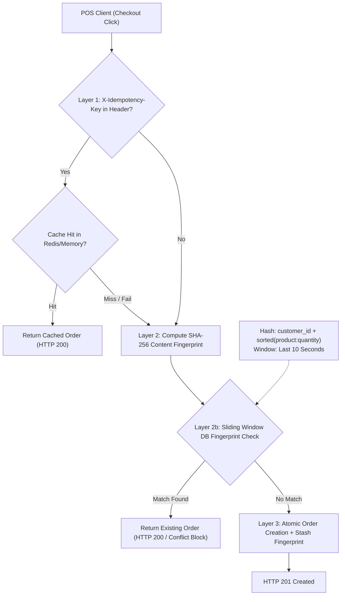
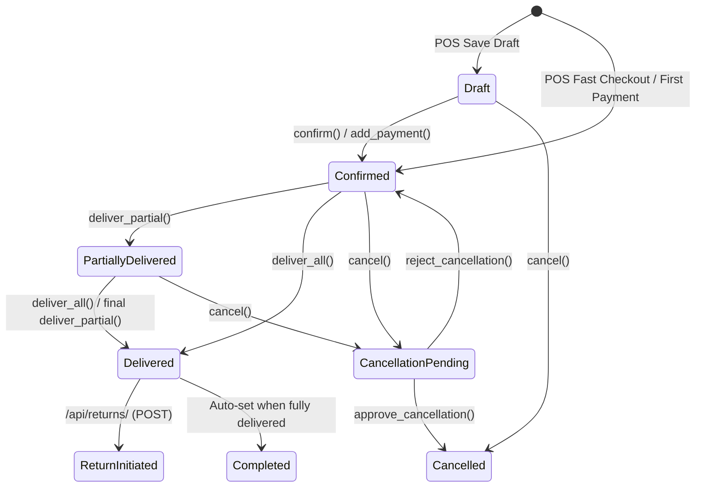

# EU-09: Order Views, Reminders & Lifecycle Tests

> **Document Role**: Authoritative Technical Wiki Specification for Execution Unit `EU-09`  
> **Domain**: Order API ViewSets, Action State Transitions, Overdue Automation & Test Regressions  
> **Source Files**: 9 production files (`orders/views.py`, `orders/urls.py`, `orders/tests.py`, `orders/management/commands/`, `scripts/`)  
> **Compliance**: Rule 01 (Sovereign Latch), Rule 02 (Concurrency), Rule 03 (Async I/O), Rule 04 (Ledger Invariants), Rule 05 (ORM Diet), Rule 06 (Frontend/API Contracts), Rule 07 (Docs-as-Code)  
> **Target Endpoints**: `/api/orders/`, `/api/payments/`, `/api/returns/`, `/api/refunds/`, `/api/return-reasons/`

---

## 1. Executive Summary & Architectural Scope

Execution Unit `EU-09` encapsulates the API presentation, action workflows, automated dunning routines, operational repair commands, and test verification harnesses for the order lifecycle. 

At its center is `OrderViewSet` ([`orders/views.py`](file:///z:/books3/orders/views.py)), an expansive 1,556-line controller orchestrating high-concurrency order creation, multi-layer idempotency defense, partial fulfillment dispatches, manager-approved cancellations, item price re-synchronization, and customer wallet overpayment allocations. Additionally, `EU-09` covers automated daily overdue reminders via GitHub Actions, historical duplicate order repair commands, quarantined legacy scripts, and an exhaustive 901-line regression test suite ([`orders/tests.py`](file:///z:/books3/orders/tests.py)).

### Member Files Index

| # | File Path | Architectural Responsibility |
|---|---|---|
| 1 | [`orders/views.py`](file:///z:/books3/orders/views.py) | Main ViewSets: `OrderViewSet`, `PaymentViewSet`, `ReturnViewSet`, `RefundViewSet` |
| 2 | [`orders/urls.py`](file:///z:/books3/orders/urls.py) | DRF DefaultRouter route definitions and public receipt url bindings |
| 3 | [`orders/tests.py`](file:///z:/books3/orders/tests.py) | 901-line test harness (`OrderEditTestCase`, `OrderReturnTestCase`) |
| 4 | [`orders/management/__init__.py`](file:///z:/books3/orders/management/__init__.py) | Management command package initialization |
| 5 | [`orders/management/commands/__init__.py`](file:///z:/books3/orders/management/commands/__init__.py) | Command package initialization |
| 6 | [`orders/management/commands/fix_duplicate_orders.py`](file:///z:/books3/orders/management/commands/fix_duplicate_orders.py) | Safe operational command with `--execute` flag to unwind duplicate orders |
| 7 | [`orders/management/commands/send_overdue_reminders.py`](file:///z:/books3/orders/management/commands/send_overdue_reminders.py) | Daily automated overdue reminder dispatcher (15-day delivery threshold) |
| 8 | [`scripts/reverse_ghost_refund.py`](file:///z:/books3/scripts/reverse_ghost_refund.py) | **[QUARANTINED]** Historical ad-hoc manual refund reversal script |
| 9 | [`scripts/extract_sql.py`](file:///z:/books3/scripts/extract_sql.py) | **[QUARANTINED]** Historical reporting query script with legacy DB string |

---

## 2. The 3-Layer Idempotency & Duplicate Prevention Defense

High-concurrency POS checkout environments suffer from double-click latency races, network retries, and offline-sync replay bugs. `OrderViewSet.create()` implements a **3-Layer Idempotency Defense**:



### Layer Mechanics & Specifications

1. **Layer 1: Cache-Based Idempotency Key (Fast-Path, Fail-Open)**
   - Header: `X-Idempotency-Key: <UUIDv4>`
   - Key: `order_idempotency_{user_id}_{idempotency_key}`
   - Behavior: Returns previously created order within 60 seconds. If the cache layer fails or is unreachable, it logs a warning and fails open to avoid halting POS transactions.
2. **Layer 2: Deterministic SHA-256 Content Fingerprint**
   - Algorithm:
     $$\text{item\_fingerprint} = \text{join}\left(\text{sort}\left(\left[ P_i : Q_i \right]\right)\right)$$
     $$\text{fingerprint} = \text{SHA-256}\left(\text{customer\_id} \parallel "|" \parallel \text{item\_fingerprint}\right)$$
   - Pure content-based hash (no time-bucket in the hash itself to prevent edge-of-second boundary misses).
3. **Layer 2b: Sliding-Window Database Fingerprint Guard**
   - Query: Searches for active orders matching `order_fingerprint = fingerprint` created within the last 10 seconds:
     ```python
     Order.objects.filter(
         customer_id=customer_id,
         order_fingerprint=fingerprint,
         created_at__gte=timezone.now() - timedelta(seconds=10),
         is_deleted=False
     ).first()
     ```
   - If found, halts creation and returns the existing order instance.

---

## 3. Order Action State Machine & Custom ViewSet Actions

`OrderViewSet` exposes specific RPC-style custom actions decorated with `@action(detail=True, methods=['post'])` to enforce strict state machine transitions:



### Action Contract Reference Table

| Action Method | HTTP Endpoint | Required Conditions | State Mutations & Business Logic |
|---|---|---|---|
| `confirm` | `POST /api/orders/{id}/confirm/` | `order_status == 'draft'` | Transitions to `confirmed`, calls `freeze_confirmed_quantities()` to batch-deduct stock. |
| `hold` | `POST /api/orders/{id}/hold/` | `order_status == 'draft'` | Explicitly holds draft without stock reservation. |
| `complete` | `POST /api/orders/{id}/complete/` | `delivery_status == 'delivered'` | Invariant guard: refuses manual completion unless goods are physically delivered. |
| `deliver_all` | `POST /api/orders/{id}/deliver_all/` | `delivery_status != 'delivered'` | Creates `Delivery` + `DeliveryItem` for 100% remaining quantities. Updates `delivery_status = 'delivered'`, auto-completes order. |
| `deliver_partial`| `POST /api/orders/{id}/deliver_partial/`| `items` payload valid | Row-locks order items, verifies \(Q_{\text{dispatch}} \le Q_{\text{remaining}}\), creates partial `Delivery`. Transitions status to `'partial'`. |
| `cancel` | `POST /api/orders/{id}/cancel/` | `can_cancel == True` | If draft \(\to\) direct cancel. If confirmed \(\to\) sets `cancellation_status = 'pending'` for manager review. |
| `approve_cancellation`| `POST /api/orders/{id}/approve_cancellation/`| `cancellation_status == 'pending'` | Requires manager role. Restores stock via `StockService`, cancels payments, marks `order_status = 'cancelled'`. |
| `reject_cancellation` | `POST /api/orders/{id}/reject_cancellation/` | `cancellation_status == 'pending'` | Resets `cancellation_status = 'na'`, returns order to active operational flow. |
| `add_payment` | `POST /api/orders/{id}/add_payment/` | `amount > 0` | Validates `amount <= balance_due`. Routes cash/bank to `LedgerService` post-commit. |
| `add_change_to_wallet`| `POST /api/orders/{id}/add_change_to_wallet/`| `change_due > 0`, registered customer | Credits cash overpayment to `customers.Wallet` via `F('balance') + change_due`. |
| `resync_item_price` | `POST /api/orders/{id}/resync_item_price/` | `item_id` in order, undelivered | Updates unit price to catalog current price, recalculates totals without destructive page reloads. |

---

## 4. Automated Overdue Reminder Subsystem

Managed by `orders/management/commands/send_overdue_reminders.py`. Executes daily via GitHub Actions (`cron: '30 3 * * *'` = 9:00 AM IST).

### Business Invariants
1. **15-Day Delivery Grace Period**:
   $$\text{delivered\_at} < \text{now}() - 15\,\text{days}$$
2. **Valid Sale Filtering**: `order_status IN ('confirmed', 'completed')` (from `orders/constants.py`). Excludes drafts and cancellations.
3. **Weekly Rate-Limit Poka-Yoke**: Max 1 reminder per week per order:
   $$\text{last\_reminder\_sent} \text{ IS NULL} \quad \lor \quad \text{last\_reminder\_sent} < \text{now}() - 7\,\text{days}$$
4. **Execution Protocol**:
   - `python manage.py send_overdue_reminders --dry-run`: Generates preview table with balance and customer details without sending.
   - Production run updates `order.last_reminder_sent = timezone.now()` only when messaging gateway reports successful dispatch.

---

## 5. Operational Tooling & Historical Script Quarantines

### Active Operational Command: `fix_duplicate_orders.py`
- **Purpose**: Reverses accidental duplicate order batches (e.g. historical orders `#1093`, `#1098`, `#1100`, `#1106`, `#1112`, `#1114`).
- **Safety Gate**: Runs in **DRY RUN** mode by default. Requires explicit `--execute` flag to mutate database state.
- **Atomic Deconstruction Sequence**:
  1. Restores reserved stock via `StockService.adjust_stock(reason='cancellation')`.
  2. Restores physical stock if deliveries were logged.
  3. Cascades deletion through `DeliveryItem` and `Delivery`.
  4. Deletes `OrderItem` records.
  5. Sets `cancellation_status = 'completed'` and soft-deletes (`is_deleted = True`).

### Quarantined Legacy Scripts

| Script Path | Quarantine Reason | Violation | Corrective Architecture |
|---|---|---|---|
| [`scripts/reverse_ghost_refund.py`](file:///z:/books3/scripts/reverse_ghost_refund.py) | Mutated customer wallet balance via direct Python arithmetic: `wallet.balance -= wt.amount; wallet.save()` | **Rule 04 Violation**: Direct balance mutation without `LedgerService` or `F()` expressions causes balance drift under concurrency. | Must use `wallet.debit()` or `LedgerService.process_withdrawal`. |
| [`scripts/extract_sql.py`](file:///z:/books3/scripts/extract_sql.py) | Hardcoded connection string pointing to legacy `ep-autumn-star` cluster. | **Rule 01 Violation**: Hard ban on legacy database connections. Connecting risks data pollution. | Repoint to Neon `ep-raspy-lake` pooler or utilize the AZQL reporting query builder (`EU-02`). |

---

## 6. Regression Verification Harness (`orders/tests.py`)

The 901-line testing suite provides comprehensive regression coverage across two critical test classes:

### 1. `OrderEditTestCase` (Lines 11–632)
- **Edit Immutability**: Proves orders cannot be edited once `delivery_status == 'delivered'`.
- **Delivered Item Deletion Prevention**: Verifies that updating an order's items payload rejects removal of any item that has \(Q_{\text{delivered}} > 0\).
- **Price Resync Precision**: Verifies silent state merge on `resync_item_price` updates order subtotal and total without invalidating existing payments.
- **Stock Adjustment Diffing**: Tests that editing item quantity from 10 to 15 correctly issues an incremental stock deduction of 5 base units.

### 2. `OrderReturnTestCase` (Lines 633–901)
- **Return Initiation & Bounds**: Verifies return quantity cannot exceed delivered quantity minus previously returned quantity:
  $$Q_{\text{return}} \le Q_{\text{delivered}} - Q_{\text{already\_returned}}$$
- **Stock Restoration at Sale Cost**: Validates that `ReturnItem.restore_stock()` adjusts inventory using `cost_price` frozen at time of sale, preventing WAC distortion.
- **Multi-Method Refund Routing**: Tests refund execution routing to cash, bank, or customer wallet store credit.
