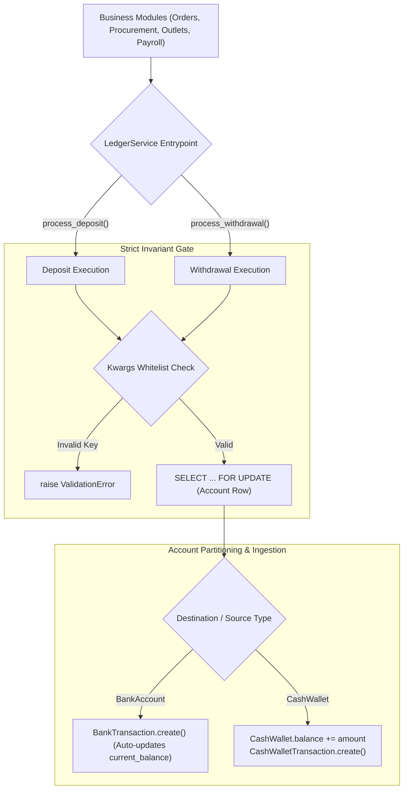
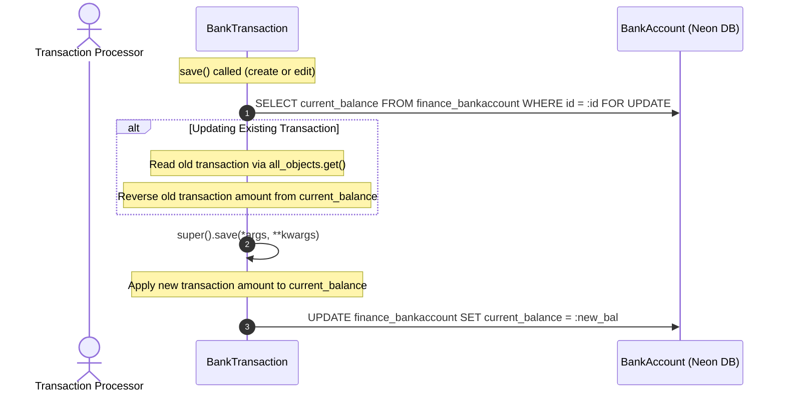
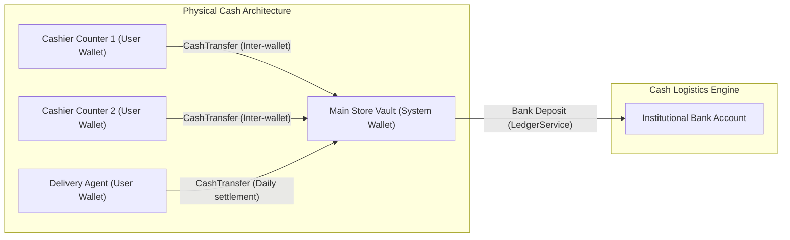

# EU-10: Financial Ledger, Bank Transactions & LedgerService

> **Document Role**: Authoritative Technical Wiki Specification for Execution Unit `EU-10`  
> **Domain**: Double-Entry Financial Ledger, Cash Drawers, Bank Synchronization & Treasury Management  
> **Source Files**: 9 production files (`finance/`, `scripts/`)  
> **Compliance**: Rule 01 (Sovereign Latch), Rule 02 (Concurrency & Row-Locking), Rule 03 (Async I/O), Rule 04 (Financial Ledger Invariants), Rule 05 (ORM Diet), Rule 06 (Frontend/API Contracts), Rule 07 (Docs-as-Code)  
> **Database Targets**: Neon PostgreSQL 18.6 (`finance_bankaccount`, `finance_banktransaction`, `finance_cashwallet`, `finance_cashwallettransaction`, `finance_cashtransfer`, `finance_expense`, `finance_expensepayment`, `finance_loan`, `finance_loanrepayment`, `finance_employeesalary`, `finance_salarypayment`)

---

## 1. Executive Summary & Architectural Scope

Execution Unit `EU-10` is the sovereign treasury and financial ledger core of the Books3 platform. It implements immutable double-entry bookkeeping, strict balance-synchronization state machines, inter-wallet cash logistics, multi-installment business expense tracking, payroll disbursements, and reducing-balance commercial loan accounting.

The absolute architectural centerpiece of this domain is the **`LedgerService` Gateway** ([`finance/services.py`](file:///z:/books3/finance/services.py)). Under **Rule 04 (Financial Ledger Invariants)**, direct database mutations on account balances (such as `account.current_balance += amount` or `wallet.balance -= amount`) are strictly forbidden across the codebase. All cash inflows and outflows must funnel through `LedgerService` to guarantee pessimistic row-locking, audit trails, and strict transaction boundary isolation.

### Member Files Index

| # | File Path | Architectural Responsibility |
|---|---|---|
| 1 | [`finance/__init__.py`](file:///z:/books3/finance/__init__.py) | Package initialization and module exposure |
| 2 | [`finance/apps.py`](file:///z:/books3/finance/apps.py) | Django AppConfig registering signals on startup |
| 3 | [`finance/admin.py`](file:///z:/books3/finance/admin.py) | Django administrative interfaces for financial models |
| 4 | [`finance/models.py`](file:///z:/books3/finance/models.py) | 22 financial models (Banks, Wallets, Expenses, Loans, Salaries) |
| 5 | [`finance/services.py`](file:///z:/books3/finance/services.py) | The mandatory `LedgerService` gateway (`process_deposit`, `process_withdrawal`) |
| 6 | [`finance/signals.py`](file:///z:/books3/finance/signals.py) | User creation post-save signal auto-provisioning personal cash wallets |
| 7 | [`finance/urls.py`](file:///z:/books3/finance/urls.py) | Financial API routing (DRF DefaultRouter + custom RPC actions) |
| 8 | [`finance/tests.py`](file:///z:/books3/finance/tests.py) | Financial transaction test suite and balance verification |
| 9 | [`scripts/test_all_tx.py`](file:///z:/books3/scripts/test_all_tx.py) | **[QUARANTINED]** Historical transaction endpoint testing script |

---

## 2. The `LedgerService` Ironclad Gateway

`LedgerService` provides two static entry points for all currency movements. Both methods execute inside `transaction.atomic()` and acquire pessimistic row locks (`select_for_update()`) on target account rows before calculating balance adjustments.



### The Kwargs Whitelist & Target Partitioning Contract

To eliminate arbitrary ORM argument leaks while supporting rich audit trails, `LedgerService` enforces a strict **Kwargs Whitelist**:
$$\mathcal{K}_{\text{allowed}} = \left\{ \text{'related\_loan'}, \text{'related\_expense'}, \text{'recorded\_by'}, \text{'created\_by'} \right\}$$
Any unauthorized keyword argument raises an immediate `ValidationError`.

Furthermore, `LedgerService` applies **Target Field Partitioning**:
- `BankTransaction` supports both `related_loan` and `related_expense`.
- `CashWalletTransaction` supports `related_loan`, but **does not have a `related_expense` column**. `LedgerService` partitions kwargs so `related_expense` is omitted from `CashWalletTransaction.objects.create()`, preventing database column exceptions.

### Attribution Precedence Constraint

When recording transactions, attribution kwargs take precedence over the positional `user` parameter:
```python
# Bank transactions use recorded_by
bank_user = kwargs.pop('recorded_by', user)

# Cash wallet transactions use created_by
wallet_user = kwargs.pop('created_by', user)
```

### Overdraft Protection & Administrative Bypass

`process_withdrawal` evaluates account liquidity before persisting transactions:
$$\text{liquidity\_check}: \quad \text{balance}_{\text{current}} - \text{amount} \ge 0$$
- If balance is insufficient and `allow_overdraft=False` (default): raises `ValidationError("Insufficient funds in...")`.
- If `allow_overdraft=True`: skips the liquidity check. **Strictly reserved for administrative corrections** (e.g. voiding a historical order or reversing an outlet payment when cash has already been disbursed).

---

## 3. Bank Account State Machine & Soft-Delete Balance Defense

`BankAccount` maintains a live `current_balance` field, updated automatically on every `BankTransaction.save()` and `delete()`:



### The `_skip_balance` Soft-Delete Defense Pattern

When a `BankTransaction` is deleted, `SoftDeleteModel.delete()` sets `is_deleted = True` and calls `self.save()`. Without defensive intervention, `save()` would execute and re-apply the transaction amount, permanently corrupting the bank balance.

Books3 prevents this via the **`_skip_balance` Sentinel Pattern**:
```python
def delete(self, *args, **kwargs):
    with transaction.atomic():
        account = BankAccount.objects.select_for_update().get(pk=self.account_id)
        # 1. Reverse balance effect
        if self.transaction_type in ['deposit', 'transfer_in']:
            account.current_balance -= self.amount
        else:
            account.current_balance += self.amount
        account.save()
        
        # 2. Set sentinel flag to block save() from re-applying balance
        self._skip_balance = True
        super().delete(*args, **kwargs)
```

### The `all_objects` Soft-Delete Manager Trap Prevention

When an existing transaction is updated, `self.save()` must inspect the previous transaction state to calculate the delta. Standard `objects.get(pk=self.pk)` ignores soft-deleted rows. Books3 explicitly invokes `BankTransaction.all_objects.get(pk=self.pk)` to guarantee historical visibility.

---

## 4. Cash Wallet Logistics & Auto-Provisioning Signal

Books3 separates institutional bank accounts from distributed, physical cash drawers via `CashWallet`.



### Cash Transfer Peer Approval Workflow (`CashTransfer`)
Inter-wallet cash movements require dual authorization:
1. `status = 'pending'`: Initiated by transferring cashier.
2. `approve()`: Executed by receiving manager. Acquires row locks on both wallets, moves balance atomically, and marks `status = 'completed'`.
3. `reject()`: Cancels transfer, leaves source wallet intact.

### User Creation Signal (`finance/signals.py`)
To ensure salesmen and cashiers immediately have a designated cash drawer:
```python
@receiver(post_save, sender=settings.AUTH_USER_MODEL)
def auto_provision_cash_wallet(sender, instance, created, **kwargs):
    if created:
        CashWallet.objects.get_or_create(
            owner=instance,
            defaults={'name': f"{instance.username}'s Wallet", 'balance': Decimal('0.00')}
        )
```

---

## 5. Expense, Payroll & Reducing-Balance Loan Subsystems

### Business Expense Multi-Payment Installments
- `Expense`: Header entity tracking vendor, category, total amount, and `payment_status` (`pending`, `partial`, `paid`).
- `ExpensePayment`: Line payments against an expense. Hard-links to `BankAccount` or `CashWallet`. Automatically routes disbursements through `LedgerService.process_withdrawal`.
- **₹5,000 Approval Invariant (Rule 04)**: Expenses exceeding ₹5,000 require manager approval before disbursement.

### Employee Salary & Advances
- `EmployeeSalary`: Monthly salary ledger records (base salary, bonuses, deductions).
- `SalaryPayment`: Disbursement records hard-linked to treasury ledgers.
- `EmployeeExpense`: Tracks out-of-pocket reimbursements and procurement cash advances.

### Commercial Loan Reducing-Balance Engine
- `Lender`: Financial institution or private lender profile.
- `Loan`: Tracks principal, annual interest rate, tenure, and reducing balance.
- `LoanRepayment`: Monthly installments partitioned into principal reduction and interest expense:
  $$\mathcal{A}_{\text{payment}} = \mathcal{P}_{\text{principal}} + \mathcal{I}_{\text{interest}}$$
  Each repayment updates `loan.current_principal -= P_principal` and logs financial ledger entries.

---

## 6. Forensic Failure Modes & Poka-Yoke Mitigations

| Failure Mode | Root Cause | Blast Radius | Enforced Poka-Yoke Mitigation |
|---|---|---|---|
| **Silent Discard of Financial Transaction** | Caller calls `LedgerService` without `destination_bank` or `destination_wallet` | Money movement lost from ledger with zero trace | View validation asserts target account presence prior to calling `LedgerService`. |
| **Concurrent Balance Drift** | Parallel transactions mutating balance without row lock | Account balance diverges from transaction sum | `LedgerService` and `BankTransaction.save()` mandate `select_for_update()` row locking. |
| **Soft-Delete Balance Doubling** | Calling `delete()` triggers `SoftDeleteModel.save()` without bypass sentinel | Account balance corrupted by \(2\times\) transaction amount | `_skip_balance = True` flag short-circuits `save()` balance recalculation. |
| **Cash Drawer Negative Drift** | Cashier disburses more cash than available in physical drawer | Wallet balance turns negative, hiding unrecorded shortages | `LedgerService.process_withdrawal` raises `ValidationError` unless `allow_overdraft=True`. |
| **ORM Crash on Target Unpack** | Passing `related_expense` to `CashWalletTransaction.create()` | HTTP 500 fatal crash on POS cash payment | `LedgerService` filters `wallet_kwargs` strictly to `{'related_loan'}`. |

---

## 7. Quarantined Scripts Reference

| Script Path | Quarantine Reason | Violation | Corrective Architecture |
|---|---|---|---|
| [`scripts/test_all_tx.py`](file:///z:/books3/scripts/test_all_tx.py) | Injects legacy path `sys.path.append(r'z:\books2')` and executes raw HTTP requests against unseeded database. | **Rule 01 Violation**: Hard ban on legacy path injection. Risks cross-loading deprecated legacy code. | Use sovereign Django test suite: `python manage.py test finance.tests`. |
