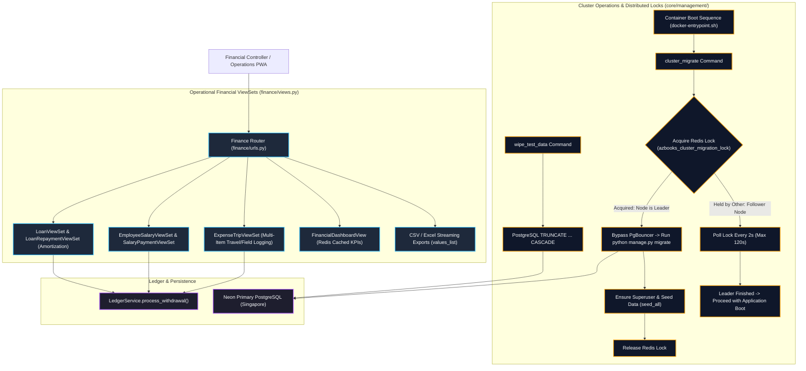
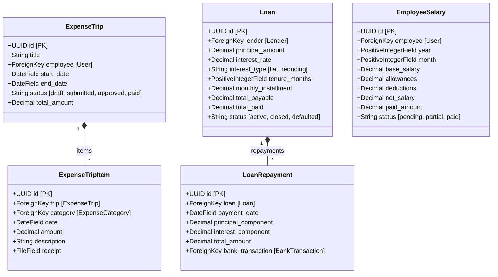
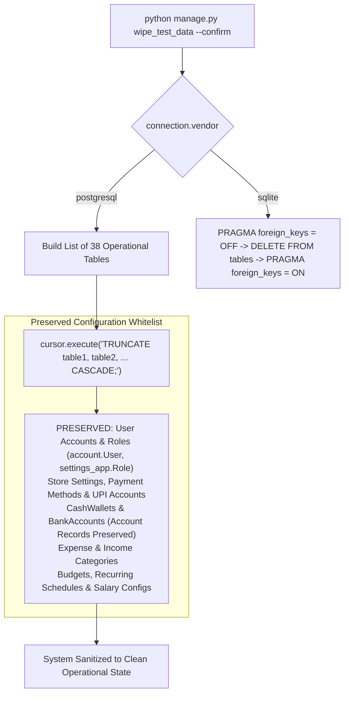
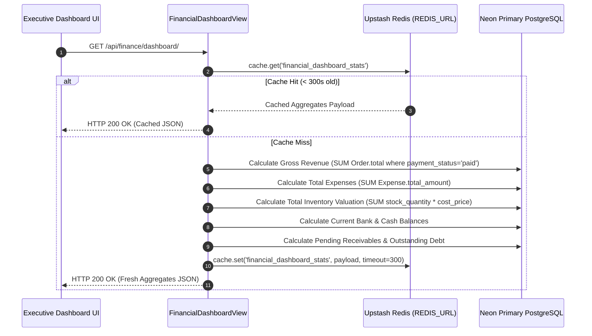

# EU-11: Financial Operations, Multi-DB & Cluster Maintenance

## 1. Architectural Role & Boundary Overview

`EU-11` encompasses the financial operations, analytical ledger reporting, operational maintenance, and multi-node cluster synchronization tier of Books3. It builds directly upon the double-entry accounting foundation (`LedgerService`) established in `EU-10`, providing:
1. **Financial Operations & Reporting ViewSets**: Endpoints for expense trips, salary disbursements, lender loan amortization schedules, other income tracking, category budgeting, and cached financial dashboard KPIs.
2. **Distributed Cluster Migration Engine**: A Redis-coordinated migration leader/follower protocol (`cluster_migrate.py`) enabling safe rolling deployments across multi-container Render environments while bypassing PgBouncer pooler locks.
3. **Transactional Data Sanitization**: Production data reset tooling (`wipe_test_data.py`) performing high-speed `TRUNCATE ... CASCADE` operations on transactional tables while maintaining configuration, RBAC, and master accounts.
4. **Legacy Script Quarantines**: Forensic analysis and quarantine of legacy maintenance scripts touching deprecated Books2 paths.

---

## 2. Source File Inventory & Structural Ownership

| Source File Path | Architectural Responsibilities |
| :--- | :--- |
| [`finance/serializers.py`](file:///z:/books3/finance/serializers.py) | Serializers for expense categories, trips, salaries, loans, repayments, budgets, audit logs, and dashboard summaries. |
| [`finance/views.py`](file:///z:/books3/finance/views.py) | Operational ViewSets (`ExpenseTripViewSet`, `SalaryPaymentViewSet`, `LoanViewSet`, etc.), streaming CSV exports, approval workflows, and audit logging. |
| [`core/management/__init__.py`](file:///z:/books3/core/management/__init__.py) | Package initialization. |
| [`core/management/commands/__init__.py`](file:///z:/books3/core/management/commands/__init__.py) | Command package. |
| [`core/management/commands/cluster_migrate.py`](file:///z:/books3/core/management/commands/cluster_migrate.py) | Distributed multi-node migration coordinator utilizing Upstash Redis locks and PgBouncer bypass. |
| [`core/management/commands/wipe_test_data.py`](file:///z:/books3/core/management/commands/wipe_test_data.py) | High-speed transactional data sanitizer executing `TRUNCATE CASCADE` across 38 operational tables. |
| [`scripts/fix_orphaned_payments.py`](file:///z:/books3/scripts/fix_orphaned_payments.py) | **[QUARANTINED]** Legacy repair script containing hardcoded `z:\books2` import paths. |
| [`scripts/extract_machhiwad_aggregated.py`](file:///z:/books3/scripts/extract_machhiwad_aggregated.py) | **[QUARANTINED]** Legacy one-off geographical order reporting script. |
| [`scripts/extract_machhiwad_links.py`](file:///z:/books3/scripts/extract_machhiwad_links.py) | **[QUARANTINED]** Legacy receipt URL extraction script. |
| [`scripts/extract_machhiwad_specific.py`](file:///z:/books3/scripts/extract_machhiwad_specific.py) | **[QUARANTINED]** Legacy customer order audit script. |

---

## 3. Operational Financial ViewSets & Amortization

`finance/views.py` delivers operational financial sub-modules extending beyond simple expense vouchers:

### Loan Amortization & Repayment Mechanics

When a `LoanRepayment` is registered via `LoanRepaymentViewSet.create()`:
1. **Mathematical Component Partitioning**: The repayment splits total outflow into principal reduction and interest expenditure:
   $$\text{total\_amount} = \text{principal\_component} + \text{interest\_component}$$
2. **Double-Entry Outflow**:
   - `principal_component` reduces the liability balance on `Loan.total_paid` and `Loan.principal_outstanding`.
   - `interest_component` generates an immutable `finance.Expense` under category `"Finance Charges / Loan Interest"`.
3. **Ledger Integration**: The combined `total_amount` is withdrawn from the specified `BankAccount` or `CashWallet` via `LedgerService.process_withdrawal`.

---

## 4. Multi-Node Cluster Migration Coordinator (`cluster_migrate`)

In zero-downtime rolling deployments on Render, multiple container instances boot concurrently. If multiple nodes run `python manage.py migrate` simultaneously, PostgreSQL encounters severe DDL locks and schema migration table race conditions. `core/management/commands/cluster_migrate.py` enforces a distributed leader-follower protocol:

```mermaid
sequenceDiagram
    autonumber
    participant NodeA as Container Node A (Leader)
    participant Redis as Upstash Redis (REDIS_URL)
    participant NodeB as Container Node B (Follower)
    participant Neon as Neon PostgreSQL Primary

    NodeA->>Redis: SET azbooks_cluster_migration_lock "locked" NX EX 180
    NodeB->>Redis: SET azbooks_cluster_migration_lock "locked" NX EX 180
    Redis-->>NodeA: OK (Lock Acquired -> Elected Leader)
    Redis-->>NodeB: None (Lock Failed -> Designated Follower)

    rect rgb(20, 30, 45)
        Note over NodeA,Neon: Migration Leader Execution
        NodeA->>NodeA: Strip "-pooler" from DATABASES['default']['HOST']
        NodeA->>Neon: Run DDL Migrations directly (bypass PgBouncer)
        NodeA->>Neon: Run createcachetable django_cache
        NodeA->>Neon: Ensure superuser "admin" exists with verified email
        NodeA->>Neon: Seed default data (seed_all)
        NodeA->>Redis: DEL azbooks_cluster_migration_lock
    end

    rect rgb(35, 25, 20)
        Note over NodeB,Redis: Follower Polling Loop
        loop Every 2 Seconds (Max 120 Seconds)
            NodeB->>Redis: GET azbooks_cluster_migration_lock
            Redis-->>NodeB: "locked" (Still Migrating)
        end
        NodeB->>Redis: GET azbooks_cluster_migration_lock
        Redis-->>NodeB: None (Leader Finished)
    end

    NodeA->>NodeA: Proceed with Gunicorn Boot
    NodeB->>NodeB: Proceed with Gunicorn Boot
```

### Invariants of the Migration Coordinator

1. **PgBouncer Bypass Invariant**: Neon PgBouncer transaction pooling aborts on `CREATE TABLE` and transactional schema locks. Line 24 explicitly strips `-pooler` from `DATABASES['default']['HOST']` and closes existing connections before executing migrations.
2. **Lock Timeout Protection**: Lock TTL is set to 180 seconds (`lock_timeout = 180`). If a container crashes during migration, the lock expires automatically, preventing permanent cluster deadlocks.
3. **Follower Polling Ceiling**: Follower containers wait a maximum of 120 seconds (60 iterations $\times$ 2s). If the leader does not finish within 2 minutes, followers terminate with exit code 1 to alert Render orchestrators.

---

## 5. Transactional Data Sanitization Protocol (`wipe_test_data`)

For staging synchronization, load testing cleanups, or store re-initialization, `core/management/commands/wipe_test_data.py` executes an atomic transactional wipe across 38 operational tables:

### Table Deletion Sequence

Tables are truncated simultaneously using PostgreSQL's `TRUNCATE ... CASCADE` syntax. This circumvents `SoftDeleteModel.delete()` soft-deletion overrides and bypasses individual foreign key trigger scans:
- **Orders Domain**: `orders_refund`, `orders_returnitem`, `orders_return`, `orders_creditnote`, `orders_ordernote`, `orders_orderstatushistory`, `orders_payment`, `orders_orderitem`, `orders_order`.
- **Finance Domain**: `finance_financeauditlog`, `finance_expensetripitem`, `finance_expensetrip`, `finance_loanrepayment`, `finance_loan`, `finance_lender`, `finance_salarypayment`, `finance_employeeexpense`, `finance_banktransaction`, `finance_cashwallettransaction`, `finance_otherincome`, `finance_expensepayment`, `finance_expense`.
- **Customers Domain**: `customers_customer`, `customers_address`, `customers_wallet`, `customers_legacydebt`.
- **Inventory Domain**: `inventory_stockhistory`, `inventory_stockadjustment`, `inventory_productimage`, `inventory_product_tags`, `inventory_product`, `inventory_category`, `inventory_vendor`, `inventory_tag`.

---

## 6. Financial Dashboard API & SWR Edge Caching

`FinancialDashboardView` in `finance/views.py` aggregates commercial health indicators across revenue, expenses, inventory value, and bank balances:

---

## 7. Quarantined Scripts Catalog

In accordance with Workspace Rule #7, legacy scripts identified in the `scripts/` directory that breach Sovereign Isolation or bypass framework gateways are classified as **[QUARANTINED]**:

| Script Path | Violation Type | Forensic Risk Analysis | Status |
| :--- | :--- | :--- | :--- |
| `scripts/fix_orphaned_payments.py` | **Sovereign Isolation Violation** | Line 5 executes `sys.path.append(r'z:\books2')`. Directly executes raw balance mutations on `CashWallet.balance` bypassing `LedgerService`. | **[QUARANTINED]** |
| `scripts/extract_machhiwad_aggregated.py` | Architectural Deprecation | Direct unindexed string containment queries (`region__name__icontains`) bypassing AZQL query compiler. | **[QUARANTINED]** |
| `scripts/extract_machhiwad_links.py` | Architectural Deprecation | One-off script printing customer receipts to console. Superceded by `messaging` living receipts. | **[QUARANTINED]** |
| `scripts/extract_machhiwad_specific.py` | Architectural Deprecation | Hardcoded order audit queries with unparameterized filters. | **[QUARANTINED]** |

---

## 8. Failure Modes & Recovery Matrix

| Failure Mode | Detection Mechanism | Immediate System Response | Recovery / Corrective Action |
| :--- | :--- | :--- | :--- |
| **Migration Deadlock on Multi-Container Boot** | Multiple nodes attempt DDL migrations simultaneously. | Redis distributed lock `azbooks_cluster_migration_lock` ensures only Leader runs migrations; followers wait. | Leader executes DDL cleanly; followers resume application boot upon lock release. |
| **PgBouncer Schema Lock During Migration** | `cluster_migrate` executing DDL against pooled port (`6543`). | Command intercepts `neon.tech` and `-pooler` in hostname, strips `-pooler`, and closes stale pool connections. | Direct connection established to Neon primary (`5432`); migrations complete without connection abort. |
| **Accidental Wiping of Store Master Data** | Operator runs `wipe_test_data`. | Command requires explicit confirmation `WIPE` or `--confirm` flag; tables strictly limited to operational data. | Master users, permissions, categories, bank account definitions, and store settings are preserved. |
| **Follower Timeout During Heavy Migrations** | Leader takes >120s to complete large database migration. | Follower container polling loop times out and exits with error code 1. | Increase follower timeout threshold or execute large index builds as pre-deployment administrative tasks. |
| **Streaming Export Memory Bloat** | Large CSV export of historical ledger transactions. | View uses `values_list()` iterator chunking with `DISABLE_SERVER_SIDE_CURSORS = True`. | Stream writes directly to `StreamingHttpResponse` in 1,000-row chunks; memory footprint remains $<30\text{ MB}$. |
