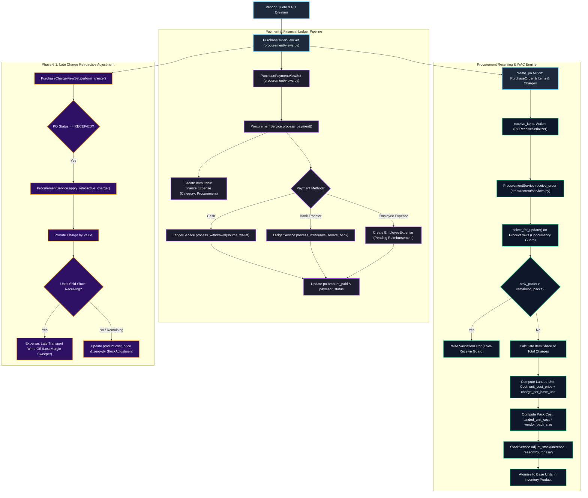
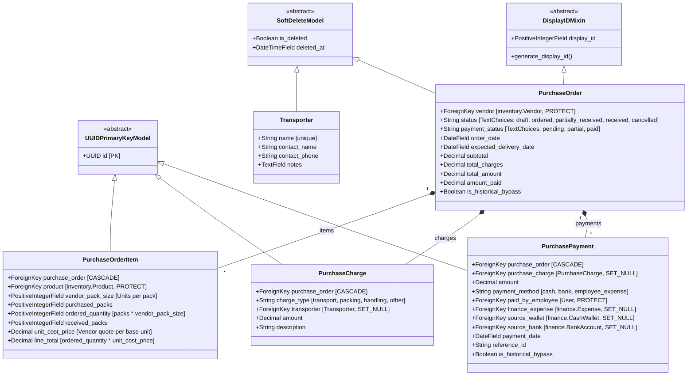
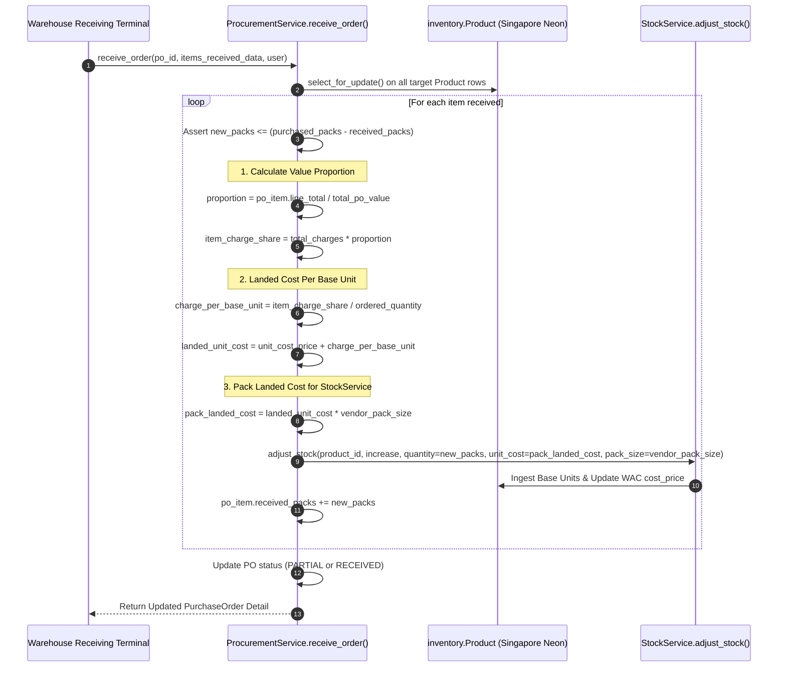
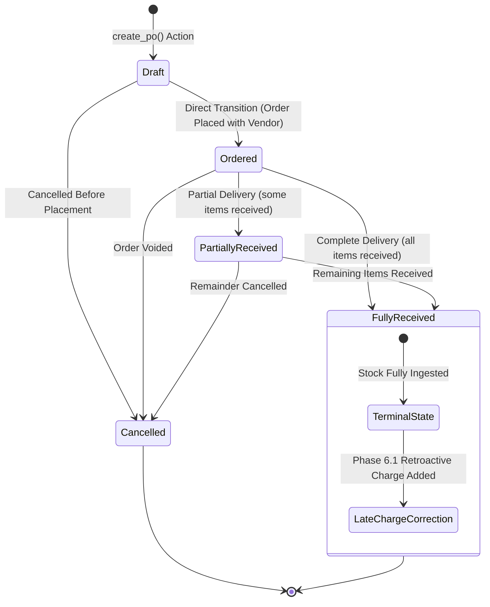
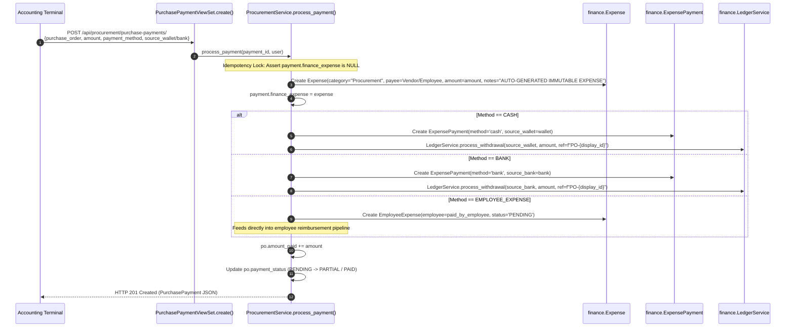
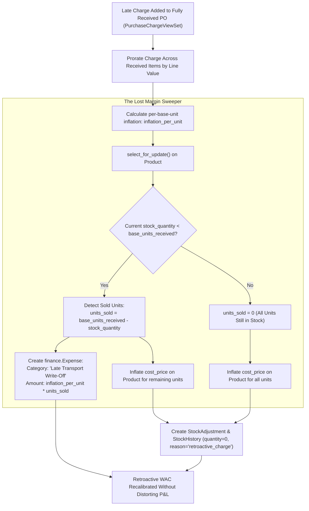

# EU-12: Procurement, Landed Cost & Freight Calculations

## 1. Architectural Role & Boundary Overview

`EU-12` governs the purchase order lifecycle, vendor freight charges, landed cost proration, weighted average cost (WAC) recalibration, and financial expenditure routing for Books3. It serves as the bridge between supply chain acquisition and financial inventory valuation, ensuring that vendor quote prices, packaging differentials, transport fees, and handling surcharges are mathematically aggregated and atomized down to the base inventory unit.



---

## 2. Source File Inventory & Structural Ownership

| Source File Path | Architectural Responsibilities |
| :--- | :--- |
| [`procurement/__init__.py`](file:///z:/books3/procurement/__init__.py) | Package initialization. |
| [`procurement/apps.py`](file:///z:/books3/procurement/apps.py) | Application configuration and metadata. |
| [`procurement/admin.py`](file:///z:/books3/procurement/admin.py) | Django Admin configuration for `Transporter`, `PurchaseOrder`, `PurchaseOrderItem`, `PurchaseCharge`, and `PurchasePayment`. |
| [`procurement/models.py`](file:///z:/books3/procurement/models.py) | Domain data models with UUID primary keys, soft deletion, display ID sequences, and vendor pack atomization definitions. |
| [`procurement/serializers.py`](file:///z:/books3/procurement/serializers.py) | Typed serializers for PO creation (`POCreateSerializer`), receipt (`POReceiveSerializer`), charges, payments, and nested detail schemas. |
| [`procurement/services.py`](file:///z:/books3/procurement/services.py) | Enterprise procurement engine (`ProcurementService`): atomic receiving, WAC injection, payment routing, retroactive charge correction, and receipt reversal. |
| [`procurement/views.py`](file:///z:/books3/procurement/views.py) | Secured ViewSets (`PurchaseOrderViewSet`, `PurchaseChargeViewSet`, `PurchasePaymentViewSet`, `TransporterViewSet`), strict state transition validators, and procurement analytics engine. |
| [`procurement/urls.py`](file:///z:/books3/procurement/urls.py) | DefaultRouter registration exposing standard RESTful endpoints and custom actions. |
| [`procurement/tests.py`](file:///z:/books3/procurement/tests.py) | Comprehensive 1,112-line IEEE 829 test suite validating WAC arithmetic, state machines, retroactive corrections, and thread concurrency. |

---

## 3. Data Model Hierarchy & Vendor Pack Specifications

Procurement models isolate goods acquisition from physical inventory, allowing vendors to supply goods in arbitrary packaging dimensions while the system automatically tracks base unit stock:



### Dimensional Mechanics: Pack vs. Base Unit

Vendors frequently bill in wholesale pack configurations (e.g. Box of 50 pens at \$400/box, or \$8.00/pen), whereas retail customers purchase individual pens.
- `PurchaseOrderItem.vendor_pack_size`: Number of base units in each purchased pack.
- `PurchaseOrderItem.ordered_quantity`: Computed automatically on save:
  $$\text{ordered\_quantity} = \text{purchased\_packs} \times \text{vendor\_pack\_size}$$
- `PurchaseOrderItem.line_total`: Computed as:
  $$\text{line\_total} = \text{ordered\_quantity} \times \text{unit\_cost\_price}$$

---

## 4. Landed Cost & Weighted Average Cost (WAC) Mathematics

When a purchase order is received via `ProcurementService.receive_order`, landed cost is allocated proportionally based on line item value:



### Mathematical Formulation

Given:
- Total PO Goods Value: $V = \sum_{i=1}^{n} \text{line\_total}_i$
- Total Freight / Packing Charges: $C = \sum_{j=1}^{m} \text{amount}_j$
- Line Item Base Unit Vendor Quote: $U_i$
- Line Item Base Units: $Q_i = \text{packs}_i \times \text{vendor\_pack\_size}_i$

1. **Value Proportion of Line Item $i$**:
   $$\lambda_i = \begin{cases} \frac{\text{line\_total}_i}{V} & \text{if } V > 0 \\ 0 & \text{if } V = 0 \end{cases}$$
2. **Freight Allocation for Line Item $i$**:
   $$\Delta C_i = C \times \lambda_i$$
3. **Landed Unit Cost (Per Base Unit)**:
   $$\text{LandedCost}_i = U_i + \frac{\Delta C_i}{Q_i}$$
4. **Weighted Average Cost (WAC) Update in Inventory**:
   When new base units $Q_{\text{new}}$ arrive at cost $L_{\text{new}}$ while existing warehouse inventory holds $Q_{\text{curr}}$ units at current WAC $C_{\text{curr}}$:
   $$C_{\text{new}} = \begin{cases} L_{\text{new}} & \text{if } Q_{\text{curr}} \le 0 \\ \frac{(Q_{\text{curr}} \times C_{\text{curr}}) + (Q_{\text{new}} \times L_{\text{new}})}{Q_{\text{curr}} + Q_{\text{new}}} & \text{if } Q_{\text{curr}} > 0 \end{cases}$$

> [!NOTE]
> If warehouse stock is negative ($Q_{\text{curr}} < 0$, caused by overselling or delayed receiving entries), the prior negative stock was already sold at unknown or distorted cost. The system executes a **negative-stock anchor reset**, setting the new cost price directly to $L_{\text{new}}$, preventing mathematical distortion.

---

## 5. PO Lifecycle State Machine & Over-Receive Guards

The lifecycle of a purchase order enforces strict forward progression and terminal immutability:



### Allowed Transitions Matrix (`VALID_STATUS_TRANSITIONS`)

```python
VALID_STATUS_TRANSITIONS = {
    PurchaseOrder.Status.DRAFT: [PurchaseOrder.Status.ORDERED, PurchaseOrder.Status.CANCELLED],
    PurchaseOrder.Status.ORDERED: [PurchaseOrder.Status.PARTIAL, PurchaseOrder.Status.RECEIVED, PurchaseOrder.Status.CANCELLED],
    PurchaseOrder.Status.PARTIAL: [PurchaseOrder.Status.RECEIVED, PurchaseOrder.Status.CANCELLED],
    PurchaseOrder.Status.RECEIVED: [],   # Terminal state — no manual status mutations permitted
    PurchaseOrder.Status.CANCELLED: [],  # Terminal state
}
```

### Over-Receive Invariant

To eliminate ghost inventory, receiving input is strictly bound to remaining unreceived quantities:
$$\text{remaining\_packs}_i = \text{purchased\_packs}_i - \text{received\_packs}_i$$
If $\text{new\_packs}_i > \text{remaining\_packs}_i$, `ProcurementService.receive_order` immediately raises a `ValidationError` and rolls back the atomic transaction.

---

## 6. Payment Routing, Ledger Integration & Expense Immutability

When a purchase payment is executed via `PurchasePaymentViewSet`, financial entries are created across the ledger:



---

## 7. Phase 6.1: Retroactive WAC Correction & Orphaned Margin Write-Off

In physical retail and manufacturing, transport and freight invoices typically arrive days or weeks after the physical goods have already been received and partially sold. `ProcurementService.apply_retroactive_charge` resolves this accounting dilemma:



### Mathematical Principle of Orphaned Margin

If 100 units were received, 40 have already been sold to customers, and a late \$200 transport fee arrives:
1. Freight inflation per unit: $\frac{\$200}{100} = \$2.00\text{ / unit}$.
2. For the 60 units remaining in warehouse stock, the inventory asset value increases by $\$2.00 \times 60 = \$120.00$, absorbed into future cost of goods sold (COGS).
3. For the 40 units already sold, that $\$2.00 \times 40 = \$80.00$ **can never hit inventory asset value** because the inventory no longer exists.
4. The system automatically creates an **Orphaned Margin Write-Off** expense for \$80.00 under category `Late Transport Write-Off`, preventing gross profit distortion while maintaining mathematical parity between physical assets and the general ledger.

---

## 8. Historical Bypass Architecture (Superuser Only)

During initial store migration or legacy data reconciliation, purchase orders often need to be recorded historically without generating artificial current-day stock increases or bank ledger deductions:

| Bypass Parameter | Target Service Pipeline | System Consequence | Access Control |
| :--- | :--- | :--- | :--- |
| `bypass_inventory_volume` | `StockService.adjust_stock` | Stock levels are NOT incremented; PO recorded for audit and billing records only. | `is_superuser = True` |
| `bypass_inventory_wac` | `StockService.adjust_stock` | Stock quantity is incremented, but product `cost_price` is untouched. | `is_superuser = True` |
| `bypass_finance_expense` | `ProcurementService.process_payment` | Payment total updated on PO, but no `finance.Expense` row is generated. | `is_superuser = True` |
| `bypass_finance_ledger` | `LedgerService.process_withdrawal` | No cash wallet or bank account balance deduction is performed. | `is_superuser = True` |

Any usage of these bypass flags marks `is_historical_bypass = True` on the `PurchaseOrder` or `PurchasePayment`, permanently tagging the records for financial audit transparency. Non-superusers attempting to invoke bypass flags are rejected with `PermissionDenied (403)`.

---

## 9. Failure Modes & Recovery Matrix

| Failure Mode | Detection Mechanism | Immediate System Response | Recovery / Corrective Action |
| :--- | :--- | :--- | :--- |
| **Warehouse Over-Receiving** | `new_packs > remaining_packs` during receipt. | `ValidationError` aborts transaction; zero stock ingested. | Correct delivery slip counts; ensure vendor pack size configuration matches physical delivery. |
| **WAC Race Condition During Concurrent Receipts** | Multiple simultaneous receipts on the same SKU. | `Product.objects.select_for_update()` locks product row before calculating WAC. | Serialized row execution; each receipt reads updated stock and cost price sequentially. |
| **Duplicate Payment Ledger Routing** | `process_payment` called on an already-processed payment. | Idempotency guard: `payment.finance_expense_id` detected; raises `ValidationError`. | Halts duplicate cash/bank withdrawal; returns 400 Bad Request to caller. |
| **Late Transport Surcharge After Stock Exhaustion** | Transport invoice added to PO when `stock_quantity == 0`. | `apply_retroactive_charge` identifies 100% of received units as sold. | 100% of the charge is written off to `finance.Expense` as `Late Transport Write-Off`; product cost is untouched. |
| **Invalid Status Transition (e.g. Received to Cancelled)** | Client submits PUT/PATCH with unauthorized status. | `VALID_STATUS_TRANSITIONS` guard returns HTTP 400 with list of valid states. | Terminal states preserved; prevents ledger desynchronization. |
| **Non-Terminating Fraction Decimal Drift** | Odd charge division (e.g. \$100 across 3 units = \$33.333333...). | Decimal precision quantized to 4 decimal places (`Decimal('0.0001')`) with `ROUND_HALF_UP`. | Exact fractional alignment; total line allocation sums within $\pm \$0.01$ penny tolerance. |
