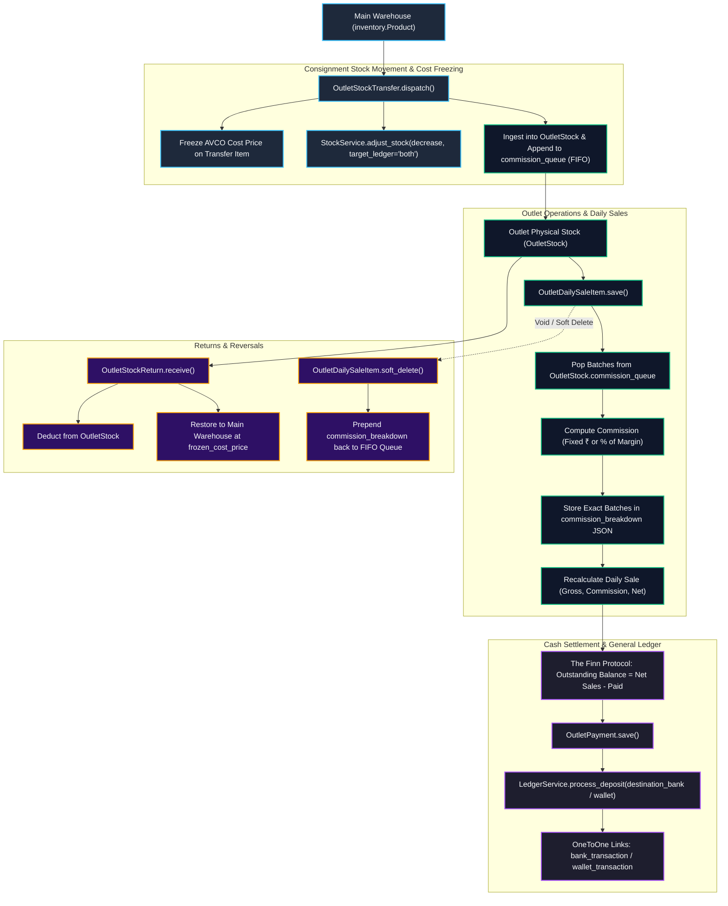
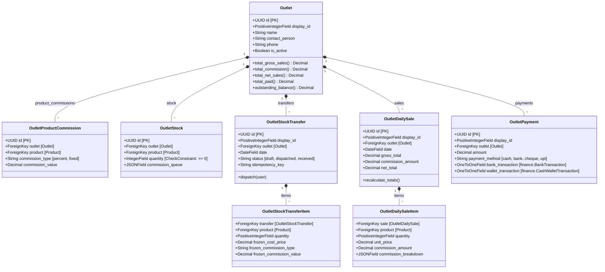
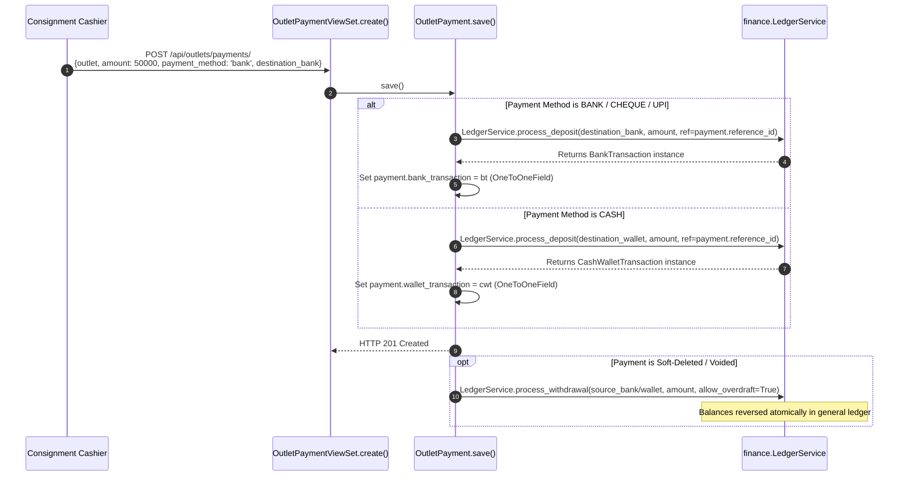

# EU-13: Outlet Consignment, Stock Transfers & Sales

## 1. Architectural Role & Boundary Overview

`EU-13` implements B2B consignment inventory management, partner retail outlet operations, and wholesale commission accounting for Books3. It enables the business to transfer inventory from the central warehouse to external consignment partners without recognizing premature revenue. Consignment stock remains an inventory asset on the company's books until retail sales are recorded, at which point revenue is recognized, partner commissions are deducted via a First-In, First-Out (FIFO) queue, and net receivables are synchronized with the general ledger.



---

## 2. Source File Inventory & Structural Ownership

| Source File Path | Architectural Responsibilities |
| :--- | :--- |
| [`outlets/__init__.py`](file:///z:/books3/outlets/__init__.py) | Package initialization. |
| [`outlets/apps.py`](file:///z:/books3/outlets/apps.py) | Application configuration and signal auto-registration. |
| [`outlets/admin.py`](file:///z:/books3/outlets/admin.py) | Django Admin definitions for `Outlet`, `OutletStock`, `OutletProductCommission`, transfers, sales, and payments. |
| [`outlets/models.py`](file:///z:/books3/outlets/models.py) | Consignment domain entities: `OutletStock` with FIFO commission queue, `OutletStockTransfer` with cost freezing, `OutletDailySale` with reversible item voids, and `OutletPayment` with `LedgerService` hard links. |
| [`outlets/serializers.py`](file:///z:/books3/outlets/serializers.py) | DRF serializers with nested item handling, commission rate threshold validations, and idempotency key handling. |
| [`outlets/signals.py`](file:///z:/books3/outlets/signals.py) | Cascade cleanup signals: Deletes orphaned `OutletPayment` records when linked `BankTransaction` or `CashWalletTransaction` records are purged. |
| [`outlets/views.py`](file:///z:/books3/outlets/views.py) | Secured ViewSets enforcing RBAC (`outlets.manage_outlet`, `outlets.manage_transfer`, `outlets.manage_return`) and custom actions (`dispatch_transfer`, `receive_return`, `bulk_upsert`). |
| [`outlets/urls.py`](file:///z:/books3/outlets/urls.py) | DefaultRouter endpoint mappings for the consignment subsystem. |
| [`outlets/tests.py`](file:///z:/books3/outlets/tests.py) | Test suite covering stock dispatch, FIFO commission popping, void rollbacks, and payment reconciliation. |

---

## 3. Data Model Hierarchy & Relationship Matrix



---

## 4. Consignment FIFO Commission Queue & Sale Lifecycle

Because partner commission agreements change over time (e.g. 15% promotion in May, 10% standard in June), stock arriving in different dispatches carries distinct commission rates. To prevent retroactive margin skew, `OutletStock` implements a **FIFO Commission Queue**:

```mermaid
sequenceDiagram
    autonumber
    participant Terminal as Partner Outlet Terminal
    participant View as OutletDailySaleViewSet.create()
    participant SaleItem as OutletDailySaleItem.save()
    participant Stock as OutletStock (Singapore Neon)
    participant Sale as OutletDailySale.recalculate_totals()

    Terminal->>View: POST /api/outlets/daily-sales/<br/>{outlet, date, items: [{product, quantity, unit_price}]}
    View->>SaleItem: Save Line Item
    
    rect rgb(20, 30, 45)
        Note over SaleItem,Stock: Atomic Transaction & Row Lock
        SaleItem->>Stock: select_for_update().get(outlet, product)
        SaleItem->>SaleItem: Assert stock.quantity >= sale.quantity
        
        Note over SaleItem: Pop Batches from commission_queue (FIFO)
        loop Until remaining_quantity == 0
            SaleItem->>Stock: Read batch = commission_queue[0]
            SaleItem->>SaleItem: q_taken = min(batch.qty, remaining_q)
            SaleItem->>SaleItem: Deduct q_taken from batch
            SaleItem->>SaleItem: Calculate Commission: fixed OR (% * (unit_price - cost_price))
            SaleItem->>SaleItem: Append popped batch to popped_batches list
        end
        
        SaleItem->>SaleItem: Save commission_breakdown = popped_batches
        SaleItem->>Stock: stock.quantity -= sale.quantity
        SaleItem->>Stock: Update commission_queue
        Stock-->>SaleItem: Saved
    end

    SaleItem->>Sale: recalculate_totals()
    Sale->>Sale: gross_total = SUM(line_total)<br/>commission_amount = SUM(item.commission)<br/>net_total = gross - commission
    Sale-->>View: Saved
    View-->>Terminal: HTTP 201 Created (Sale Record JSON)
```



### Commission Resolution Hierarchy

1. **Specific Outlet Override**: Checked first in `OutletProductCommission` for `(outlet, product)`.
2. **Global Product Defaults**: Falls back to `Product.default_commission_type` and `Product.default_commission_value`.
3. **Calculation Modes**:
   - **Fixed Amount**: Commission is charged as a flat rupee fee per unit sold:
     $$\text{Commission} = \text{quantity} \times \text{commission\_value}$$
   - **Percentage of Gross Margin**: Commission is charged on the profit spread:
     $$\text{margin\_per\_unit} = \max(0, \text{unit\_price} - \text{product.cost\_price})$$
     $$\text{Commission} = (\text{quantity} \times \text{margin\_per\_unit}) \times \frac{\text{commission\_value}}{100}$$

---

## 5. Reversible Void Protocol & AVCO Cost Protection

### Reversible Void Execution (`OutletDailySaleItem.soft_delete`)

If an outlet sale was entered erroneously, voiding the sale must not permanently destroy the commission queue order. The void protocol executes an exact rollback:
1. Row-locks `OutletStock`.
2. Increments `outlet_stock.quantity += self.quantity`.
3. **Queue Restoration**: Prepends the exact batches recorded in `self.commission_breakdown` back to the **head** of `outlet_stock.commission_queue`.
   ```python
   queue = self.commission_breakdown + queue
   ```
4. Recalculates parent sale totals to zero out receivables.

### AVCO Protection on Warehouse Returns (`OutletStockReturn.receive`)

When unsold goods are returned from an outlet to the main warehouse:
- Merely incrementing warehouse stock at current market price would distort Weighted Average Cost (AVCO).
- `OutletStockReturn.receive()` queries the last dispatched `OutletStockTransferItem` to obtain the `frozen_cost_price`.
- It injects this exact historical unit cost into `StockService.adjust_stock(adjustment_type='increase', unit_cost=frozen_cost_price, target_ledger='both')`.

---

## 6. Financial Settlement: The Finn Protocol

Receivables from consignment partners are tracked using the deterministic equation known as **The Finn Protocol**:

$$\text{Outstanding Balance} = \sum \text{Net Total Sales} - \sum \text{Outlet Payments}$$

Where:
- $\text{Gross Sales} = \sum (\text{quantity} \times \text{unit\_price})$
- $\text{Net Total} = \text{Gross Sales} - \text{Total Commission}$

### Payment Processing & Hard Links

When an outlet remits payment via `OutletPaymentViewSet`:


---

## 7. Failure Modes & Recovery Matrix

| Failure Mode | Detection Mechanism | Immediate System Response | Recovery / Corrective Action |
| :--- | :--- | :--- | :--- |
| **Overselling Consignment Stock** | `sale.quantity > outlet_stock.quantity`. | `ValueError` raised during line item save; transaction aborted. | Dispatch replenishment transfer to outlet before recording retail sale. |
| **Negative Stock Constraint Breach** | Database `CheckConstraint: quantity >= 0` triggered. | PostgreSQL throws `IntegrityError`. | Enforces physical impossibility of negative consignment inventory at database level. |
| **Commission Exceeding Retail Selling Price** | `validate()` in `OutletProductCommissionSerializer`. | Returns HTTP 400 with field validation error. | Invariant: Commission value cannot exceed retail selling price. |
| **Modifying Dispatched Transfer Items** | User attempts PUT/PATCH on item of `dispatched` transfer. | Model `save()` check raises `ValueError`. | Dispatched transfers are immutable; operational corrections must use `OutletStockReturn`. |
| **Orphaned Payments on Ledger Purge** | Linked `BankTransaction` deleted in finance app. | Signal `cleanup_orphaned_outlet_payment_bank` automatically purges `OutletPayment`. | Eliminates phantom receivables; ledger parity maintained. |
| **Network Retry Duplicating Transfer** | Client submits transfer twice with same `idempotency_key`. | Unique constraint catch in `create()` returns existing transfer record. | Safe idempotent retry; zero duplicate warehouse stock deductions. |
