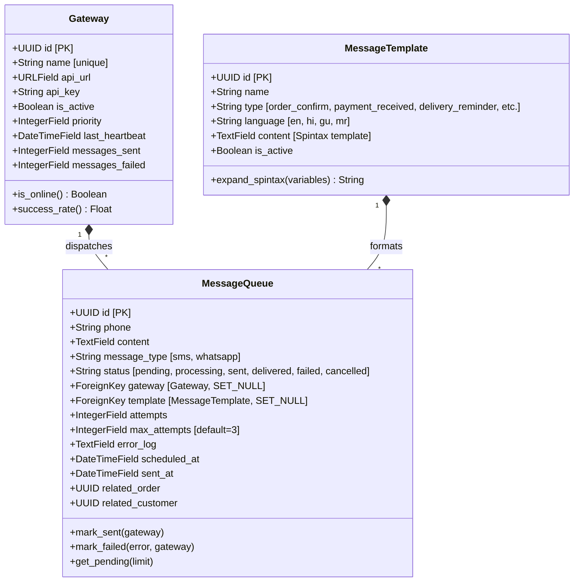
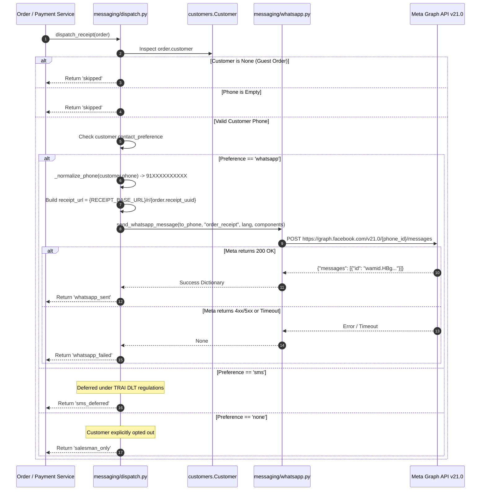

# EU-14: Messaging Engine, WhatsApp API & Dispatch Gateway

## 1. Architectural Role & Boundary Overview

`EU-14` governs customer notification delivery, transactional WhatsApp Cloud API integrations, living digital receipt dispatches, Spintax template expansion, and hardware SMS gateway orchestration for Books3. It implements the tribunal's cascading delivery hierarchy: prioritizing WhatsApp Cloud API for rich, compliant transactional notifications; deferring raw SMS pending TRAI TCCCPR 2018 DLT registration; and preserving salesman screen visibility when messaging is opted out.

```mermaid
flowchart TD
    Trigger["Commercial Event: Order Created / Payment Recorded"] --> Dispatcher["dispatch_receipt() / dispatch_payment_update() (messaging/dispatch.py)"]
    
    subgraph "Customer Preference & Privacy Barrier"
        Dispatcher --> GuestCheck{"Guest Order or Missing Phone?"}
        GuestCheck -->|Yes| SkipDispatch["Return 'skipped' (Zero PII Outflow)"]
        GuestCheck -->|No| PrivacyCheck{"Privacy Guard: show_balance_in_messages?"}
        
        PrivacyCheck -->|False (Payment Update)| PrivacySkip["Return 'privacy_skip' (Mask Sensitive Balances)"]
        PrivacyCheck -->|True| ChannelSelect{"customer.contact_preference"}
    end

    subgraph "Cascading Delivery Engine"
        ChannelSelect -->|whatsapp| Normalize["_normalize_phone() -> 91XXXXXXXXXX"]
        ChannelSelect -->|sms| DLTDeferred["Log 'sms_deferred' (TRAI DLT Invariant)"]
        ChannelSelect -->|none| SalesmanOnly["Return 'salesman_only' (POS Screen Only)"]
        
        Normalize --> TemplateFormat["Format Meta Graph Template (order_receipt / payment_update)"]
        TemplateFormat --> LivingReceipt["Embed Living Receipt URL: {RECEIPT_BASE_URL}/r/{receipt_uuid}"]
        LivingReceipt --> CloudAPI["send_whatsapp_message() (messaging/whatsapp.py)"]
        CloudAPI --> MetaGraph["Meta Graph API v21.0 (https://graph.facebook.com/v21.0)"]
    end

    subgraph "Hardware Gateway & Spintax Queue Subsystem"
        AdminQueue["MessageQueueViewSet (messaging/views.py)"] --> QueueModel["MessageQueue (messaging/models.py)"]
        QueueModel --> Spintax["MessageTemplate.expand_spintax() ({Hi|Hello} {name})"]
        Spintax --> AndroidGateway["Gateway Device (Heartbeat & Priority Routing)"]
    end

    classDef trigger fill:#1e293b,stroke:#38bdf8,stroke-width:2px,color:#f8fafc;
    classDef barrier fill:#0f172a,stroke:#f43f5e,stroke-width:2px,color:#f8fafc;
    classDef delivery fill:#1e1e2e,stroke:#10b981,stroke-width:2px,color:#f8fafc;
    classDef queue fill:#2e1065,stroke:#f59e0b,stroke-width:2px,color:#f8fafc;

    class Trigger,Dispatcher trigger;
    class GuestCheck,SkipDispatch,PrivacyCheck,PrivacySkip,ChannelSelect barrier;
    class Normalize,DLTDeferred,SalesmanOnly,TemplateFormat,LivingReceipt,CloudAPI,MetaGraph delivery;
    class AdminQueue,QueueModel,Spintax,AndroidGateway queue;
```

---

## 2. Source File Inventory & Structural Ownership

| Source File Path | Architectural Responsibilities |
| :--- | :--- |
| [`messaging/__init__.py`](file:///z:/books3/messaging/__init__.py) | Package initialization. |
| [`messaging/apps.py`](file:///z:/books3/messaging/apps.py) | Application configuration and metadata. |
| [`messaging/admin.py`](file:///z:/books3/messaging/admin.py) | Django Admin registration for `Gateway`, `MessageTemplate`, and `MessageQueue`. |
| [`messaging/models.py`](file:///z:/books3/messaging/models.py) | Messaging data models: `Gateway` with heartbeat detection, `MessageTemplate` with Spintax expansion, and `MessageQueue` with exponential retry logging. |
| [`messaging/serializers.py`](file:///z:/books3/messaging/serializers.py) | DRF serializers for gateway status, template previews, queue management, and real-time queue metrics. |
| [`messaging/dispatch.py`](file:///z:/books3/messaging/dispatch.py) | Business dispatch router (`dispatch_receipt`, `dispatch_payment_update`) implementing the cascading delivery hierarchy. |
| [`messaging/whatsapp.py`](file:///z:/books3/messaging/whatsapp.py) | Direct HTTP client for Meta's WhatsApp Cloud API (`v21.0`), supporting pre-approved template messages and 24-hour service window text messages. |
| [`messaging/views.py`](file:///z:/books3/messaging/views.py) | Secured ViewSets (`GatewayViewSet`, `MessageTemplateViewSet`, `MessageQueueViewSet`) with queue statistics, manual retries, and test dispatches. |
| [`messaging/urls.py`](file:///z:/books3/messaging/urls.py) | DefaultRouter endpoint configuration. |
| [`messaging/tests.py`](file:///z:/books3/messaging/tests.py) | Test suite verifying phone normalization, Spintax expansion, customer preference routing, and privacy guards. |

---

## 3. Data Model Hierarchy & Queue Architecture



### Spintax Template Engine (`expand_spintax`)

To prevent carrier anti-spam fingerprinting during outbound broadcasts, `MessageTemplate` supports nested Spintax syntax `{option1|option2|option3}` combined with variable interpolation `{{variable_name}}`:
1. **Regex Substitution**: Recursively evaluates inner bracketed groups `\{([^{}]+)\}`, selecting an option at pseudo-random.
2. **Variable Injection**: Matches `{{key}}` and injects dynamic order data (e.g. `{{display_id}}`, `{{total}}`).

---

## 4. The Cascading Delivery Hierarchy & Dispatch Pipeline

`messaging/dispatch.py` acts as the single point of entry for commercial event notifications, evaluating customer preferences:



### Phone Normalization Specifications

To prevent Meta API rejection, `_normalize_phone` enforces E.164-compatible formatting for Indian telephone networks:
- Strips leading `+` signs, whitespace, and hyphens.
- If a 10-digit number is supplied (`9876543210`), prepends the Indian country code: `919876543210`.
- If a 12-digit number already begins with `91`, it is preserved.

---

## 5. WhatsApp Cloud API Client & Transactional Safety

`messaging/whatsapp.py` communicates directly with Meta Graph API endpoints:

```python
WHATSAPP_API_URL = "https://graph.facebook.com/v21.0/{phone_id}/messages"
```

### Transactional Atomicity Invariant (Rule #3)

> [!CAUTION]
> External HTTP network requests (`requests.post`) must **NEVER** be invoked directly inside an open Django `@transaction.atomic` block. 
> If Meta experiences a 500 error or a 10-second timeout, the database connection and row locks (`select_for_update`) remain held open, causing catastrophic connection pool exhaustion and locking the POS checkout terminals.

All calls to `dispatch_receipt` and `dispatch_payment_update` must be executed via `transaction.on_commit()`:
```python
transaction.on_commit(lambda: dispatch_receipt(order))
```

### 24-Hour Customer Care Window (`send_whatsapp_text`)

Meta enforces a strict two-tier messaging policy:
1. **Business-Initiated (Out of Window)**: Must use pre-approved templates (`order_receipt`, `payment_update`, `overdue_reminder`).
2. **User-Initiated (Within 24 Hours)**: When a customer replies to a message, the business may send free-form plain text messages via `send_whatsapp_text()` for 24 hours without incurring template charges.

---

## 6. Living Receipt Capability-Token Architecture

Instead of generating and attaching bulky PDF files over WhatsApp, the system emits a lightweight, dynamic **Living Receipt Link**:
```
https://books3.circleaz.in/r/3f9c2d11-8e4a-4c22-b8d9-21a4f5b7e901
```

### Security & Functional Properties

1. **Capability Token Isolation**: The `receipt_uuid` acts as an unguessable capability token. The customer can inspect their invoice without logging into an account, yet attackers cannot enumerate invoices by guessing integer IDs.
2. **Real-Time State Synchronization**: Unlike static PDF files that freeze balance due at the moment of dispatch, the living receipt queries the live database (or Cloudflare Edge cache). When the customer makes a partial payment, refreshing the receipt link instantly displays the updated outstanding balance.
3. **Cloudflare R2 Snapshot Baking**: As documented in `EU-08`, upon terminal delivery, an immutable HTML snapshot is asynchronously compiled and baked to Cloudflare R2 bucket `books3-receipts` as an archival record.

---

## 7. Failure Modes & Recovery Matrix

| Failure Mode | Detection Mechanism | Immediate System Response | Recovery / Corrective Action |
| :--- | :--- | :--- | :--- |
| **Meta Graph API Timeout / Outage** | `requests.exceptions.Timeout` in `whatsapp.py` (10s timeout). | Exception caught; logs error; returns `None` and `whatsapp_failed`. | Transaction completes safely; order is created; salesman screen displays receipt link directly. |
| **Network Lock Exhaustion from Direct HTTP Calls** | Thread monitoring alerts database connection spikes. | Violation of Rule #3. | Ensure all dispatch triggers are wrapped in `transaction.on_commit()` hooks. |
| **Customer Balance Leakage via Messaging** | Customer opted out of balance display (`show_balance_in_messages=False`). | `dispatch_payment_update` returns `privacy_skip`. | Sensitive balance numbers are omitted; customer receives transaction confirmation without account balance. |
| **Missing WhatsApp Credentials on Startup** | `WHATSAPP_PHONE_NUMBER_ID` or `WHATSAPP_ACCESS_TOKEN` is unset. | `whatsapp.py` emits warning log and exits cleanly without throwing fatal runtime errors. | Configure verified Meta credentials in Render environment variables. |
| **Invalid Customer Phone Format** | Phone contains letters or invalid character counts. | `_normalize_phone` fails; Meta returns 400 Bad Request. | Caught gracefully in HTTP error handler; logged in `error_log`; POS terminal alerts cashier to update customer phone. |
| **Hardware Gateway Disconnection** | Gateway device fails to report heartbeat in >300s. | `Gateway.is_online` property evaluates to `False`. | Admin dashboard flags gateway as offline; router skips to next priority active gateway. |
