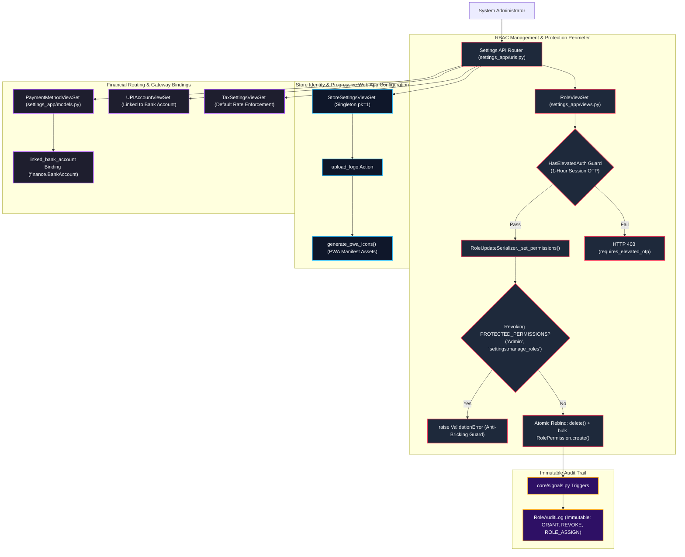
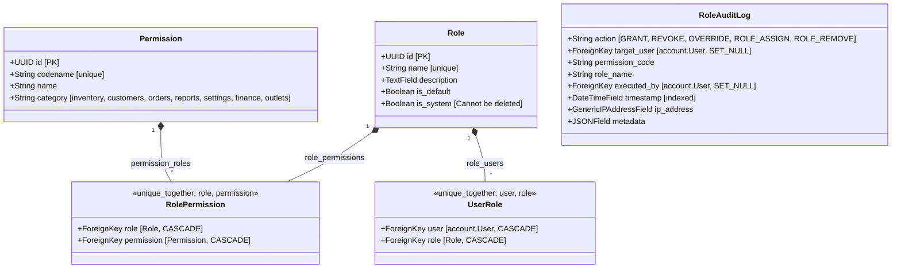
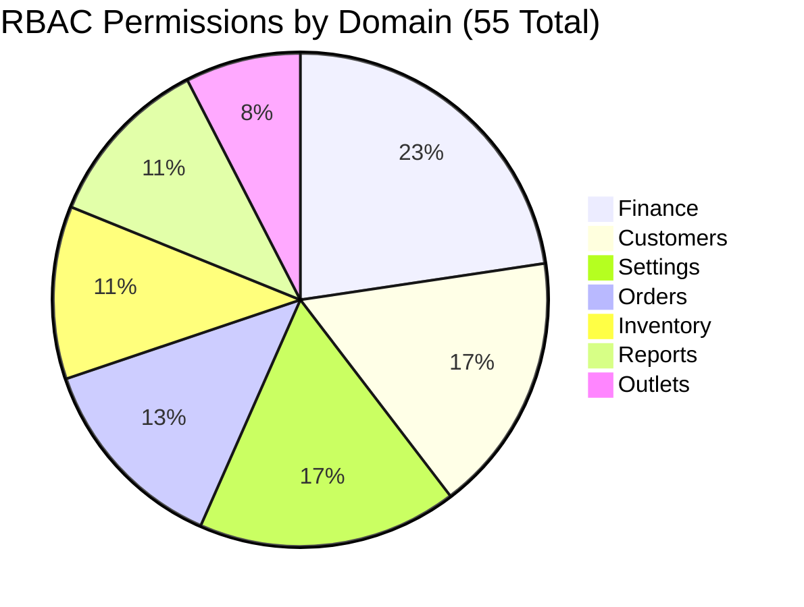
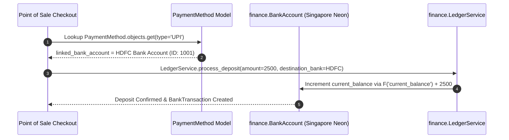

# EU-15: Settings, RBAC & Store Configurations

## 1. Architectural Role & Boundary Overview

`EU-15` provides system-wide administration, tenant configuration, cryptographic role-based access control (RBAC), and hardware/payment integrations for Books3. It serves as the master authority for `core.permissions` (documented in `EU-02`), housing the role-permission definitions, default seeding routines (`seed_rbac.py`, `seed_all.py`), singleton store identity configuration, taxation rules, payment method ledger routing, and immutable security audit logging (`RoleAuditLog`).



---

## 2. Source File Inventory & Structural Ownership

| Source File Path | Architectural Responsibilities |
| :--- | :--- |
| [`settings_app/__init__.py`](file:///z:/books3/settings_app/__init__.py) | Package initialization. |
| [`settings_app/apps.py`](file:///z:/books3/settings_app/apps.py) | Application configuration and metadata. |
| [`settings_app/admin.py`](file:///z:/books3/settings_app/admin.py) | Django Admin definitions for `Role`, `Permission`, `RolePermission`, `UserRole`, `StoreSettings`, `TaxSettings`, `PaymentMethod`, `UPIAccount`, and `RoleAuditLog`. |
| [`settings_app/models.py`](file:///z:/books3/settings_app/models.py) | Enterprise configuration entities: RBAC matrix (`Role`, `Permission`, `RolePermission`, `UserRole`), singleton store models, academic grouping taxonomies, and immutable audit logs. |
| [`settings_app/serializers.py`](file:///z:/books3/settings_app/serializers.py) | DRF serializers with `PROTECTED_PERMISSIONS` revocation checks, atomic permission re-binding, and nullable foreign key sanitization. |
| [`settings_app/views.py`](file:///z:/books3/settings_app/views.py) | Secured ViewSets enforcing elevated session authentication (`HasElevatedAuth`), logo upload with PWA icon rendering, and permission grouping. |
| [`settings_app/urls.py`](file:///z:/books3/settings_app/urls.py) | DefaultRouter registration exposing all administrative and configuration endpoints. |
| [`settings_app/tests.py`](file:///z:/books3/settings_app/tests.py) | Automated test suite validating protected permission guardrails, role assignment integrity, and store singleton behaviors. |
| [`settings_app/management/commands/seed_rbac.py`](file:///z:/books3/settings_app/management/commands/seed_rbac.py) | Deterministic RBAC seeder materializing 55 system permissions and 4 default system roles. |
| [`settings_app/management/commands/seed_all.py`](file:///z:/books3/settings_app/management/commands/seed_all.py) | Master boot orchestrator running RBAC seeding, store defaults, payment methods, and initial category creation. |

---

## 3. RBAC Domain Model & Anti-Bricking Architecture



### Protected Permissions Anti-Bricking Guard

In `settings_app/serializers.py` (`RoleUpdateSerializer._set_permissions`), the system enforces an unassailable integrity check:
```python
# Identify which permissions would be REMOVED
removed_codenames = current_codenames - new_codenames

# Block removal of protected permissions
for perm_code in removed_codenames:
    if (role.name, perm_code) in protected:
        raise serializers.ValidationError(
            f"Cannot revoke protected permission '{perm_code}' from role '{role.name}'. "
            f"This permission is required for system integrity."
        )
```
Where `protected` is defined as:
```python
PROTECTED_PERMISSIONS = frozenset([
    ('Admin', 'settings.manage_roles'),
    ('Admin', 'settings.manage_users'),
])
```
This guarantees that an administrator cannot accidentally revoke their own ability to manage roles or users, eliminating the risk of catastrophic administrative self-lockout.

---

## 4. Canonical RBAC Matrix (`seed_rbac.py`)

The system initializes with 55 granular permissions categorized into 7 operational domains:



### Default System Role Archetypes

| Role Name | System Role? | Default Role? | Granted Permission Profile |
| :--- | :---: | :---: | :--- |
| **Admin** | **Yes** | No | **ALL (55 permissions)**: Unrestricted access across all domains, database settings, and user provisioning. |
| **Manager** | **Yes** | No | **Full operational access**: Inventory, Customer geodata, Order processing, Outlet consignment, and Report viewing. Excludes User administration and Store settings. |
| **Cashier** | **Yes** | **Yes** | **POS execution access**: Order creation, payment entry, receipt dispatch, and customer lookup. Excludes wholesale margins, inventory stock adjustments, and financial ledgers. |
| **Accountant** | **Yes** | No | **Financial controller access**: Ledgers, banking, loan amortization, expense audits, and financial reporting. Excludes catalog modifications. |

---

## 5. Store Identity, Progressive Web App & Singleton Patterns

### Store Settings Singleton (`StoreSettings`)

`StoreSettings` enforces the singleton pattern by overriding the model primary key:
```python
def save(self, *args, **kwargs):
    self.pk = 1
    super().save(*args, **kwargs)
```
- **Tenant Brand Identity**: Stores business name (`AZ Books`), physical address, contact telephone, email, and GSTIN registration numbers.
- **Dynamic PWA Icon Generation**: In `StoreSettingsViewSet.upload_logo`, uploading a new SVG/PNG store logo automatically invokes `generate_pwa_icons()`, generating `pwa-icon-192.png`, `pwa-icon-512.png`, and `apple-touch-icon.png` in the media storage directory without blocking the HTTP response.
- **Maintenance Mode Sentinel**: When `maintenance_mode = True`, non-superuser client requests are rejected with HTTP 503 Service Unavailable, enabling zero-traffic database maintenance windows.

---

## 6. Financial Ledger Routing & Payment Integration

`settings_app` acts as the configuration nexus routing customer receipts and online deposits into specific general ledger accounts:



### Configuration Entities

- **`PaymentMethod`**: Manages allowed checkout methods (`Cash`, `Bank Transfer`, `UPI`, `Cheque`, `Customer Credit`). Contains a protected foreign key `linked_bank_account` ensuring all digital proceeds deposit directly into the appropriate bank account.
- **`UPIAccount`**: Configures virtual payment addresses (VPA), QR code image attachments, and linked bank accounts for dynamic checkout QR generation.
- **`TaxSettings`**: Configures tax rules (e.g. `GST 0%`, `GST 5%`, `GST 18%`). Enforces a single `is_default` rate using an automatic exclusion update during save:
  ```python
  if self.is_default:
      TaxSettings.objects.filter(is_default=True).exclude(pk=self.pk).update(is_default=False)
  ```

---

## 7. Elevated Authentication Barriers on Settings

To safeguard the security perimeter, `settings_app/views.py` enforces `HasElevatedAuth` on all high-risk mutations:

| ViewSet | Protected Actions | Security Requirement |
| :--- | :--- | :--- |
| `UserViewSet` | `destroy` | Active elevated session OTP (`elevated_auth_{user.id}`) within the last 1 hour. |
| `RoleViewSet` | `create`, `update`, `partial_update`, `destroy` | Active elevated session OTP (`elevated_auth_{user.id}`) within the last 1 hour. |
| `StoreSettingsViewSet` | `create`, `upload_logo` | Restricted to users holding `settings.manage_store`. |

---

## 8. Failure Modes & Recovery Matrix

| Failure Mode | Detection Mechanism | Immediate System Response | Recovery / Corrective Action |
| :--- | :--- | :--- | :--- |
| **Revocation of System Admin Privileges** | `RoleUpdateSerializer._set_permissions` detects removal of `settings.manage_roles`. | Raises `ValidationError`; rejects transaction. | Anti-bricking guard prevents administrative lockout; role definition remains intact. |
| **System Role Deletion Attempt** | User attempts DELETE on `Role` where `is_system=True`. | Model check or ViewSet rejects deletion with HTTP 400 Bad Request. | System roles (`Admin`, `Manager`, `Cashier`) cannot be purged; custom roles can be deleted. |
| **Non-Elevated Role Modification** | Administrator submits role update without prior elevated OTP verification. | `HasElevatedAuth` returns HTTP 403 `requires_elevated_otp`. | Frontend opens OTP verification dialog; user verifies code via email; request is retried. |
| **Unlinked Payment Method Deposit** | POS attempts to process UPI payment with `linked_bank_account=None`. | Serializer validation alerts cashier; ledger rejects orphan deposit. | Configure default bank account in `PaymentMethodViewSet`. |
| **Corrupted PWA Logo Format** | Upload of non-image MIME type via `upload_logo`. | `upload_logo` validates `content_type` against whitelist; returns HTTP 400. | Rejects file; preserves existing store logo and PWA manifest icons. |
| **Concurrent Default Tax Setting Mutex** | Multiple requests simultaneously set `is_default=True` on tax rates. | `save()` execution isolates update via atomic exclusion query. | Exactly one tax rate holds `is_default=True`; no multi-default anomalies. |
