# Architectural Specification: EU-16 Dashboard KPIs & Reports Routing Engine

> **Status**: APPROVED  
> **Domain**: Analytics & Reporting  
> **Execution Unit**: `EU-16`  
> **Scope**: 10 Production Source Files (`dashboard/__init__.py`, `dashboard/apps.py`, `dashboard/admin.py`, `dashboard/models.py`, `dashboard/serializers.py`, `dashboard/views.py`, `dashboard/urls.py`, `reports/__init__.py`, `reports/apps.py`, `reports/urls.py`)

---

## 1. Executive Summary & Domain Scope

`EU-16` establishes the real-time analytical aggregation boundary and primary reporting URL routing backbone of AZ Books. The `dashboard` app functions as a stateless, synthetic intelligence layer. It maintains zero persistent database tables (`dashboard/models.py` is empty), instead operating purely as an optimized aggregation engine over `orders.Order`, `orders.OrderItem`, `inventory.Product`, and `customers.Customer`.

The architecture enforces strict business timezone boundaries (`Asia/Kolkata`) for daily sales truncations, high-performance database aggregations excluding unconfirmed or voided transactions via `VALID_SALE_STATUSES`, and proactive inventory/order alerts. Concurrently, `EU-16` governs the master URL dispatch hierarchy for `reports/`, mounting seven distinct analytical viewset controllers across sales, inventory, customers, finance, audit logs, and AZQL query management.

---

## 2. Component Directory & Member File Manifest

| File Path | Role in Architecture | Key Responsibilities & Invariants |
| :--- | :--- | :--- |
| `dashboard/__init__.py` | Package Initializer | Exposes dashboard module namespace. |
| `dashboard/apps.py` | App Configuration | Registers `DashboardConfig` with Django application registry. |
| `dashboard/admin.py` | Admin Registration | Administrative hooks (stateless; zero registered models). |
| `dashboard/models.py` | Analytical Models | Intentionally stateless ($0$ tables); aggregates live domain models. |
| `dashboard/serializers.py` | Data Transfer Schemas | Defines non-model serializers for KPI payloads, trends, and alerts. |
| `dashboard/views.py` | Aggregation API Endpoints | Executes timezone-bounded queries, alerts, and trend rollups. |
| `dashboard/urls.py` | Dashboard Route Table | Exposes endpoints for stats, top products, trends, orders, and alerts. |
| `reports/__init__.py` | Package Initializer | Exposes reports module namespace. |
| `reports/apps.py` | App Configuration | Registers `ReportsConfig` with Django application registry. |
| `reports/urls.py` | Master Reports Router | Mounts `DefaultRouter` with 7 domain analytical endpoints. |

---

## 3. High-Level Architecture & Analytical Data Flow

```mermaid
flowchart TD
    subgraph ClientLayer ["Client Layer"]
        PWA["React Dashboard UI / PWA Shell"]
    end

    subgraph DashboardEngine ["Dashboard Aggregation Engine (dashboard/views.py)"]
        TZ["_business_today() (Asia/Kolkata)"]
        StatsView["DashboardStatsView (reports.view_sales, orders.view_orders)"]
        TrendView["SalesTrendView (TruncDate 'created_at')"]
        TopProdView["TopProductsView (Sum 'quantity', Sum 'line_total')"]
        AlertsView["AlertsView (Low Stock <= F('low_stock_threshold'))"]
        RecentOrders["RecentOrdersView (select_related 'customer')"]
    end

    subgraph DataDomain ["Live Core Models"]
        OrdersDB[("orders.Order (is_deleted=False)")]
        ItemsDB[("orders.OrderItem")]
        ProductsDB[("inventory.Product")]
        CustomersDB[("customers.Customer")]
    end

    subgraph ReportsRouter ["Reports Router (reports/urls.py)"]
        RR["DefaultRouter"]
        SR["/sales/ (SalesReportViewSet)"]
        IR["/inventory/ (InventoryReportViewSet)"]
        CR["/customers/ (CustomerReportViewSet)"]
        FR["/finance/ (FinanceReportViewSet)"]
        AL["/activity/ (ActivityLogViewSet)"]
        QR["/queries/ (QueryViewSet)"]
        QH["/queries-history/ (QueryStateHistoryViewSet)"]
    end

    PWA -->|"GET /api/dashboard/*"| DashboardEngine
    PWA -->|"GET /api/reports/*"| ReportsRouter

    StatsView --> TZ
    StatsView -->|"Filter VALID_SALE_STATUSES"| OrdersDB
    StatsView -->|"Filter created_at >= 7d"| CustomersDB
    TrendView --> TZ
    TrendView --> OrdersDB
    TopProdView --> ItemsDB
    AlertsView --> ProductsDB
    AlertsView --> OrdersDB
    RecentOrders --> OrdersDB

    ReportsRouter --> RR
    RR --> SR
    RR --> IR
    RR --> CR
    RR --> FR
    RR --> AL
    RR --> QR
    RR --> QH
```



---

## 4. Timezone Partitioning & Aggregation Engine

### 4.1 Business Timezone Calculation Protocol
Financial and operational metrics in AZ Books must strictly align with the local business operating day rather than UTC database server time. Discrepancies between UTC midnight and Indian Standard Time ($UTC+05:30$) cause early-morning sales to bleed into the preceding calendar date.

`dashboard/views.py` guarantees strict local day alignment via the `_business_today()` boundary generator:

```python
_biz_tz = zoneinfo.ZoneInfo(BUSINESS_TIMEZONE)

def _business_today():
    """Return (start_of_today, now) in business timezone, as UTC datetimes."""
    now_biz = timezone.now().astimezone(_biz_tz)
    today_start_biz = now_biz.replace(hour=0, minute=0, second=0, microsecond=0)
    return today_start_biz, now_biz
```

### 4.2 Mathematical Aggregation Formulations
The analytical engine computes real-time daily metrics utilizing Django ORM aggregation expressions:

1. **Today's Gross Sales (\$S_{today}\$)**:
   $$S_{today} = \sum_{o \in \mathcal{O}_{today}} o.\text{total} \quad \text{where} \quad \mathcal{O}_{today} = \{o \in \text{Order} \mid o.\text{created\_at} \ge T_{start} \land o.\text{status} \in \mathcal{S}_{valid}\}$$

2. **Sales Trend Vector ($\vec{V}_{trend}$)**:
   For $i \in \{0, 1, \dots, 6\}$, where day index $d_i = \text{Date}_{today} - (6 - i) \text{ days}$:
   $$V_i = \sum_{o \in \text{Order}(d_i)} o.\text{total} \quad (\text{fallback to } 0.00 \text{ if } \mathcal{O}(d_i) = \emptyset)$$

3. **Low-Stock Alert Predicate**:
   $$P_{low} = \{p \in \text{Product} \mid p.\text{stock\_quantity} \le p.\text{low\_stock\_threshold}\}$$

---

## 5. Security & Fail-Closed RBAC Matrix

All dashboard endpoints enforce strict, non-bypassable RBAC permissions inherited from `core.permissions.HasRequiredPermission`:

| Endpoint URL | View Class | HTTP Method | Required Permissions | Failure Mode |
| :--- | :--- | :--- | :--- | :--- |
| `/api/dashboard/stats/` | `DashboardStatsView` | `GET` | `['reports.view_sales', 'orders.view_orders']` | `403 Forbidden` if either permission is missing |
| `/api/dashboard/top-products/` | `TopProductsView` | `GET` | `'inventory.view_products'` | `403 Forbidden` |
| `/api/dashboard/sales-trend/` | `SalesTrendView` | `GET` | `['reports.view_sales', 'orders.view_orders']` | `403 Forbidden` if either permission is missing |
| `/api/dashboard/recent-orders/` | `RecentOrdersView` | `GET` | `'orders.view_orders'` | `403 Forbidden` |
| `/api/dashboard/alerts/` | `AlertsView` | `GET` | Authenticated Session (`IsAuthenticated`) | `401 Unauthorized` if unauthenticated |

---

## 6. Comprehensive API Endpoint Contract

### 6.1 `GET /api/dashboard/stats/`
Returns primary operational KPI snapshot for the active business session.

- **Response Payload Schema (`DashboardStatsSerializer`)**:
  ```json
  {
    "today_sales_value": "18450.00",
    "today_sales_count": 14,
    "pending_orders_count": 3,
    "pending_orders_value": "4200.00",
    "low_stock_count": 5,
    "recent_customers_count": 8
  }
  ```

### 6.2 `GET /api/dashboard/top-products/`
Returns top 5 products ranked by quantity sold across all confirmed and completed orders.

- **Response Payload Schema (`TopProductSerializer`)**:
  ```json
  [
    {
      "name": "Classmate Notebook 200 Pages",
      "quantity_sold": 120,
      "revenue": "6000.00"
    }
  ]
  ```

### 6.3 `GET /api/dashboard/sales-trend/`
Returns consecutive 7-day sales totals with zero-fill guarantees for days with zero transactions.

- **Response Payload Schema (`SalesTrendSerializer`)**:
  ```json
  [
    {"date": "2026-09-07", "value": "12400.00"},
    {"date": "2026-09-08", "value": "9800.00"},
    {"date": "2026-09-09", "value": "15300.00"},
    {"date": "2026-09-10", "value": "0.00"},
    {"date": "2026-09-11", "value": "22100.00"},
    {"date": "2026-09-12", "value": "18900.00"},
    {"date": "2026-09-13", "value": "18450.00"}
  ]
  ```

### 6.4 `GET /api/dashboard/recent-orders/`
Returns the 5 most recent orders with preloaded customer relations.

- **Response Payload Schema (`RecentOrderSerializer`)**:
  ```json
  [
    {
      "id": "ORD-2026-00412",
      "customer_name": "Alpesh Patel",
      "total": "1250.00",
      "status": "Delivered",
      "created_at": "2026-09-13T14:22:10Z"
    }
  ]
  ```

### 6.5 `GET /api/dashboard/alerts/`
Aggregates critical inventory alerts (stock below threshold) and stale pending orders (confirmed orders older than 24 hours).

- **Response Payload Schema (`AlertSerializer`)**:
  ```json
  [
    {
      "type": "stock",
      "message": "Low stock: Camlin Geometry Box (2 remaining)",
      "severity": "high",
      "link": "/inventory/stock"
    },
    {
      "type": "order",
      "message": "Order #408 is still pending (>24h)",
      "severity": "medium",
      "link": "/orders/a1b2c3d4-0000-0000-0000-000000000408"
    }
  ]
  ```

---

## 7. Master Reports Router Decomposition (`reports/urls.py`)

The `reports` URL routing layer consolidates all specialized reporting submodules under a single DRF `DefaultRouter`:

```python
router = DefaultRouter()
router.register(r'sales', SalesReportViewSet, basename='sales-report')
router.register(r'inventory', InventoryReportViewSet, basename='inventory-report')
router.register(r'customers', CustomerReportViewSet, basename='customer-report')
router.register(r'finance', FinanceReportViewSet, basename='finance-report')
router.register(r'activity', ActivityLogViewSet, basename='activity-log')
router.register(r'queries', QueryViewSet, basename='saved-query')
router.register(r'queries-history', QueryStateHistoryViewSet, basename='query-history')
```

This routing configuration delegates query compilation, analytical exports, and audit recovery to `EU-17`.

---

## 8. Failure Modes & Operational Risk Register

| Failure Vector | Trigger Condition | Architectural Defense | Severity |
| :--- | :--- | :--- | :--- |
| **Timezone Boundary Skew** | Aggregating `created_at__date` directly against server UTC midnight. | Mandatory `_business_today()` utilizing `zoneinfo.ZoneInfo(BUSINESS_TIMEZONE)`. | High |
| **Ghost Sales Contamination** | Aggregating cancelled or draft orders into revenue stats. | Mandatory filter `order_status__in=VALID_SALE_STATUSES`. | Critical |
| **N+1 Customer Lookups** | Iterating recent orders without customer join. | Mandatory `select_related('customer')` in `RecentOrdersView`. | Medium |
| **Zero-Sales Day Vector Hole** | Generating trend chart where certain calendar dates have zero orders. | Dense dictionary mapping `totals_map.get(day, Decimal('0.00'))` guaranteeing exactly 7 daily items. | Medium |
| **Stale Alert Spam** | Querying unindexed pending orders or hundreds of low stock rows. | Hard result slices `[:5]` for stock and `[:3]` for stale orders. | Low |
