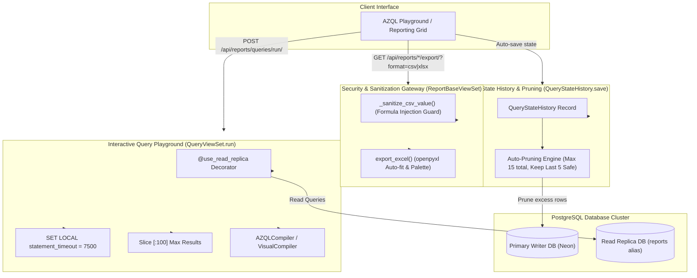

# Architectural Specification: EU-17 Reporting Deep Analytics & AZQL Test Suite

> **Status**: APPROVED  
> **Domain**: Analytics & Reporting  
> **Execution Unit**: `EU-17`  
> **Scope**: 10 Production Source Files (`reports/models.py`, `reports/serializers.py`, `reports/signals.py`, `reports/views.py`, `reports/tests.py`, `reports/tests_azql.py`, `reports/admin.py`, `scripts/get_securecoder_findings.py`, `settings_app/management/__init__.py`, `settings_app/management/commands/__init__.py`)

---

## 1. Executive Summary & Domain Scope

`EU-17` encompasses the core analytical calculation engines, the AZQL interactive query compiler runtime, the automated audit trail subsystem, and the export sanitization gateway of AZ Books. The reporting domain provides deep business intelligence across five primary sectors: Sales, Inventory, Customers, Finance, and System Activity.

Crucially, `EU-17` integrates with the AZQL AST compiler (`core.azql`), hosting the execution playground via `QueryViewSet.run`. It enforces isolation boundaries using the `@use_read_replica` database decorator and PostgreSQL transaction timeouts (`SET LOCAL statement_timeout = 7500`). It establishes strict CSV formula injection sanitization, a self-pruning query state history engine that guarantees safe-point preservation, and a 598-line test suite verifying analytical query parsing and security defenses.

---

## 2. Component Directory & Member File Manifest

| File Path | Role in Architecture | Key Responsibilities & Invariants |
| :--- | :--- | :--- |
| `reports/models.py` | Reporting Data Models | Defines `ActivityLog`, `SavedQuery` (soft-delete), and `QueryStateHistory` (auto-pruning). |
| `reports/serializers.py` | Data Transfer Objects | Serializers for audit logs, saved query ASTs, and query execution history. |
| `reports/signals.py` | Event Audit Observers | Listens to model mutations to trigger audit log entries. |
| `reports/views.py` | Analytical Controllers | 1,594 lines implementing 7 viewsets, CSV/Excel openpyxl generation, and AZQL execution. |
| `reports/tests.py` | Reporting Unit Tests | Validates analytical rollups, date filtering, and spreadsheet export generation. |
| `reports/tests_azql.py` | AZQL Verification Suite | 598 lines verifying lexing, AST parsing, universal quantifiers, and security injection blocks. |
| `reports/admin.py` | Admin Registration | Configures Django admin interfaces for `ActivityLog` and `SavedQuery`. |
| `scripts/get_securecoder_findings.py` | Security Scan Parser | **[QUARANTINED]** Semgrep offline findings aggregator containing legacy `books2` path trap. |
| `settings_app/management/__init__.py` | Package Initializer | Management command package namespace. |
| `settings_app/management/commands/__init__.py` | Package Initializer | Command loader initialization module. |

---

## 3. High-Level Architecture & Analytical Pipeline



---

## 4. Key Architectural Mechanisms

### 4.1 AZQL Interactive Playground & Read Replica Isolation
Interactive query compilation poses severe resource exhaustion risks if unconstrained. In `reports/views.py`, `QueryViewSet.run` enforces multi-layer isolation:

1. **Read Replica Routing**: Decorated with `@use_read_replica`, ensuring all compiled queries execute against the dedicated read replica (`db_alias = 'reports'`), shielding operational checkout and financial writes from table scans.
2. **Statement Timeout Lockdown**: Injects `SET LOCAL statement_timeout = 7500` inside an atomic block, terminating any query exceeding $7.5\text{ seconds}$.
3. **Operational Error Translation**: Catches `django.db.utils.OperationalError` containing `timeout` or `cancel`, returning a standardized HTTP 400 response (`"Query execution timed out. Maximum limit is 7500ms."`) rather than throwing an unhandled 500.
4. **Interactive Result Floor**: Enforces `.distinct()[:100]` to eliminate memory bloat across the wire.

```python
@action(detail=False, methods=['post'])
@use_read_replica
def run(self, request):
    # ... compile qs via AZQLCompiler or VisualCompiler ...
    db_alias = 'reports' if not getattr(settings, 'IS_TESTING', False) else 'default'
    try:
        with transaction.atomic(using=db_alias):
            if connections[db_alias].vendor == 'postgresql':
                with connections[db_alias].cursor() as cursor:
                    cursor.execute("SET LOCAL statement_timeout = 7500")
            results = list(qs.distinct()[:100])
    except utils.OperationalError as e:
        if "timeout" in str(e).lower() or "cancel" in str(e).lower():
            return Response(
                {"error": "Query execution timed out. Maximum limit is 7500ms."},
                status=status.HTTP_400_BAD_REQUEST
            )
        raise
```

### 4.2 CSV Formula Injection Neutralization
Exporting unescaped user strings to CSV files enables Dynamic Data Exchange (DDE) and formula execution vulnerabilities in Microsoft Excel and LibreOffice Calc.

`ReportBaseViewSet._sanitize_csv_value()` inspects the leading byte of every string value. If it matches formula execution characters (`=`, `+`, `-`, `@`, `\t`, `\r`), it prepends an apostrophe (`'`):

$$\text{sanitize}(v) = \begin{cases} ' \mathbin{\Vert} v & \text{if } v \text{ is str and } v[0] \in \{=, +, -, @, \backslash t, \backslash r\} \\ v & \text{otherwise} \end{cases}$$

### 4.3 QueryStateHistory Auto-Pruning Engine
`QueryStateHistory` stores transient auto-saves and execution runs for audit recovery. Left unmanaged, this table would grow unbounded. The model overrides `.save()` with a mathematical retention invariant:

1. Maximum total records per user: $N_{max} = 15$.
2. Invariant preservation: Always retain the last $K_{safe} = 5$ successful safe points (`is_safe=True`).
3. Slicing algorithm:
   $$\mathcal{P}_{safe} = \text{safe\_points}[:5], \quad \mathcal{I}_{prot} = \{\text{id} \mid \text{id} \in \mathcal{P}_{safe}\}$$
   $$M_{keep} = 15 - |\mathcal{I}_{prot}|$$
   $$\mathcal{E}_{excess} = (\text{All} \setminus \mathcal{I}_{prot})[M_{keep}:]$$
   $$\text{Delete}(\mathcal{E}_{excess})$$

This executes within an atomic block during every `.save()`, guaranteeing that user recovery states never exceed 15 records while strictly protecting reliable checkpoints.

---

## 5. Domain ViewSet Catalog (`reports/views.py`)

| ViewSet Class | Route Base | Domain Covered | Key Metrics & Operations |
| :--- | :--- | :--- | :--- |
| `SalesReportViewSet` | `/api/reports/sales/` | Sales & Revenue | Revenue rollups, gross vs net margins, discount totals, order volume by day/week/month. |
| `InventoryReportViewSet` | `/api/reports/inventory/` | Stock & Valuation | Total asset valuation ($Qty \times Cost$), dead stock detection, stock turnover rates. |
| `CustomerReportViewSet` | `/api/reports/customers/` | CRM & Receivables | Outstanding customer debt, lifetime value (LTV), credit limit utilization. |
| `FinanceReportViewSet` | `/api/reports/finance/` | P&L & Cash Flow | Cash flow statements, expense category breakdown, bank balance reconciliation. |
| `ActivityLogViewSet` | `/api/reports/activity/` | System Audit Trail | User logins, entity creations, updates, voids, and exports with IP/User-Agent tracking. |
| `QueryViewSet` | `/api/reports/queries/` | AZQL Query Management | CRUD on `SavedQuery`, sharing, execution via `.run()`, and schema reflection via `.schema()`. |
| `QueryStateHistoryViewSet`| `/api/reports/queries-history/`| Query Undo/Redo | Auto-save retrieval and state restoration. |

---

## 6. Verification Suite: `reports/tests_azql.py`

The AZQL verification engine encompasses 598 lines of unit and integration tests executing across seven distinct verification vectors:

1. **Lexical Grammar Analysis**: Validates tokenization of identifiers, keywords (`WHERE`, `AND`, `OR`, `WAS EVER`), comparison operators (`=`, `!=`, `>`, `<`, `LIKE`, `IN`), and literal types.
2. **AST Tree Synthesis**: Tests syntax tree construction and validation against `SCHEMA_WHITELIST`.
3. **Universal Quantifiers (`HAS_ALL`)**: Validates compilation of `HAS_ALL` expressions into double-negative SQL subqueries (`~Exists(sub_qs.exclude(inner_q))`) to verify universal conditions without Cartesian explosion.
4. **Temporal Audit History (`WAS EVER`)**: Tests queries probing `django-simple-history` audit tables (`HistoricalOrder`, etc.) to locate entities that satisfied predicates at any historical point.
5. **Security Injection Defense**: Proves that non-whitelisted SQL keywords (`DROP`, `UNION`, `EXEC`, `--`) and arbitrary model navigation paths throw `ValidationError`.
6. **Visual Compiler Parity**: Verifies that queries constructed via the JSON AST visual builder yield identical QuerySet filters to raw AZQL text statements.
7. **Timeout & Limit Enforcement**: Simulates slow queries to verify that `statement_timeout` triggers gracefully.

---

## 7. Quarantined Script Analysis: `scripts/get_securecoder_findings.py`

> [!WARNING]
> **QUARANTINE NOTICE: PATH CONTAMINATION IN SECURITY SCANNER**  
> `scripts/get_securecoder_findings.py` contains a hardcoded reference to the legacy repository workspace in `find_workspace_db()`:
> ```python
> if "folder" in ws_data and "z%3A/books2" in ws_data["folder"]:
>     db_path = os.path.join(folder_path, "state.vscdb")
> ```
> **Remediation Mandate**: This script is classified as **[QUARANTINED]**. Prior to operational use in Books3, line 86 must be updated to inspect `"z%3A/books3"` to prevent false positive reading of obsolete Books2 VS Code state databases.

---

## 8. Failure Modes & Operational Risk Register

| Failure Vector | Trigger Condition | Architectural Defense | Severity |
| :--- | :--- | :--- | :--- |
| **Analytical Primary Starvation** | Running intensive aggregation reports on primary database. | Enforced `@use_read_replica` routing to the read replica pool. | High |
| **Runaway Query DOS** | Complex join query executing indefinitely in interactive playground. | `SET LOCAL statement_timeout = 7500` enforced at PostgreSQL session level. | Critical |
| **CSV Formula Execution** | User inputs malicious string (e.g. `=cmd|' /C calc'!A0`) in customer name, exported to CSV. | Mandatory `_sanitize_csv_value()` prefixing formula characters with `'`. | Critical |
| **Query History Unbounded Growth** | Frequent auto-saving in frontend AZQL editor accumulating thousands of rows. | Transactional auto-pruning in `QueryStateHistory.save` enforcing a 15-row ceiling. | Medium |
| **Cross-Tenant Saved Query Hijack**| Non-admin user updating a query created by another user. | `_is_owner_or_admin` check raising `PermissionDenied` on unauthorized mutations. | High |
