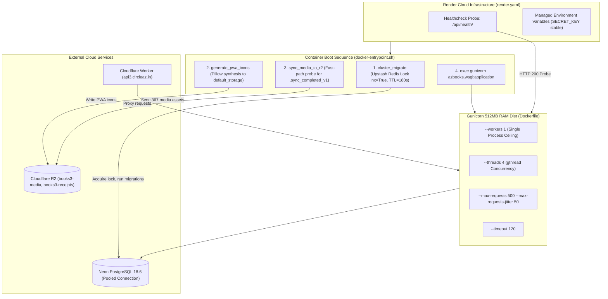

# Architectural Specification: EU-18 Operational Tooling, Environment Hydration & Deployment

> **Status**: APPROVED  
> **Domain**: DevOps & Operational Tooling  
> **Execution Unit**: `EU-18`  
> **Scope**: 10 Production Source Files (`manage.py`, `Dockerfile`, `docker-compose.yml`, `docker-entrypoint.sh`, `render.yaml`, `requirements.txt`, `tools/run_local_tests_fast.py`, `scratch/hydrate_books3_db.py`, `settings_app/pwa_icons.py`, `settings_app/management/commands/generate_pwa_icons.py`)

---

## 1. Executive Summary & Domain Scope

`EU-18` codifies the complete infrastructure, containerization, database hydration, testing automation, and deployment pipeline for AZ Books. Operating on cloud infrastructure with strict resource ceilings (notably the 512MB RAM barrier on the Render free tier), the system demands surgical configuration of its runtime environment, WSGI concurrency model, and container boot sequences.

This unit integrates:
1. **Render Infrastructure-as-Code (`render.yaml`)**: Cloud declarative definitions with persistent `SECRET_KEY`, Cloudflare R2 object storage bindings, and multi-origin CORS/CSRF configurations.
2. **Containerization Blueprint (`Dockerfile` & `docker-entrypoint.sh`)**: Multi-step boot orchestration with PostGIS/GDAL runtime libraries, distributed cluster migrations, dynamic PWA icon synthesis, and idempotent R2 media hydration.
3. **512MB RAM Concurrency Diet**: Gunicorn configured strictly for single-worker multi-threading (`--workers 1 --threads 4 --worker-class gthread`), recycling workers every 500 requests to eliminate memory fragmentation.
4. **Topological Database Hydration (`scratch/hydrate_books3_db.py`)**: A directed acyclic graph (DAG) hydration engine utilizing `graphlib.TopologicalSorter` to populate 40,625 rows across Neon PostgreSQL without superuser permissions.
5. **Rapid In-Memory Local Test Suite (`tools/run_local_tests_fast.py`)**: A GDAL-mocked, in-memory SQLite test harness evaluating the entire test suite in seconds without requiring native C-libraries on developer workstations.

---

## 2. Component Directory & Member File Manifest

| File Path | Role in Architecture | Key Responsibilities & Invariants |
| :--- | :--- | :--- |
| `manage.py` | Django CLI Gateway | Standard command-line entrypoint configuring `DJANGO_SETTINGS_MODULE`. |
| `Dockerfile` | Container Build Specification | Python 3.13-slim image with GDAL/PostGIS system libraries and static asset collection. |
| `docker-compose.yml` | Local Multi-Container Stack | Orchestrates local development environment with PostGIS, Django backend, and Vite frontend. |
| `docker-entrypoint.sh` | Container Boot Pipeline | Sequential initialization: cluster migrations, PWA icon creation, idempotent R2 media sync. |
| `render.yaml` | Cloud Deployment Blueprint | Render Infrastructure-as-Code configuring web services, env vars, and health probes. |
| `requirements.txt` | Python Dependency Manifest | Pinned production dependencies; excludes bulky testing suites to enforce RAM diet. |
| `tools/run_local_tests_fast.py`| Local Test Runner | Fast in-memory SQLite runner mocking PostGIS with custom math functions (`sqrt`, `power`). |
| `scratch/hydrate_books3_db.py` | Sovereign Hydration DAG | Topological database hydration script resolving foreign keys and synchronizing sequences. |
| `settings_app/pwa_icons.py` | PWA Asset Synthesizer | Generates required PWA icon sizes (192, 512, 180, 32) from store logo or text fallback. |
| `settings_app/management/commands/generate_pwa_icons.py`| PWA Command Wrapper | Django management command invoking `pwa_icons.generate_pwa_icons`. |

---

## 3. High-Level Architecture & Container Lifecycle



---

## 4. Key Architectural Mechanisms

### 4.1 The 512MB RAM WSGI Concurrency Model
On Render free-tier instances, exceeding 512MB of resident set size (RSS) memory triggers an immediate kernel out-of-memory (OOM) kill. Python web applications with multiple worker processes readily breach this threshold under concurrent load or PDF/spreadsheet generation.

`Dockerfile` enforces a strict single-worker, multi-threaded configuration:

$$\text{Total Memory} \approx \text{Base Process} + (\text{Threads} \times \text{Stack}) + \text{Heap} \le 350\text{MB} < 512\text{MB}$$

```dockerfile
CMD gunicorn azbooks.wsgi:application \
    --bind 0.0.0.0:${PORT:-8000} \
    --workers 1 \
    --threads 4 \
    --worker-class gthread \
    --max-requests 500 \
    --max-requests-jitter 50 \
    --timeout 120
```

1. **`--workers 1`**: Prevents multiple heavy Python processes from co-existing on the same 512MB node.
2. **`--threads 4` (`gthread`)**: Handles concurrent I/O-bound requests (e.g., waiting on Neon DB queries or R2 uploads) within a single memory space.
3. **`--max-requests 500 --max-requests-jitter 50`**: Periodically recycles the worker process to reclaim memory leaked by C-extensions or fragmented Python heaps.
4. **`--timeout 120`**: Permits long-running database aggregations or cold-start queries without abrupt termination.

### 4.2 Idempotent Boot Orchestration (`docker-entrypoint.sh`)
The container startup script sequences critical operational tasks before binding the WSGI server:

```bash
#!/bin/bash
set -e

echo "==> Running cluster migrations and database initialization safely..."
python manage.py cluster_migrate

echo "==> Generating PWA icons (if missing)..."
python manage.py generate_pwa_icons

echo "==> Synchronizing media assets to Cloudflare R2 (idempotent)..."
python manage.py sync_media_to_r2 || echo "Media sync warning: non-fatal bypass"

echo "==> Starting server..."
exec "$@"
```

- **`cluster_migrate`**: Acquires a distributed Redis lock (`azbooks_cluster_migration_lock`) to ensure only one container executes `migrate` when scaling horizontally, bypassing PgBouncer connection poolers to prevent transaction lock aborts.
- **`generate_pwa_icons`**: Inspects `StoreSettings.logo` and generates responsive PWA icons if not already cached.
- **`sync_media_to_r2`**: Checks for the existence of `media/.sync_completed_v1` in R2; if present, exits in $<100\text{ms}$ to protect Render healthcheck deadlines.

### 4.3 Topological Database Hydration (`scratch/hydrate_books3_db.py`)
Direct SQL restoration on managed serverless PostgreSQL (like Neon) fails when tables are inserted out of topological dependency order or when non-superusers lack authority to disable constraints globally (`session_replication_role = 'replica'`).

`scratch/hydrate_books3_db.py` solves this via a directed acyclic graph (DAG):

1. **Information Schema Introspection**: Queries `information_schema.table_constraints` to extract parent-child foreign key relationships across all 95 models.
2. **Topological Ordering**: Computes execution order via Python's `graphlib.TopologicalSorter`:
   $$\mathcal{G} = (V, E), \quad (u, v) \in E \iff v \text{ depends on } u$$
3. **Self-Referential Breakout**: Temporarily drops foreign key constraints on circular/self-referential tables (`customers_geographicregion.parent_id`, `inventory_product.parent_id`), loads data in topological batches, commits the transaction, and re-attaches the constraints.
4. **PostgreSQL Sequence Resynchronization**: Iterates through all 26 table sequences, executing:
   $$\text{SELECT setval}(pg\_get\_serial\_sequence(t, \text{'id'}), \text{COALESCE}(\max(id), 1))$$
5. **Mathematical Parity Verification**: Audits 22 core metrics against `manifest.json` ensuring 100% row count and financial sum consistency.

### 4.4 High-Speed Local GIS Test Harness (`tools/run_local_tests_fast.py`)
PostGIS and GDAL C-libraries are notoriously difficult to compile and maintain across developer Windows environments. `tools/run_local_tests_fast.py` enables developers to run the entire backend test suite in memory via SQLite:

1. **Virtual GIS Module Injection**: Injects mocked Python modules for `django.contrib.gis.*` into `sys.modules`.
2. **Spatial Field Emulation**: Maps `PointField`, `PolygonField`, and `GeometryField` to SQLite `TextField`, parsing EWKB hex strings and WKT strings into lightweight Python `Point(x, y)` objects.
3. **Trigonometric Distance Approximation in SQLite**: Injects custom C-level math functions (`sqrt`, `power`, `split_part`) into SQLite connections, approximating spherical distance via planar projection:
   $$D \approx \sqrt{\left((x - \text{lon}) \times 103,500\right)^2 + \left((y - \text{lat}) \times 111,000\right)^2} \le R$$
4. **Migration Bypass**: Replaces `settings.MIGRATION_MODULES` with a mock dictionary returning `None`, creating tables directly from model metadata in milliseconds.

---

## 5. Environment & Infrastructure Parameters (`render.yaml`)

| Key | Sync Mode | Production Value / Target | Architectural Invariant |
| :--- | :--- | :--- | :--- |
| `SECRET_KEY` | `sync: false` | Set manually in Render Dashboard | **MUST NOT** use `generateValue: true`; rotation destroys all active user JWT tokens. |
| `DEBUG` | Fixed | `"False"` | Prevents leaking stack traces or internal configuration. |
| `ALLOWED_HOSTS` | Fixed | `".onrender.com,.circleaz.in,localhost"` | Restricts host header attacks to legitimate domains. |
| `CSRF_TRUSTED_ORIGINS` | Fixed | `https://books3.circleaz.in,https://circleaz.in,https://api3.circleaz.in` | Enables cross-origin form/auth submissions from PWA. |
| `DATABASE_URL` | `sync: false` | Neon PostgreSQL (Pooled endpoint) | Enforces PostgreSQL connection string with SSL enabled. |
| `R2_ENDPOINT_URL` | `sync: false` | Cloudflare R2 Account Endpoint | Object storage API endpoint. |
| `R2_BUCKET_NAME` | Fixed | `"books3-media"` | Isolated bucket for product/store assets. |
| `R2_CUSTOM_DOMAIN` | Fixed | `"media3.circleaz.in"` | CDN edge domain for public media serving. |
| `R2_RECEIPTS_BUCKET`| Fixed | `"books3-receipts"` | Dedicated bucket for immutable PDF/HTML snapshots. |
| `DEFAULT_FROM_EMAIL`| Fixed | `"CircleAZ <no-reply@auth3.circleaz.in>"` | Resend transactional email identity. |

---

## 6. PWA Dynamic Icon Engine (`settings_app/pwa_icons.py`)

The PWA specification requires standard icon dimensions to enable native installation across iOS, Android, and Desktop platforms.

`settings_app/pwa_icons.py` provides automated synthesis:

```python
ICON_SIZES = {
    'store/pwa-icon-192.png': 192,
    'store/pwa-icon-512.png': 512,
    'store/apple-touch-icon.png': 180,
    'store/favicon.png': 32,
}
```

- **Uploaded Logo Path**: Performs high-quality square center-crop and `LANCZOS` resampling, applying a solid white background to preserve transparent PNG legibility.
- **Initial Fallback Path**: If no logo is configured, synthesizes a dark-mode icon (`#1a1a2e`) with an indigo accent ring (`#6366f1`) and uppercase store initials.
- **Storage Target**: Writes directly to `django.core.files.storage.default_storage`, overwriting prior assets to maintain stable, persistent URLs.

---

## 7. Failure Modes & Operational Risk Register

| Failure Vector | Trigger Condition | Architectural Defense | Severity |
| :--- | :--- | :--- | :--- |
| **Render OOM Termination** | Multi-worker Gunicorn configuration consuming $>512\text{MB}$ RAM. | Enforced single-worker multi-threading (`--workers 1 --threads 4`) with memory recycling (`--max-requests 500`). | Critical |
| **JWT Session Invalidation** | Render rotating `SECRET_KEY` on redeploy via `generateValue: true`. | Mandatory `sync: false` for `SECRET_KEY` in `render.yaml`. | Critical |
| **Database Migration Race** | Multiple container replicas executing `manage.py migrate` simultaneously. | Distributed Upstash Redis lock (`nx=True`, TTL 180s) in `cluster_migrate`. | High |
| **Healthcheck Timeout on Boot** | Media synchronization scanning 367 files sequentially over slow network. | Fast-path probe for `media/.sync_completed_v1` exiting in $<100\text{ms}$. | High |
| **Foreign Key Circular Lockup** | Bulk database restoration stalling on self-referential parent pointers. | Topological DAG sorting with temporary constraint decoupling. | Critical |
| **PostgreSQL Sequence Desync** | Bulk table inserts resetting or desynchronizing auto-increment IDs. | Explicit post-hydration sequence alignment across all 26 sequences. | High |
