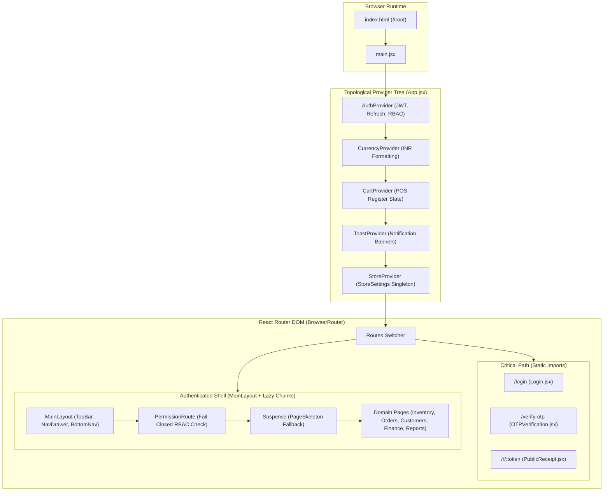

# Architectural Specification: FE-01 Core SPA Shell & Build Configuration

> **Status**: APPROVED  
> **Domain**: Frontend Core Architecture  
> **Execution Unit**: `FE-01`  
> **Scope**: 10 Production Source Files (`frontend/src/App.jsx`, `frontend/src/main.jsx`, `frontend/src/index.css`, `frontend/src/config/api.js`, `frontend/src/config/navigation.js`, `frontend/src/assets/react.svg`, `frontend/src/styles/components/page-layout.css`, `frontend/src/styles/components/form-layout.css`, `frontend/src/styles/components/modal-system.css`, `frontend/src/styles/components/data-table.css`)

---

## 1. Executive Summary & Domain Scope

`FE-01` constitutes the foundational Single Page Application (SPA) shell, Vite build configuration, routing orchestration, and master styling substrate for AZ Books. The application runs on React 18 in client-rendered SPA mode, hosted on Cloudflare Pages (`books3.circleaz.in`), interfacing with backend APIs through Cloudflare Workers and Render.

This unit establishes:
1. **Critical Path vs Lazy Code Splitting**: Immediate, static imports for essential entry paths (`Login`, `OTPVerification`, `PublicReceipt`, `ElevatedAuthModal`), paired with `React.lazy()` chunking for all business domains to minimize initial bundle size and First Contentful Paint (FCP).
2. **Context Provider Hierarchy**: Strict topological layering of shared state engines (`AuthProvider` $\to$ `CurrencyProvider` $\to$ `CartProvider` $\to$ `ToastProvider` $\to$ `StoreProvider`) ensuring deterministic dependency injection without cyclic re-renders.
3. **Master Configuration Gateways**: Unified API route mapping (`config/api.js`) and hierarchical navigation structures (`config/navigation.js`) providing single sources of truth for endpoints, breadcrumbs, search indices, and permission gates.
4. **Vanilla CSS Component Substrate**: Modular, zero-runtime CSS architectural layers (`index.css`, `page-layout.css`, `form-layout.css`, `modal-system.css`, `data-table.css`) implementing high-contrast dark theme variables, responsive grids, and standard mobile viewports without third-party utility bloat (Tailwind-free).

---

## 2. Component Directory & Member File Manifest

| File Path | Role in Architecture | Key Responsibilities & Invariants |
| :--- | :--- | :--- |
| `frontend/src/App.jsx` | Master SPA Application Root | Declares provider tree, route registry, lazy route boundaries, and top-level modals. |
| `frontend/src/main.jsx` | React DOM Entrypoint | Mounts `<App />` into `#root` DOM node with StrictMode initialization. |
| `frontend/src/index.css` | Global CSS Master Sheet | CSS custom properties, color palette tokens, typography, and utility classes. |
| `frontend/src/config/api.js` | Centralized API Route Map | Base URL resolution via `VITE_API_URL` and endpoint string definitions. |
| `frontend/src/config/navigation.js` | Master Navigation Graph | Navigation hierarchy, permissions mapping, breadcrumbs, and searchable items. |
| `frontend/src/assets/react.svg` | Static Framework Asset | Bundled React vector asset. |
| `frontend/src/styles/components/page-layout.css` | Layout CSS Foundations | Glass card styling, responsive content containers, and flex/grid shell rules. |
| `frontend/src/styles/components/form-layout.css` | Form Component Styles | Input groups, validation states, button primitives, and control alignment. |
| `frontend/src/styles/components/modal-system.css` | Global Modal System Styles | Centered overlay dialogs, z-index hierarchies ($z=1000$), and animations. |
| `frontend/src/styles/components/data-table.css` | Tabular Data Styles | Dense accounting tables, sticky headers, cell alignments, and scroll containers. |

---

## 3. High-Level Architecture & Route Hierarchy



---

## 4. Key Architectural Mechanisms

### 4.1 Route Code-Splitting & Lazy Loading Strategy
To keep initial load latency under $1.5\text{ seconds}$ over standard Indian cellular networks, `frontend/src/App.jsx` enforces a two-tier import strategy:

1. **Static Critical Path**: Authentication gates (`Login`, `OTPVerification`), unauthenticated receipts (`PublicReceipt`), and emergency credential prompts (`ElevatedAuthModal`) are statically imported. This guarantees instant visual feedback without network waterfall delays.
2. **Lazy Domain Chunks**: All 38 domain views are split via `React.lazy(() => import(...))`. Vite packages each route into an isolated JS and CSS chunk.
3. **Suspense Fallback**: Every lazy component tree is wrapped in `<Suspense fallback={<PageSkeleton />}>`. The skeleton mimics the target page's layout cards to eliminate visual layout shifts (CLS).

### 4.2 Centralized Navigation & Routing Contracts (`config/navigation.js`)
Navigation is driven by a single declarative specification (`navConfig`), decoupling UI rendering from route topology:

```javascript
export const navConfig = [
    {
        id: 'dashboard',
        title: 'Dashboard',
        path: '/',
        icon: 'LayoutDashboard',
        permission: null, // Publicly accessible to all authenticated users
    },
    {
        id: 'inventory',
        title: 'Inventory',
        path: '/inventory',
        icon: 'Package',
        permission: 'inventory.view_products',
        subItems: [
            { title: 'Products', path: '/inventory', permission: 'inventory.view_products' },
            { title: 'Add Product', path: '/inventory/add', permission: 'inventory.manage_products' },
            { title: 'Stock Control', path: '/inventory/stock', permission: 'inventory.manage_stock' },
            // ...
        ]
    },
    // ...
];
```

- **Dynamic Breadcrumb Resolution**: `getBreadcrumbs(pathname)` crawls the configuration graph to generate hierarchical breadcrumb arrays (`Home > Inventory > Stock Control`) without hardcoded route strings inside individual pages.
- **Searchable Index Synthesis**: `searchableItems` automatically extracts flattened search records for `OmniSearch`, ensuring new routes are instantly discoverable via `Ctrl+K`.

### 4.3 Styling Architecture & CSS Custom Properties
The styling architecture avoids runtime CSS-in-JS libraries and massive utility stylesheets in favor of vanilla CSS custom properties defined in `index.css`:

```css
:root {
    /* Color Palette */
    --color-primary: #6366f1;
    --color-primary-hover: #4f46e5;
    --color-bg-dark: #0f172a;
    --color-surface-dark: #1e293b;
    --color-surface-card: rgba(30, 41, 59, 0.7);
    --color-border: rgba(148, 163, 184, 0.15);
    
    /* Semantic Status Colors */
    --color-success: #10b981;
    --color-warning: #f59e0b;
    --color-danger: #ef4444;
    --color-info: #3b82f6;

    /* Layout Constraints */
    --sidebar-width-full: 260px;
    --sidebar-width-mini: 72px;
    --topbar-height: 64px;
    --bottomnav-height: 60px;
}
```

- **Glassmorphism Design Pattern (`page-layout.css`)**: Implements `.glass-card` using `backdrop-filter: blur(12px)` and subtle borders, standardizing the application's signature modern interface across all viewport sizes.
- **Form Primitives (`form-layout.css`)**: Unifies input heights ($42\text{px}$ desktop, $48\text{px}$ mobile touch targets), focus outlines, and floating error labels.
- **Accounting Tables (`data-table.css`)**: Enforces right-aligned numeric columns, tabular font numbers (`font-variant-numeric: tabular-nums`), sticky column headers, and horizontal scroll indicators for data grids.

---

## 5. Security & Fail-Closed RBAC Routing

`App.jsx` wraps protected route definitions with the `<PermissionRoute>` boundary component:

```jsx
<Route path="/orders/new" element={
  <PermissionRoute permission="orders.create_orders">
    <LazyPage><NewOrder /></LazyPage>
  </PermissionRoute>
} />
```

1. **Unauthenticated Redirect**: Directs unauthenticated sessions immediately to `/login`, preserving destination state (`state: { from: location }`) for post-authentication return.
2. **Fail-Closed Permission Guard**: If the active user's decoded JWT permissions set lacks the required permission string, the route intercepts the attempt and displays a standardized `<AccessDenied />` interface with a 5-second automatic countdown redirecting to `/`.

---

## 6. Failure Modes & Operational Risk Register

| Failure Vector | Trigger Condition | Architectural Defense | Severity |
| :--- | :--- | :--- | :--- |
| **Lazy Chunk Download Failure** | User loses network connectivity while navigating to a new route. | `<ErrorBoundary>` wraps the route outlet; displays reload CTA instead of white-screen crash. | High |
| **Circular Provider Dependency** | A child provider attempts to read context from a parent not yet mounted. | Topological provider ordering strictly documented and enforced in `App.jsx`. | Critical |
| **Cumulative Layout Shift (CLS)** | Dynamic lazy components loading without pre-allocated height. | `<PageSkeleton />` renders identical geometry cards before chunk initialization. | Medium |
| **Base URL Misconfiguration** | Missing `VITE_API_URL` environment variable during deployment. | `config/api.js` falls back safely to `http://localhost:8000/api` in dev mode. | High |
| **Viewport Overflow on Mobile** | Tables or modals wider than $360\text{px}$ viewports. | `overflow-x: auto` containers and mobile-first media queries (`@media (max-width: 767px)`). | Medium |
