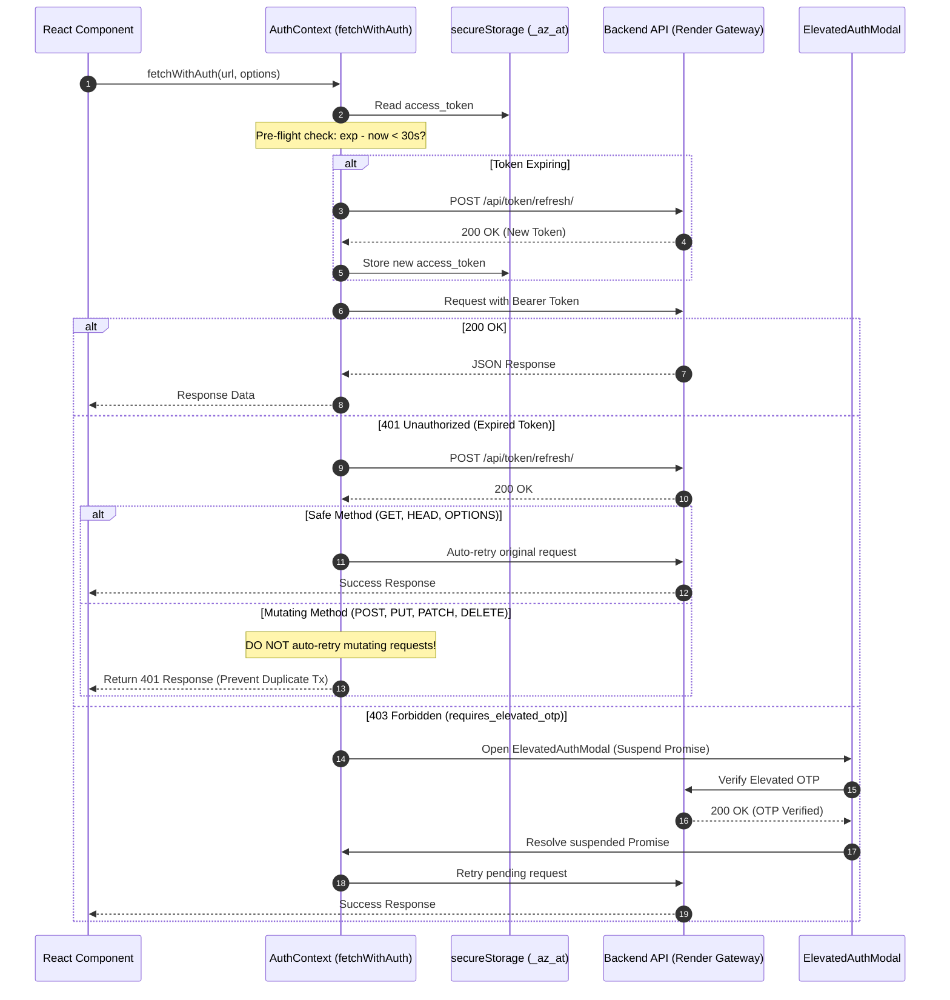

# Architectural Specification: FE-02 State, Auth & Security Foundations

> **Status**: APPROVED  
> **Domain**: State Management & Security  
> **Execution Unit**: `FE-02`  
> **Scope**: 10 Production Source Files (`frontend/src/context/AuthContext.jsx`, `frontend/src/context/CurrencyContext.jsx`, `frontend/src/context/StoreContext.jsx`, `frontend/src/context/CartContext.jsx`, `frontend/src/context/ToastContext.jsx`, `frontend/src/utils/secureStorage.js`, `frontend/src/utils/usePermissions.js`, `frontend/src/components/PermissionRoute.jsx`, `frontend/src/components/ElevatedAuthModal.jsx`, `frontend/src/components/ElevatedAuthModal.css`)

---

## 1. Executive Summary & Domain Scope

`FE-02` establishes the state management, identity lifecycle, client-side authorization, and security boundary of the AZ Books frontend. Operating in a progressive web application environment, the system requires resilient authentication handling, offline-capable permission evaluation, and strict cryptographic/token safeguards.

This unit implements:
1. **Network-Independent RBAC Evaluation**: Synchronous extraction of roles and granular permissions directly from the JWT access token payload using Base64Url normalization and UTF-8 decoding, providing $O(1)$ permission lookups without API latency.
2. **Resilient Token Refresh & Keepalive Pipeline**: Proactive background token refreshes scheduled two minutes prior to expiration, preemptive request interception for expiring tokens ($<30\text{s}$), and background keepalive pings preventing Render free-tier instance sleep.
3. **Elevated Auth Interceptor Protocol**: Automatic interception of HTTP 403 responses requiring step-up verification (`requires_elevated_otp`), suspending API execution in a Promise queue and presenting the modal challenge before transparently completing the pending request.
4. **Idempotency Defense on 401 Retries**: Enforcing an ironclad restriction that only safe HTTP methods (`GET`, `HEAD`, `OPTIONS`) may auto-retry after token refresh, strictly blocking automatic resubmission of mutating requests (`POST`, `PUT`, `PATCH`, `DELETE`) to eliminate duplicate financial transactions.
5. **Client-Side Obfuscated Storage**: A salted Base64 storage abstraction (`secureStorage`) protecting session tokens and user metadata against naive scraping and automated browser extensions.

---

## 2. Component Directory & Member File Manifest

| File Path | Role in Architecture | Key Responsibilities & Invariants |
| :--- | :--- | :--- |
| `frontend/src/context/AuthContext.jsx` | Master Authentication Engine | JWT lifecycle, login/logout, OTP verification, `fetchWithAuth`, keepalive pings. |
| `frontend/src/context/CurrencyContext.jsx`| Global Currency Context | Centralizes INR currency symbol (`₹`) and standard decimal formatting. |
| `frontend/src/context/StoreContext.jsx` | Store Settings Context | Caches store metadata, operating hours, tax defaults, and logo URL. |
| `frontend/src/context/CartContext.jsx` | POS Checkout State | Manages order items, quantities, subtotal calculations, and discount rules. |
| `frontend/src/context/ToastContext.jsx` | Toast Alert Dispatcher | Global banner notification queue for success, error, warning, and info messages. |
| `frontend/src/utils/secureStorage.js` | Obfuscated Storage Gateway | Encodes tokens with salt; manages transparent migration from plain keys. |
| `frontend/src/utils/usePermissions.js` | Permission Inspection Hook | $O(1)$ `Set` lookups; superuser-only bypass (denies `is_staff` bypass). |
| `frontend/src/components/PermissionRoute.jsx`| Route Security Guard | Fail-closed route protector rendering `<AccessDenied />` on permission failure. |
| `frontend/src/components/ElevatedAuthModal.jsx`| Step-Up Auth Dialog | Modal challenge capturing OTP/password for sensitive financial mutations. |
| `frontend/src/components/ElevatedAuthModal.css`| Modal Visual Styling | Responsive modal layout, error banners, and high-contrast buttons. |

---

## 3. High-Level Security & Authentication Lifecycle



---

## 4. Key Architectural Mechanisms

### 4.1 Synchronous JWT RBAC Claim Extraction
To eliminate layout thrashing and asynchronous permission checks, `AuthContext.jsx` parses user permissions synchronously from the JWT payload during initialization and token refresh:

```javascript
function decodeJwtPayload(tokenStr) {
    const base64Url = tokenStr.split('.')[1];
    const base64 = base64Url.replace(/-/g, '+').replace(/_/g, '/');
    const padded = base64.padEnd(base64.length + (4 - (base64.length % 4)) % 4, '=');
    
    const binary = atob(padded);
    const bytes = new Uint8Array(binary.length);
    for (let i = 0; i < binary.length; i++) {
        bytes[i] = binary.charCodeAt(i);
    }
    
    const decoder = new TextDecoder('utf-8');
    return JSON.parse(decoder.decode(bytes));
}
```

1. **Base64Url Normalization**: Replaces URL-safe characters (`-` and `_`) with standard Base64 characters (`+` and `/`), appending `=` padding to prevent `DOMException: The string to be decoded is not correctly encoded`.
2. **Unicode Safety**: Decodes byte arrays through `TextDecoder('utf-8')`, preserving multi-byte characters and internationalized user names.
3. **Synchronous Availability**: The decoded `rbac` object `{ role, roles, permissions, is_staff, is_superuser }` is immediately accessible to components without network round-trips.

### 4.2 Proactive Token Refresh & Keepalive Pipeline
AZ Books implements a dual-timer background lifecycle strategy:

1. **Proactive Refresh Timer (`REFRESH_BUFFER_MS = 120000`)**: Calculates time remaining until token expiration ($\Delta t = \text{exp} - \text{now} - 120\text{s}$). Schedules a background refresh 2 minutes prior to actual expiry, ensuring active users never encounter 401 errors.
2. **Pre-flight Expiry Guard**: `fetchWithAuth` checks if the active token has $<30\text{ seconds}$ of validity. If so, it awaits `refreshToken()` before firing the outgoing HTTP request, preventing doomed network calls.
3. **Render Instance Keepalive (`KEEPALIVE_INTERVAL_MS = 600000`)**: Sends a lightweight `GET /api/health/` request with `cache: 'no-store'` every 10 minutes, keeping the Render backend warm and eliminating 50-second cold start penalties.

### 4.3 Idempotency Guard on 401 Retries
Automatic request retries on expired authentication tokens present severe double-submission risks for financial operations. `fetchWithAuth` strictly segregates idempotent from mutating HTTP verbs:

```javascript
if (response.status === 401) {
    const refreshed = await refreshToken();
    if (refreshed) {
        const method = (options.method || 'GET').toUpperCase();
        const safeToRetry = ['GET', 'HEAD', 'OPTIONS'].includes(method);
        if (safeToRetry) {
            headers['Authorization'] = `Bearer ${secureStorage.getItem('access_token')}`;
            return fetch(url, { ...options, headers, cache: 'no-store' });
        }
        // Mutating methods return 401 so caller can handle gracefully
    } else {
        logout();
    }
}
```

- **Idempotent Retries**: `GET`, `HEAD`, and `OPTIONS` requests automatically refresh headers and retry seamlessly.
- **Mutating Freeze**: `POST`, `PUT`, `PATCH`, and `DELETE` requests are never automatically retried, preventing accidental duplicate orders, double expense creation, or ledger drift.

### 4.4 Elevated Auth Step-Up Interception
For high-risk operations (modifying bank accounts, approving expenses $> \text{₹}5,000$, wiping data), the backend returns:
```json
{ "code": "requires_elevated_otp", "detail": "Elevated authorization required." }
```

`fetchWithAuth` intercepts this response, pauses the executing Promise, and mounts `<ElevatedAuthModal />`. Upon successful OTP entry:
- The modal completes the elevated authentication challenge.
- The suspended Promise resolves, re-issuing the original request with elevated authorization headers.
- If the user cancels, the Promise rejects cleanly without mutating state.

### 4.5 Permission Set Memoization (`usePermissions.js`)
To eliminate $O(N)$ string scans across hundreds of permission checks in large tables, `usePermissions` creates a memoized `Set`:

$$\mathcal{S}_{perms} = \text{Set}(\text{rbac.permissions})$$

Lookups evaluate in $O(1)$ time complexity:
```javascript
const permissionSet = useMemo(
    () => new Set(rbac?.permissions || []),
    [rbac?.permissions]
);

const hasPermission = useCallback((permissionCode) => {
    if (!rbac) return false;
    if (rbac.is_superuser) return true; // Superuser bypass
    return permissionSet.has(permissionCode);
}, [rbac, permissionSet]);
```

> [!IMPORTANT]
> **Staff Bypass Prohibition (`ICE-03/P-06`)**:  
> In AZ Books, `is_staff` grants Django admin access but **DOES NOT** bypass frontend permission checks. Only `is_superuser` possesses universal bypass rights.

---

## 5. Failure Modes & Operational Risk Register

| Failure Vector | Trigger Condition | Architectural Defense | Severity |
| :--- | :--- | :--- | :--- |
| **Token Refresh Race Condition** | Multiple concurrent requests firing simultaneously when access token expires. | Single flight promise locking (`refreshPromiseRef`) ensures only one refresh request runs. | High |
| **Double-Submission on 401** | Mutating financial POST retried automatically after token renewal. | Strict verb check (`safeToRetry = ['GET', 'HEAD', 'OPTIONS'].includes(method)`). | Critical |
| **Storage Corruption Lockout** | Malformed JSON in `localStorage` throwing unhandled exceptions. | `try-catch` wrapper clearing corrupted storage keys and triggering graceful login redirect. | Medium |
| **Infinite Elevated Auth Loop** | Backend persistently returning `requires_elevated_otp` after verification. | Rejection handler closing modal and returning original 403 response on failure. | High |
| **Render Cold-Start Timeout** | Free tier spinning down during user inactivity, causing subsequent API timeouts. | Proactive background keepalive timer (`KEEPALIVE_INTERVAL_MS`) pinging `/api/health/`. | Medium |
