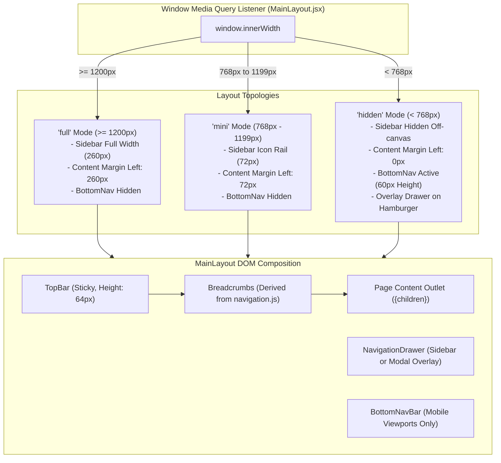

# Architectural Specification: FE-03 Application Layout & Navigation Infrastructure

> **Status**: APPROVED  
> **Domain**: Layout & Navigation Architecture  
> **Execution Unit**: `FE-03`  
> **Scope**: 10 Production Source Files (`frontend/src/components/layout/MainLayout.jsx`, `frontend/src/components/layout/MainLayout.css`, `frontend/src/components/layout/TopBar.jsx`, `frontend/src/components/layout/TopBar.css`, `frontend/src/components/layout/NavigationDrawer.jsx`, `frontend/src/components/layout/NavigationDrawer.css`, `frontend/src/components/layout/BottomNavBar.jsx`, `frontend/src/components/layout/BottomNavBar.css`, `frontend/src/components/layout/Breadcrumbs.jsx`, `frontend/src/components/layout/Breadcrumbs.css`)

---

## 1. Executive Summary & Domain Scope

`FE-03` establishes the universal layout frame, adaptive navigation mechanisms, and responsive viewport management for the AZ Books web application. As a hybrid Point of Sale (POS) and Enterprise Resource Planning (ERP) platform, the frontend must adapt fluidly between high-density desktop accounting monitors, warehouse tablet scanners, and mobile delivery screens.

This unit coordinates:
1. **Tri-Modal Responsive Viewport Controller**: An automated media query management engine classifying viewports into `full` ($\ge 1200\text{px}$), `mini` ($768\text{px} - 1199\text{px}$), and `hidden` ($< 768\text{px}$) layout topologies.
2. **Dynamic Navigation Drawer**: A permission-aware sidebar hierarchy dynamically populated from `config/navigation.js`, filtering unauthorized links, rendering collapsible accordion sections, and preserving active state across route transitions.
3. **Ergonomic Mobile Navigation Bar**: A fixed bottom navigation rail (`BottomNavBar`) providing thumb-accessible shortcuts to primary operational domains (Dashboard, Inventory, POS Register, Customers) on mobile devices.
4. **Decoupled Breadcrumb System**: An autonomous breadcrumb generator computing ancestor route links directly from URL segment matching without manual props.
5. **Sticky TopBar Command Center**: A persistent header hosting global omni-search triggers (`Ctrl+K`), polling notification badges, offline synchronization indicators, and user session controls.

---

## 2. Component Directory & Member File Manifest

| File Path | Role in Architecture | Key Responsibilities & Invariants |
| :--- | :--- | :--- |
| `frontend/src/components/layout/MainLayout.jsx` | Master Layout Shell | Manages responsive sidebar states, layout margins, and modal visibility. |
| `frontend/src/components/layout/MainLayout.css` | Master Shell Styles | Grid/flex layout containers, responsive margin shifts, and overlay backdrops. |
| `frontend/src/components/layout/TopBar.jsx` | Header Command Center | Hosts logo, search trigger, unread notification counter, and profile trigger. |
| `frontend/src/components/layout/TopBar.css` | Header Styles | Sticky positioning ($z=50$), glassmorphism blur, and button alignment. |
| `frontend/src/components/layout/NavigationDrawer.jsx`| Hierarchical Drawer | Permission-filtered sidebar navigation, accordion submenus, and collapse states. |
| `frontend/src/components/layout/NavigationDrawer.css`| Drawer Styles | Width transitions ($260\text{px} \leftrightarrow 72\text{px}$), hover tooltips, and scroll styling. |
| `frontend/src/components/layout/BottomNavBar.jsx` | Mobile Navigation Rail | Fixed bottom navigation bar for viewports $< 768\text{px}$. |
| `frontend/src/components/layout/BottomNavBar.css` | Bottom Rail Styles | Fixed bottom positioning ($z=40$), touch targets ($48\text{px}$), and active indicators. |
| `frontend/src/components/layout/Breadcrumbs.jsx` | Breadcrumb Trail | Dynamically renders ancestor route hierarchy with truncation. |
| `frontend/src/components/layout/Breadcrumbs.css` | Breadcrumb Styles | Horizontal link flow, chevron separators, and overflow ellipsis. |

---

## 3. High-Level Responsive Viewport Architecture



---

## 4. Key Architectural Mechanisms

### 4.1 Tri-Modal Responsive Viewport Controller
In `MainLayout.jsx`, screen size transitions are monitored via non-polling `MediaQueryList` event listeners rather than expensive window resize handlers:

```javascript
useEffect(() => {
    const mqDesktop = window.matchMedia('(min-width: 1200px)');
    const mqTablet = window.matchMedia('(min-width: 768px) and (max-width: 1199px)');

    function updateMode() {
        if (mqDesktop.matches) {
            setSidebarMode('full');
            setOverlayOpen(false);
        } else if (mqTablet.matches) {
            setSidebarMode('mini');
            setOverlayOpen(false);
        } else {
            setSidebarMode('hidden');
            setSidebarCollapsed(false);
        }
    }

    updateMode();
    mqDesktop.addEventListener('change', updateMode);
    mqTablet.addEventListener('change', updateMode);
    return () => {
        mqDesktop.removeEventListener('change', updateMode);
        mqTablet.removeEventListener('change', updateMode);
    };
}, []);
```

- **Zero Polling Overhead**: Only fires state updates when crossing the $768\text{px}$ or $1200\text{px}$ thresholds.
- **Dynamic Content Offsets**: CSS variables `--sidebar-current-width` adjust automatically, eliminating horizontal content clipping and margin calculation jitter.

### 4.2 Permission-Aware Dynamic Navigation (`NavigationDrawer.jsx`)
`NavigationDrawer` consumes the central `navConfig` and evaluates visibility using `usePermissions`:

1. **Section Pruning**: A navigation item is rendered if and only if `item.permission === null` or `hasPermission(item.permission) === true`.
2. **Parent Collapse Rule**: If all children of a parent accordion (e.g. `Finance`) are hidden due to insufficient permissions, the entire category collapses and hides automatically.
3. **Active State Detection**: Applies `.active` styling if `location.pathname === item.path` or if any sub-item path is an exact prefix of the current URL.
4. **Accessible Focus Return**: When the mobile drawer overlay closes, keyboard focus returns to `hamburgerRef.current`, satisfying WCAG 2.1 accessibility criteria.

### 4.3 Notification Count Polling Invariant
`MainLayout` periodically polls for unread alerts without resetting intervals when JWT tokens rotate:

```javascript
const fetchWithAuthRef = useRef(fetchWithAuth);
useEffect(() => {
    fetchWithAuthRef.current = fetchWithAuth;
}, [fetchWithAuth]);

useEffect(() => {
    const fetchCount = async () => {
        try {
            const res = await fetchWithAuthRef.current(ENDPOINTS.NOTIFICATIONS_COUNT);
            if (res.ok) {
                const data = await res.json();
                setNotifCount(data.unread_count);
            }
        } catch (err) { /* silent */ }
    };
    fetchCount();
    const interval = setInterval(fetchCount, 60000); // 60s polling
    return () => clearInterval(interval);
}, []); // Empty dependency array — stable lifecycle
```

By reading through `fetchWithAuthRef`, the polling cycle is decoupled from component re-renders, preventing timer thrashing.

### 4.4 Mobile Thumb Ergonomics (`BottomNavBar.jsx`)
For viewports under $768\text{px}$, desktop navigation controls are unergonomic for single-handed mobile use. `BottomNavBar` mounts at the bottom edge of the screen:

- **Height**: $60\text{px}$ fixed height with `env(safe-area-inset-bottom)` support for iOS home indicators.
- **Touch Bounds**: Minimum $48\text{px} \times 48\text{px}$ interactive bounding boxes for all navigation items.
- **Priority Shortcuts**:
  1. **Dashboard** (`/`)
  2. **Inventory** (`/inventory`)
  3. **POS Register** (`/orders/new` — highlighted with primary accent pill)
  4. **Customers** (`/customers`)
  5. **More Menu** (triggers off-canvas `NavigationDrawer`)

---

## 5. Security & Permission Visibility Matrix

| Navigation Component | Target Route | Required Permission | Visibility Behavior |
| :--- | :--- | :--- | :--- |
| **Inventory Menu** | `/inventory` | `inventory.view_products` | Hidden if permission absent |
| **Add Product** | `/inventory/add` | `inventory.manage_products` | Hidden from submenu if missing |
| **POS Checkout** | `/orders/new` | `orders.create_orders` | Hidden from BottomNav if missing |
| **Finance Module** | `/finance` | `finance.view_dashboard` | Entire category hidden if absent |
| **Reports Engine** | `/reports` | `reports.view_sales` | Hidden from navigation if absent |
| **Settings Module** | `/settings` | `settings.view_settings` | Hidden from navigation if absent |
| **Audit Logs** | `/reports/activity` | `reports.view_activity` | Hidden from submenu if absent |

---

## 6. Failure Modes & Operational Risk Register

| Failure Vector | Trigger Condition | Architectural Defense | Severity |
| :--- | :--- | :--- | :--- |
| **Content Hidden by BottomNav** | Bottom content cut off on mobile devices. | `MainLayout.css` adds `padding-bottom: calc(var(--bottomnav-height) + 16px)` on screens $< 768\text{px}$. | High |
| **Mobile Drawer Trap** | Overlay fails to close when navigating to a new route. | Route change observer automatically invokes `setOverlayOpen(false)` on `location.pathname` change. | Medium |
| **Notification Spam DDOS** | Aggressive polling exhausting backend connections. | Fixed 60-second interval; uses lightweight dedicated endpoint (`/notifications/count/`). | Low |
| **Accordion State Loss** | Navigating between sub-items closing parent accordion menu. | Parent accordion expansion state tracks active path prefixes to remain open. | Medium |
| **Store Logo Flash** | Store logo image failing or delaying load on cold boot. | Fallback initials placeholder rendered instantly until `storeSettings.logo` resolves. | Low |
