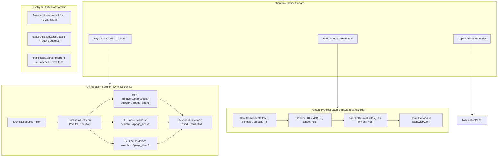

# Architectural Specification: FE-04 OmniSearch, Notifications & Common Utilities

> **Status**: APPROVED  
> **Domain**: Common UI & Utilities  
> **Execution Unit**: `FE-04`  
> **Scope**: 10 Production Source Files (`frontend/src/components/layout/UserProfileDropdown.jsx`, `frontend/src/components/layout/UserProfileDropdown.css`, `frontend/src/components/layout/NotificationPanel.jsx`, `frontend/src/components/layout/NotificationPanel.css`, `frontend/src/components/common/OmniSearch.jsx`, `frontend/src/components/common/OmniSearch.css`, `frontend/src/utils/payloadSanitizer.js`, `frontend/src/utils/test_payloadSanitizer.js`, `frontend/src/utils/financeUtils.js`, `frontend/src/utils/statusUtils.js`)

---

## 1. Executive Summary & Domain Scope

`FE-04` encapsulates the primary interactive utilities, command palette search engine, notification dispatch surface, and client-side data sanitation layer of AZ Books. Operating at the boundary between user input and HTTP network serialization, this unit serves as the first line of defense against data corruption and type mismatch vulnerabilities.

This unit implements:
1. **OmniSearch Spotlight Engine (`OmniSearch.jsx`)**: A global keyboard-driven command palette (`Ctrl+K` / `Cmd+K`) executing debounced parallel queries across Products, Customers, and Orders while providing instant access to operational quick actions.
2. **Payload Sanitizer — Frontera Protocol Layer 1 (`payloadSanitizer.js`)**: An automated client-side data transformer that purges empty strings (`""`) from nullable foreign keys and numeric values, converting them to `null` before transmission to avoid DRF validation rejections and database integer cast exceptions.
3. **Financial Precision Formatting (`financeUtils.js`)**: Locale-aware currency formatting for the Indian Rupee (`en-IN`) ensuring 2-decimal precision without binary floating-point drift, alongside robust API error response parsing.
4. **Status Class & Label Normalization (`statusUtils.js`)**: The centralized state-to-styling translation matrix governing order, delivery, payment, return, and refund status badge rendering across all interface screens.
5. **Notification & Profile Drawers**: Slide-over management panels for real-time system alerts, unread counts, and session state teardown.

---

## 2. Component Directory & Member File Manifest

| File Path | Role in Architecture | Key Responsibilities & Invariants |
| :--- | :--- | :--- |
| `frontend/src/components/layout/UserProfileDropdown.jsx` | User Profile Popover | Displays username, role badge, profile link, and session logout trigger. |
| `frontend/src/components/layout/UserProfileDropdown.css` | Profile Menu Styles | Glassmorphism popover styles, avatar ring, and action button hover states. |
| `frontend/src/components/layout/NotificationPanel.jsx` | Slide-Over Notification Tray | Displays real-time alerts, mark-as-read triggers, and empty-state placeholders. |
| `frontend/src/components/layout/NotificationPanel.css` | Notification Tray Styles | Off-canvas sliding drawer animation, badge styling, and scroll containers. |
| `frontend/src/components/common/OmniSearch.jsx` | Spotlight Search Modal | Global `Ctrl+K` command palette with debounced multi-entity parallel search. |
| `frontend/src/components/common/OmniSearch.css` | Search Palette Styles | Centered spotlight overlay ($z=1000$), category filter pills, and highlighted item cursor. |
| `frontend/src/utils/payloadSanitizer.js` | Input Sanitization Layer | Converts empty strings to `null` for FKs/decimals (Frontera Protocol Layer 1). |
| `frontend/src/utils/test_payloadSanitizer.js` | Sanitizer Unit Tests | Validates in-place mutation, foreign key nullification, and decimal string safety. |
| `frontend/src/utils/financeUtils.js` | Financial Helpers | Currency formatting (`formatINR`) and DRF field-error dictionary parsing. |
| `frontend/src/utils/statusUtils.js` | Status Matrix & Mappings | Translates technical status strings into human-readable labels and badge classes. |

---

## 3. High-Level Architecture & Interactive Flow



---

## 4. Key Architectural Mechanisms

### 4.1 OmniSearch Spotlight Architecture (`OmniSearch.jsx`)
`OmniSearch` delivers sub-100ms command palette interactions:

1. **Global Keyboard Listener**: Attaches window-level listener toggling the modal via `(e.ctrlKey || e.metaKey) && e.key === 'k'`.
2. **Parallel Promise Resolution**: Executes search requests across multiple endpoints concurrently using `Promise.allSettled()`, ensuring failure in one API doesn't abort the remaining results:
   ```javascript
   const [productsRes, customersRes, ordersRes] = await Promise.allSettled([
       fetchWithAuth(`${ENDPOINTS.INVENTORY_PRODUCTS}?search=${encodeURIComponent(searchQuery)}&page_size=5`),
       fetchWithAuth(`${ENDPOINTS.CUSTOMERS}?search=${encodeURIComponent(searchQuery)}&page_size=5`),
       fetchWithAuth(`${ENDPOINTS.ORDERS}?search=${encodeURIComponent(searchQuery)}&page_size=5`),
   ]);
   ```
3. **Keyboard Navigation Cursor**: Tracks `selectedIndex` across arrow keys (`ArrowUp`, `ArrowDown`), clamping index bounds and activating items on `Enter`.
4. **Quick Action Integrations**: Preloads static actions (`Create New Order`, `Add New Product`, `Add New Customer`) when the search input is empty.

### 4.2 Frontera Protocol Layer 1: Payload Sanitization (`payloadSanitizer.js`)
HTML form inputs bound to empty states natively emit empty strings (`""`). Passing `""` to Django REST Framework for nullable ForeignKeys or numeric fields produces HTTP 400 validation failures (`"Incorrect type. Expected pk value, received str."`).

`payloadSanitizer.js` intercepts payloads prior to transmission:

```javascript
export function sanitizeFKFields(obj, fields) {
    if (!obj || typeof obj !== 'object') return obj;
    for (const field of fields) {
        if (field in obj && (obj[field] === '' || obj[field] === undefined)) {
            obj[field] = null;
        }
    }
    return obj;
}

export function sanitizeDecimalFields(obj, fields) {
    if (!obj || typeof obj !== 'object') return obj;
    for (const field of fields) {
        if (field in obj) {
            const val = obj[field];
            if (val === '' || val === undefined || val === null) {
                obj[field] = null;
            } else {
                const trimmed = String(val).trim();
                obj[field] = isNaN(parseFloat(trimmed)) ? null : trimmed;
            }
        }
    }
    return obj;
}
```

- **In-Place Mutation**: Mutates objects in place to conserve allocations during high-frequency POS cart operations.
- **Base-10 String Enforcement**: Converts valid decimal numbers to trimmed strings rather than JavaScript IEEE-754 floating-point numbers, safeguarding financial precision.

### 4.3 Financial Formatting & Error Normalization (`financeUtils.js`)
1. **Indian Currency Grouping (`formatINR`)**: Formats numbers to the Indian numbering system ($1,00,000$ instead of $100,000$):
   ```javascript
   export function formatINR(value) {
       return parseFloat(value || 0).toLocaleString('en-IN', {
           minimumFractionDigits: 2,
           maximumFractionDigits: 2
       });
   }
   ```
2. **DRF Field Error Parsing (`parseApiError`)**: Normalizes nested DRF error dictionaries into readable strings for toast banners:
   $$\{ \text{phone}: [\text{"Invalid number"}], \text{name}: [\text{"Required"}] \} \implies \text{"phone: Invalid number | name: Required"}$$

### 4.4 Status Mapping Matrix (`statusUtils.js`)
`statusUtils.js` enforces consistent badge styling across all business modules:

| Semantic Category | Technical Status Tokens | CSS Badge Class | Visual Representation |
| :--- | :--- | :--- | :--- |
| **Success** | `paid`, `completed`, `delivered`, `confirmed`, `order complete` | `.status-success` | Emerald Green background |
| **Warning** | `partial`, `processing`, `ready`, `pending`, `delivered - awaiting payment` | `.status-warning` | Amber / Gold background |
| **Danger** | `cancelled`, `refunded`, `order cancelled` | `.status-danger` | Rose Red background |
| **Action Needed** | `cancelled — refund pending`, `return received — process refund`, `overpaid — refund due` | `.status-action-needed` | Pulsing Indigo border & text |

---

## 5. Security & Data Integrity Validations

1. **URL Encoding on Search Queries**: All query strings passed into `OmniSearch` are escaped with `encodeURIComponent(searchQuery)` to eliminate URL parameter injection.
2. **Safe Key Cleanup on Logout**: `UserProfileDropdown` triggers `logout()` from `AuthContext`, completely clearing obfuscated tokens (`_az_at`, `_az_rt`) from storage.
3. **Sanitizer Unit Test Verification (`test_payloadSanitizer.js`)**: Executes automated test assertions confirming that nested student structures and array payloads never serialize empty string foreign keys.

---

## 6. Failure Modes & Operational Risk Register

| Failure Vector | Trigger Condition | Architectural Defense | Severity |
| :--- | :--- | :--- | :--- |
| **Search Request Flooding** | User typing rapidly triggering dozens of concurrent backend API calls. | 300ms debounce timer via `debounceRef` cancelling pending queries. | Medium |
| **API Search Partial Failure** | Inventory API times out while Customer API succeeds. | `Promise.allSettled()` collects successful results and displays partial data gracefully. | Low |
| **DRF Integer Conversion Error**| User clears a foreign key selector in a form, emitting `""`. | `sanitizeFKFields()` converts `""` to `null` before `fetchWithAuth`. | High |
| **Floating-Point Rounding Drift**| JavaScript calculating `0.1 + 0.2 = 0.30000000000000004` on payment payload. | `sanitizeDecimalFields()` preserves exact string representations. | Critical |
| **Stale Notification Counter** | User reading notifications on another device without refreshing page. | Notification drawer refreshes full list on mount and updates unread badge. | Low |
