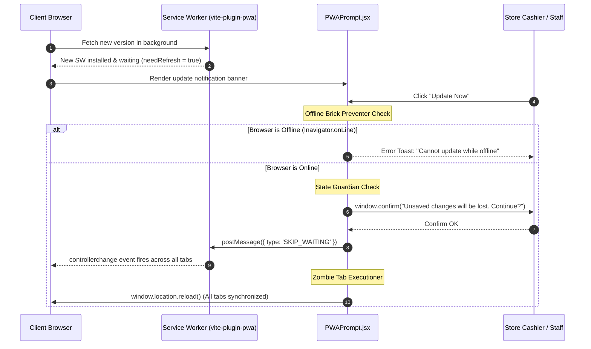

# Architectural Specification: FE-05 PWA, Offline, Diagnostics & UI Primitives

> **Status**: APPROVED  
> **Domain**: PWA & Offline Services  
> **Execution Unit**: `FE-05`  
> **Scope**: 10 Production Source Files (`frontend/src/components/common/ErrorBoundary.jsx`, `frontend/src/components/common/PageSkeleton.jsx`, `frontend/src/components/common/PageSkeleton.css`, `frontend/src/components/common/LoadingSpinner.jsx`, `frontend/src/components/common/LoadingSpinner.css`, `frontend/src/components/common/OfflineSyncBadge.jsx`, `frontend/src/components/common/OfflineSyncBadge.css`, `frontend/src/components/common/PWAPrompt.jsx`, `frontend/src/components/common/PWAPrompt.css`, `frontend/src/components/common/PWAInstallPrompt.jsx`)

---

## 1. Executive Summary & Domain Scope

`FE-05` provides the progressive web application (PWA) runtime engine, offline connectivity sensors, dynamic chunk crash guards, and rendering skeleton primitives for AZ Books. Because the POS operates in semi-reliable retail and warehouse environments across Gujarat with fluctuating cellular coverage, the frontend must resist network disconnections, handle service worker lifecycle upgrades without stranding unsaved register transactions, and guide staff into native app installation.

This unit integrates:
1. **Dynamic Chunk Crash Shield (`ErrorBoundary.jsx`)**: Intercepts `ChunkLoadError` and failed dynamic module imports caused by network dropouts during lazy page transitions, offering an automated reload recovery path that flushes the browser's poisoned import cache.
2. **Offline Connectivity Sensor (`OfflineSyncBadge.jsx`)**: Real-time DOM event sensor monitoring `navigator.onLine`, rendering a high-visibility warning banner that alerts cashiers when offline to prevent uncommitted order submissions.
3. **PWA Update Controller & Zombie Tab Executioner (`PWAPrompt.jsx`)**: Coordinates Vite PWA service worker updates (`virtual:pwa-register/react`), providing an "Offline Brick Preventer", an unsaved-state confirmation prompt ("State Guardian"), and a `controllerchange` listener that synchronizes and reloads all open browser tabs simultaneously.
4. **Platform-Aware PWA Installation Engine (`PWAInstallPrompt.jsx`)**: Manages the native `beforeinstallprompt` event for Android/Chromium while providing a specialized step-by-step Share-Sheet guidance prompt for iOS Safari, strictly gated behind staff authentication to hide installation banners from public receipt viewers.
5. **Zero-CLS Layout Skeletons (`PageSkeleton.jsx`)**: Structural geometric placeholders matching card dimensions, eliminating Cumulative Layout Shift (CLS) during asynchronous route hydration.

---

## 2. Component Directory & Member File Manifest

| File Path | Role in Architecture | Key Responsibilities & Invariants |
| :--- | :--- | :--- |
| `frontend/src/components/common/ErrorBoundary.jsx` | Runtime Error Interceptor | Catches lazy chunk loading failures; provides "Try Again" reload recovery. |
| `frontend/src/components/common/PageSkeleton.jsx` | Visual Skeleton Loader | Pre-allocates layout geometry during asynchronous lazy-chunk fetching. |
| `frontend/src/components/common/PageSkeleton.css` | Skeleton Shimmer Styles | CSS shimmer animation rules and card outline placeholders. |
| `frontend/src/components/common/LoadingSpinner.jsx`| Universal Spinner Primitive | GPU-accelerated CSS spinner supporting small, medium, and large variants. |
| `frontend/src/components/common/LoadingSpinner.css`| Spinner Keyframe Styles | CSS `@keyframes spin` with zero CPU rendering overhead. |
| `frontend/src/components/common/OfflineSyncBadge.jsx`| Network Status Sensor | Monitors `online`/`offline` window events; warns of network loss. |
| `frontend/src/components/common/OfflineSyncBadge.css`| Offline Banner Styles | Floating amber status banner styled for high visibility ($z=9999$). |
| `frontend/src/components/common/PWAPrompt.jsx` | Service Worker Manager | Handles PWA updates, "Zombie Tab Executioner", and offline reload guards. |
| `frontend/src/components/common/PWAPrompt.css` | Update Banner Styles | High-contrast bottom toast with "Update Now" and "Dismiss" controls. |
| `frontend/src/components/common/PWAInstallPrompt.jsx`| PWA Install Gateway | Intercepts `beforeinstallprompt`; renders iOS home-screen instructions. |

---

## 3. High-Level PWA & Service Worker Lifecycle



---

## 4. Key Architectural Mechanisms

### 4.1 Chunk Load Error Recovery (`ErrorBoundary.jsx`)
In modern code-split SPAs, deploying a new build invalidates old asset hashes on Cloudflare Pages. Users navigating to a lazy-loaded route whose chunk was deleted experience `ChunkLoadError` or `Failed to fetch dynamically imported module`.

`ErrorBoundary.jsx` intercepts this specifically:

```javascript
render() {
    if (this.state.hasError) {
        const isChunkError =
            this.state.error?.name === 'ChunkLoadError' ||
            this.state.error?.message?.includes('dynamically imported module') ||
            this.state.error?.message?.includes('Failed to fetch');

        return (
            <div className="error-fallback">
                <div>{isChunkError ? '📡' : '⚠️'}</div>
                <h2>{isChunkError ? 'Connection Lost' : 'Something went wrong'}</h2>
                <p>
                    {isChunkError
                        ? 'Could not load this page. Please check your internet connection and try again.'
                        : 'An unexpected error occurred. Please try reloading the page.'}
                </p>
                <button onClick={this.handleRetry} className="btn btn-primary">
                    Try Again
                </button>
            </div>
        );
    }
    return this.props.children;
}
```

- **`handleRetry()` Invariant**: Invokes `window.location.reload()`. A standard React state reset is insufficient because the browser caches the rejected `import()` Promise; a hard document reload forces the browser to request the updated HTML containing fresh chunk hashes.

### 4.2 PWA Service Worker Update Pipeline (`PWAPrompt.jsx`)
`PWAPrompt` balances seamless updates with retail transactional integrity via three protective protocols:

1. **The Zombie Tab Executioner**: When multiple tabs are open on a POS register, updating one tab while others remain on obsolete assets causes state drift. `PWAPrompt` listens to `navigator.serviceWorker.controllerchange`:
   ```javascript
   useEffect(() => {
       let refreshing = false;
       const handleControllerChange = () => {
           if (refreshing) return;
           refreshing = true;
           window.location.reload();
       };
       if ('serviceWorker' in navigator) {
           navigator.serviceWorker.addEventListener('controllerchange', handleControllerChange);
       }
       return () => {
           if ('serviceWorker' in navigator) {
               navigator.serviceWorker.removeEventListener('controllerchange', handleControllerChange);
           }
       };
   }, []);
   ```
2. **The Offline Brick Preventer**: If a cashier clicks "Update Now" during an internet drop, reloading the page would destroy the running application without network connectivity to fetch new scripts. `PWAPrompt` verifies `navigator.onLine` before dispatching `SKIP_WAITING`.
3. **The State Guardian**: Prompts the cashier via `window.confirm` to ensure active checkout totals or scanned cart items are not accidentally discarded.

### 4.3 Platform-Adaptive PWA Install Strategy (`PWAInstallPrompt.jsx`)
Browsers handle PWA installation heterogeneously:

1. **Chromium / Android Flow**: Captures the native `beforeinstallprompt` event stored on `window.deferredInstallPrompt`. Renders a custom glassmorphism install banner. Upon clicking "Install App", invokes `deferredPrompt.prompt()` and awaits the `userChoice` resolution.
2. **iOS Safari Flow**: Apple does not support `beforeinstallprompt`. The component inspects `navigator.userAgent`:
   ```javascript
   const isIos = /iPad|iPhone|iPod/.test(navigator.userAgent) && !window.MSStream;
   const isWebView = /(iPhone|iPod|iPad).*AppleWebKit(?!.*Safari)/i.test(navigator.userAgent) || 
                     /FBAV|Instagram|Line/i.test(navigator.userAgent);
   const isStandalone = window.matchMedia('(display-mode: standalone)').matches || navigator.standalone;
   ```
   - **Anti-Trap (WebView Detection)**: In-app browsers (Instagram, Facebook, Line) lack the Safari "Share" button required to add bookmarks to the home screen. The prompt automatically suppresses itself in WebViews.
   - **Standalone Detection**: If the app is already installed (`display-mode: standalone`), prompt execution aborts.
   - **Guidance Banner**: Renders tailored visual instructions: *"Tap the Share button below and select Add to Home Screen."*
3. **Authentication Boundary**: Gated with `if (!isAuthenticated || isDismissed) return null;`. External customers viewing public living receipts (`/r/:token`) are never prompted to install the internal store application.

---

## 5. Failure Modes & Operational Risk Register

| Failure Vector | Trigger Condition | Architectural Defense | Severity |
| :--- | :--- | :--- | :--- |
| **Flaky Network Lazy Crash** | Cashier clicks navigation link while cellular network drops. | `<ErrorBoundary>` displays "Connection Lost" and reload button instead of white screen. | High |
| **Corrupted SW Offline Reload** | User initiates PWA update while offline, corrupting runtime cache. | "Offline Brick Preventer" checks `navigator.onLine` before executing update. | Critical |
| **Unsaved POS Cart Wipe** | Service worker updates automatically in the middle of a customer checkout. | "State Guardian" confirmation dialog blocks update if cashier has active order work. | Critical |
| **Zombie Tab Cache Desync** | Cashier updates one register tab; other background tabs execute obsolete JS. | `controllerchange` event listener synchronizes and reloads all open application tabs. | High |
| **Customer Receipt PWA Spam** | Customer opens living receipt link on phone and sees staff install prompts. | Staff authentication gate (`!isAuthenticated`) hides install prompts from public views. | Medium |
