# Architectural Specification: FE-06 Common UI Widgets, Feedback & Shared Controls

> **Status**: APPROVED  
> **Domain**: Common UI Components & State Utilities  
> **Execution Unit**: `FE-06`  
> **Scope**: 9 Production Source Files (`frontend/src/components/common/PWAInstallPrompt.css`, `frontend/src/components/common/Pagination.jsx`, `frontend/src/components/common/Pagination.css`, `frontend/src/components/common/Toast.jsx`, `frontend/src/components/common/Toast.css`, `frontend/src/components/GuardedAction.jsx`, `frontend/src/components/ManagerOverrideModal.jsx`, `frontend/src/hooks/useServerList.js`, `frontend/src/utils/imageCompression.js`)

---

## 1. Executive Summary & Domain Scope

`FE-06` codifies the shared UI control primitives, paginated data synchronization engines, managerial security challenge modals, and client-side image processing pipelines of AZ Books. In a data-intensive retail system, common UI interactions must adhere to strict performance and security patterns: search inputs must cancel stale in-flight requests, restricted actions must remain visible without inducing layout shift, and multi-megabyte camera photos must be compressed into WebP before upload.

This unit integrates:
1. **Server-Side List Orchestration Hook (`useServerList.js`)**: A battle-hardened data fetching hook managing debounced searches, multi-field filtering, pagination states, and race-condition prevention using native `AbortController` cancellation.
2. **Non-Destructive Action Guard (`GuardedAction.jsx`)**: An RBAC wrapper that preserves UI layout stability by rendering unauthorized buttons in a disabled state with padlock indicators (🔒) and descriptive permission tooltips rather than abruptly removing them from the DOM.
3. **Managerial Step-Up Authentication (`ManagerOverrideModal.jsx`)**: An elevated authorization challenge replacing naive 4-digit PINs with cryptographically verified manager username/password credentials via `/api/core/manager-override/`.
4. **Client-Side WebP Compression Pipeline (`imageCompression.js`)**: An in-browser Canvas pipeline converting raw phone images into dual WebP assets ($1500\times 1500$ master product image and $70\times 70$ square thumbnail) prior to transmission.
5. **Universal Feedback & Pagination Primitives (`Pagination.jsx`, `Toast.jsx`)**: Centralized tabular page jumpers and auto-dismissing toast notifications.

---

## 2. Component Directory & Member File Manifest

| File Path | Role in Architecture | Key Responsibilities & Invariants |
| :--- | :--- | :--- |
| `frontend/src/components/common/PWAInstallPrompt.css` | Install Modal Styles | Glassmorphism styling, header icons, and action button layouts. |
| `frontend/src/components/common/Pagination.jsx` | Pagination Controller | Renders First, Prev, Next, Last, numeric page windows, and jump inputs. |
| `frontend/src/components/common/Pagination.css` | Pagination Styles | Compact button rows, active page indicators, and disabled styling. |
| `frontend/src/components/common/Toast.jsx` | Feedback Toast Primitive | Animated notification banner with icon mapping and progress countdown. |
| `frontend/src/components/common/Toast.css` | Toast Visual Styles | Slide-in animations, status-specific border accents ($z=10000$). |
| `frontend/src/components/GuardedAction.jsx` | RBAC Action Container | Disables unauthorized buttons with padlock overlay; prevents UI jumping. |
| `frontend/src/components/ManagerOverrideModal.jsx` | Manager Step-Up Challenge | Authenticates manager credentials to bypass restrictions for cashiers. |
| `frontend/src/hooks/useServerList.js` | Paginated Data Engine | Centralized hook with `AbortController`, 300ms debounce, and DRF parsing. |
| `frontend/src/utils/imageCompression.js` | In-Browser WebP Converter | Converts raw image files to dual WebP assets ($1500\text{px}$ + $70\text{px}$ thumb). |

---

## 3. High-Level Architecture & Interaction Pipelines

```mermaid
flowchart TD
    subgraph ListEngine ["useServerList Hook Pipeline (useServerList.js)"]
        SearchInput["Search Input / Filter Change"] --> Debounce["300ms Debounce Timer"]
        Debounce --> AbortPrior["abortController.abort() (Cancel Stale Requests)"]
        AbortPrior --> NewFetch["fetchWithAuth(endpoint?search=...&page=...)"]
        NewFetch --> ParseDRF["Normalize: json.results, count, totalPages"]
    end

    subgraph SecurityGate ["Manager Override Protocol (ManagerOverrideModal.jsx)"]
        CashierAction["Cashier Triggers Restricted Action"] --> CheckPerm{"GuardedAction: Permitted?"}
        CheckPerm -->|Yes| Execute["Execute Handler Directly"]
        CheckPerm -->|No| PromptModal["Open ManagerOverrideModal"]
        PromptModal --> SubmitCreds["POST /api/core/manager-override/ (username, password, perm)"]
        SubmitCreds --> VerifyAuth{"Backend: django.contrib.auth.authenticate()"}
        VerifyAuth -->|Success| AllowOverride["Invoke onSuccess() Callback"]
        VerifyAuth -->|Failure| ShowError["Render Error Alert"]
    end

    subgraph MediaPipeline ["Client-Side WebP Compression (imageCompression.js)"]
        RawFile["Raw Camera Image (e.g. 8MB JPEG/PNG)"] --> CanvasDraw["HTML5 Canvas 2D Draw (Scale to <=1500px)"]
        CanvasDraw --> WebPMaster["Blob 1: 1500x1500 WebP (Quality 0.85)"]
        CanvasDraw --> WebPThumb["Blob 2: 70x70 Square WebP Thumbnail"]
        WebPMaster --> Upload["Upload Optimized File to R2"]
        WebPThumb --> Upload
    end
```



---

## 4. Key Architectural Mechanisms

### 4.1 Race-Condition Free Server List Hook (`useServerList.js`)
Fast keystroke entries in search inputs frequently cause network race conditions where an early, slow query resolves after a later, faster query, displaying stale data.

`useServerList` neutralizes this via native `AbortController` cancellation:

```javascript
const fetchData = useCallback(async () => {
    // Cancel in-flight request
    if (abortControllerRef.current) {
        abortControllerRef.current.abort();
    }
    const controller = new AbortController();
    abortControllerRef.current = controller;

    setLoading(true);
    try {
        const queryParams = new URLSearchParams({ search: debouncedSearch, ...filters, page });
        const response = await fetchWithAuth(`${endpoint}?${queryParams.toString()}`, {
            signal: controller.signal
        });

        if (controller.signal.aborted) return;

        if (response.ok) {
            const json = await response.json();
            setData(json.results || []);
            setTotalCount(json.count || 0);
            setTotalPages(Math.ceil((json.count || 0) / pageSize));
        }
    } catch (error) {
        if (error.name === 'AbortError') return; // Clean exit on intentional abort
        console.error('Fetch error:', error);
    } finally {
        if (!controller.signal.aborted) setLoading(false);
    }
}, [endpoint, page, debouncedSearch, filters, pageSize]);
```

- **300ms Input Debouncing**: Buffers user keystrokes, resetting `page = 1` only after typing pauses.
- **Stale Request Neutralization**: If a new query fires while a request is in flight, `controller.abort()` discards the pending TCP response.
- **Clean URL Serialization**: Automatically strips empty string, `null`, and `undefined` filter keys to keep backend logs readable.

### 4.2 Layout-Preserving Guarded Actions (`GuardedAction.jsx`)
Hiding buttons when a user lacks permission causes unpredictable UI jumping (e.g. a table row with 3 action buttons suddenly collapsing into 1).

`GuardedAction.jsx` solves this by keeping the element in the DOM while neutralizing its interactivity:

```javascript
function GuardedAction({ permission, children, tooltipText }) {
    const { hasPermission } = usePermissions();
    const allowed = hasPermission(permission);

    if (allowed) return children;

    return (
        <div 
            style={{ position: 'relative', display: 'inline-block', opacity: 0.5, cursor: 'not-allowed' }}
            title={tooltipText || `Requires permission: ${permission}`}
            onClick={(e) => { e.preventDefault(); e.stopPropagation(); }}
        >
            {cloneElement(children, { 
                disabled: true, 
                onClick: (e) => e.preventDefault(),
                style: { ...children.props?.style, pointerEvents: 'none' } 
            })}
            <span style={{ position: 'absolute', top: '50%', right: '8px', transform: 'translateY(-50%)' }}>
                🔒
            </span>
        </div>
    );
}
```

- **Accessibility**: Emits `aria-label="Locked"` and informative tooltips explaining the missing permission.
- **Pointer Events Lockdown**: Applies `pointer-events: none` directly to child nodes to prevent click bubbling.

### 4.3 Cryptographic Manager Overrides (`ManagerOverrideModal.jsx`)
In retail settings, junior cashiers frequently need a manager to authorize an order discount, price override, or stock adjustment. Legacy retail software often relies on 4-digit PINs, which are easily shouldered-surfed.

`ManagerOverrideModal.jsx` authenticates against the backend:
1. Prompts for the manager's actual system username and password.
2. Dispatches `POST /api/core/manager-override/`:
   ```json
   {
     "manager_username": "alpesh",
     "manager_password": "SecurePassword123!",
     "required_permission": "orders.apply_order_discount",
     "action_description": "Override for orders.apply_order_discount"
   }
   ```
3. The backend executes `django.contrib.auth.authenticate()`, verifies that the manager possesses the specific permission, and logs an immutable audit trail entry in `reports.ActivityLog`.

### 4.4 Client-Side Dual-WebP Compression (`imageCompression.js`)
Uploading 8MB camera photos from warehouse devices directly to Cloudflare R2 exhausts mobile bandwidth and triggers Cloudflare body size limits.

`imageCompression.js` performs dual-canvas resampling before upload:

1. **Master Image Synthesis**: Scales the source image down to a bounding box of $1500\text{px} \times 1500\text{px}$ using bilinear canvas interpolation with a solid white background, compressing to WebP at $0.85$ quality.
2. **Thumbnail Synthesis**: Concurrently generates a $70\text{px} \times 70\text{px}$ square thumbnail (`_thumb.webp`), pre-allocating an optimized asset for table row previews.
3. **Payload Efficiency**: Reduces an 8MB JPEG to a $\approx 180\text{KB}$ WebP master and a $\approx 4\text{KB}$ thumbnail, achieving a $>97\%$ reduction in network payload.

---

## 5. Security & Permission Visibility Matrix

| Component | Target Action | Verification Mechanism | Security Invariant |
| :--- | :--- | :--- | :--- |
| **GuardedAction** | Arbitrary Protected Button | `usePermissions().hasPermission` | Renders disabled with 🔒 overlay; prevents layout shift. |
| **ManagerOverrideModal** | Privileged Action Bypass | `POST /api/core/manager-override/` | Evaluates true manager credentials; logs audit trail. |
| **useServerList** | Paginated API Reads | `fetchWithAuth` + JWT Bearer | Aborts prior requests; verifies HTTP 200/401/403. |
| **imageCompression** | Media File Upload | In-browser Canvas to Blob | Generates sanitized `.webp` files, stripping EXIF GPS metadata. |

---

## 6. Failure Modes & Operational Risk Register

| Failure Vector | Trigger Condition | Architectural Defense | Severity |
| :--- | :--- | :--- | :--- |
| **Search Result Race Condition** | Rapid typing causing slower early queries to overwrite fresh results. | `AbortController` aborts prior in-flight requests on every keystroke. | High |
| **Insecure PIN Sniffing** | Cashier shoulder-surfing manager PIN codes during register overrides. | Enforced username + password challenge verifying true manager credentials. | Critical |
| **Out-of-Memory Canvas Crash**| Mobile device attempting to decode an ultra-high-resolution 100MP RAW photo. | `Image.onerror` catches canvas allocation limits, falling back gracefully. | Medium |
| **Network Loss Pagination Desync**| User paging through records while internet disconnects. | `useServerList` preserves existing records in state; displays error toast. | Low |
| **Padlock Click Bleed** | User clicking disabled `GuardedAction` container firing child actions. | `e.preventDefault()` and `e.stopPropagation()` bound to container and child. | High |
