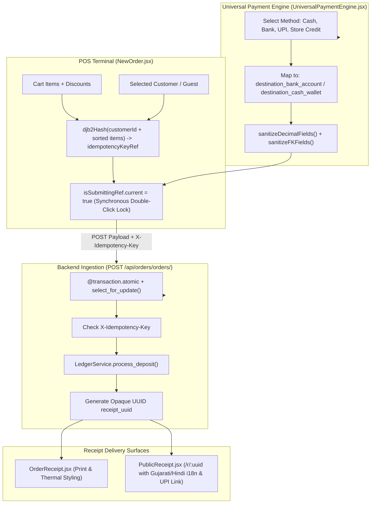

# Architectural Specification: FE-07 Universal Payment Engine & Core POS Checkout

> **Status**: APPROVED  
> **Domain**: POS Register & Order Ingestion  
> **Execution Unit**: `FE-07`  
> **Scope**: 8 Production Source Files (`frontend/src/components/common/UniversalPaymentEngine.jsx`, `frontend/src/pages/orders/NewOrder.jsx`, `frontend/src/pages/NewOrder.css`, `frontend/src/pages/orders/OrderReceipt.jsx`, `frontend/src/pages/orders/OrderReceipt.css`, `frontend/src/pages/public/PublicReceipt.jsx`, `frontend/src/pages/public/PublicReceipt.css`, `frontend/src/pages/orders/EditOrder.jsx`)

---

## 1. Executive Summary & Domain Scope

`FE-07` constitutes the operational heart of AZ Books: the Point of Sale (POS) checkout engine, the universal payment routing ledger, the living receipt presentation surface, and the order modification interface. POS checkout operations demand extreme speed, zero latency jitter, and ironclad financial safeguards: cashiers must be able to scan products rapidly, split payments across diverse instruments (Cash, Bank Transfer, UPI, Store Credit), and issue verified receipts without network race conditions or duplicate submissions.

This unit implements:
1. **Universal Payment Engine (`UniversalPaymentEngine.jsx`)**: The centralized payment component used across all financial interfaces, managing active bank accounts, cash wallets, method-to-ledger mapping, and payload sanitization with hook loop defenses.
2. **High-Speed POS Register (`NewOrder.jsx`)**: A 1,445-line checkout terminal featuring synchronous double-submission locks (`isSubmittingRef`), deterministic content-fingerprinted idempotency keys (`djb2Hash`), on-the-fly quick product creation with WebP compression, and managerial discount overrides.
3. **Internal Staff Receipt Viewer (`OrderReceipt.jsx`)**: A print-optimized receipt viewer (`@media print`) providing thermal printer formatting and WhatsApp share links.
4. **Public Living Receipt (`PublicReceipt.jsx`)**: An unauthenticated, capability-token-secured web receipt (`/r/:token`) supporting multilingual interfaces (Gujarati, Hindi, English) and dynamic UPI deep-links (`upi://pay`).
5. **Controlled Order Editing (`EditOrder.jsx`)**: A state-restricted editor allowing modifications strictly before order confirmation and dispatch.

---

## 2. Component Directory & Member File Manifest

| File Path | Role in Architecture | Key Responsibilities & Invariants |
| :--- | :--- | :--- |
| `frontend/src/components/common/UniversalPaymentEngine.jsx` | Universal Payment Engine | Centralizes payment methods, bank/wallet selectors, and payload sanitization. |
| `frontend/src/pages/orders/NewOrder.jsx` | POS Checkout Terminal | 1,445 lines: cart state, customer search, double-click locks, idempotency keys. |
| `frontend/src/pages/NewOrder.css` | POS Register Styles | Dual-pane layout, fast product search cards, dense accounting summaries. |
| `frontend/src/pages/orders/OrderReceipt.jsx` | Staff Receipt Interface | Thermal print styling, WhatsApp capability link generation, store metadata. |
| `frontend/src/pages/orders/OrderReceipt.css` | Print Media Styles | `@media print` rules removing navigation, buttons, and applying thermal margins. |
| `frontend/src/pages/public/PublicReceipt.jsx` | Public Living Receipt | Opaque UUID route (`/r/:uuid`), i18n (Gujarati/Hindi/English), UPI deep-link. |
| `frontend/src/pages/public/PublicReceipt.css` | Public Receipt Styles | Customer-facing mobile layout, status badges, and UPI QR code styling. |
| `frontend/src/pages/orders/EditOrder.jsx` | Order Amendment View | Restricted editing of unconfirmed draft orders before inventory commitment. |

---

## 3. High-Level Checkout & Payment Architecture



---

## 4. Key Architectural Mechanisms

### 4.1 Synchronous Submission Lock & Content Idempotency (`NewOrder.jsx`)
In high-throughput retail checkout, cashiers frequently double-click the "Complete Sale" button, or network drops trigger automated service worker retries, leading to duplicate orders and double-deducted inventory.

`NewOrder.jsx` enforces a dual-layer defense:

1. **Synchronous Ref Lock (`isSubmittingRef`)**:
   React state updates (`setIsSubmitting(true)`) are asynchronous and batch on the next tick. A cashier clicking twice in $50\text{ms}$ will bypass state checks. `NewOrder.jsx` uses a synchronous ref:
   ```javascript
   if (isSubmittingRef.current) return;
   isSubmittingRef.current = true;
   setIsLoading(true);
   ```
2. **Deterministic Content Fingerprinting (`djb2Hash`)**:
   The idempotency key is deterministically synthesized from the cart contents rather than random timestamps:
   ```javascript
   const djb2Hash = (str) => {
       let hash = 5381;
       for (let i = 0; i < str.length; i++) {
           hash = ((hash << 5) + hash) + str.charCodeAt(i);
           hash = hash & hash;
       }
       return (hash >>> 0).toString(36);
   };

   useEffect(() => {
       if (cartItems.length === 0 || !selectedCustomer) {
           idempotencyKeyRef.current = null;
           return;
       }
       const sortedItems = [...cartItems]
           .sort((a, b) => a.product_id.localeCompare(b.product_id))
           .map(item => `${item.product_id}:${item.quantity}:${item.price}`)
           .join('|');
       const fingerprint = `${selectedCustomer.id}|${sortedItems}|${orderDiscount.value}`;
       idempotencyKeyRef.current = `ord_${djb2Hash(fingerprint)}`;
   }, [cartItems, selectedCustomer, orderDiscount]);
   ```
   If a network dropout causes the client to retransmit, the identical idempotency key is sent, allowing the backend to intercept and return the already-created order without duplication.

### 4.2 Universal Payment Engine Invariants (`UniversalPaymentEngine.jsx`)
`UniversalPaymentEngine` centralizes the financial payload synthesis across the application:

1. **Hook Loop Defense**: Passing an array literal `allowedMethods={['cash', 'bank']}` to a child component causes infinite re-renders because `['cash', 'bank'] !== ['cash', 'bank']` by reference. The engine serializes the array:
   ```javascript
   const allowedMethodsKey = allowedMethods.join(',');
   useEffect(() => {
       // Fetch bank/wallet dependencies
   }, [allowedMethodsKey, fetchWithAuth]);
   ```
2. **Strict Inflow / Outflow Mapping**:
   - `inflow` (e.g. Sales, Deposits): Maps selection to `destination_bank_account` or `destination_cash_wallet`.
   - `outflow` (e.g. Expenses, Refunds): Maps selection to `source_bank_account` or `source_cash_wallet`.
3. **Automated Sanitization**: Invokes `sanitizeDecimalFields` and `sanitizeFKFields`, guaranteeing that empty dropdowns emit `null` rather than `""`.

### 4.3 Public Living Receipt Architecture (`PublicReceipt.jsx`)
Receipts are accessible to external customers without requiring an account or authentication token:

- **Capability Token URI**: Mounted at `/r/:uuid`, where `:uuid` matches `Order.receipt_uuid`. The opaque 128-bit UUID acts as an unguessable capability token.
- **Multilingual Support**: Supports Gujarati (`gu`), Hindi (`hi`), and English (`en`) through a zero-dependency translation dictionary (`STRINGS`), catering to local retail customers across Gujarat.
- **Live State Reflection**: Displays real-time payment progress, outstanding balance, and delivery status directly from the live database.
- **Dynamic UPI Deep-Link**: Synthesizes a standardized UPI URI:
  $$\text{upi://pay?pa=store@upi\&am=BALANCE\&pn=AZ+Books\&tr=ORDER\_ID}$$
  Enables customers to tap "Pay Now" on their mobile device and complete remaining balances via Google Pay, PhonePe, or Paytm.

---

## 5. Security & Permission Visibility Matrix

| Component | Target Action | Required Permission | Architectural Defense |
| :--- | :--- | :--- | :--- |
| **NewOrder** | Create Order | `orders.create_orders` | Gated by `<PermissionRoute>`; aborts if unauthenticated. |
| **NewOrder** | Modify Unit Price | `orders.override_price` | Prompts `<ManagerOverrideModal />` if cashier lacks permission. |
| **NewOrder** | Apply Discount | `orders.apply_order_discount` | Prompts `<ManagerOverrideModal />` if cashier lacks permission. |
| **OrderReceipt** | Staff Receipt View | `orders.view_orders` | Gated by staff auth; renders thermal layout. |
| **PublicReceipt** | Customer Living View | None (Public URI) | Unauthenticated access strictly bounded to opaque `receipt_uuid`. |
| **EditOrder** | Amend Existing Order | `orders.change_orders` | Strictly blocked if `order_status` is already confirmed/delivered. |

---

## 6. Failure Modes & Operational Risk Register

| Failure Vector | Trigger Condition | Architectural Defense | Severity |
| :--- | :--- | :--- | :--- |
| **Rapid Double-Click Duplicate Order**| Cashier double-clicks "Complete Sale" button on slow connection. | Synchronous `isSubmittingRef.current = true` lock blocks secondary clicks. | Critical |
| **Retry Duplicate Transaction** | Flaky network triggers client-side retry of checkout POST. | Deterministic content-fingerprinted idempotency key (`ord_${djb2Hash}`) deduplicates on backend. | Critical |
| **Infinite Payment Loop** | Passing raw array to `UniversalPaymentEngine` props. | Memoized `allowedMethodsKey = allowedMethods.join(',')` stabilizes hook dependencies. | High |
| **Public Receipt Account Scrape** | Malicious crawler attempting to enumerate order receipts. | Unguessable 128-bit UUID capability tokens (`/r/:uuid`) prevent sequential ID scraping. | Critical |
| **Zero-Quantity Order Item** | Cashier inputs quantity 0 or negative number in cart item. | Frontend validator rejects non-positive quantities before payload submission. | High |
