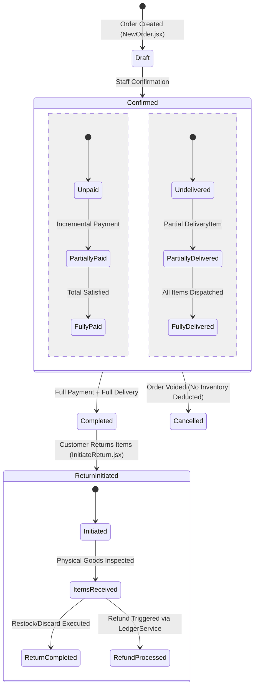

# Architectural Specification: FE-08 Order Management, Receipts & Order History

> **Status**: APPROVED  
> **Domain**: POS & Order Lifecycle  
> **Execution Unit**: `FE-08`  
> **Scope**: 10 Production Source Files (`frontend/src/pages/orders/OrderList.jsx`, `frontend/src/pages/OrderList.css`, `frontend/src/pages/orders/OrderDetails.jsx`, `frontend/src/pages/orders/OrderDetails.css`, `frontend/src/pages/returns/InitiateReturn.jsx`, `frontend/src/pages/returns/InitiateReturn.css`, `frontend/src/pages/returns/ReturnDetails.jsx`, `frontend/src/pages/returns/ReturnDetails.css`, `frontend/src/pages/returns/ReturnsList.jsx`, `frontend/src/pages/returns/ReturnsList.css`)

---

## 1. Executive Summary & Domain Scope

`FE-08` codifies the complete operational lifecycle of orders, delivery fulfillments, return workflows, and audit history tracking in AZ Books. While order entry (`FE-07`) focuses on fast initial capture, `FE-08` governs the long-running post-sale state machine: tracking payment progress, processing partial deliveries, recording customer returns with inventory disposition rules (`restock` vs `discard`), and synchronizing financial refunds.

This unit integrates:
1. **Server-Side Order Ledger (`OrderList.jsx`)**: A high-density data grid powered by `useServerList`, supporting multi-dimensional status filtering across six distinct state dimensions with ISO timestamp boundary normalization.
2. **Order Lifecycle Command Center (`OrderDetails.jsx`)**: A 1,535-line comprehensive operational interface managing incremental payment collections, partial line-item deliveries, single-item price resynchronization (`resync_item_price`), privileged payment corrections, and cancellation protocols.
3. **Customer Return Ingestion Engine (`InitiateReturn.jsx`)**: A structured workflow enabling cashiers to search delivered orders, select specific returned line items within strict quantity ceilings, assign return reasons, and designate inventory disposition.
4. **Return Lifecycle & Refund Integration (`ReturnDetails.jsx`, `ReturnsList.jsx`)**: State progression inspector tracking returns from initiation to physical receipt, linking directly to the financial refund modal.

---

## 2. Component Directory & Member File Manifest

| File Path | Role in Architecture | Key Responsibilities & Invariants |
| :--- | :--- | :--- |
| `frontend/src/pages/orders/OrderList.jsx` | Paginated Order Registry | Multi-filter grid using `useServerList`; ISO timestamp conversion. |
| `frontend/src/pages/OrderList.css` | Order Grid Styles | Dense accounting tables, status pill badges, and mobile card layouts. |
| `frontend/src/pages/orders/OrderDetails.jsx` | Order Command Center | 1,535 lines: status updates, payments, partial delivery, item price resync. |
| `frontend/src/pages/orders/OrderDetails.css` | Command Center Styles | Order summary cards, payment timeline, delivery fulfillment modal styling. |
| `frontend/src/pages/returns/InitiateReturn.jsx` | Return Ingestion Interface | Delivered order search, line item selection, and stock action selection. |
| `frontend/src/pages/returns/InitiateReturn.css` | Return Form Styles | Item checklist cards, quantity steppers, and reason dropdown styles. |
| `frontend/src/pages/returns/ReturnDetails.jsx` | Return Status Controller | Tracks return progression (`initiated` $\to$ `items_received` $\to$ `completed`). |
| `frontend/src/pages/returns/ReturnDetails.css` | Return Inspector Styles | Timeline visualization, items list, and refund trigger controls. |
| `frontend/src/pages/returns/ReturnsList.jsx` | Return Audit Ledger | Server-paginated audit trail of customer returns via `useServerList`. |
| `frontend/src/pages/returns/ReturnsList.css` | Return Ledger Styles | Table layouts, date filters, and status badge alignments. |

---

## 3. High-Level Order & Return State Architecture



---

## 4. Key Architectural Mechanisms

### 4.1 Multi-Dimensional Filter Serialization (`OrderList.jsx`)
Orders in AZ Books possess six independent state dimensions: `order_status`, `payment_status`, `delivery_status`, `return_status`, `refund_status`, and `cancellation_status`.

`OrderList.jsx` maps these into backend Django queries:

```javascript
buildParams: (debouncedSearch, fltrs) => ({
    search: debouncedSearch,
    order_status: fltrs.orderStatus,
    payment_status: fltrs.paymentStatus,
    delivery_status: fltrs.deliveryStatus,
    return_status: fltrs.returnStatus,
    refund_status: fltrs.refundStatus,
    cancellation_status: fltrs.cancellationStatus,
    created_after: fltrs.dateAfter ? `${fltrs.dateAfter}T00:00:00` : '',
    created_before: fltrs.dateBefore ? `${fltrs.dateBefore}T23:59:59` : '',
    ordering: fltrs.ordering,
})
```

- **Date Boundary Normalization**: User calendar dates (e.g. `2026-09-13`) are expanded to full ISO boundary strings (`2026-09-13T00:00:00` and `2026-09-13T23:59:59`), ensuring queries capture all transactions throughout the entire 24-hour business cycle.

### 4.2 Comprehensive Order Command Center (`OrderDetails.jsx`)
`OrderDetails.jsx` governs complex operational actions:

1. **Incremental Payment Capture with Idempotency Guard**:
   Allows recording multiple payments against an order over time (e.g. advance deposit followed by delivery settlement). Protects payment submission with synchronous ref locking (`isPaymentSubmitting.current = true`) and a unique payment idempotency key.
2. **Line-Item Partial Fulfillment**:
   Supports dispatching partial shipments:
   - `deliveryMode = 'all'`: Dispatches remaining unfulfilled quantities for all line items.
   - `deliveryMode = 'partial'`: Emits individual item quantities, enforcing that $\text{quantity} \le (\text{ordered} - \text{already\_delivered})$.
3. **Single Item Price Resynchronization (`resync_item_price`)**:
   If catalog prices change while an order is in draft state, clicking "Resync Price" recalculates the specific line item against current master prices without resetting other customized discounts or quantities.
4. **Privileged Payment Corrections**:
   Modifying historical payments alters bank reconciliation balances. `OrderDetails` restricts payment editing modals strictly to privileged users:
   ```javascript
   const isPrivilegedRole = rbac.role === 'owner' || rbac.role === 'manager' || rbac.is_superuser;
   ```

### 4.3 Return Ingestion & Stock Disposition (`InitiateReturn.jsx`)
Customer returns require accurate inventory accounting:

1. **Ceiling Bounds Enforcement**: Cashiers cannot return more items than were actually delivered ($\text{qty}_{return} \le \text{qty}_{delivered}$).
2. **Stock Action Disposition**:
   - `restock`: Re-injects goods into inventory using the original historical unit cost price (`cost_price`), preventing AVCO skew.
   - `discard`: Marks goods as damaged/unsellable, preventing physical warehouse stock from inflating.
3. **Mandatory Return Reasons**: Requires selecting a validated reason from `ENDPOINTS.RETURN_REASONS` (`Defective`, `Wrong Item`, `Customer Cancellation`, etc.).

---

## 5. Security & Permission Visibility Matrix

| Operation | UI Component | Required Permission | Architectural Constraint |
| :--- | :--- | :--- | :--- |
| **View Order Ledger** | `OrderList` | `orders.view_orders` | Fail-closed route access; paginated read replica queries. |
| **Record Payment** | `OrderDetails` | `orders.record_payment` | Row-locked transaction; updates `LedgerService` balance. |
| **Fulfill Delivery** | `OrderDetails` | `orders.fulfill_orders` | Auto-updates `delivery_status`; generates `DeliveryItem`. |
| **Edit Payment** | `OrderDetails` | Privileged Role (`owner`/`manager`/`admin`) | Requires elevated permissions; verifies bank reconciliation impact. |
| **Initiate Return** | `InitiateReturn`| `orders.manage_returns` | Strictly restricted to confirmed/completed orders. |
| **Cancel Order** | `OrderDetails` | `orders.cancel_orders` | Blocked if any items have already been delivered. |

---

## 6. Failure Modes & Operational Risk Register

| Failure Vector | Trigger Condition | Architectural Defense | Severity |
| :--- | :--- | :--- | :--- |
| **Over-Return Exploitation** | Cashier entering return quantity greater than ordered quantity. | Strict client-side validation clamping `quantity <= delivered_quantity`. | Critical |
| **AVCO Skew on Return** | Restocking goods at current elevated selling price instead of purchase cost. | Backend `StockService` restoring units using frozen historical `cost_price`. | Critical |
| **Duplicate Delivery Dispatch** | Cashier submitting multiple deliveries for the same order items concurrently. | Synchronous `deliverySubmitting` ref lock and backend database row locks. | High |
| **Unauthorized Payment Edit** | Junior cashier modifying a historical payment to hide cash discrepancies. | Role gate restricting payment edits strictly to `owner`, `manager`, or `admin`. | Critical |
| **Voiding Delivered Order** | Cashier clicking Cancel on an order where goods are already delivered. | Backend and frontend disable cancellation once `delivery_status != 'pending'`. | High |
