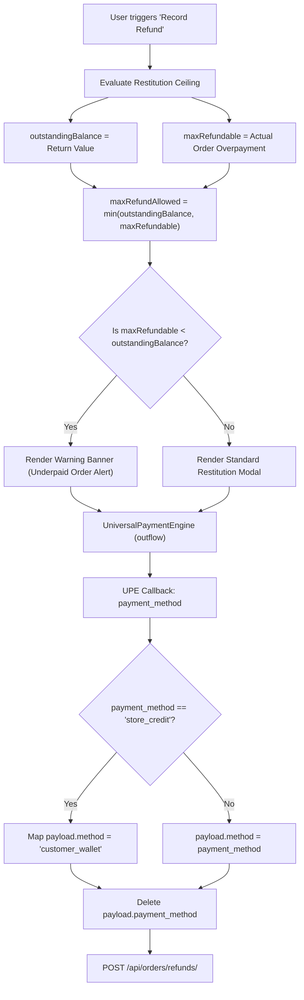
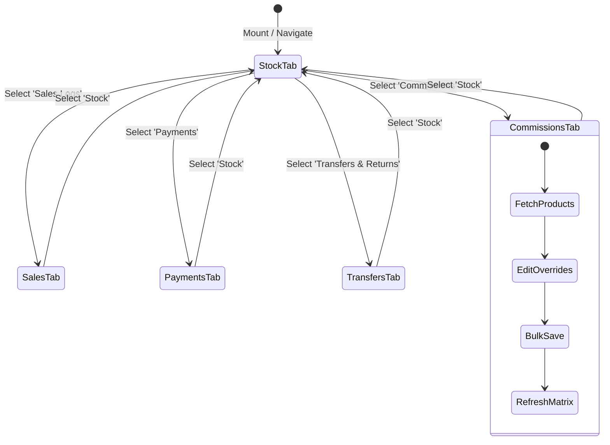

# FE-09: Returns, Refunds & Outlets Consignment Engine

> **Status**: APPROVED  
> **Domain**: Orders & Outlets  
> **Source Files**:  
> - `frontend/src/pages/returns/modals/RefundModal.jsx`  
> - `frontend/src/pages/outlets/OutletsList.jsx`  
> - `frontend/src/pages/outlets/OutletsList.css`  
> - `frontend/src/pages/outlets/AddOutlet.jsx`  
> - `frontend/src/pages/outlets/EditOutlet.jsx`  
> - `frontend/src/pages/outlets/OutletDetails.jsx`  
> - `frontend/src/pages/outlets/OutletDetails.css`  
> - `frontend/src/pages/outlets/OutletForm.css`  
> - `frontend/src/pages/outlets/modals/PaymentModal.jsx`  
> **Execution Order**: 27 of 45  

---

## 1. Architectural Role & Responsibilities

The `FE-09` unit provides the commercial reconciliation bridge between customer order returns, cash restitution, and B2B consignment outlet ledger management:
1. **Clamped Restitution Gateway (`RefundModal.jsx`)**: Enforces dual-ceiling validation preventing refund payouts from exceeding actual customer net overpayment, mapping `<UniversalPaymentEngine />` outputs to backend legacy schemas.
2. **B2B Outlet Directory (`OutletsList.jsx`)**: Server-side paginated master registry tracking retail partner contact personas, activity states, and live outstanding balances.
3. **Outlet Lifecycle Form Management (`AddOutlet.jsx`, `EditOutlet.jsx`)**: Validated profile mutation maintaining communication channels and active/inactive operational status.
4. **Command Hub & Unified Balance Ledger (`OutletDetails.jsx`)**: 960-line operational cockpit featuring real-time financial summary KPI cards, 5-tab multi-entity sub-ledgers (Stock, Sales, Payments, Transfers/Returns, Commission Matrix), and commission override bulk persistence.
5. **Inflow Financial Ingestion (`PaymentModal.jsx`)**: Centralized ledger settlement logging payments received from consignment partners, routing inflows through cash wallets or bank accounts via the UPE.

---

## 2. Core Workflows & State Machines

### 2.1 Restitution Ceilings & UPE Schema Adaptation

When an order return is accepted, customer restitution is bounded by an absolute mathematical ceiling. If an order was originally underpaid, returning delivered goods does not entitle the customer to a full cash refund of the returned items' value.

Mathematical Restitution Invariant:
$$\text{Max Refund Allowed} = \min\left(\text{Outstanding Balance}, \text{Max Refundable}\right)$$

---

### 2.2 Consignment Outlet Balance & Tab Navigation Machine

`OutletDetails.jsx` maintains an interactive tab state machine that selectively queries sub-resources upon activation while preserving route synchronization:

---

## 3. Data Contracts & UI Specifications

### 3.1 Component Interface Catalog

| Component | Props / Route Params | Primary Hooks / Contexts | Target API Endpoint | Purpose |
| :--- | :--- | :--- | :--- | :--- |
| `RefundModal` | `isOpen`, `onClose`, `returnId`, `orderId`, `orderDisplayId`, `outstandingBalance`, `maxRefundable`, `onRefundComplete` | `useAuth`, `useToast`, `useCurrency`, `useState`, `useEffect` | `POST /api/orders/refunds/` | Dispatches restitution disbursements with dual-ceiling bounds check |
| `OutletsList` | Route: `/outlets` | `useServerList`, `useCurrency`, `useNavigate` | `GET /api/outlets/` | Displays wholesale partner directory with color-coded balance badges |
| `AddOutlet` | Route: `/outlets/add` | `useAuth`, `useToast`, `useNavigate`, `useState` | `POST /api/outlets/` | Registers new partner profiles and redirects to detail command center |
| `EditOutlet` | Route: `/outlets/:id/edit` | `useAuth`, `useToast`, `useNavigate`, `useParams`, `useState` | `GET /api/outlets/{id}/`, `PUT /api/outlets/{id}/` | Updates contact details and operational active toggle |
| `OutletDetails` | Route: `/outlets/:id` | `useAuth`, `useCurrency`, `useToast`, `useParams`, `useLocation` | `GET /api/outlets/{id}/`, sub-resource endpoints | Master 960-line consignment command hub and ledger matrix |
| `PaymentModal` | `isOpen`, `onClose`, `outletId`, `outstandingBalance`, `onPaymentComplete` | `useAuth`, `useToast`, `useState`, `useEffect` | `POST /api/outlets/payments/` | Logs wholesale customer settlements into bank or physical cash wallets |

---

### 3.2 Outlet Financial Aggregates & Balance Calculations

`OutletDetails.jsx` aggregates 4 primary financial metrics rendered on glass stat cards:

| Metric Field | Source Model Column | UI Presentation Class | Business Significance |
| :--- | :--- | :--- | :--- |
| `total_gross_sales` | `Outlet.total_gross_sales` | Standard Metric | Cumulative retail value of all items sold by the consignment partner |
| `total_commission` | `Outlet.total_commission` | Standard Metric | Total commission withheld by the outlet under contracted rates |
| `total_net_sales` | `Outlet.total_net_sales` | Standard Metric | $\text{Gross Sales} - \text{Commission Withheld} = \text{Net Store Receivable}$ |
| `total_paid` | `Outlet.total_paid` | `text-success` | Cumulative settlement payments received and deposited into store accounts |
| `outstanding_balance` | `Outlet.outstanding_balance` | $\text{Bal} > 0$ ? `text-danger` : `text-success` | Net amount currently owed: $\text{Total Net Sales} - \text{Total Paid}$ |

---

### 3.3 Commission Override Matrix Invariant

`OutletDetails.jsx` implements an inline matrix allowing custom commission rates per product for each outlet:
- Overrides are stored in local state as a map: `{ [productId]: { type: 'percent' | 'fixed', value: string } }`.
- When saved, modified overrides are sent as an array payload to `POST /api/outlets/commissions/bulk_update/`.
- Cleared overrides (where an override previously existed on the server but was removed locally) trigger explicit `DELETE` calls to `/api/outlets/commissions/{id}/` to revert the product to catalog default rates.

---

## 4. Failure Modes & Edge Case Protections

| Failure Vector | Trigger Condition | System Defense Mechanism | Resulting State |
| :--- | :--- | :--- | :--- |
| **Restitution Over-Refund** | Cashier attempts to refund full returned item value on an order that had a pending unpaid balance. | Client clamps max input to `Math.min(outstandingBalance, maxRefundable)` and displays an explanation banner. | Financial ledger drain prevented; cashier cannot exceed cash overpayment. |
| **UPE Legacy Key Rejection** | UniversalPaymentEngine emits `store_credit` as payment method string. | `RefundModal.jsx` re-maps `payment_method` to `customer_wallet` and deletes original key. | DRF serializer validates `method` cleanly without rejecting field schema. |
| **Commission Rate Drift on Save** | User edits 10 products on page 2 of commission tab while having unsaved edits on page 1. | State `overrides` persists globally in component memory across pagination transitions until explicit `handleSaveCommissions()` execution. | No edits lost during multi-page pagination or filter adjustments. |
| **Modal State Pollution** | User opens refund modal, fills notes, cancels, and opens another order's refund. | `useEffect` keyed to `!isOpen` resets `formData`, `refundPayload`, and transaction IDs. | Next modal opens with pristine state; zero cross-order pollution. |
| **Zero Outstanding Inflow Attempt** | Cashier logs payment when outlet has zero or negative balance. | `PaymentModal.jsx` sets `initialAmount` and `maxAmount` to `outstandingBalance` while UPE enforces zero-floor constraint. | Prevents ghost deposit records that corrupt outlet net ledger. |

---

## 5. Verification & Integrity Checklist

- [x] Restitution bounds strictly enforce $\min(\text{outstanding}, \text{refundable})$ ceiling.
- [x] UPE output cleanly maps `store_credit` to `customer_wallet` for order refunds.
- [x] Modal state resets strictly execute on `!isOpen` to avoid mid-interaction re-renders.
- [x] `OutletDetails.jsx` financial cards accurately reflect gross sales, commissions, net sales, and live receivables.
- [x] Commission overrides support both `percent` and `fixed` modalities with bulk persistence and deletion cascades.
