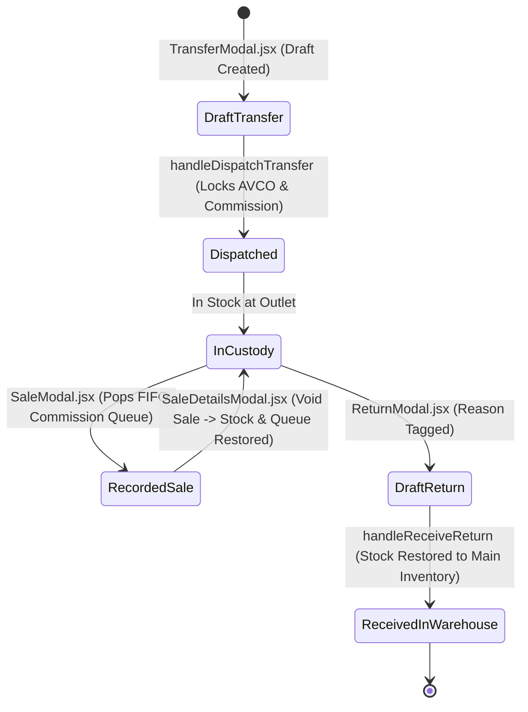
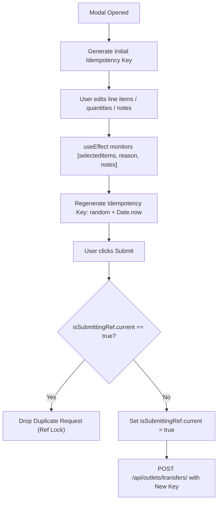
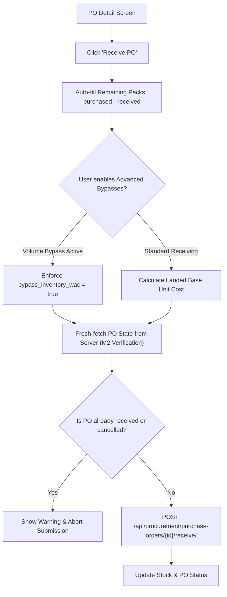

# FE-10: Outlets Modals & Stock Movement Transactions

> **Status**: APPROVED  
> **Domain**: Outlets & Procurement  
> **Source Files**:  
> - `frontend/src/pages/outlets/modals/ReturnDetailsModal.jsx`  
> - `frontend/src/pages/outlets/modals/ReturnModal.jsx`  
> - `frontend/src/pages/outlets/modals/SaleDetailsModal.jsx`  
> - `frontend/src/pages/outlets/modals/SaleModal.jsx`  
> - `frontend/src/pages/outlets/modals/TransferDetailsModal.jsx`  
> - `frontend/src/pages/outlets/modals/TransferModal.jsx`  
> - `frontend/src/pages/procurement/ProcurementList.jsx`  
> - `frontend/src/pages/procurement/CreatePO.jsx`  
> - `frontend/src/pages/procurement/PODetail.jsx`  
> **Execution Order**: 28 of 45  

---

## 1. Architectural Role & Responsibilities

The `FE-10` unit bridges consignment stock custodial transfers, partner retail sale popping, and warehouse procurement fulfillment:
1. **Consignment Transfer Lifecycle (`TransferModal.jsx`, `TransferDetailsModal.jsx`)**: Drafts and dispatches multi-item stock transfers from central inventory to retail partner custody, freezing historical AVCO cost price and locking agreed commission rates.
2. **Dynamic Idempotency Shielding**: Implements dynamic payload-dependent idempotency key regeneration to eradicate the **"Silent Betrayal"** race condition (replaying stale keys after modifying transfer line items).
3. **Daily Sale Recording & Commission FIFO Popping (`SaleModal.jsx`, `SaleDetailsModal.jsx`)**: Records outlet sales against active consignment stock, popping historical transfer commission batches via backend FIFO logic, while supporting single-click reversible voids that restore stock and re-queue commission tiers.
4. **Consignment Stock Restitution (`ReturnModal.jsx`, `ReturnDetailsModal.jsx`)**: Drafts multi-item returns with validated reasons (unsold, damage, recall, overstock), enforcing receiving confirmation before warehouse stock restoration.
5. **Procurement Master & Ingestion Pipeline (`ProcurementList.jsx`, `CreatePO.jsx`, `PODetail.jsx`)**: Manages purchase order lifecycle (draft, ordered, partially received, received), automated pack atomization to base units, landed charge allocation, and advanced bypass mechanics for historical ledger reconciliations.

---

## 2. Core Workflows & State Machines

### 2.1 Outlets Consignment Stock Transfer & Restitution Lifecycle

Consignment inventory moves under strict custodial tracking without triggering premature revenue recognition:

---

### 2.2 Dynamic Idempotency & "The Silent Betrayal" Defense

In rapid POS or consignment operations, caching an idempotency key at modal open leads to duplicate key reuse if line items are subsequently modified. `TransferModal.jsx`, `ReturnModal.jsx`, and `SaleModal.jsx` enforce payload-dependent regeneration:

---

### 2.3 Procurement PO Receiving & Mathematical Bypass Invariants

In `PODetail.jsx`, receiving goods calculates landed costs while supporting forensic migration bypasses:

Mathematical Bypass Invariant:
$$\text{Bypass Inventory Volume} \implies \text{Bypass Inventory WAC} = \text{True}$$
*Rationale*: Adding landed charges to stock without recording received physical volume yields a zero or negative denominator in weighted average cost (WAC) calculations, corrupting asset valuation.

---

## 3. Data Contracts & UI Specifications

### 3.1 Modal & Page Specification Catalog

| Component | Props / Route Params | Primary Contexts / Hooks | API Interactions | Key Features |
| :--- | :--- | :--- | :--- | :--- |
| `TransferModal` | `isOpen`, `onClose`, `outletId`, `onTransferComplete`, `initialData` | `useAuth`, `useToast`, `useRef`, `useState`, `useEffect` | `POST` / `PUT` `/api/outlets/transfers/` | Draft vs dispatch transfers; dynamic idempotency regeneration; live catalog search |
| `TransferDetailsModal` | `isOpen`, `onClose`, `transfer` | Stateless UI Modal | Displays line items | Renders frozen AVCO cost price and locked commission rates (`%` or `₹`) |
| `ReturnModal` | `isOpen`, `onClose`, `outletId`, `onReturnComplete` | `useAuth`, `useToast`, `useRef`, `useState` | `POST /api/outlets/returns/` | 10 return reasons (unsold, damage, recall, etc.); clamps return quantity to available stock |
| `ReturnDetailsModal` | `isOpen`, `onClose`, `returnRecord` | Stateless UI Modal | Displays line items | Status badge (`draft` vs `received`); full audit notes |
| `SaleModal` | `isOpen`, `onClose`, `outletId`, `onSaleComplete` | `useAuth`, `useToast`, `useState`, `useEffect` | `POST /api/outlets/sales/` | Daily sales recording against available consignment stock; triggers backend FIFO popping |
| `SaleDetailsModal` | `isOpen`, `onClose`, `sale` | Stateless UI Modal | Calls `sale.onVoid()` callback | Detailed gross, commission, and net breakdown; single-click reversible void action |
| `ProcurementList` | Route: `/procurement` | `useServerList`, `useAuth`, `useNavigate` | `GET /api/procurement/purchase-orders/`, `GET /api/procurement/analytics/` | Server-side paginated PO directory; status/vendor filters; cost analytics tab |
| `CreatePO` | Route: `/procurement/new` | `useAuth`, `useToast`, `useNavigate`, `useRef` | `POST /api/procurement/purchase-orders/create-po/` | Base-unit pack conversion; additional charges; double-submit lock |
| `PODetail` | Route: `/procurement/:id` | `useAuth`, `useToast`, `useNavigate`, `useParams` | `/receive/`, `/reverse/`, `/charges/`, `/payments/` | Partial/full receiving; receipt reversals; UPE procurement payments; bypass toggles |

---

### 3.2 Pack Conversion & Cost Partitioning (`CreatePO.jsx`)

When purchase orders include multi-pack variants, `CreatePO.jsx` partitions pack sizes into base units:

$$\text{Base Unit Cost} = \begin{cases} \dfrac{\text{raw\_cost}}{\text{pack\_size}} & \text{if } \text{is\_pack} = \text{True} \\ \text{raw\_cost} & \text{otherwise} \end{cases}$$

$$\text{Total Ordered Quantity} = \text{purchased\_packs} \times \text{vendor\_pack\_size}$$

$$\text{Line Total} = \text{purchased\_packs} \times \text{vendor\_pack\_size} \times \text{unit\_cost\_price}$$

---

## 4. Failure Modes & Edge Case Protections

| Failure Mode | Root Cause Scenario | Protective Architecture | System Outcome |
| :--- | :--- | :--- | :--- |
| **"The Silent Betrayal"** | Operator opens Transfer modal, selects 3 items, changes mind, adds 2 different items, and submits. | `useEffect` regenerates `idempotencyKey` whenever `selectedItems` change. | Prevents backend deduplicator from dropping modified transfer as a duplicate. |
| **Consignment Over-Return** | Partner attempts to return more units than currently present in outlet custody. | `handleUpdateQuantity` clamps input: `Math.min(Math.max(1, qty), item.maxQty)`. | Input ceiling physically bounds returns to registered outlet stock. |
| **Concurrent Double-Receiving** | Operator clicks "Receive PO" twice rapidly or two warehouse staff receive simultaneously. | M2 verification fresh-fetches server PO state before submission; drops request if status is `received`. | Eliminates double-dispatching inventory increments. |
| **WAC Asset Explosion** | Admin enables "Volume Bypass" during historical data entry without checking WAC bypass. | Synchronous effect forces `bypass_inventory_wac = true` whenever `bypass_inventory_volume = true`. | Protects inventory valuation from division-by-zero or zero-volume denominator errors. |
| **Reversible Void Asymmetry** | Partner voids a daily sale from 2 weeks ago where stock had a promotional commission. | `SaleDetailsModal` void action calls backend which prepends popped batches back to FIFO queue. | Restores exact historical commission breakdown rather than applying current default rates. |

---

## 5. Verification & Integrity Checklist

- [x] `TransferModal.jsx` and `SaleModal.jsx` dynamically regenerate idempotency keys on item mutations.
- [x] `TransferDetailsModal.jsx` displays frozen cost price and locked commission rates from snapshot.
- [x] `ReturnModal.jsx` strictly validates return quantities against outlet available balance.
- [x] `SaleDetailsModal.jsx` supports reversible voiding with stock restoration.
- [x] `CreatePO.jsx` calculates base unit costs via integer pack size division.
- [x] `PODetail.jsx` enforces the mathematical rule: Volume Bypass implies WAC Bypass.
