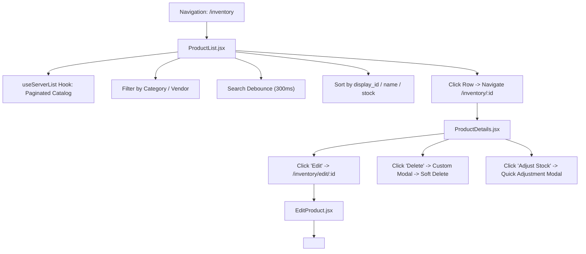
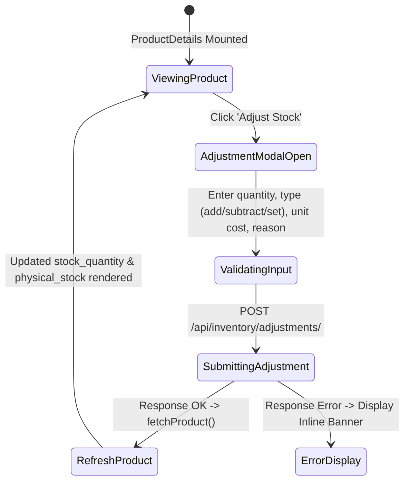

# FE-11: Procurement Services & Inventory Catalog

> **Status**: APPROVED  
> **Domain**: Procurement & Inventory  
> **Source Files**:  
> - `frontend/src/pages/procurement/Transporters.jsx`  
> - `frontend/src/services/procurementService.js`  
> - `frontend/src/pages/inventory/ProductList.jsx`  
> - `frontend/src/pages/inventory/ProductList.css`  
> - `frontend/src/pages/inventory/ProductDetails.jsx`  
> - `frontend/src/pages/inventory/ProductDetails.css`  
> - `frontend/src/pages/inventory/AddProduct.jsx`  
> - `frontend/src/pages/inventory/AddProduct.css`  
> - `frontend/src/pages/inventory/EditProduct.jsx`  
> **Execution Order**: 29 of 45  

---

## 1. Architectural Role & Responsibilities

The `FE-11` unit governs the core master catalog, procurement logistics, and physical item introspection:
1. **Centralized Procurement Endpoint Bus (`procurementService.js`)**: Exports standardized URL builders and resource endpoints for purchase orders, stock receiving, reversals, charges, and logistics partners.
2. **Logistics & Fleet Registry (`Transporters.jsx`)**: Manages third-party freight carriers, contact personas, vehicle capacity classifications, and active shipping status.
3. **Master Catalog Browser (`ProductList.jsx`)**: Server-side paginated product table with multi-column sorting, live debounced search, category/vendor filters, and visual stock-level status badges (`in-stock`, `low-stock`, `out-of-stock`).
4. **Product Deep Introspection & Quick Stock Adjustments (`ProductDetails.jsx`)**: 344-line item view featuring image lightbox previews, metadata breakdowns, inline stock adjustment modal with landed cost inputs, and custom soft-delete confirmation dialogs.
5. **Polymorphic Creation & Edit Wrappers (`AddProduct.jsx`, `EditProduct.jsx`)**: Route-level wrappers embedding the shared `<ProductForm />` component, handling server-side data hydration for modifications.

---

## 2. Core Workflows & Navigation Topology

### 2.1 Inventory Product Browsing & Detail Navigation



---

### 2.2 Quick Stock Adjustment Workflow (`ProductDetails.jsx`)

When warehouse staff or managers need to adjust physical stock directly from the product view:



---

## 3. Data Contracts & UI Specifications

### 3.1 Component & Service Catalog

| Component / File | Route / Role | Primary Hooks / Contexts | API Target | Responsibilities |
| :--- | :--- | :--- | :--- | :--- |
| `procurementService.js` | Service Module | Pure URL builders | `API_BASE/procurement/...` | Centralizes procurement REST endpoints and parameterized action paths |
| `Transporters.jsx` | Route: `/procurement/transporters` | `useAuth`, `useToast`, `useState`, `useEffect` | `GET`/`POST`/`PUT` `/api/procurement/transporters/` | CRUD for transport logistics partners, vehicle fleet types, and contact numbers |
| `ProductList.jsx` | Route: `/inventory` | `useServerList`, `useAuth`, `useCurrency`, `useNavigate` | `GET /api/inventory/products/` | Master catalog browser, search debouncing, category/vendor filtering, stock status badges |
| `ProductDetails.jsx` | Route: `/inventory/:id` | `useAuth`, `useCurrency`, `useParams`, `useNavigate` | `GET`/`DELETE` `/api/inventory/products/{id}/`, `POST /api/inventory/adjustments/` | Item details, image lightbox, inline quick adjustments, soft-delete confirmation modal |
| `AddProduct.jsx` | Route: `/inventory/add` | Route Wrapper | Delegates to `ProductForm` | Mounts creation form with clean initial state |
| `EditProduct.jsx` | Route: `/inventory/edit/:id` | `useAuth`, `useParams`, `useNavigate`, `useState` | `GET /api/inventory/products/{id}/` | Hydrates product data and passes `isEdit={true}` to `ProductForm` |

---

### 3.2 Product Stock Status Hierarchy (`ProductList.jsx`)

Stock status badges are dynamically derived on the client from product attributes:

| Condition | Status Class | Badge Label | Visual Presentation |
| :--- | :--- | :--- | :--- |
| $\text{stock\_quantity} \le 0$ | `out-of-stock` | Out of Stock | Red background badge |
| $\text{stock\_quantity} \le \text{low\_stock\_threshold}$ (default: 5) | `low-stock` | Low Stock | Amber/Warning background badge |
| $\text{stock\_quantity} > \text{low\_stock\_threshold}$ | `in-stock` | In Stock | Green background badge |

---

### 3.3 Procurement Service URL Mapping Matrix

Centralized endpoint definitions exported by `procurementService.js`:

```javascript
PROCUREMENT_ENDPOINTS = {
    PURCHASE_ORDERS: `${API_BASE}/procurement/purchase-orders/`,
    CREATE_PO:       `${API_BASE}/procurement/purchase-orders/create-po/`,
    ANALYTICS:       `${API_BASE}/procurement/purchase-orders/analytics/`,
    TRANSPORTERS:    `${API_BASE}/procurement/transporters/`,
    CHARGES:         `${API_BASE}/procurement/purchase-charges/`,
    PAYMENTS:        `${API_BASE}/procurement/purchase-payments/`,
}
```

Parameterized URL builders:
- `getPurchaseOrderUrl(id)`: Returns `${PURCHASE_ORDERS}${id}/`
- `getReceiveUrl(id)`: Returns `${PURCHASE_ORDERS}${id}/receive/`
- `getReverseUrl(id)`: Returns `${PURCHASE_ORDERS}${id}/reverse/`

---

## 4. Failure Modes & Edge Case Protections

| Failure Mode | Root Cause Scenario | Protective Architecture | System Outcome |
| :--- | :--- | :--- | :--- |
| **Accidental Product Deletion** | Operator clicks delete on a high-velocity product. | LENS-06 modal requires explicit secondary confirmation button before dispatching `DELETE`. | Eliminates accidental one-click catalog deletions. |
| **Foreign Key Constraint Deletion Block** | Operator attempts to delete a product already referenced in historical sales orders. | LENS-08 catches backend error and renders an inline warning banner (`form-error-banner`). | Clean non-blocking user feedback instead of ugly browser alert or unhandled crash. |
| **Stale Search Input Stacking** | User types rapidly in the catalog search bar, dispatching 10 overlapping HTTP requests. | LENS-03 debounces search input by 300ms, cancelling inflight requests via `useServerList` `AbortController`. | Zero UI flickering; results strictly match final typed query. |
| **Adjustment Unit Cost Omission** | Warehouse staff enters an 'add' stock adjustment without specifying a unit cost price. | `ProductDetails.jsx` treats `unitCost` as optional; backend uses current product AVCO if omitted. | Stock count increases safely without zeroing out product valuation. |
| **Dead-Link Image Previews** | Product has broken or missing image URLs in catalog. | Media path defaults to `MEDIA_BASE` fallback with image onError error boundary. | UI renders placeholder without broken image icon or layout shift. |

---

## 5. Verification & Integrity Checklist

- [x] `procurementService.js` provides centralized endpoint resolution with zero hardcoded URLs.
- [x] `Transporters.jsx` debounces searches and handles full CRUD operations.
- [x] `ProductList.jsx` evaluates stock status thresholds dynamically and leverages `GuardedAction` for RBAC.
- [x] `ProductDetails.jsx` supports inline quick stock adjustments with reason tracking.
- [x] `AddProduct.jsx` and `EditProduct.jsx` cleanly delegate rendering to `<ProductForm />`.
