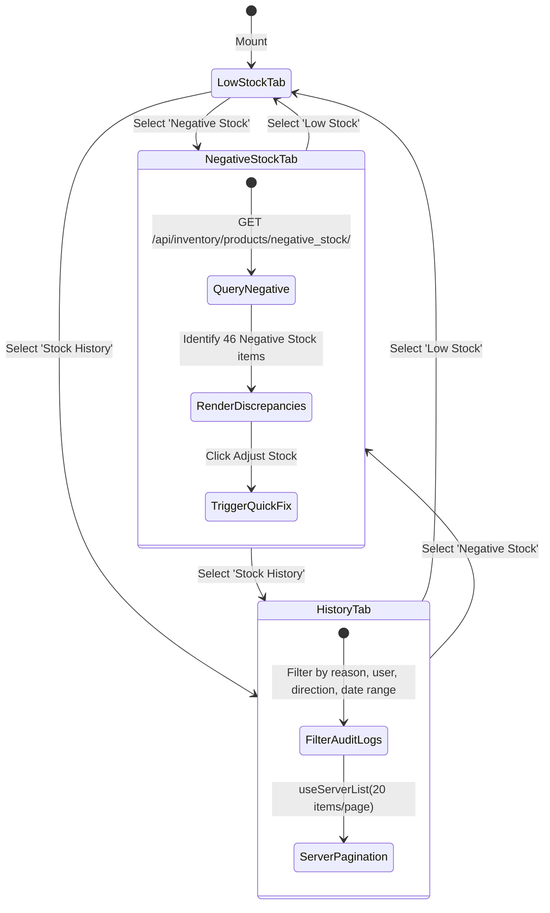
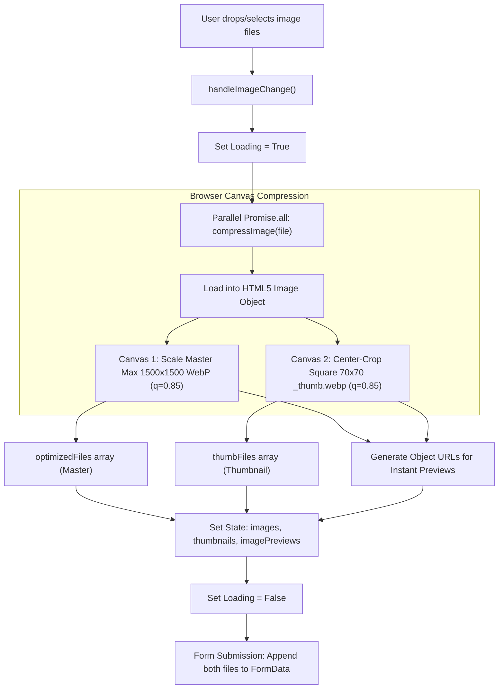
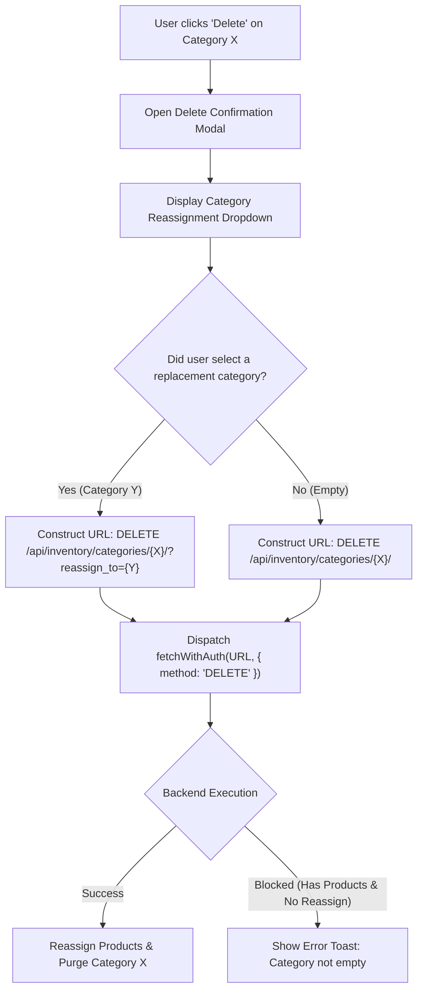

# FE-12: Inventory Stock Control & Product Components

> **Status**: APPROVED  
> **Domain**: Inventory Domain  
> **Source Files**:  
> - `frontend/src/pages/inventory/StockControl.jsx`  
> - `frontend/src/pages/inventory/StockControl.css`  
> - `frontend/src/pages/inventory/Categories.jsx`  
> - `frontend/src/pages/inventory/Vendors.jsx`  
> - `frontend/src/pages/inventory/DeletedProducts.jsx`  
> - `frontend/src/pages/inventory/DeletedProducts.css`  
> - `frontend/src/components/inventory/ProductForm.jsx`  
> - `frontend/src/components/inventory/ProductForm.css`  
> - `frontend/src/components/inventory/CategoryModal.jsx`  
> - `frontend/src/components/inventory/VendorModal.jsx`  
> **Execution Order**: 30 of 45  

---

## 1. Architectural Role & Responsibilities

The `FE-12` unit embodies the physical inventory auditing center, taxonomy management, soft-deleted catalog recovery, and the master product creation/editing engine:
1. **Physical Stock Control & Discrepancy Auditing (`StockControl.jsx`)**: 627-line central warehouse console partitioning inventory into 3 operational audit tabs: Low Stock alerts, Negative Stock discrepancy queues (crucial for ledger reconciliation), and server-side paginated Stock History logs.
2. **Comprehensive Stock Adjustment Modal**: Supports multi-type inventory adjustments (`add`, `subtract`, `set`), landed unit cost inputs, reason tracking (`adjustment`, `damage`, `theft`, `cycle_count`), and searchable product selection (LENS-12).
3. **Soft-Deleted Product Cemetery & Recovery (`DeletedProducts.jsx`)**: Dedicated isolation view for soft-deleted catalog records, providing single-click restoration (`restore/`) and administrative permanent purging (`hard_delete/`).
4. **Taxonomy & Partner Hierarchy (`Categories.jsx`, `Vendors.jsx`, `CategoryModal.jsx`, `VendorModal.jsx`)**: Master category and vendor registries with safe category deletion via reassignment gates (`?reassign_to=...`) and RBAC contact privacy stripping for cashiers.
5. **Master Product Mutation Engine (`ProductForm.jsx`)**: 705-line unified form handling product creation and editing, featuring client-side Canvas dual-WebP compression, commission margin bounds validation, and inline taxonomy modal spawning.

---

## 2. Core Workflows & State Machines

### 2.1 Warehouse Stock Control & Discrepancy Queues

`StockControl.jsx` acts as the physical inventory command center, actively querying critical operational states:

---

### 2.2 Client-Side Image Processing & Upload Pipeline (`ProductForm.jsx`)

To minimize bandwidth and eliminate server-side thumbnail generation bottlenecks, `ProductForm.jsx` integrates client-side Canvas processing before network transmission:

Bandwidth Reduction Impact:
$$\text{Average Original Image} \approx 3.8\,\text{MB} \xrightarrow{\text{Dual WebP Compression}} \text{Master} \approx 120\,\text{KB} + \text{Thumb} \approx 4\,\text{KB} \quad (>96.7\% \text{ reduction})$$

---

### 2.3 Safe Category Deletion with Reassignment (`Categories.jsx`)

Deleting an active category without reassigning associated products risks database constraint violations or orphan product records:

---

## 4. Data Contracts & UI Specifications

### 4.1 Component Catalog

| Component | Route / Modal Role | Primary Hooks / Contexts | Target API Endpoint | Responsibilities |
| :--- | :--- | :--- | :--- | :--- |
| `StockControl` | Route: `/inventory/stock-control` | `useAuth`, `useLocation`, `useServerList`, `useRef`, `useState` | `/products/low_stock/`, `/products/negative_stock/`, `/stock-history/`, `/adjustments/` | Warehouse audit center; low stock & negative stock discrepancy queues; stock adjustment modal |
| `DeletedProducts` | Route: `/inventory/deleted` | `useAuth`, `useNavigate`, `useLocation`, `useState`, `useCallback` | `GET /api/inventory/products/deleted/`, `POST .../restore/`, `POST .../hard_delete/` | Soft-deleted product graveyard; one-click restore; permanent purging confirmation |
| `Categories` | Route: `/inventory/categories` | `useAuth`, `useToast`, `useState`, `useCallback` | `GET`/`DELETE` `/api/inventory/categories/` | Taxonomy directory; safe category deletion with query parameter reassignment |
| `Vendors` | Route: `/inventory/vendors` | `useAuth`, `useToast`, `useState`, `useCallback` | `GET`/`DELETE` `/api/inventory/vendors/` | Supplier directory; deletion modal; RBAC field masking |
| `ProductForm` | Shared Component | `useAuth`, `useCurrency`, `usePermissions`, `useNavigate`, `useState` | `POST`/`PUT` `/api/inventory/products/` | 705-line product master form; dual-WebP compression; commission bounds; inline modals |
| `CategoryModal` | UI Modal | `useAuth`, `useState`, `useEffect` | `POST`/`PUT` `/api/inventory/categories/` | Inline category creation/editing without page navigation |
| `VendorModal` | UI Modal | `useAuth`, `usePermissions`, `useState`, `useEffect` | `POST`/`PUT` `/api/inventory/vendors/` | Inline vendor creation; strips email/phone if user lacks `finance.manage_expenses` |

---

### 4.2 Commission Bounds Validation Math (`ProductForm.jsx`)

`ProductForm.jsx` enforces rigorous client-side mathematical bounds on default commission rates before form submission:

1. **Fixed Commission Bound**:
   $$\text{Fixed Commission Value} \le \text{Selling Price}$$
   *Validation Rule*: A flat commission payout cannot exceed the total retail price of the item.

2. **Percentage Commission Margin Bound**:
   $$\text{Gross Margin} = \max(0, \text{Selling Price} - \text{Cost Price})$$
   $$\text{Computed Commission} = \begin{cases} \dfrac{\text{Commission Value}}{100} \times \text{Gross Margin} & \text{if } \text{Gross Margin} > 0 \\ 0 & \text{otherwise} \end{cases}$$
   $$\text{Computed Commission} \le \text{Selling Price}$$

---

## 5. Failure Modes & Edge Case Protections

| Failure Mode | Root Cause Scenario | Protective Architecture | System Outcome |
| :--- | :--- | :--- | :--- |
| **Negative Stock Drift** | Rapid POS checkouts or manual inventory mismatches drive stock below zero. | `StockControl.jsx` maintains dedicated `Negative Stock` queue querying `/products/negative_stock/` for forensic triage. | Staff can immediately identify negative-stock products and execute adjustment resets. |
| **Unsaved Form State Loss on Taxonomy Add** | User is filling out 15 fields in `ProductForm`, discovers category or vendor is missing. | Clicking "+ Add Category" opens `CategoryModal` as an overlay, adding the item and auto-selecting it in `ProductForm` state. | Form data remains completely intact; zero user re-entry required. |
| **Cashier Wholesale Margin Peeking** | Cashier inspects DOM or enters edit view on high-margin products. | `ProductForm` evaluates `hasPermission('finance.manage_expenses') || hasPermission('finance.view_reports')`; cost inputs are completely removed from DOM if unauthorized. | Wholesale supplier costs and profit margins remain strictly confidential. |
| **Vendor Contact Data Leakage** | Unauthorized staff uses VendorModal to inspect supplier phone numbers or email addresses. | `VendorModal` strips `contact_email` and `contact_phone` from submission payload and hides input fields for unauthorized users. | Supplier direct channels protected from unauthorized contact. |
| **Permanent Deletion of Live Product** | User attempts to permanently purge a product directly from the active inventory view. | Permanent hard-deletion (`hard_delete/`) is strictly isolated inside `DeletedProducts.jsx`; active products must undergo soft-delete first. | Dual-stage destruction barrier prevents catastrophic catalog loss. |

---

## 6. Verification & Integrity Checklist

- [x] `StockControl.jsx` provides isolated tabs for Low Stock, Negative Stock, and Stock History.
- [x] Quick stock adjustments support `add`, `subtract`, and `set` modes with reason tracking.
- [x] `DeletedProducts.jsx` supports both non-destructive restore and permanent purge.
- [x] `Categories.jsx` supports safe deletion with product reassignment via `?reassign_to=`.
- [x] `ProductForm.jsx` integrates client-side Canvas WebP dual compression ($1500\times 1500$ and $70\times 70$ thumbnail).
- [x] Commission values are validated against selling price and gross margins to prevent negative store yields.
- [x] RBAC guards strictly mask wholesale cost and vendor contact details from unauthorized staff.
