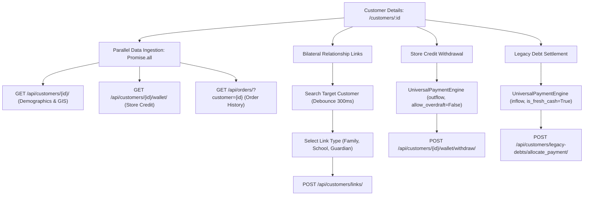
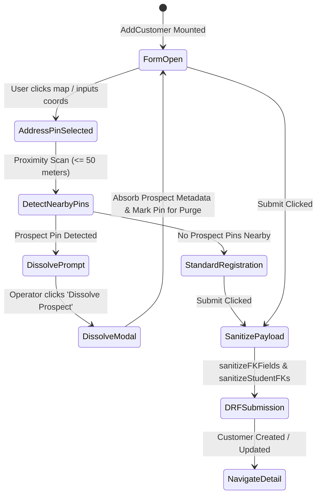

# FE-13: Customer Directory, Profiling & Registration

> **Status**: APPROVED  
> **Domain**: Customer Domain  
> **Source Files**:  
> - `frontend/src/pages/customers/CustomerList.jsx`  
> - `frontend/src/pages/customers/CustomerList.css`  
> - `frontend/src/pages/customers/CustomerDetails.jsx`  
> - `frontend/src/pages/customers/CustomerDetails.css`  
> - `frontend/src/pages/customers/AddCustomer.jsx`  
> - `frontend/src/pages/customers/AddCustomer.css`  
> - `frontend/src/components/StudentEducationBlock.jsx`  
> - `frontend/src/components/common/SchoolStructureTree.jsx`  
> - `frontend/src/components/common/SchoolStructureTree.css`  
> **Execution Order**: 31 of 45  

---

## 1. Architectural Role & Responsibilities

The `FE-13` unit governs customer identity, household relationship networks, educational demographics, and profile registration:
1. **Customer Directory Console (`CustomerList.jsx`)**: Server-side paginated master registry with live debounced search across customer names, phone numbers, and emails, rendering real-time store credit wallet balances.
2. **Customer Command Center (`CustomerDetails.jsx`)**: 855-line profile hub aggregating parallel data streams (customer demographics, wallet sub-ledger, order history), bilateral relationship linking, store credit withdrawals via `<UniversalPaymentEngine />`, and legacy debt settlements.
3. **Unified Registration & Mutation Form (`AddCustomer.jsx`)**: 1,449-line dual-mode engine (create and edit) integrating interactive spatial pin mapping (`MapComponent`), home photo uploads with client-side Canvas WebP compression, prospect pin dissolution, and household student dependencies.
4. **Polymorphic Education Demographics (`StudentEducationBlock.jsx`)**: Dynamic student dependent block supporting institutional hierarchies (school $\to$ class $\to$ division $\to$ subdivision) or decoupled independent class assignments.
5. **Hierarchical Taxonomy Selector (`SchoolStructureTree.jsx`)**: Three-state checkbox tree (checked, unchecked, indeterminate) with natural alphanumeric sorting and inline taxonomy node creation.

---

## 2. Core Workflows & State Machines

### 2.1 Customer Profile & Ledger Settlement Topology

`CustomerDetails.jsx` orchestrates multi-entity relationship mapping and financial ledger operations:

---

### 2.2 Customer Registration & Prospect Pin Dissolution (`AddCustomer.jsx`)

When registering a customer at a physical address where a marketing prospect pin exists:

---

## 3. Data Contracts & UI Specifications

### 3.1 Component & Interface Catalog

| Component | Route / Scope | Primary Hooks / Contexts | Target API Endpoints | Key Responsibilities |
| :--- | :--- | :--- | :--- | :--- |
| `CustomerList` | Route: `/customers` | `useServerList`, `useCurrency`, `useNavigate` | `GET /api/customers/` | Server-side paginated directory; wallet balances; quick edit routing |
| `CustomerDetails` | Route: `/customers/:id` | `useAuth`, `useCurrency`, `useToast`, `useParams`, `useNavigate` | `/customers/{id}/`, `/wallet/`, `/orders/`, `/links/` | 855-line command hub; parallel loading; wallet withdrawals; legacy debt payments; interactive map |
| `AddCustomer` | Route: `/customers/add`, `/customers/:id/edit` | `useAuth`, `useNavigate`, `useParams`, `useRef`, `useState` | `/customers/`, `/customers/{id}/`, `/schools/`, `/classes/` | 1,449-line creation/edit form; image compression; prospect dissolution; dependent students |
| `StudentEducationBlock` | Form Sub-component | `useState`, `useEffect` | `/classes/`, `/divisions/`, `/subdivisions/` | Manages school-linked educational cascading selects or decoupled freeform templates |
| `SchoolStructureTree` | Common UI Widget | `useState`, `useMemo` | Controlled Component | Three-state checkbox tree for school curriculum structure with natural sort |

---

### 3.2 Household Education Demographics Architecture

`AddCustomer.jsx` and `StudentEducationBlock.jsx` partition education structures into two distinct modes:

1. **Institutionally Linked Mode (`independentClass = false`)**:
   - `school`: Foreign key to `School` model.
   - `class_obj`: Cascaded foreign key filtered by selected school: `GET /api/customers/classes/?school={id}`.
   - `division`: Cascaded foreign key filtered by class: `GET /api/customers/divisions/?class_obj={id}`.
   - `subdivision`: Cascaded foreign key filtered by division: `GET /api/customers/subdivisions/?division={id}`.

2. **Decoupled Independent Mode (`independentClass = true`)**:
   - Clears all institution foreign keys (`school`, `class_obj`, `division`, `subdivision` set to `null`).
   - Uses catalog template strings (`class_name`, `division_name`, `subdivision_name`) populated from global template definitions.

---

## 4. Failure Modes & Edge Case Protections

| Failure Mode | Root Cause Scenario | Protective Architecture | System Outcome |
| :--- | :--- | :--- | :--- |
| **Empty String Foreign Key Crash** | Native HTML select inputs set value to `""` when an option is deselected. | `AddCustomer.jsx` invokes `sanitizeFKFields()` and `sanitizeStudentFKs()` prior to serialization. | Converts `""` to `null`, preventing DRF integer validation crashes (HTTP 400). |
| **Store Credit Overdraft** | Staff attempts to withdraw more store credit than the customer's available wallet balance. | UPE outflow enforces `maxAmount = wallet.balance` and backend enforces `allow_overdraft=False`. | Wallet balance cannot be driven negative by client withdrawals. |
| **Duplicate Household Student Drift** | Staff adds multiple students with identical names under the same customer. | `StudentEducationBlock` enforces required name constraints and unique array indexing. | Household members are tracked with distinct primary keys and relational bindings. |
| **Circular Link Explosion** | Staff attempts to link Customer A to Customer A. | `CustomerDetails.jsx` link search filters out the active customer ID: `.filter(c => c.id !== id)`. | Self-referencing link requests are blocked in UI. |
| **Unsaved Form Loss on Tag Creation** | Operator types a new location tag in `AddCustomer` and clicks enter. | Inline tag creation fires dedicated `POST /api/customers/tags/` without triggering parent form submission (`e.preventDefault()`). | New tag is created and selected; all parent customer inputs remain untouched. |

---

## 5. Verification & Integrity Checklist

- [x] `CustomerList.jsx` normalizes search queries with 300ms debounce.
- [x] `CustomerDetails.jsx` executes parallel data ingestion via `Promise.all()`.
- [x] Wallet withdrawals strictly route through `UniversalPaymentEngine` with non-overdraft bounds.
- [x] Legacy debt settlements enforce `is_fresh_cash = true` constraint.
- [x] `AddCustomer.jsx` sanitizes empty string foreign keys to `null` before submission.
- [x] `SchoolStructureTree.jsx` supports three-state checkbox logic and natural alphanumeric sorting.
