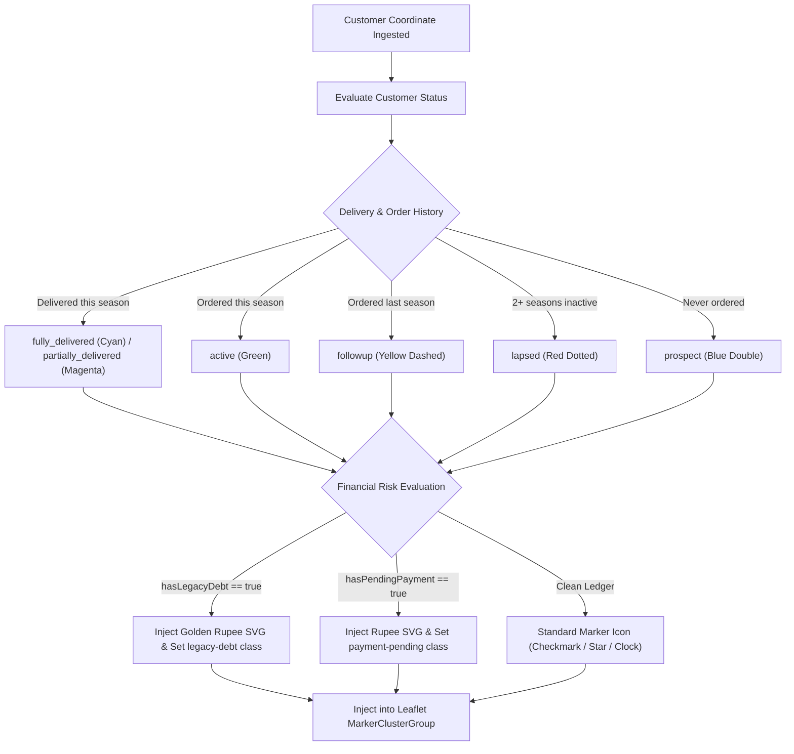
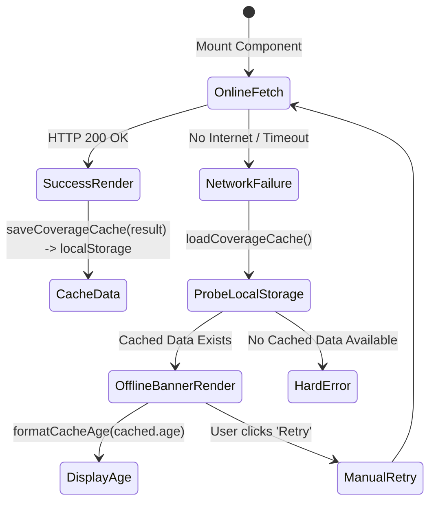

# FE-14: Customer GIS, Mapping & Geographic Demographics

> **Status**: APPROVED  
> **Domain**: Customer Domain  
> **Source Files**:  
> - `frontend/src/pages/customers/CustomerMap.jsx`  
> - `frontend/src/pages/customers/CustomerMap.css`  
> - `frontend/src/pages/customers/mapUtils.js`  
> - `frontend/src/components/MapComponent.jsx`  
> - `frontend/src/components/MapComponent.css`  
> - `frontend/src/pages/customers/CoverageList.jsx`  
> - `frontend/src/pages/customers/CoverageList.css`  
> - `frontend/src/pages/customers/SeasonReport.jsx`  
> - `frontend/src/pages/customers/SeasonReport.css`  
> **Execution Order**: 32 of 45  

---

## 1. Architectural Role & Responsibilities

The `FE-14` unit provides the geospatial intelligence, field coverage monitoring, and spatial sales prospecting engine:
1. **Interactive Spatial Command Console (`CustomerMap.jsx`)**: 2,180-line Leaflet geospatial console integrating `leaflet.markercluster`, multi-status customer pins, financial Rupee badge overlays for debts and pending payments, and DOM-based XSS-safe interactive popups.
2. **Geospatial & Seasonal Utilities (`mapUtils.js`)**: Encapsulates academic season boundaries (December through November), URL filter query serialization, and local storage offline cache management.
3. **Dual-Layer Base Map Primitive (`MapComponent.jsx`)**: Reusable React-Leaflet map supporting Google Satellite and OpenStreetMap raster tiles, live GPS user tracking with pulsating location accuracy circles, and click-to-pin coordinate capture.
4. **Offline-Resilient Field Coverage List (`CoverageList.jsx`)**: Field-optimized checklist for delivery drivers in rural connectivity dead zones, falling back to cached local storage data with cache age indicators.
5. **Year-over-Year Season Report (`SeasonReport.jsx`)**: Executive geographic sales report comparing village counts, coverage percentage, revenue, and homes visited across operating seasons, with automated PDF checklist generation.

---

## 2. Core Workflows & Spatial Algorithms

### 2.1 Academic School Season Calculation Formula

Retail educational bookselling operates on a strict academic season cycle differing from standard calendar years. `mapUtils.js` defines the season boundary algorithm:

$$\text{Current Season Year} = \begin{cases} \text{Year} & \text{if } \text{Month} \ge 11 \ (\text{December}) \\ \text{Year} - 1 & \text{otherwise} \end{cases}$$

$$\text{Season Label} = \text{"Dec "} + \text{Season Year} + \text{" – Nov "} + (\text{Season Year} + 1)$$

*Operational Significance*: An order recorded in May 2026 falls within the `Dec 2025 – Nov 2026` season, ensuring correct Year-over-Year (YoY) comparative grouping.

---

### 2.2 Dual-Status Map Pin Geometry & Financial Badge Hierarchy

`CustomerMap.jsx` dynamically synthesizes custom HTML div-markers evaluating commercial activity and financial risk:

Marker Presentation Matrix:

| Status Code | Base Color | Border Style | Icon | Semantic Meaning |
| :--- | :--- | :--- | :--- | :--- |
| `fully_delivered` | `#00f9be` (Cyan) | Solid | `✓` | All ordered goods delivered to household this season |
| `partially_delivered` | `#d600f9` (Magenta) | Solid | `½` | Partial delivery completed; remaining items pending dispatch |
| `active` | `#22c55e` (Green) | Solid | `✓` | Active order placed in current season |
| `followup` | `#eab308` (Yellow) | Dashed | `⏳` | Customer purchased last season; needs field sales visit |
| `lapsed` | `#ef4444` (Red) | Dotted | `✗` | Customer inactive for 2 or more consecutive seasons |
| `prospect` | `#3b82f6` (Blue) | Double | `★` | Unverified marketing lead / never placed an order |

---

### 2.3 Offline-First Field Coverage Architecture (`CoverageList.jsx`)

When delivery staff venture into remote geographic regions without cellular connectivity:

---

## 3. Data Contracts & UI Specifications

### 3.1 Component Catalog

| Component | Route / Scope | Primary Hooks / Contexts | API Target | Responsibilities |
| :--- | :--- | :--- | :--- | :--- |
| `CustomerMap` | Route: `/customers/map` | `useAuth`, `useToast`, `useNavigate`, `useRef`, `useState` | `GET /api/customers/map/`, `/targets/`, `/villages/` | 2,180-line GIS console; Leaflet clustering; financial debt badges; spatial filter persistence |
| `mapUtils.js` | Helper Module | Pure functions, `localStorage` | Client-side Storage | Season formulas, filter persistence (`az_map_filters`), coverage caching (`az_coverage_data`) |
| `MapComponent` | Common UI Primitive | `react-leaflet`, `useState`, `useEffect` | Google Satellite / OSM | Reusable coordinate picker; GPS live location tracking with blue pulse; fullscreen modal |
| `CoverageList` | Route: `/customers/coverage` | `useAuth`, `useCallback`, `useState`, `useEffect` | `GET /api/customers/map/` | Offline-first field checklist; village and faliya sorting; cache age indicator |
| `SeasonReport` | Route: `/customers/season-report` | `useAuth`, `useToast`, `useState`, `useCallback` | `GET /api/customers/season-report/`, `GET /api/customers/coverage-pdf/` | YoY analytics; summary cards with delta indicators; downloadable village checklist PDFs |

---

### 3.2 XSS-Safe DOM Popup Specification (`CustomerMap.jsx`)

To eliminate cross-site scripting vulnerabilities when rendering unescaped customer names in map popups, `CustomerMap.jsx` rejects innerHTML template interpolation for customer-controlled strings. Popups are constructed exclusively using the browser DOM API:

- Root: `document.createElement('div')` (`className = 'map-popup-content'`).
- Title: `document.createElement('a')` (`textContent = customer.full_name`, with React Router `navigate` interceptor).
- Financial Status: `document.createElement('div')` (`textContent = customer.wallet_balance`).
- Order Action: Native `button` binding click listener directly to POS checkout.

---

## 4. Failure Modes & Edge Case Protections

| Failure Mode | Root Cause Scenario | Protective Architecture | System Outcome |
| :--- | :--- | :--- | :--- |
| **DOM XSS Injection** | Malicious customer record created with `<script>` payload in `full_name`. | `createPopupContent()` uses native `textContent` assignments rather than string template `innerHTML`. | Malicious tags are rendered as benign plaintext strings; zero script execution. |
| **Cellular Dead Zone Lockout** | Delivery agent enters a remote village with zero network reception while checking deliveries. | `CoverageList.jsx` catches network error and reads `az_coverage_data` from `localStorage`. | Offline banner displays exact cache age; agent continues deliveries uninterrupted. |
| **Marker Cluster GPU Throttling** | Loading 5,000 pins simultaneously causes canvas crash on mobile devices. | `L.markerClusterGroup` groups pins by zoom level with `chunkedLoading: true` and lazy sub-tree unrendering. | Smooth 60fps panning and zooming even on low-powered mobile hardware. |
| **GPS Geolocation Drift** | User clicks "Locate Me" but GPS signal is weak, yielding 500-meter inaccuracy. | `MapComponent.jsx` renders a semi-transparent blue accuracy circle (`radius = accuracy`) centered on location. | Visualizes positional uncertainty to prevent false delivery pin snapping. |
| **Map Resize Layout Distortion** | User toggles browser sidebar or expands map to fullscreen, causing grey unloaded tiles. | `MapResizer` listens to `isFullscreen` and fires `map.invalidateSize()` after 150ms timeout. | Leaflet recalculates viewport dimensions immediately, repairing raster tiles. |

---

## 5. Verification & Integrity Checklist

- [x] Season calculation accurately partitions December through November cycles.
- [x] Map markers visually reflect delivery progress and display Rupee icons for pending payments/debts.
- [x] `CoverageList.jsx` successfully falls back to `localStorage` offline cache on fetch failure.
- [x] `MapComponent.jsx` handles dual-layer Google Satellite and OpenStreetMap tiles.
- [x] Popups in `CustomerMap.jsx` enforce DOM-based `textContent` assignments to eradicate XSS vectors.
- [x] `SeasonReport.jsx` computes YoY delta indicators and provides downloadable checklist PDFs.
