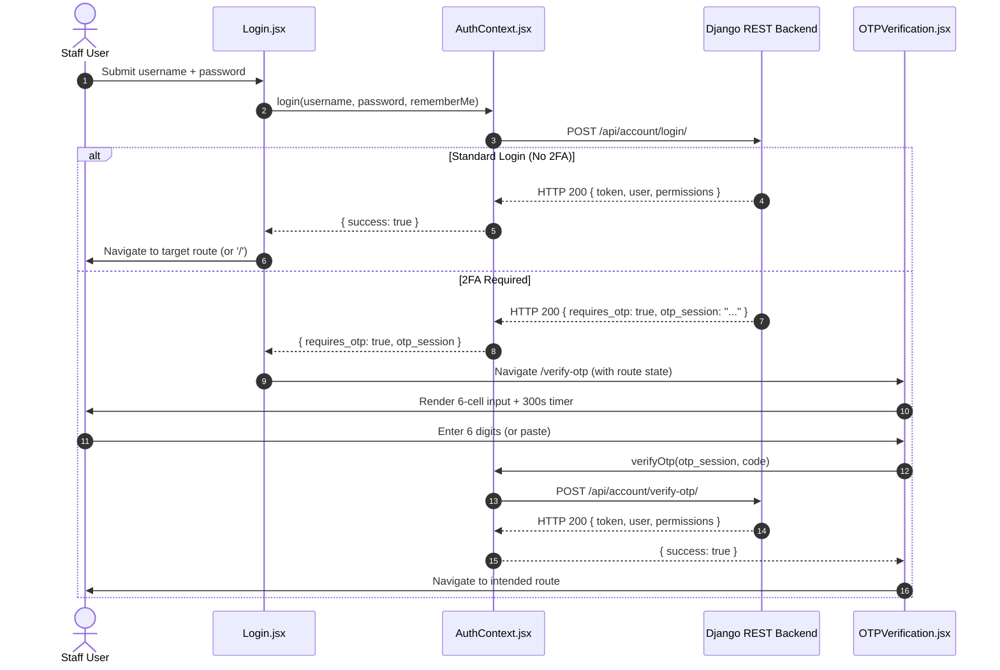
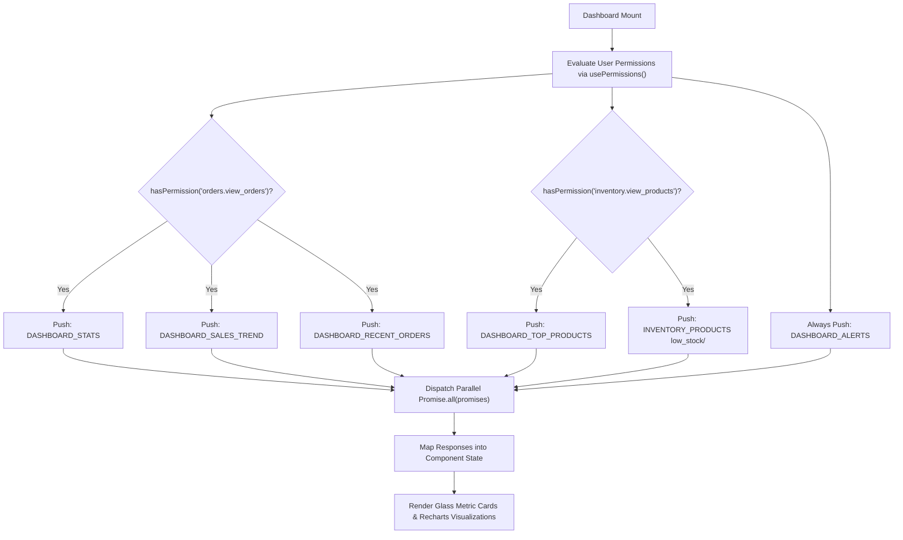

# FE-15: Dashboard Hub, Analytics & Executive Metrics

> **Status**: APPROVED  
> **Domain**: Dashboard & Auth Pages  
> **Source Files**:  
> - `frontend/src/pages/Dashboard.jsx`  
> - `frontend/src/pages/Dashboard.css`  
> - `frontend/src/pages/Login.jsx`  
> - `frontend/src/pages/Login.css`  
> - `frontend/src/pages/OTPVerification.jsx`  
> - `frontend/src/pages/OTPVerification.css`  
> - `frontend/src/pages/Profile.jsx`  
> - `frontend/src/pages/Profile.css`  
> - `frontend/src/components/dashboard/Charts.css`  
> - `frontend/src/components/dashboard/StatCard.jsx`  
> **Execution Order**: 33 of 45  

---

## 1. Architectural Role & Responsibilities

The `FE-15` unit establishes the executive operational hub, identity authentication gateways, two-factor verification, and user profile management:
1. **Executive Command Hub (`Dashboard.jsx`)**: Central operational cockpit aggregating business KPIs (Today's Sales, Pending Orders, Recent Customers, Low Stock alerts), recent orders feed, and visual performance charts via RBAC-partitioned parallel data ingestion.
2. **Credential Challenge Gate (`Login.jsx`)**: Primary entry portal managing credential authentication, "Remember Me" session duration preferences, and two-factor challenge routing.
3. **Six-Digit Resend OTP Verification (`OTPVerification.jsx`)**: Two-factor security screen featuring auto-advancing 6-cell input boxes, clipboard paste extraction, a 30-second resend cooldown timer, and a 300-second session expiration countdown.
4. **User Account & Security Profile (`Profile.jsx`)**: Self-service user settings managing contact information, profile picture avatar uploads via `multipart/form-data`, password rotation dialogs, and recent security activity logs.
5. **Reusable Metric Primitives (`StatCard.jsx`)**: Standardized KPI card displaying numeric totals, subtexts, icons, and domain color tokens (`sales`, `orders`, `customers`, `inventory`).

---

## 2. Core Workflows & State Machines

### 2.1 Two-Factor Authentication & OTP Challenge Pipeline

The application enforces a multi-step challenge-response authentication flow:

---

### 2.2 Executive Dashboard RBAC Partitioning

`Dashboard.jsx` dynamically tailors its data ingestion pipeline to the user's evaluated permissions:

---

## 3. Data Contracts & UI Specifications

### 3.1 Component Catalog

| Component | Route / Scope | Primary Hooks / Contexts | Target API Endpoints | Key Responsibilities |
| :--- | :--- | :--- | :--- | :--- |
| `Dashboard` | Route: `/` | `useAuth`, `usePermissions`, `useCurrency`, `useState`, `useEffect` | `/dashboard/stats/`, `/sales-trend/`, `/top-products/`, `/recent-orders/`, `/alerts/` | Central executive dashboard; RBAC-gated parallel ingestion; Recharts and widgets |
| `Login` | Route: `/login` | `useAuth`, `useNavigate`, `useLocation`, `useState` | `/api/account/login/` via context | Credentials form, "Remember Me" toggle, 2FA redirection, dev credentials hint |
| `OTPVerification` | Route: `/verify-otp` | `useAuth`, `useNavigate`, `useLocation`, `useRef`, `useState` | `/api/account/verify-otp/`, `/resend-otp/` | 6-box input; auto-advance; paste extraction; 30s resend timer; 300s expiry countdown |
| `Profile` | Route: `/profile` | `useAuth`, `useState`, `useEffect` | `/api/account/profile/`, `/picture/`, `/change-password/`, `/activity/` | User self-service; avatar upload; password rotation; audit activity log |
| `StatCard` | Shared Dashboard Component | Stateless UI Component | N/A (Render Props) | Standard metric tile displaying value, label, subtext, icon, and domain color theme |

---

### 3.2 6-Digit OTP Box Interaction Mechanics (`OTPVerification.jsx`)

`OTPVerification.jsx` delivers high-speed keyboard and clipboard ergonomics:
1. **Digit Filter & Auto-Advance**: Input is strictly constrained to `^\d$` regex. Upon single digit entry at cell $i$, focus automatically jumps to cell $i+1$.
2. **Backspace Retraction**: Pressing `Backspace` on an empty cell $i$ clears and jumps focus back to cell $i-1$.
3. **Clipboard Paste Interceptor**: `handlePaste` intercepts pasted text, strips non-digit characters (`replace(/\D/g, '')`), extracts the first 6 digits, auto-fills all 6 cells, shifts focus to cell index 5, and immediately triggers `handleSubmit()`.
4. **Resend Cooldown & Expiry Lock**:
   - `resendCooldown`: 30-second interval timer before allowing `handleResend()`.
   - `expirySeconds`: 300-second (5-minute) countdown timer matching backend OTP token lifespan.

---

## 4. Failure Modes & Edge Case Protections

| Failure Mode | Root Cause Scenario | Protective Architecture | System Outcome |
| :--- | :--- | :--- | :--- |
| **Unauthenticated Route Tampering** | User attempts to navigate directly to `/verify-otp` without an active login session. | `useEffect` checks `location.state?.otp_session`; redirects to `/login` with `replace: true` if absent. | Prevents broken or orphaned OTP verification states. |
| **Expired OTP Verification** | User submits an OTP code after the 5-minute expiration window has elapsed. | Backend rejects code; component resets all 6 cells, auto-focuses cell 0, and renders error message. | Clears stale inputs immediately, allowing user to request a fresh OTP. |
| **Unauthorized Endpoint Exposure** | Cashier loads dashboard; system fires analytical queries intended only for store managers. | `Dashboard.jsx` evaluates granular RBAC string permissions before appending endpoints to the fetch queue. | Sensitive financial metrics are never queried or leaked to unauthorized staff. |
| **Password Desynchronization** | User inputs mismatched new passwords in change password dialog. | Client-side check validates `new_password === confirm_password` before sending network request. | Avoids redundant backend round-trip; provides instant inline error feedback. |
| **Profile Picture Payload Explosion** | User uploads an uncompressed 20MB raw photo for user avatar. | Backend file size validator enforces upload limits; client handles HTTP error gracefully with toast alert. | Prevents web server memory exhaustion or buffer overflow crashes. |

---

## 5. Verification & Integrity Checklist

- [x] `Dashboard.jsx` executes parallel data fetching strictly gated by user permissions.
- [x] `Login.jsx` properly handles `requires_otp` responses by transitioning to `/verify-otp`.
- [x] `OTPVerification.jsx` supports auto-advance, backspace retraction, and clipboard paste auto-submit.
- [x] OTP countdown timer visually reflects 5-minute lifespan and enforces 30s resend cooldown.
- [x] `Profile.jsx` supports profile editing, avatar uploads, password changes, and activity history.
- [x] `StatCard.jsx` accurately renders domain-specific themes (`sales`, `orders`, `customers`, `inventory`).
