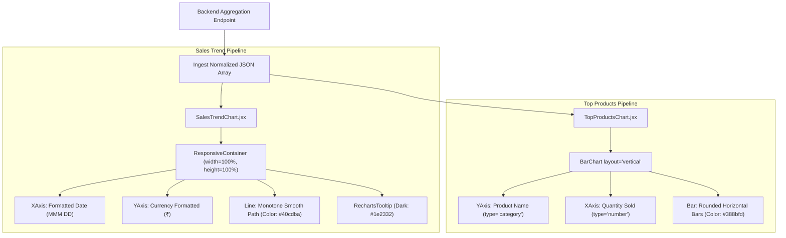
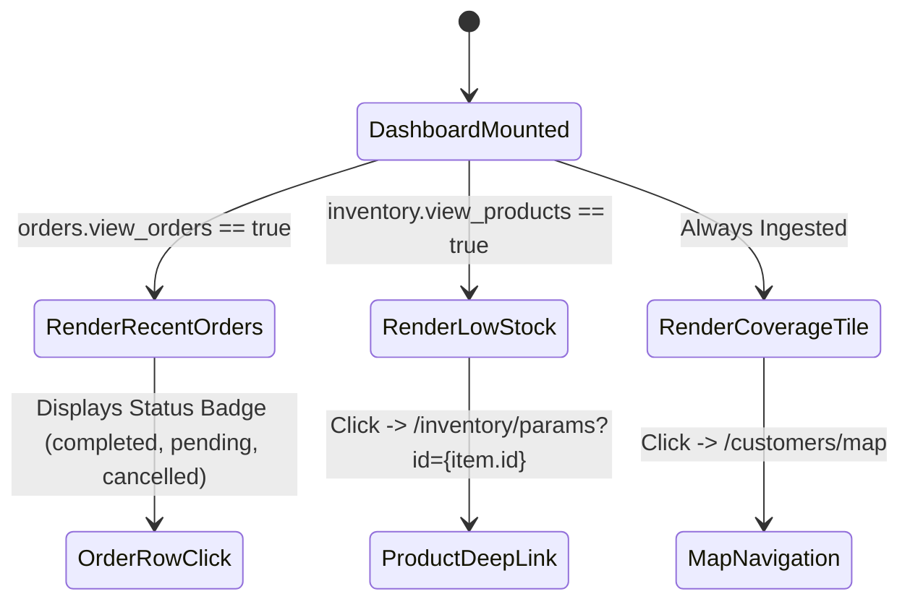
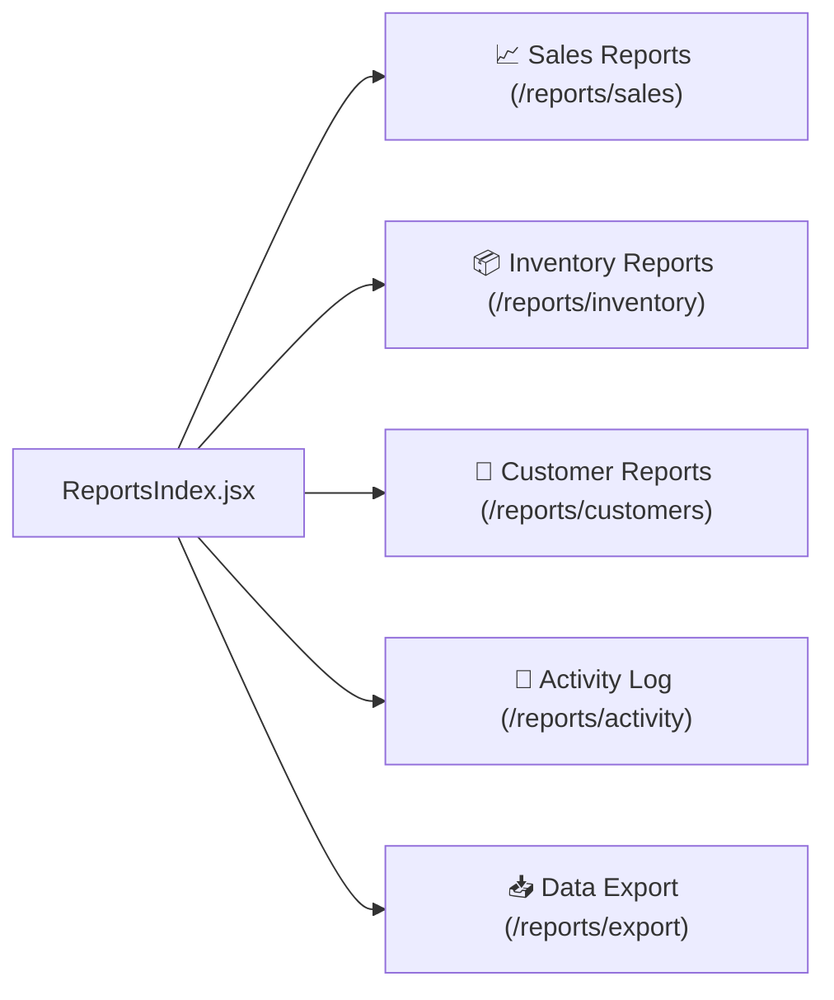

# FE-16: Dashboard Performance Widgets & Sales Visualizations

> **Status**: APPROVED  
> **Domain**: Dashboard & Reports  
> **Source Files**:  
> - `frontend/src/components/dashboard/StatCard.css`  
> - `frontend/src/components/dashboard/SalesTrendChart.jsx`  
> - `frontend/src/components/dashboard/TopProductsChart.jsx`  
> - `frontend/src/components/dashboard/RecentOrdersWidget.jsx`  
> - `frontend/src/components/dashboard/RecentOrdersWidget.css`  
> - `frontend/src/components/dashboard/LowStockWidget.jsx`  
> - `frontend/src/components/dashboard/LowStockWidget.css`  
> - `frontend/src/components/dashboard/CoverageWidget.jsx`  
> - `frontend/src/pages/reports/ReportsIndex.jsx`  
> - `frontend/src/pages/reports/ReportsIndex.css`  
> **Execution Order**: 34 of 45  

---

## 1. Architectural Role & Responsibilities

The `FE-16` unit provides the visualization primitives, operational feed widgets, and analytical report navigation:
1. **Time-Series Sales Visualization (`SalesTrendChart.jsx`)**: Recharts-powered responsive line chart visualizing 7-day revenue velocity with date formatting, currency quantization, and dark-theme tooltips.
2. **Catalog Velocity Leaderboard (`TopProductsChart.jsx`)**: Recharts vertical bar chart ranking top-selling products by volume (`quantity_sold`), rendering category labels and item counts.
3. **Live Transaction Feed (`RecentOrdersWidget.jsx`)**: Real-time POS order monitor presenting customer names, transaction totals, color-coded status badges, and timestamp breakdowns.
4. **Proactive Warehouse Alert Feed (`LowStockWidget.jsx`)**: Physical inventory monitor flagging items at or below low-stock thresholds, providing direct deep links into product inventory parameters.
5. **Spatial Field Coverage Tile (`CoverageWidget.jsx`)**: Geographic summary widget rendering season coverage percentages, covered household ratios, village counts, and direct click-through routing to the interactive map.
6. **Reports Master Launchpad (`ReportsIndex.jsx`)**: Central analytical navigation hub partitioning business intelligence into 5 dedicated report domains (Sales, Inventory, Customers, Activity Log, Data Export).

---

## 2. Core Workflows & Data Ingestion

### 2.1 Recharts Analytical Data Flow & Theme Binding

The visualization components ingest backend REST aggregates and render SVG paths via Recharts responsive containers:

---

### 2.2 Operational Dashboard Feed Topology

In the bottom grid of the main dashboard, live transactional and inventory alerts operate asynchronously:

---

## 3. Data Contracts & UI Specifications

### 3.1 Component & Widget Catalog

| Component | Props / Route | Dependencies | Target Data Structure | Key Features |
| :--- | :--- | :--- | :--- | :--- |
| `SalesTrendChart` | `data` (Array) | `recharts`, `useCurrency` | `[{ date: '2026-09-10', value: 4500 }]` | 7-day revenue trend; responsive SVG line; currency tooltip; cyan aesthetic |
| `TopProductsChart` | `data` (Array) | `recharts` | `[{ name: 'Math Std 8', quantity_sold: 45 }]` | Vertical layout bar chart; item volume leaderboard; non-overlapping category labels |
| `RecentOrdersWidget` | `orders` (Array) | `useCurrency` | `[{ id, customer_name, total, status, created_at }]` | Live order log; color-coded status badges; formatted local time strings |
| `LowStockWidget` | `items` (Array) | `react-router-dom` | `[{ id, name, stock_quantity, low_stock_threshold }]` | Proactive stock warnings; deep link to inventory parameters; empty state handling |
| `CoverageWidget` | Stateless Tile | `useAuth`, `useNavigate` | Fetches `ENDPOINTS.CUSTOMERS_MAP` | Live percentage indicator; ratio `(covered/total)`; village counts; map link |
| `ReportsIndex` | Route: `/reports` | `useCurrency`, `Link` | Static Route Configuration | 5 report category cards with domain icons, summary stat strip, and responsive grid |

---

### 3.2 Report Navigation Taxonomy (`ReportsIndex.jsx`)

The reports landing pad defines the architectural taxonomy for analytical business intelligence:

| Section | Target Route | Color Theme | Analytical Purpose |
| :--- | :--- | :--- | :--- |
| **Sales Reports** | `/reports/sales` | Cyan (`cyan`) | In-depth revenue velocity, payment method breakdowns, and daily sales trends |
| **Inventory Reports** | `/reports/inventory` | Blue (`blue`) | Physical stock valuations, negative stock audits, and inventory velocity |
| **Customer Reports** | `/reports/customers` | Purple (`purple`) | Customer lifetime value (CLV), purchase frequencies, and village distribution |
| **Activity Log** | `/reports/activity` | Orange (`orange`) | Comprehensive system audit trails, staff mutations, and manager overrides |
| **Data Export** | `/reports/export` | Green (`green`) | CSV and Excel bulk exports for off-platform financial accounting and audits |

---

## 4. Failure Modes & Edge Case Protections

| Failure Mode | Root Cause Scenario | Protective Architecture | System Outcome |
| :--- | :--- | :--- | :--- |
| **Empty Chart Array Crash** | New database instance or fresh operational season with zero sales records. | Recharts `ResponsiveContainer` safely handles empty array data without DOM throw; cards render empty grid axes. | Zero frontend runtime errors; empty axes indicate zero sales cleanly. |
| **Data Type Mismatch in Order Feed** | Backend returns `{}` or `null` instead of an array on network error. | `RecentOrdersWidget.jsx` validates `Array.isArray(orders)` before invoking `.map()`. | Renders "No recent orders" fallback state instead of crashing with `TypeError`. |
| **SVG Responsive Container Collapse** | Parent grid container collapses to zero width during responsive layout transition. | Recharts `ResponsiveContainer` listens to window resize events and recalculates viewBox dimensions. | Visualizations dynamically adapt to tablet and mobile viewports without clipping. |
| **Coverage Endpoint Timeout** | Heavy spatial boundary query in `CUSTOMERS_MAP` delays response on slow network. | `CoverageWidget.jsx` wraps fetch in silent error handler (`try/catch`) and returns `null` if data is unavailable. | Dashboard remains fully functional; non-critical widget fails quietly without blocking. |
| **Negative Stock Item Link Fracture** | User clicks low stock alert for a product whose route requires specific search query params. | Link anchors to `/inventory/params?id=${item.id}`, allowing product master view to resolve item by ID. | Seamless operator navigation from alert banner directly to the inventory edit form. |

---

## 5. Verification & Integrity Checklist

- [x] `SalesTrendChart.jsx` formats date axes cleanly and applies Indian Rupee currency tokens.
- [x] `TopProductsChart.jsx` renders horizontal bars with category product labels.
- [x] `RecentOrdersWidget.jsx` safely handles non-array props and renders formatted timestamps.
- [x] `LowStockWidget.jsx` provides deep navigation links to inventory items.
- [x] `CoverageWidget.jsx` calculates live coverage ratios and navigates to the spatial map.
- [x] `ReportsIndex.jsx` registers all 5 canonical report domains with clean responsive styling.
