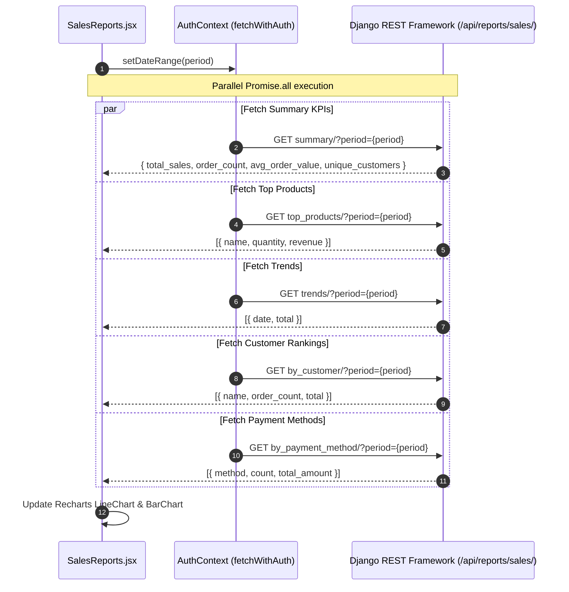
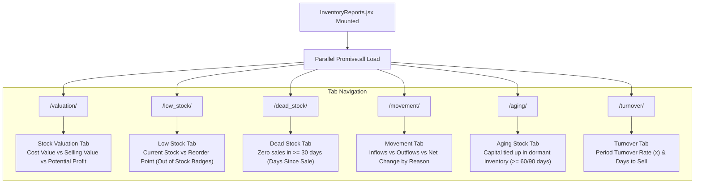
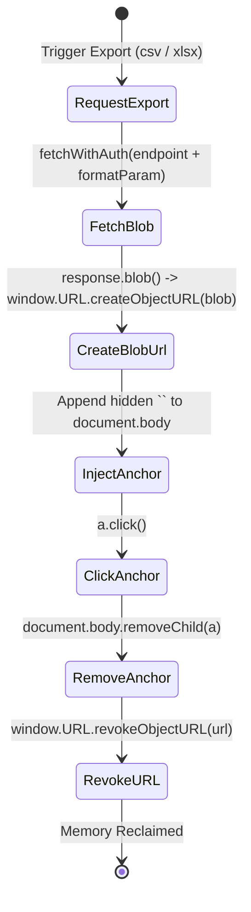

# FE-17: Reports Hub, Sales Analytics & Data Export

> **Status**: APPROVED  
> **Domain**: Reports Domain  
> **Source Files**:  
> - `frontend/src/pages/reports/SalesReports.jsx`  
> - `frontend/src/pages/reports/SalesReports.css`  
> - `frontend/src/pages/reports/InventoryReports.jsx`  
> - `frontend/src/pages/reports/InventoryReports.css`  
> - `frontend/src/pages/reports/CustomerReports.jsx`  
> - `frontend/src/pages/reports/CustomerReports.css`  
> - `frontend/src/pages/reports/DataExport.jsx`  
> - `frontend/src/pages/reports/DataExport.css`  
> - `frontend/src/pages/reports/ActivityLog.jsx`  
> - `frontend/src/pages/reports/ActivityLog.css`  
> **Execution Order**: 35 of 45  

---

## 1. Architectural Role & Responsibilities

The `FE-17` unit anchors the analytical reporting and operational audit infrastructure of the Books3 platform:
1. **Sales Intelligence & Revenue Analytics (`SalesReports.jsx`)**: Multi-period aggregation cockpit executing parallel data fetching across 5 backend reporting vectors (summary KPIs, top products, time-series revenue trends, customer expenditure rankings, and payment method distribution).
2. **Multi-Dimensional Inventory Telemetry (`InventoryReports.jsx`)**: Comprehensive warehouse telemetry divided into 6 distinct analytical tabs (Stock Valuation, Low Stock warnings, Dead Stock identification, Stock Movement ledger, Aging Stock capital allocation, and Inventory Turnover velocity).
3. **Customer Cohort & RFM Segmentation (`CustomerReports.jsx`)**: Customer intelligence hub categorizing buyers across Recency, Frequency, and Monetary (RFM) cohorts (Champions, Loyal, Potential Loyalists, At Risk, Lost) alongside Customer Lifetime Value (CLV) insights.
4. **Asynchronous Data Export Engine (`DataExport.jsx`)**: Multi-entity bulk extraction terminal supporting CSV and Excel (`.xlsx`) file generation for Products, Customers, and Orders with animated progress feedback and URL blob lifecycle cleanup.
5. **System Audit Trail Feed (`ActivityLog.jsx`)**: Enterprise activity ledger built on `useServerList`, recording operator actions, authentication events, state mutations, IP addresses, and structured differential payloads.

---

## 2. Core Workflows & Analytical Pipelines

### 2.1 Sales Reports Multi-Vector Data Ingestion

When the user selects a time range (`today`, `week`, `month`), `SalesReports.jsx` dispatches 5 simultaneous requests via `Promise.all` to populate the summary cards, charts, and breakdown tables:

---

### 2.2 Inventory Telemetry & Multi-Tab Analysis

`InventoryReports.jsx` loads 6 analytical vectors on mount and presents them via a tabbed interface:

---

### 2.3 Blob Export & Memory Reclamation Pipeline

Both `SalesReports.jsx`, `InventoryReports.jsx`, `CustomerReports.jsx`, and `DataExport.jsx` implement native browser blob streaming to prevent memory leaks during large dataset downloads:

---

## 3. Data Contracts & Component Specifications

### 3.1 Reports & Export Component Catalog

| Component | Route / Mount | Target Endpoints | Data Dependencies | Primary Responsibilities |
| :--- | :--- | :--- | :--- | :--- |
| `SalesReports` | `/reports/sales` | `ENDPOINTS.REPORTS_SALES` | `recharts`, `useCurrency`, `useAuth` | Time-series line chart, top products vertical bar chart, payment method table, CSV/Excel export |
| `InventoryReports` | `/reports/inventory` | `ENDPOINTS.REPORTS_INVENTORY` | `useCurrency`, `useAuth` | 6-tab inventory console (valuation, low stock, dead stock, movement, aging, turnover), bulk exports |
| `CustomerReports` | `/reports/customers` | `ENDPOINTS.REPORTS_CUSTOMERS` | `useCurrency`, `useAuth` | Top customers by spend, 5 RFM segment cards, CLV insights (AOV, avg orders, avg CLV) |
| `DataExport` | `/reports/export` | Multiple reporting export APIs | `useAuth`, `useToast` | Centralized backup export terminal for Products, Customers, Orders; format radio toggles; progress overlay |
| `ActivityLog` | `/reports/activity` | `ENDPOINTS.REPORTS_ACTIVITY` | `useServerList`, `Pagination` | Paginated, filterable event audit log with action icons, date picker, and differential change modal |

---

### 3.2 RFM Customer Segmentation Matrix (`CustomerReports.jsx`)

The customer report classifies clients into 5 analytical cohorts based on behavioural indicators:

| Cohort Name | Icon | Accent Color | Behavioral Definition | Target Action |
| :--- | :--- | :--- | :--- | :--- |
| **Champions** | 🏆 | `#22c55e` | Highest frequency and monetary spend with recent orders | VIP discounts and priority wholesale allocation |
| **Loyal** | 💎 | `#40cdba` | Consistent repeat purchases with strong aggregate spend | Cross-sell higher margin book bundles |
| **Potential Loyalists** | ⭐ | `#388bfd` | Recent first-time or second-time buyers with high basket value | Engagement campaigns and loyalty enrollment |
| **At Risk** | ⚠️ | `#f59e0b` | Historically frequent buyers who have not purchased recently | Re-engagement outreach and special restocking offers |
| **Lost** | 💤 | `#ef4444` | No purchasing activity for extended seasonal cycles | Inactive account archiving or churn analysis |

---

### 3.3 Inventory Turnover & Valuation Mathematical Invariants

In `InventoryReports.jsx`, financial metrics maintain strict mathematical parity:

$$\text{Potential Profit} = \text{Total Selling Value} - \text{Total Cost Value}$$

$$\text{Days to Sell} = \frac{\text{Period Days}}{\text{Turnover Rate}}$$

$$\text{Net Stock Change} = \text{Total Inflows} - \text{Total Outflows}$$

$$\text{Tied-up Capital} = \sum_{i=1}^{n} (\text{Stock Quantity}_i \times \text{Cost Price}_i) \quad \forall \text{ Product } i \text{ with Days Without Sale} \ge \text{Threshold}$$

---

## 4. Failure Modes & Edge Case Protections

| Failure Mode | Root Cause Scenario | Protective Architecture | System Outcome |
| :--- | :--- | :--- | :--- |
| **DOM Memory Leak on Large Export** | Repeatedly creating `window.URL.createObjectURL` without cleanup during large exports exhausts browser heap | Explicit execution of `window.URL.revokeObjectURL(url)` immediately following `a.click()` and DOM removal | Object URL reference is released immediately, preventing memory leaks |
| **Zero-Denominator Turnover Rate** | Brand new product catalogs or zero COGS during the selected period causes division by zero | Backend returns null/dash string; frontend defaults safely to `turnover.days_to_sell || '—'` | UI renders clean em-dash without throwing NaN or crashing the Recharts engine |
| **Dead Stock False Positives** | Products created recently (< 30 days) flagged as dead stock because they have zero sales | Backend excludes items where `created_at > NOW() - 30 days`; frontend checks `item.days_since_sale` | Only genuinely stagnant catalog items appear in dead stock tables |
| **Export Format Desynchronization** | User toggles format to Excel (`xlsx`), but backend defaults to CSV if parameter is omitted | Append `&file_format=xlsx` to query string when format equals `xlsx`; suffix filename with `.xlsx` | File extension matches MIME payload accurately; Excel opens workbook without format warnings |
| **Activity Log Pagination Out-of-Bounds** | Applying an event filter (e.g. `action_type=delete`) while on page 10 exceeds the filtered result set | `useServerList` automatically resets page to 1 when filters or debounced search queries mutate | User is cleanly routed to page 1 of the new filtered dataset |
