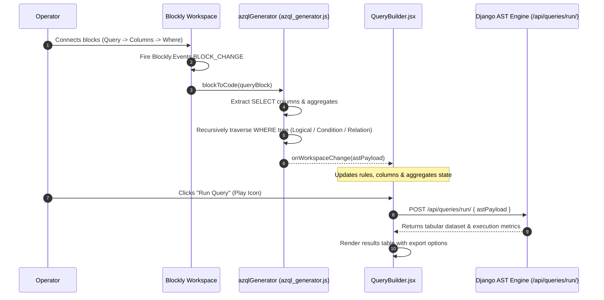

# FE-18: AZQL Query Playground & Visual Blockly Workspace

> **Status**: APPROVED  
> **Domain**: Reports & Messaging  
> **Source Files**:  
> - `frontend/src/pages/queries/QueryBuilder.jsx`  
> - `frontend/src/pages/queries/QueryBuilder.css`  
> - `frontend/src/pages/queries/BlocklyEditor.jsx`  
> - `frontend/src/pages/queries/AggregateColumnModal.jsx`  
> - `frontend/src/pages/queries/azql_blocks.js`  
> - `frontend/src/pages/queries/azql_generator.js`  
> - `frontend/src/pages/messaging/MessagingIndex.jsx`  
> - `frontend/src/pages/messaging/MessagingIndex.css`  
> - `frontend/src/pages/messaging/GatewayManagement.jsx`  
> - `frontend/src/pages/messaging/GatewayManagement.css`  
> **Execution Order**: 36 of 45  

---

## 1. Architectural Role & Responsibilities

The `FE-18` unit delivers the visual and code-driven query intelligence engine (AZQL) alongside communication gateway management:
1. **AZQL Code Studio & Monaco Language Server (`QueryBuilder.jsx`)**: Comprehensive 1,600-line playground featuring a custom Monarch tokenizer for the AZQL domain-specific language (DSL), bracketed path navigation, contextual IntelliSense completions, query execution, and draft history snapshots.
2. **Visual Block Programming Environment (`BlocklyEditor.jsx`)**: Google Blockly drag-and-drop AST visual workspace configured with DarkTheme, category toolbox, undo/redo stack monitors, and automatic AST generation.
3. **AST Node Grammar & Serialization (`azql_blocks.js`, `azql_generator.js`)**: Domain block grammar defining queries, logical connectors, filter conditions, relational subqueries (`HAS_ANY`, `HAS_ALL`, `HAS_NONE`), and aggregate expressions compiling into execution-ready JSON AST payloads.
4. **Subquery Aggregate Column Builder (`AggregateColumnModal.jsx`)**: Specialized modal configuring nested relational aggregates (`SUM`, `COUNT`, `AVG`, `MAX`, `MIN`) with targeted entity schema reflection and subquery filter builders.
5. **Messaging Fleet & SMS Gateway Control (`MessagingIndex.jsx`, `GatewayManagement.jsx`)**: Real-time dispatch telemetry (Pending, Sent Today, Failed) and Android SMS gateway management with heartbeat monitoring, success rate metrics, and remote activation toggles.

---

## 2. Core Workflows & Compilation Pipelines

### 2.1 Monaco AZQL Grammar & Recursive Path Resolution

`QueryBuilder.jsx` registers a custom language definition `azql` with Monaco Editor. The completion item provider inspects the cursor position and recursively traverses relational paths via `resolvePath`:

```mermaid
graph TD
    A["User Types '[' or '__' in Monaco Editor"] --> B["Capture textUntilPosition"]
    B --> C{"Inside Bracket '[...]'?"}
    
    C -->|Yes| D["Extract bracketContent"]
    D --> E{"Contains '__' Relation Delimiter?"}
    
    E -->|Yes| F["Call resolvePath(schema, baseEntity, prefixPath)"]
    F --> G["Traverse Entity Relations Graph"]
    G --> H["Resolve Target Child Entity"]
    H --> I["Suggest Target Entity Fields & Sub-relations"]
    
    E -->|No| J["Suggest Current Entity Fields & Root Relations"]
    
    C -->|No| K{"Trigger Character?"}
    K -->|'@'| L["Suggest Macros: @Me, @Today"]
    K -->|'='| M["Extract Field -> Lookup Choices Enum in Schema -> Suggest Quoted Options"]
    K -->|Other| N["Suggest SQL Keywords: SELECT, FROM, WHERE, ORDER BY, ASOF, WAS EVER"]
```

---

### 2.2 Visual Blockly AST Compilation Pipeline

`BlocklyEditor.jsx` manages the visual canvas. Every mutation event compiles the block hierarchy into a standardized JSON Abstract Syntax Tree:



---

## 3. Data Contracts & AST Schemas

### 3.1 Visual Query AST Specification

The visual query generator outputs a structured payload representing the complete query topology:

```json
{
  "query_type": "visual",
  "entity": "order",
  "columns": [
    "display_id",
    "total",
    "payment_status",
    "created_at"
  ],
  "aggregates": [
    {
      "function": "SUM",
      "relation": "items",
      "field": "subtotal",
      "alias": "calculated_item_sum",
      "filter_rules": {
        "combinator": "and",
        "rules": []
      }
    }
  ],
  "rules": {
    "combinator": "and",
    "rules": [
      {
        "field": "payment_status",
        "operator": "=",
        "value": "completed"
      },
      {
        "field": "~items",
        "operator": "HAS_ANY",
        "value": {
          "combinator": "and",
          "rules": [
            {
              "field": "quantity",
              "operator": ">",
              "value": "10"
            }
          ]
        }
      }
    ]
  }
}
```

---

### 3.2 Component & Control Specifications

| Component | Route / Mount | Target Endpoints | Data Dependencies | Primary Responsibilities |
| :--- | :--- | :--- | :--- | :--- |
| `QueryBuilder` | `/queries/builder` | `ENDPOINTS.QUERIES`, `ENDPOINTS.QUERIES_SCHEMA`, `ENDPOINTS.QUERIES_HISTORY` | `@monaco-editor/react`, `useAuth`, `useCurrency` | Dual-mode editor (Visual Blockly vs AZQL Monaco), schema introspection, query execution, history autosave |
| `BlocklyEditor` | Embedded in `QueryBuilder` | N/A (Client-side SVG) | `blockly/core`, `@blockly/theme-dark` | Google Blockly canvas, custom AZQL block definitions, undo/redo stack handling, live AST compilation |
| `AggregateColumnModal` | Modal in `QueryBuilder` | Schema entities | `react-querybuilder` | Nested aggregate column definition (`SUM`, `COUNT`, `AVG`, `MAX`, `MIN`), relation selection, subquery rule builder |
| `MessagingIndex` | `/messaging` | `ENDPOINTS.MESSAGING_QUEUE + stats/` | `useAuth`, `Link` | Gateway status dashboard displaying pending, sent today, and failed message tallies with navigation cards |
| `GatewayManagement` | `/messaging/gateways` | `ENDPOINTS.MESSAGING_GATEWAYS` | `useAuth` | Android SMS gateway table, online/offline ping badges, heartbeat timestamps, success rate percentage, toggle switch |

---

## 4. Failure Modes & Edge Case Protections

| Failure Mode | Root Cause Scenario | Protective Architecture | System Outcome |
| :--- | :--- | :--- | :--- |
| **Monaco Closure Stale State Trap** | Autocompletion provider references outdated React state after entity or schema updates | `schemaRef` and `entityRef` maintain synchronous references to current schema and entity state | Autocompletion always resolves fields against the active entity without editor re-initialization |
| **Recursive Relational Infinite Loop** | Malicious or circular schema definitions (e.g. `order -> customer -> orders -> ...`) in path completion | `resolvePath` steps strictly through path segments delimited by `__`, terminating when segment count is exhausted | Traversal terminates in $O(N)$ steps where $N$ is the number of path segments; zero infinite loops |
| **Blockly SVG Workspace Container Collapse** | Blockly fails to calculate dimensions when rendered inside a hidden or transitioning tab | Canvas container enforces fixed height (`height: 600px; width: 100%`) with explicit `Blockly.svgResize` triggers | Blockly SVG viewport scales correctly without clipping block elements |
| **Autosave Thrashing on Default State** | Debounced autosave continuously writes blank/default queries to the backend history table | `isDefault` guard validates whether query matches entity baseline fields before triggering history POST | Backend history is preserved for meaningful user edits; empty queries are discarded |
| **Stale Gateway State Invalidation** | Toggling an SMS gateway status (`/toggle/`) leaves the client table in an inconsistent state | `toggleGateway` awaits POST response and immediately calls `fetchGateways()` to refresh live state | Gateway toggle reflects real database state with zero UI lag |
