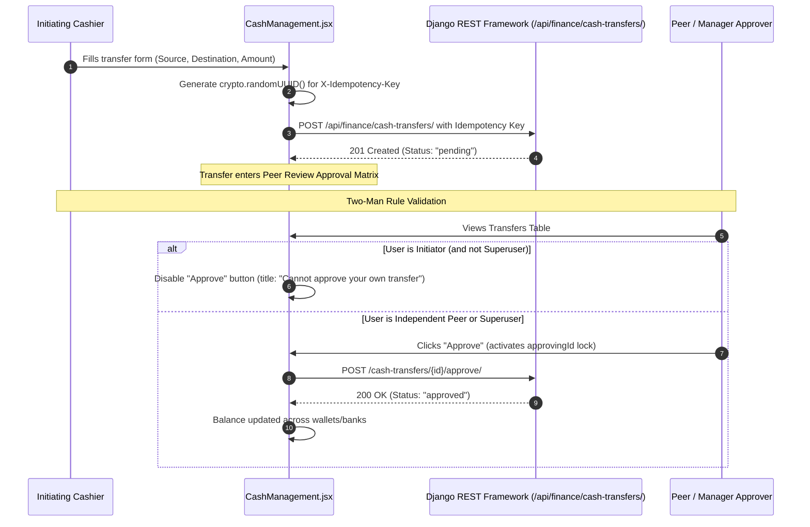
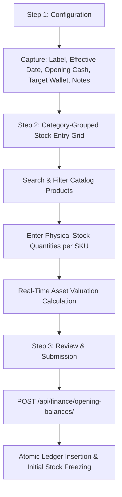

# FE-19: Messaging Center & Core Finance Overview

> **Status**: APPROVED  
> **Domain**: Messaging & Finance  
> **Source Files**:  
> - `frontend/src/pages/messaging/MessageQueue.jsx`  
> - `frontend/src/pages/messaging/MessageQueue.css`  
> - `frontend/src/pages/messaging/MessageTemplates.jsx`  
> - `frontend/src/pages/messaging/MessageTemplates.css`  
> - `frontend/src/pages/finance/FinanceIndex.jsx`  
> - `frontend/src/pages/finance/FinanceIndex.css`  
> - `frontend/src/pages/finance/CashManagement.jsx`  
> - `frontend/src/pages/finance/CashManagement.css`  
> - `frontend/src/pages/finance/OpeningBalance.jsx`  
> - `frontend/src/pages/finance/OpeningBalance.css`  
> **Execution Order**: 37 of 45  

---

## 1. Architectural Role & Responsibilities

The `FE-19` unit governs outbound transactional communication, executive financial analytics, cash drawer governance, and opening ledger data migrations:
1. **Outbound Communication Dispatch Queue (`MessageQueue.jsx`)**: Real-time message monitor built on `useServerList`, presenting dispatch states (`pending`, `sent`, `failed`), phone numbers, gateway assignments, and single-click retry triggers.
2. **Multi-Channel Template Repository (`MessageTemplates.jsx`)**: Template management interface organizing WhatsApp and SMS transactional templates with language tags (`gu`, `hi`, `en`), type categories, and parameter placeholder visualizations.
3. **Executive Finance Cockpit & Sub-Ledger Launchpad (`FinanceIndex.jsx`)**: Central financial command dashboard ingesting live P&L and balance sheet metrics across flexible periods (`today`, `week`, `month`), enforcing 2-decimal floating-point dust sanitization, semantic KPI coloring, and DoS chart element capping.
4. **Physical Cash Drawer & Custodial Wallet Governance (`CashManagement.jsx`)**: Multi-wallet balance tracker (Company Safe vs Personal Employee Wallets) implementing a strict Two-Man Peer Review approval matrix, cryptographic idempotency keys, and double-click approval locks.
5. **Admin Opening Balance Migration Wizard (`OpeningBalance.jsx`)**: Three-step onboarding and data migration wizard for capturing historical pre-system inventory stock counts and initial cash capital with real-time asset valuation formulas.

---

## 2. Core Workflows & Governance Protocols

### 2.1 Cash Transfer Peer-Review Approval Matrix (The Two-Man Rule)

In `CashManagement.jsx`, inter-wallet and wallet-to-bank cash transfers enforce cryptographic idempotency and the Two-Man Rule to prevent internal fraud:

---

### 2.2 Opening Balance Migration Wizard Pipeline

`OpeningBalance.jsx` guides administrators through a 3-step atomic onboarding wizard to prevent inventory discrepancies during system cutover:

---

## 3. Data Contracts & Mathematical Formulations

### 3.1 Component & Interface Specifications

| Component | Route / Mount | Target Endpoints | Data Dependencies | Primary Responsibilities |
| :--- | :--- | :--- | :--- | :--- |
| `MessageQueue` | `/messaging/queue` | `ENDPOINTS.MESSAGING_QUEUE` | `useServerList`, `useAuth`, `Pagination` | Status filtering (`pending`, `failed`, `sent`), gateway association, inline retry for failed messages |
| `MessageTemplates` | `/messaging/templates` | `ENDPOINTS.MESSAGING_TEMPLATES` | `useAuth` | Template card grid with language chips (`gu`, `hi`, `en`), type tags, and content preview |
| `FinanceIndex` | `/finance` | `ENDPOINTS.FINANCE_DASHBOARD` | `recharts`, `lucide-react`, `useCurrency` | Executive KPI cards (Revenue, COGS, Gross Profit, Expenses, Net Profit, Cash, AR, AP), 12 navigation sub-ledger tiles |
| `CashManagement` | `/finance/cash-management` | `ENDPOINTS.FINANCE_CASH_WALLETS`, `ENDPOINTS.FINANCE_CASH_TRANSFERS`, `ENDPOINTS.FINANCE_BANK_ACCOUNTS` | `useAuth`, `useCurrency`, `useToast` | Multi-wallet balance cards, inter-wallet transfer modal with idempotency, peer-review approval table |
| `OpeningBalance` | `/finance/opening-balance` | `ENDPOINTS.FINANCE_OPENING_BALANCES`, `products-template/` | `useAuth`, `useCurrency` | 3-step migration wizard, bulk quantity grid grouped by category, live asset valuation math |

---

### 3.2 Floating-Point Dust Mitigation & Financial Calculations

To eliminate IEEE-754 floating-point inaccuracies in `FinanceIndex.jsx` and `OpeningBalance.jsx`, raw values are strictly quantized before arithmetic evaluation:

$$\text{round2}(v) = \frac{\lfloor (v + 10^{-7}) \times 100 \rceil}{100}$$

$$\text{Gross Profit} = \text{round2}(\text{Revenue} - \text{COGS})$$

$$\text{Net Profit} = \text{round2}(\text{Gross Profit} - \text{Expenses})$$

$$\text{Opening Stock Valuation} = \sum_{i=1}^{m} \left( \text{Quantity}_i \times \text{Cost Price}_i \right)$$

$$\text{Total Migrated Assets} = \text{Opening Stock Valuation} + \text{Opening Cash}$$

---

## 4. Failure Modes & Edge Case Protections

| Failure Mode | Root Cause Scenario | Protective Architecture | System Outcome |
| :--- | :--- | :--- | :--- |
| **Self-Approval Ledger Exploitation** | Cashier initiates an unauthorized cash transfer and immediately approves it to drain the drawer | Strict evaluation: `disabled={(t.initiated_by === user?.id && !user?.is_superuser)}` | Initiator is physically barred from self-approval; requires independent peer or superuser sign-off |
| **Double-Click Transfer Duplication** | User clicks "Approve" multiple times rapidly during network latency | Synchronous state lock via `approvingId === t.id` guarding button execution | Only the initial request dispatches; subsequent clicks are blocked until resolution |
| **Floating-Point Cent Drift in Dashboard** | Compounding additions and subtractions across thousands of line items produce values like `₹10,500.0000000002` | Every KPI passes through `round2()` before display and semantic class derivation | UI renders clean, currency-quantized financial figures without visual rounding dust |
| **Chart Rendering Denial of Service (DoS)** | Dashboard receives hundreds of granular expense categories, causing Recharts to freeze the DOM | Enforced `MAX_CHART_ITEMS = 20` slicing array before passing data to Recharts containers | Charts render instantly with capped elements, preserving responsive browser performance |
| **Opening Balance Category State Overwrite** | Modifying search queries resets user quantity inputs across hidden categories | Product quantities are stored in an independent state dictionary `quantities[productId]`, decoupled from filtered search results | Filtering or collapsing categories does not erase previously entered stock counts |
