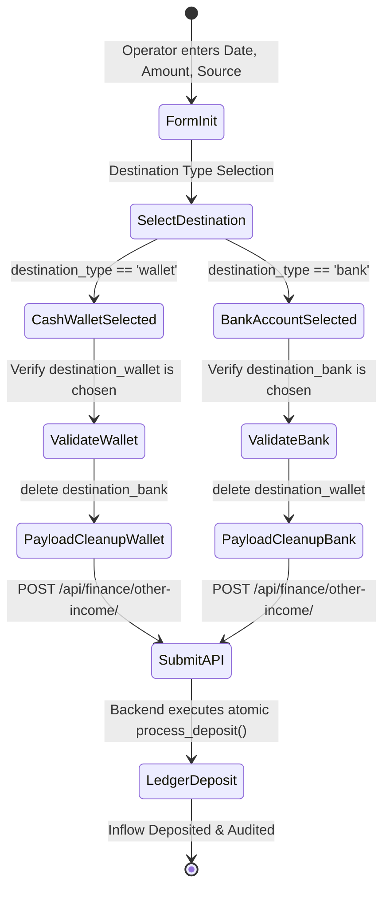

# FE-20: Banking Ledgers, Cash Wallets & Transactions

> **Status**: APPROVED  
> **Domain**: Finance Domain  
> **Source Files**:  
> - `frontend/src/pages/finance/BankAccounts.jsx`  
> - `frontend/src/pages/finance/BankAccounts.css`  
> - `frontend/src/pages/finance/BankTransactions.jsx`  
> - `frontend/src/pages/finance/BankTransactions.css`  
> - `frontend/src/pages/finance/AllTransactions.jsx`  
> - `frontend/src/pages/finance/AllTransactions.css`  
> - `frontend/src/pages/finance/RecordTransaction.jsx`  
> - `frontend/src/pages/finance/RecordTransaction.css`  
> - `frontend/src/pages/finance/OtherIncomeList.jsx`  
> - `frontend/src/pages/finance/AddOtherIncome.jsx`  
> **Execution Order**: 38 of 45  

---

## 1. Architectural Role & Responsibilities

The `FE-20` unit establishes the banking repository, unified transaction timeline, manual journal entry tools, and non-sales revenue governance:
1. **Bank Account Registry & Security Masking (`BankAccounts.jsx`)**: Institutional account master tracking account numbers, institution names, current balances, and default flags (`/set_default/`), enforcing write-only security masks to protect sensitive banking credentials.
2. **Bank Transaction Audit Log (`BankTransactions.jsx`)**: Account-specific banking ledger providing multi-parameter filtering, color-coded inflow/outflow tags, and one-click statement reconciliation toggles (`/reconcile/`).
3. **Unified Financial Ledger (`AllTransactions.jsx`)**: Comprehensive 331-line consolidated timeline merging bank account movements and cash wallet disbursements into a single chronological stream with multi-entity deep links.
4. **Manual Transaction Entry Terminal (`RecordTransaction.jsx`)**: Financial journal entry form for logging manual deposits, withdrawals, and inter-account transfers with target account validation.
5. **Non-Sales Revenue Ledger & Routing Guardrails (`OtherIncomeList.jsx`, `AddOtherIncome.jsx`)**: Ancillary income recording terminal (rent, scrap, bank interest) enforcing strict destination routing into audited bank accounts or cash wallets to prevent off-ledger accounting leaks.

---

## 2. Core Workflows & Unified Ledger Architecture

### 2.1 Unified Ledger Data Convergence & Entity Routing

`AllTransactions.jsx` aggregates asynchronous records across disparate financial ledgers and links them directly to parent business entities:

```mermaid
graph TD
    A["Unified Financial Ledger (AllTransactions.jsx)"] --> B["Ingest Consolidated Timeline"]
    
    subgraph Data Sources
        B --> S1["🏦 Bank Account Transactions"]
        B --> S2["👛 Cash Wallet Movements"]
    end

    B --> C["Render Unified Chronological Feed"]
    C --> D["User Clicks Transaction Row"]
    D --> E["Transaction Details Modal"]
    
    subgraph Linked Entity Dispatch (navigateToLinkedEntity)
        E -->|type: order / refund| F["/orders/:id"]
        E -->|type: expense| G["/finance/expenses/:id"]
        E -->|type: employee_expense| H["/finance/employee-expenses/:id"]
        E -->|type: other_income| I["/finance/other-income/"]
        E -->|type: loan| J["/finance/loans/:id"]
        E -->|type: salary| K["/finance/salaries/"]
    end
```

---

### 2.2 Ledger Routing Guardrails for Other Income

To uphold financial accounting invariants, `AddOtherIncome.jsx` requires explicit destination routing before permitting submission:



---

## 3. Data Contracts & Component Specifications

### 3.1 Financial Ledger Component Catalog

| Component | Route / Mount | Target Endpoints | Data Dependencies | Primary Responsibilities |
| :--- | :--- | :--- | :--- | :--- |
| `BankAccounts` | `/finance/banking` | `ENDPOINTS.FINANCE_BANK_ACCOUNTS` | `useAuth`, `useCurrency`, `useToast` | Bank account cards, opening balance recording, account masking, default account assignment |
| `BankTransactions` | `/finance/banking/transactions` | `ENDPOINTS.FINANCE_BANK_TRANSACTIONS` | `useServerList`, `useAuth`, `Pagination` | Bank transaction ledger, type badges (`deposit`, `withdrawal`, `transfer`), statement reconciliation trigger |
| `AllTransactions` | `/finance/transactions` | `ENDPOINTS.FINANCE_ALL_TRANSACTIONS` | `useServerList`, `useCurrency`, `Pagination` | Consolidated timeline, source/type/amount/date filtering, transaction details modal, entity deep-linking |
| `RecordTransaction` | `/finance/banking/record` | `ENDPOINTS.FINANCE_BANK_TRANSACTIONS` | `useAuth`, `useCurrency`, `useToast` | Manual journal entry form, transfer target account validation, automated account default selection |
| `OtherIncomeList` | `/finance/other-income` | `ENDPOINTS.FINANCE_OTHER_INCOME` | `useServerList`, `useCurrency`, `Pagination` | Paginated non-sales revenue log with search bar and direct record income routing button |
| `AddOtherIncome` | `/finance/other-income/add` | `ENDPOINTS.FINANCE_OTHER_INCOME`, `CASH_WALLETS`, `BANK_ACCOUNTS` | `useAuth`, `useToast` | Ancillary income entry form enforcing strict destination routing into cash wallets or bank accounts |

---

### 3.2 Inflow & Outflow Visual Notation Matrix

Transactions across `AllTransactions.jsx` and `BankTransactions.jsx` are strictly tagged with directional formatting:

| Transaction Type | Mathematical Sign | CSS Badge Class | Palette Accent | Ledger Impact |
| :--- | :--- | :--- | :--- | :--- |
| `deposit` | `+` (Positive) | `deposit` / `positive` | Green (`#4ade80`) | Increases bank or wallet available balance |
| `withdrawal` | `-` (Negative) | `withdrawal` / `negative` | Red (`#f87171`) | Decreases bank or wallet available balance |
| `transfer_in` | `+` (Positive) | `deposit` / `positive` | Green (`#4ade80`) | Inflow leg of an internal inter-account transfer |
| `transfer_out` | `-` (Negative) | `withdrawal` / `negative` | Red (`#f87171`) | Outflow leg of an internal inter-account transfer |
| `transfer` | `↔` (Neutral) | `transfer` | Blue (`#60a5fa`) | Paired internal movement between institution accounts |

---

## 4. Failure Modes & Edge Case Protections

| Failure Mode | Root Cause Scenario | Protective Architecture | System Outcome |
| :--- | :--- | :--- | :--- |
| **Accidental Overwrite of Masked Bank Account Number** | Editing an existing bank account submits the masked string (`****1234`) back to the backend | `account_number` is left empty in edit mode; backend treats blank values as "retain existing value" | Original encrypted account number is preserved without corruption |
| **Self-Transfer Between Identical Accounts** | Operator selects the same account for both source and target in `RecordTransaction.jsx` | Target account dropdown dynamically filters out the selected source account: `acc.id !== formData.account` | Dropdown physically prevents selecting identical accounts for transfers |
| **Off-Ledger Ancillary Revenue Leakage** | Income recorded without a specified bank account or cash wallet creates ghost revenue without cash backing | `AddOtherIncome.jsx` blocks submission unless `destination_wallet` or `destination_bank` is verified | 100% of non-sales income is routed into an audited financial container |
| **Cross-Payload Destination Pollution** | Switching destination type from 'wallet' to 'bank' leaves stale `destination_wallet` in payload | Form submission explicitly deletes inactive destination keys (`delete payload.destination_wallet` or `bank`) | Backend receives clean, mutually-exclusive destination routing parameters |
| **Dead Deep Links on Deleted Entities** | Clicking an entity link in `AllTransactions` for a purged or soft-deleted order throws a 404 | Modal dismisses before navigation; downstream entity view handlers catch 404s with graceful toast alerts | Application state remains stable with zero unhandled client routing exceptions |
