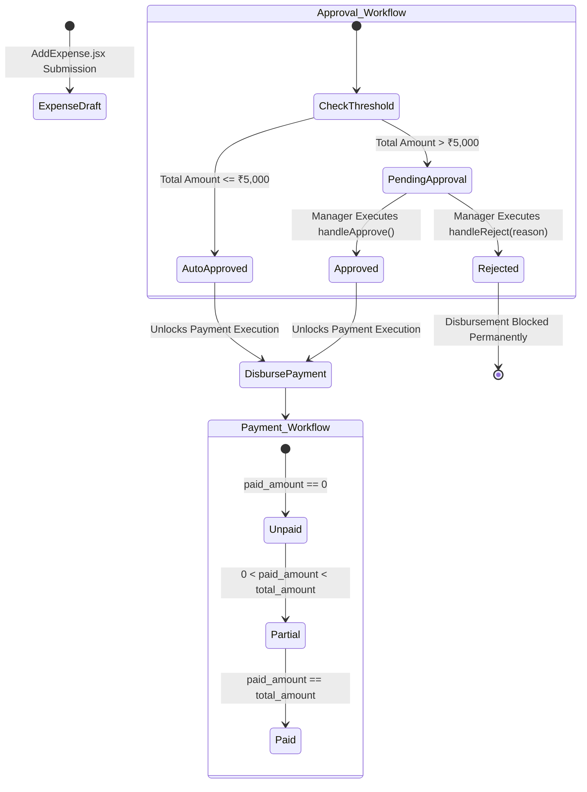
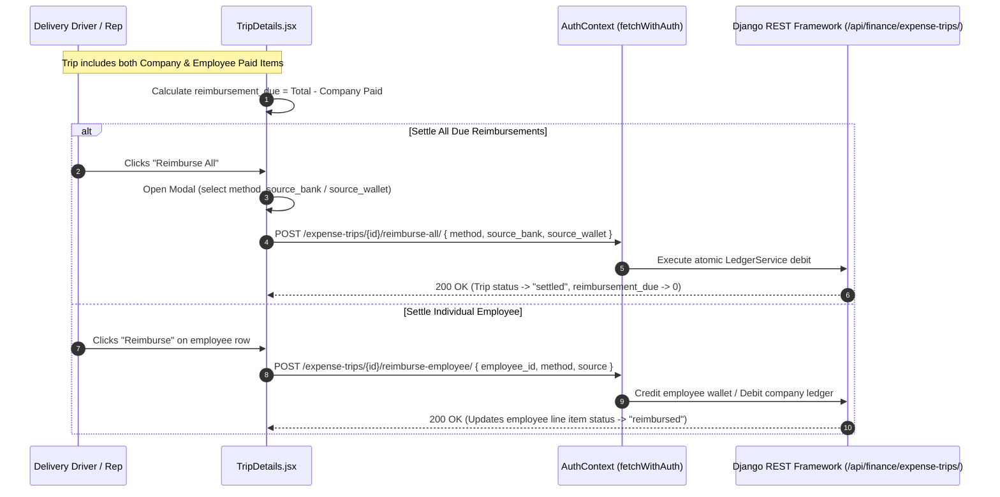

# FE-21: Expense Tracking, Category Allocation & Trips

> **Status**: APPROVED  
> **Domain**: Finance Domain  
> **Source Files**:  
> - `frontend/src/pages/finance/ExpenseList.jsx`  
> - `frontend/src/pages/finance/ExpenseList.css`  
> - `frontend/src/pages/finance/AddExpense.jsx`  
> - `frontend/src/pages/finance/AddExpense.css`  
> - `frontend/src/pages/finance/ExpenseDetails.jsx`  
> - `frontend/src/pages/finance/ExpenseDetails.css`  
> - `frontend/src/pages/finance/ExpenseCategories.jsx`  
> - `frontend/src/pages/finance/ExpenseCategories.css`  
> - `frontend/src/pages/finance/TripList.jsx`  
> - `frontend/src/pages/finance/TripDetails.jsx`  
> **Execution Order**: 39 of 45  

---

## 1. Architectural Role & Responsibilities

The `FE-21` unit governs operational company expenditures, category allocation schemas, and grouped trip logistics:
1. **Corporate Expense Ledger (`ExpenseList.jsx`)**: Filterable expenditure monitor built on `useServerList`, supporting category filtering, payment status tags (`paid`, `partial`, `unpaid`), date boundaries, and payee identification.
2. **Expense Ingestion Engine (`AddExpense.jsx`)**: Operational expenditure capture form validating payee entities, base amounts, tax components, total liabilities, and automatic payment status assignments.
3. **Expense Audit Command Center (`ExpenseDetails.jsx`)**: Comprehensive 594-line detail console managing dual status lifecycles (Payment Status vs Approval Status), manager step-up approvals, rejection modals with mandatory reason logging, and incremental ledger disbursements into bank accounts or cash wallets.
4. **Taxonomy & Category Master (`ExpenseCategories.jsx`)**: Hierarchical expense classification repository managing visual emoji tags, custom asset icons with multi-part file uploads, and active state toggles.
5. **Grouped Delivery Trip Hub (`TripList.jsx`, `TripDetails.jsx`)**: Field logistics and operational trip ledger consolidating multiple travel disbursements under a unified trip container, tracking company-funded payments versus employee out-of-pocket reimbursements.

---

## 2. Core Workflows & Financial Governance Protocols

### 2.1 Dual-Status Lifecycle & Approval Threshold Protocol

Every operational expense traverses two independent status state machines: Payment Status and Approval Status:

---

### 2.2 Trip Expense Settlement & Reimbursement Pipeline

In `TripDetails.jsx`, field travel expenses incur split financial liabilities, resolving through atomic settlement endpoints:

---

## 3. Data Contracts & Mathematical Invariants

### 3.1 Financial Component Catalog

| Component | Route / Mount | Target Endpoints | Data Dependencies | Primary Responsibilities |
| :--- | :--- | :--- | :--- | :--- |
| `ExpenseList` | `/finance/expenses` | `ENDPOINTS.FINANCE_EXPENSES`, `CATEGORIES` | `useServerList`, `useCurrency`, `Pagination` | Expense ledger grid with category/status filters, formatted date tags, and direct row navigation |
| `AddExpense` | `/finance/expenses/add` | `ENDPOINTS.FINANCE_EXPENSES`, `CATEGORIES` | `useAuth`, `useToast`, `useCurrency` | Expense creation form with automatic total amount derivation ($Amount + Tax$) and payee typing |
| `ExpenseDetails` | `/finance/expenses/:id` | `ENDPOINTS.FINANCE_EXPENSES + :id/` | `useAuth`, `useToast`, `useCurrency` | Multi-status tracker, ₹5,000 threshold approval/rejection modal, incremental payment recording |
| `ExpenseCategories` | `/finance/expense-categories` | `ENDPOINTS.FINANCE_EXPENSE_CATEGORIES` | `useAuth`, `useToast` | Category grid with emoji selectors, custom icon file uploads, and active status switches |
| `TripList` | `/finance/trips` | `ENDPOINTS.FINANCE_EXPENSE_TRIPS` | `useAuth`, `useCurrency`, `useToast` | Trip summary ledger displaying total spend, company burden, reimbursement due, and status chips |
| `TripDetails` | `/finance/trips/:id` | `ENDPOINTS.FINANCE_EXPENSE_TRIPS + :id/` | `useAuth`, `useToast`, `useCurrency` | Granular trip breakdown, line-item status monitor, single and batch employee reimbursement modals |

---

### 3.2 Trip Reimbursement Mathematical Formulations

Within `TripList.jsx` and `TripDetails.jsx`, liability metrics adhere to rigid accounting bounds:

$$\text{Trip Total Amount} = \sum_{j=1}^{m} \text{Item Amount}_j$$

$$\text{Company Burden} = \sum_{j \in \text{Company Paid}} \text{Item Amount}_j$$

$$\text{Reimbursement Due} = \sum_{k \in \text{Employee Paid}} \text{Item Amount}_k - \sum_{k \in \text{Reimbursed}} \text{Item Amount}_k$$

$$\text{Settlement Status} = \begin{cases} 
\text{settled} & \text{if } \text{Reimbursement Due} = 0 \\
\text{partial} & \text{if } 0 < \text{Reimbursement Due} < \sum_{k} \text{Item Amount}_k \\
\text{unsettled} & \text{if } \text{Reimbursement Due} = \sum_{k} \text{Item Amount}_k 
\end{cases}$$

---

## 4. Failure Modes & Edge Case Protections

| Failure Mode | Root Cause Scenario | Protective Architecture | System Outcome |
| :--- | :--- | :--- | :--- |
| **Unauthorized High-Value Payout** | Cashier attempts to disburse an expense $> \text{₹}5,000$ before managerial approval | Payment submission form in `ExpenseDetails.jsx` is disabled until `approval_status === 'approved'` | Premature ledger drainage is blocked; high-value outlays require verified sign-off |
| **Ambiguous Ledger Sourcing** | Operator submits a reimbursement with a cash method but selects a bank account ID | `handlePaymentSubmit` and `handleReimburseSubmit` validate: cash requires `source_wallet`; non-cash requires `source_bank` | Clean, non-polluted ledger payloads dispatch to DRF endpoints |
| **Trip Total Discrepancy on Currency Rounding** | Summing individual item amounts produces fractional paisa errors against overall trip totals | Values are clamped and formatted using `formatINR` with 2-decimal maximum fraction bounds | UI renders exact rupee and paisa parity across trip header cards and item tables |
| **Rejection Without Audit Justification** | Manager rejects an expense without stating the rationale, creating unresolvable dispute loops | `showRejectModal` forces input into `rejectReason`; API blocks submission if reason string is blank | Rejection audit trail records operator identity, timestamp, and explicit business rationale |
| **Custom Category Icon Upload Memory Trap** | Selecting an asset from the custom icon library repeatedly clones large image blobs | `selectFromLibrary` downloads blob once, wraps in native `File` object, and releases object URLs | Minimal memory footprint during category icon management |
