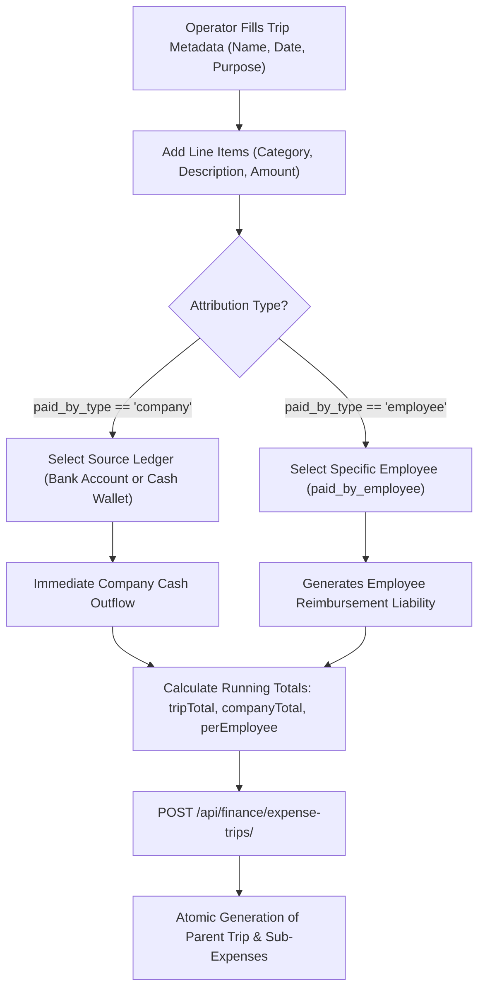
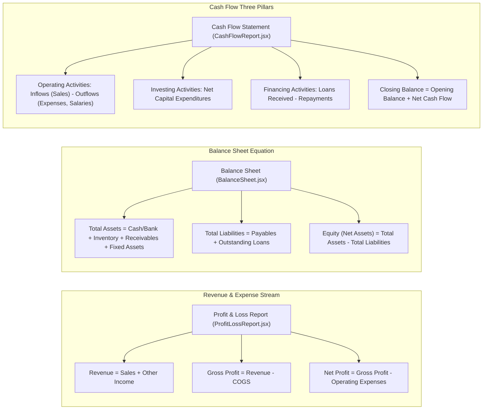

# FE-22: Trip Management, Budgets & Recurring Expenses

> **Status**: APPROVED  
> **Domain**: Finance Domain  
> **Source Files**:  
> - `frontend/src/pages/finance/CreateTrip.jsx`  
> - `frontend/src/pages/finance/RecurringExpenses.jsx`  
> - `frontend/src/pages/finance/CategoryBudgets.jsx`  
> - `frontend/src/pages/finance/IncomeCategories.jsx`  
> - `frontend/src/pages/finance/ExpenseReport.jsx`  
> - `frontend/src/pages/finance/ProfitLossReport.jsx`  
> - `frontend/src/pages/finance/ProfitLossReport.css`  
> - `frontend/src/pages/finance/BalanceSheet.jsx`  
> - `frontend/src/pages/finance/CashFlowReport.jsx`  
> - `frontend/src/pages/finance/CashFlowReport.css`  
> **Execution Order**: 40 of 45  

---

## 1. Architectural Role & Responsibilities

The `FE-22` unit provides the budgeting controls, periodic expenditure automation, delivery trip construction, and the formal financial statement reporting triad:
1. **Multi-Item Trip Provisioning (`CreateTrip.jsx`)**: Complex expenditure form builder allowing operators to group multiple delivery expenses with real-time financial attribution (company-funded ledger debits vs employee out-of-pocket claims).
2. **Periodic Expense Automation (`RecurringExpenses.jsx`)**: Recurring template engine supporting multiple scheduling frequencies (`daily`, `weekly`, `monthly`, `quarterly`, `yearly`) with immediate on-demand `/generate/` triggers.
3. **Category Spending Limits & Governance (`CategoryBudgets.jsx`)**: Budgetary control dashboard enforcing monthly spending caps with live utilization gauges, color-coded progress bars, and over-budget clamps.
4. **Non-Sales Revenue Classification (`IncomeCategories.jsx`)**: Master classification catalog for ancillary revenue streams (rent, scrap, bank interest) with active status switches.
5. **The Financial Statement Triad (`ProfitLossReport.jsx`, `BalanceSheet.jsx`, `CashFlowReport.jsx`, `ExpenseReport.jsx`)**: Corporate financial statement suite generating live P&L statements, balance sheets with fundamental equity equations, three-pillar cash flow statements, and category expense audits.

---

## 2. Core Workflows & Financial Ingestion Pipelines

### 2.1 Multi-Line Trip Creation & Attribution Architecture

When constructing a trip in `CreateTrip.jsx`, line items dynamically branch into separate accounting paths based on payment attribution:

---

### 2.2 Financial Statement Triad Architecture

The financial reporting suite maps directly to standard GAAP double-entry principles across flexible time periods:

---

## 3. Data Contracts & Mathematical Formulations

### 3.1 Component & Interface Catalog

| Component | Route / Mount | Target Endpoints | Data Dependencies | Primary Responsibilities |
| :--- | :--- | :--- | :--- | :--- |
| `CreateTrip` | `/finance/trips/new` | `ENDPOINTS.FINANCE_EXPENSE_TRIPS`, `BANKS`, `WALLETS` | `useAuth`, `useCurrency`, `useToast` | Multi-line trip builder, company vs employee attribution, running subtotal calculation |
| `RecurringExpenses` | `/finance/recurring` | `ENDPOINTS.FINANCE_RECURRING_EXPENSES` | `useAuth`, `useCurrency`, `useToast` | Periodic expense templates (daily, monthly, yearly), active toggles, manual `/generate/` trigger |
| `CategoryBudgets` | `/finance/budgets` | `ENDPOINTS.FINANCE_CATEGORY_BUDGETS` | `useAuth`, `useCurrency`, `useToast` | Budget cards with live utilization gauges, remaining limits, and edit/delete modals |
| `IncomeCategories` | `/finance/income-categories` | `ENDPOINTS.FINANCE_INCOME_CATEGORIES` | `useAuth`, `useToast` | Non-sales revenue categories, active switches, description tracking |
| `ExpenseReport` | `/finance/reports/expenses` | `ENDPOINTS.REPORTS_FINANCE + expense_report/` | `useAuth`, `useCurrency` | Period-based expense audit with category breakdowns and payment/approval distributions |
| `ProfitLossReport` | `/finance/reports/profit-loss` | `ENDPOINTS.REPORTS_FINANCE + pnl/` | `useAuth`, `useToast` | Periodic P&L statement, revenue breakdown, COGS deduction, operating expenses, net margin |
| `BalanceSheet` | `/finance/reports/balance-sheet` | `ENDPOINTS.REPORTS_FINANCE + balance_sheet/` | `useAuth`, `useToast` | Point-in-time balance sheet, asset/liability classifications, net equity derivation, CSV/XLSX export |
| `CashFlowReport` | `/finance/reports/cash-flow` | `ENDPOINTS.REPORTS_FINANCE + cash_flow/` | `useAuth`, `useToast` | Three-pillar cash flow statement, net cash flow calculation, opening/closing cash reconciliation |

---

### 3.2 Budget Utilization & Financial Invariant Mathematics

In `CategoryBudgets.jsx`, budget adherence is monitored via percentage quantization:

$$\text{Utilization Percentage} = \frac{\text{Spent Amount}}{\text{Budget Limit}} \times 100$$

$$\text{Remaining Budget} = \text{Budget Limit} - \text{Spent Amount}$$

$$\text{Progress Bar Theme} = \begin{cases} 
\text{\#ef4444 (Red)} & \text{if } \text{Utilization} \ge 100\% \\
\text{\#f59e0b (Amber)} & \text{if } 80\% \le \text{Utilization} < 100\% \\
\text{\#10b981 (Green)} & \text{if } \text{Utilization} < 80\% 
\end{cases}$$

$$\text{Balance Sheet Invariant: } \quad \text{Equity} \equiv \text{Total Assets} - \text{Total Liabilities}$$

---

## 4. Failure Modes & Edge Case Protections

| Failure Mode | Root Cause Scenario | Protective Architecture | System Outcome |
| :--- | :--- | :--- | :--- |
| **Trip Submission with Incomplete Attribution** | Submitting a trip item marked 'company' without selecting a bank account or cash wallet | Line item validator loops through all items; halts submission if `paid_by_type === 'company'` lacks ledger ID | Form halts with descriptive toast alert; zero phantom transactions reach the database |
| **Budget Utilization Division by Zero** | Admin creates a category budget with a limit of ₹0.00 | Component clamps calculation with fallback: `parseFloat(b.utilization_pct || 0)` | Utilization gauge safely renders 0.0% without NaN or UI crashes |
| **Cash Flow Negative Closing Balance Drift** | Severe operational outflows exceed opening reserves, resulting in negative cash | Net Cash Flow is formatted with semantic classes (`amount negative`) and wrapped in negative currency markers | Reports clearly display negative liquidity without mathematical distortion |
| **Recurring Expense Infinite Generation** | Repeatedly clicking "Generate" during slow network response spawns duplicate expense entries | Button is guarded by active state tracking: `disabled={generating === item.id}` | Only a single generation call dispatches; button locks until network resolution |
| **Export File Mime Type Mismatch** | Exporting Balance Sheet as Excel with CSV file extension breaks spreadsheet parsers | Suffix is derived from requested format: `formatParam = fmt === 'xlsx' ? '&file_format=xlsx' : ''` | Excel sheets download with `.xlsx` extension and proper binary headers |
