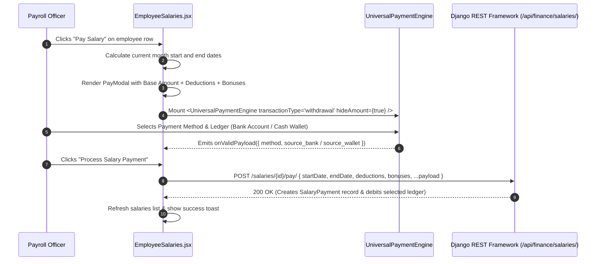
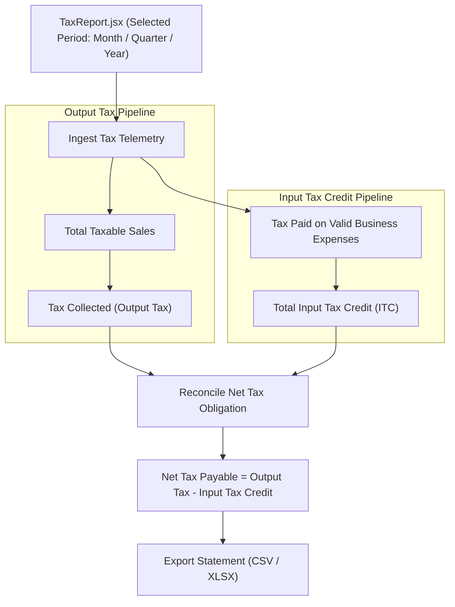

# FE-23: Financial Statement Reports & Payroll Ledger

> **Status**: APPROVED  
> **Domain**: Finance Domain  
> **Source Files**:  
> - `frontend/src/pages/finance/TaxReport.jsx`  
> - `frontend/src/pages/finance/EmployeeExpenses.jsx`  
> - `frontend/src/pages/finance/EmployeeExpenses.css`  
> - `frontend/src/pages/finance/EmployeeExpenseDetail.jsx`  
> - `frontend/src/pages/finance/EmployeeSalaries.jsx`  
> - `frontend/src/pages/finance/EmployeeSalaries.css`  
> - `frontend/src/pages/finance/LenderList.jsx`  
> - `frontend/src/pages/finance/LenderList.css`  
> - `frontend/src/pages/finance/LenderDetails.jsx`  
> - `frontend/src/pages/finance/LenderDetails.css`  
> **Execution Order**: 41 of 45  

---

## 1. Architectural Role & Responsibilities

The `FE-23` unit administers compliance tax reporting, employee expense reimbursements, corporate payroll disbursement, and financial lender profiles:
1. **GST Compliance & Tax Computation (`TaxReport.jsx`)**: Comprehensive tax assessment terminal reconciling Output Tax collected on customer sales against Input Tax Credit (ITC) paid on operating expenditures.
2. **Employee Expense Reimbursement Hub (`EmployeeExpenses.jsx`, `EmployeeExpenseDetail.jsx`)**: Staff expense tracking portal allowing employees to submit out-of-pocket claims with receipt uploads, supporting manager approval/rejection workflows and audited ledger reimbursements.
3. **Enterprise Payroll & Salary Execution (`EmployeeSalaries.jsx`)**: Corporate payroll manager integrating `<UniversalPaymentEngine />` to process monthly salary disbursements, apply bonuses and deductions, and maintain employee compensation baselines.
4. **Institutional Lender Master (`LenderList.jsx`)**: Financial lender directory tracking corporate credit facilities, contact officers, active loan portfolios, and total outstanding debt liabilities.
5. **Credit Facility Command View (`LenderDetails.jsx`)**: Lender profile console managing loan origination, terms, interest rates, duration, and associated repayment history.

---

## 2. Core Workflows & Payroll / Tax Pipelines

### 2.1 Corporate Payroll Execution via Universal Payment Engine

In `EmployeeSalaries.jsx`, processing a monthly salary payment delegates ledger sourcing and method validation to `<UniversalPaymentEngine />`:

---

### 2.2 Tax Compliance & Input Tax Credit (ITC) Formulation

`TaxReport.jsx` executes periodic tax reconciliations to determine net tax remittance:

---

## 3. Data Contracts & Payroll Formulations

### 3.1 Payroll & Lender Component Catalog

| Component | Route / Mount | Target Endpoints | Data Dependencies | Primary Responsibilities |
| :--- | :--- | :--- | :--- | :--- |
| `TaxReport` | `/finance/reports/tax` | `ENDPOINTS.REPORTS_FINANCE + tax_report/` | `useAuth`, `useToast` | Periodic tax report, Output Tax vs ITC computation, Net Tax Payable summary, CSV/Excel export |
| `EmployeeExpenses` | `/finance/employee-expenses` | `ENDPOINTS.FINANCE_EMPLOYEE_EXPENSES` | `useServerList`, `useAuth`, `useCurrency` | Employee expense queue, receipt inspection modal, manager approval/rejection, ledger reimbursement |
| `EmployeeExpenseDetail` | `/finance/employee-expenses/:id` | `ENDPOINTS.FINANCE_EMPLOYEE_EXPENSES + :id/` | `useAuth`, `useCurrency` | Granular claim review, receipt image lightbox, status audit timeline, rejection rationale display |
| `EmployeeSalaries` | `/finance/salaries` | `ENDPOINTS.FINANCE_SALARIES` | `useAuth`, `UniversalPaymentEngine`, `useCurrency` | Payroll directory, base compensation settings, salary payment modal with bonuses and deductions |
| `LenderList` | `/finance/lenders` | `ENDPOINTS.FINANCE_LENDERS` | `useAuth`, `useCurrency`, `useToast` | Lender institution table, active loan counts, total credit outstanding, new lender creation modal |
| `LenderDetails` | `/finance/lenders/:id` | `ENDPOINTS.FINANCE_LENDERS + :id/` | `useAuth`, `useCurrency`, `useToast` | Lender contact hub, credit facility creation form (principal, rate, term), loan portfolio list |

---

### 3.2 Net Salary Calculation & Tax Mathematical Invariants

In `EmployeeSalaries.jsx` and `TaxReport.jsx`, financial formulas adhere to rigid linear constraints:

$$\text{Net Salary Payable} = \text{Base Amount} + \text{Bonuses} - \text{Deductions}$$

$$\text{Net Tax Payable} = \max\left(0, \, \text{Tax Collected}_{\text{Sales}} - \text{Tax Paid}_{\text{Expenses}}\right)$$

$$\text{Excess Input Tax Credit} = \max\left(0, \, \text{Tax Paid}_{\text{Expenses}} - \text{Tax Collected}_{\text{Sales}}\right)$$

$$\text{Lender Total Outstanding} = \sum_{l=1}^{p} \text{Loan Remaining Balance}_l$$

---

## 4. Failure Modes & Edge Case Protections

| Failure Mode | Root Cause Scenario | Protective Architecture | System Outcome |
| :--- | :--- | :--- | :--- |
| **Negative Net Salary Disbursement** | Deductions entered by HR exceed Base Amount + Bonuses | Form validates `Net Salary Payable > 0`; blocks submission if deductions create negative pay | Payment submission is halted; prevents anomalous credit balances in employee ledgers |
| **Double Payout on Payroll** | Rapid multi-clicking on "Process Salary Payment" during network latency | Button disables immediately upon submission (`disabled={loading}`) with synchronous spinner | Only a single payment dispatches; duplicate bank/wallet debits are completely prevented |
| **Missing Tax Report Endpoint Crash** | Backend API returns 404/500 if the tax report endpoint is temporarily unmigrated | Frontend wraps call in try-catch with zeroed fallback state (`taxable_sales: 0, tax_collected: 0`) | Dashboard renders zero-state UI gracefully without throwing unhandled exceptions |
| **Reimbursement Without Account Ledger** | Admin approves employee reimbursement but fails to select a source bank or cash wallet | Reimbursement handler blocks execution: requires `source_wallet` for cash or `source_bank` for bank transfers | Rejection toast warns user; ledger integrity is preserved with zero unassigned payouts |
| **Overwriting Encrypted Lender Data** | Editing lender contact details accidentally blanks out existing bank routing codes | Component loads existing data into `editLenderData` state; submits explicit PATCH with verified fields | Non-modified financial attributes remain untouched on the backend |
