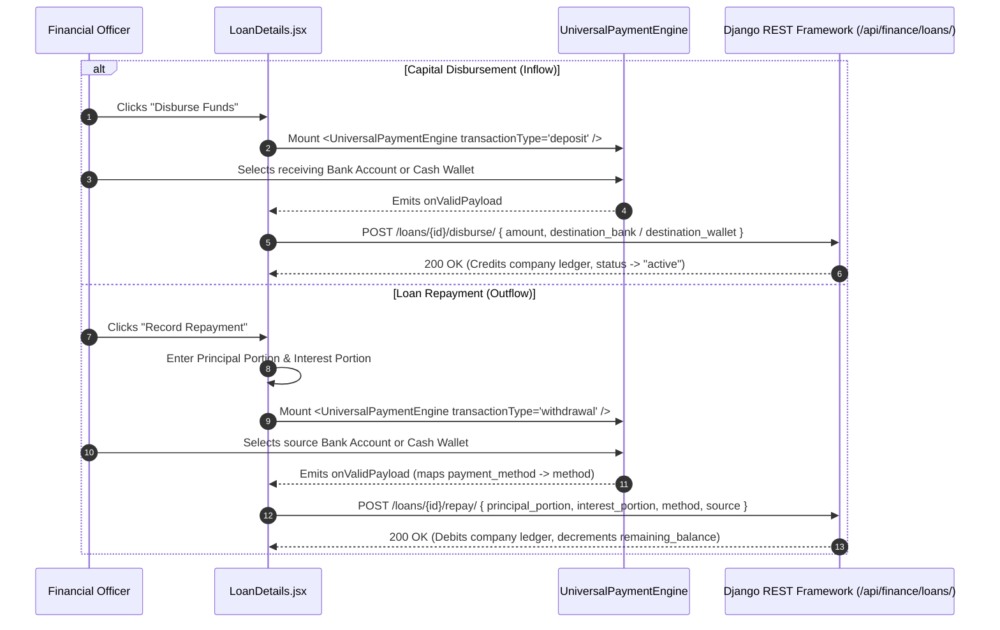
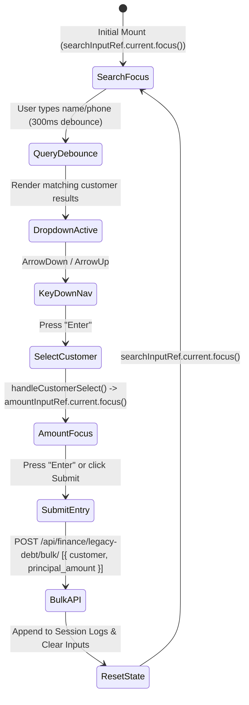

# FE-24: Loans, Debt Recovery & Legacy Ledger

> **Status**: APPROVED  
> **Domain**: Finance & Settings  
> **Source Files**:  
> - `frontend/src/pages/finance/LoanDetails.jsx`  
> - `frontend/src/pages/finance/LoanDetails.css`  
> - `frontend/src/pages/finance/LegacyDebtEntry.jsx`  
> - `frontend/src/pages/finance/LegacyDebtEntry.css`  
> - `frontend/src/pages/finance/LegacyDebtDashboard.jsx`  
> - `frontend/src/pages/finance/LegacyDebtDashboard.css`  
> - `frontend/src/pages/settings/SettingsIndex.jsx`  
> - `frontend/src/pages/settings/SettingsIndex.css`  
> - `frontend/src/pages/settings/shared.css`  
> **Execution Order**: 42 of 45  

---

## 1. Architectural Role & Responsibilities

The `FE-24` unit manages commercial debt facilities, rapid-fire legacy customer debt capture, historical recovery telemetry, and the administrative settings directory:
1. **Loan Lifecycle Command Center (`LoanDetails.jsx`)**: Comprehensive 433-line credit facility manager governing loan disbursements (capital inflow into bank/wallet ledgers) and repayments (splitting outflows into principal reduction and interest expense via `<UniversalPaymentEngine />`).
2. **High-Velocity Debt Ingestion Terminal (`LegacyDebtEntry.jsx`)**: Keyboard-optimized rapid-entry console designed for high-volume legacy customer debt migration, featuring debounced autocomplete, arrow-key navigation, enter-key focus transitions, and bulk array dispatch.
3. **The Accountant's Debt Recovery Dashboard (`LegacyDebtDashboard.jsx`)**: Specialized debt liquidation cockpit rendering total imported debt, cumulative recovery metrics, outstanding balances, circular SVG collection gauges, and Recharts distribution donut charts.
4. **Settings Master Directory (`SettingsIndex.jsx`, `shared.css`)**: Centralized configuration navigation pad organizing system administration into 10 dedicated management domains (Store, Employees, Finance, Data, Boundaries, Payments, Receipts, Notifications, Integrations, System Info).

---

## 2. Core Workflows & Debt Management Pipelines

### 2.1 Loan Capital Disbursement & Repayment Allocation

In `LoanDetails.jsx`, loan funds flow through distinct double-entry accounting transactions:

---

### 2.2 Rapid-Fire Legacy Debt Entry Pipeline

`LegacyDebtEntry.jsx` enforces a zero-mouse, keyboard-first focus flow to accelerate historical debt transcription:

---

## 3. Data Contracts & Mathematical Invariants

### 3.1 Component & Interface Catalog

| Component | Route / Mount | Target Endpoints | Data Dependencies | Primary Responsibilities |
| :--- | :--- | :--- | :--- | :--- |
| `LoanDetails` | `/finance/loans/:id` | `ENDPOINTS.FINANCE_LOANS + :id/` | `UniversalPaymentEngine`, `useAuth`, `useCurrency` | Loan details view, disbursement modal, principal/interest repayment recording, loan deletion |
| `LegacyDebtEntry` | `/finance/legacy-debt/entry` | `ENDPOINTS.CUSTOMERS`, `LEGACY_DEBT_BULK` | `useAuth`, `useCurrency`, `useToast` | Keyboard-driven rapid debt migration, debounced search, session history feed, autofocus loops |
| `LegacyDebtDashboard` | `/finance/legacy-debt` | `ENDPOINTS.LEGACY_DEBT + summary/` | `recharts`, `lucide-react`, `useAuth` | Debt recovery cockpit, total imported vs recovered cards, circular collection rate gauge, donut chart |
| `SettingsIndex` | `/settings` | Static Navigation Structure | `Link` (`react-router-dom`), `shared.css` | Administrative hub directing to 10 settings sub-domains with standardized icon cards |

---

### 3.2 Debt Collection & Amortization Formulations

Within `LegacyDebtDashboard.jsx` and `LoanDetails.jsx`, metrics satisfy strict financial formulas:

$$\text{Total Remaining Debt} = \text{Total Imported Debt} - \text{Total Recovered Debt}$$

$$\text{Collection Rate Percentage} = \frac{\text{Total Recovered Debt}}{\text{Total Imported Debt}} \times 100$$

$$\text{Repayment Total Outflow} = \text{Principal Portion} + \text{Interest Portion}$$

$$\text{Loan Remaining Principal} = \text{Original Principal} - \sum \text{Principal Repayments}$$

---

## 4. Failure Modes & Edge Case Protections

| Failure Mode | Root Cause Scenario | Protective Architecture | System Outcome |
| :--- | :--- | :--- | :--- |
| **UPE Payload Schema Mismatch on Repayment** | `<UniversalPaymentEngine />` outputs `payment_method`, but legacy loan repayment expects `method` | `LoanDetails.jsx` intercepts payload: `payload.method = payload.payment_method; delete payload.payment_method;` | Backend receives expected attribute names without validation rejections |
| **Disbursement Field Pollution** | Sending `payment_method` to the `/disburse/` endpoint triggers an unexpected argument error | Component explicitly cleans payload: `delete payload.payment_method` before POST | Disbursement dispatches strictly with destination bank/wallet attributes |
| **Rapid Data Entry Double-Submit Race** | Operator double-taps Enter on the amount input in `LegacyDebtEntry.jsx` | Guard `isSubmitting` flag locks entry execution until backend returns 201 response | Exactly one debt record is created per customer without duplicate liabilities |
| **Legacy Debt Negative Collection Rate** | Data import anomalies where recovered debt exceeds imported totals produce values $> 100\%$ | SVG circular chart clamps stroke dasharray: `${Math.min(collection_rate_pct, 100)}, 100` | Gauge renders cleanly without SVG clipping or layout distortion |
| **Focus Loss During Rapid Entry** | Browser drops active element focus after dynamic DOM rendering of dropdown items | `setTimeout` and explicit `.focus()` ref calls re-assert cursor focus into `amountInputRef` and `searchInputRef` | Operator can transcribe hundreds of debt records continuously without touching the mouse |
