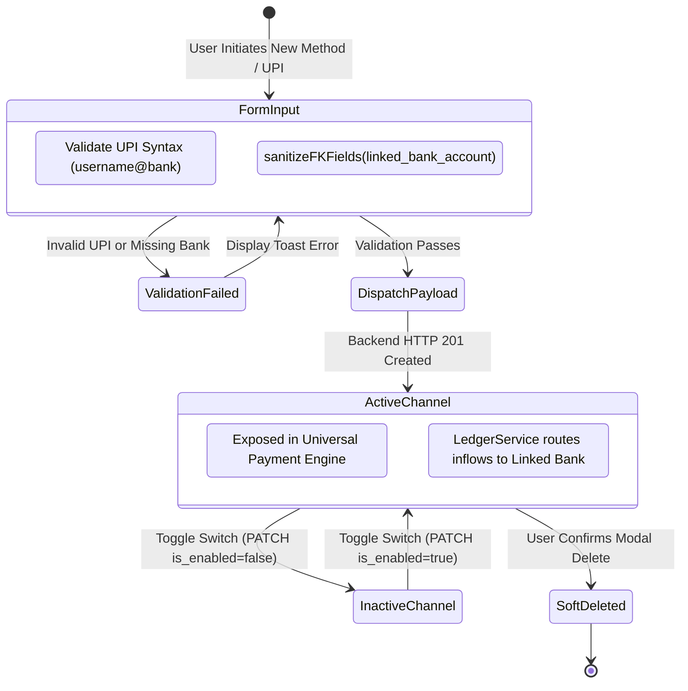

# Frontend Execution Unit Architecture: FE-25 — Store Settings, System Info & Tax Configuration

## 1. Domain Overview & Purpose
`FE-25` codifies the foundational configuration management suite in Books3, centralizing store identity, multi-tier taxation rules, financial settlement routing, UPI accounts, receipt layout customizer, notification triggers, and third-party integration gateways. These components govern systemic constants across all operational domains (POS checkout, invoicing, receipt PDF rendering, and bank ledger deposits).

### Member Files
1. `frontend/src/pages/settings/StoreSettings.jsx`
2. `frontend/src/pages/settings/StoreSettings.css`
3. `frontend/src/pages/settings/FinancialSettings.jsx`
4. `frontend/src/pages/settings/FinancialSettings.css`
5. `frontend/src/pages/settings/PaymentSettings.jsx`
6. `frontend/src/pages/settings/ReceiptSettings.jsx`
7. `frontend/src/pages/settings/ReceiptSettings.css`
8. `frontend/src/pages/settings/NotificationSettings.jsx`
9. `frontend/src/pages/settings/IntegrationSettings.jsx`

---

## 2. Architectural Data Flow & Component Hierarchy

```mermaid
flowchart TD
    subgraph ClientContext ["Client State & Hooks"]
        AuthCtx["useAuth() (fetchWithAuth)"]
        CurrCtx["useCurrency() (setCurrency)"]
        StoreCtx["useStoreSettings() (fetchStoreSettings)"]
        ToastCtx["useToast() (showToast)"]
    end

    subgraph SettingsPages ["Configuration Controllers"]
        SS["StoreSettings.jsx"]
        FS["FinancialSettings.jsx"]
        PS["PaymentSettings.jsx"]
        RS["ReceiptSettings.jsx"]
        NS["NotificationSettings.jsx"]
        IS["IntegrationSettings.jsx"]
    end

    subgraph BackendAPI ["Django REST API Gateway (api3.circleaz.in)"]
        EP_Store["/api/settings/store/"]
        EP_Tax["/api/settings/taxes/"]
        EP_PayMethod["/api/settings/payment-methods/"]
        EP_UPI["/api/settings/upi-accounts/"]
        EP_Receipt["/api/settings/receipt/"]
        EP_Notify["/api/settings/notifications/"]
    end

    SS -->|"Multipart FormData (Logo + Metadata)"| EP_Store
    FS -->|"Tax Rate CRUD & Default Radio"| EP_Tax
    PS -->|"Payment Methods & UPI ID Routing"| EP_PayMethod
    PS -->|"UPI Accounts CRUD"| EP_UPI
    RS -->|"Live Preview & Visibility Toggles"| EP_Receipt
    NS -->|"Event Dispatch Toggles"| EP_Notify

    SS -.->|"Sync Currency & Store State"| CurrCtx
    SS -.->|"Refresh Cache"| StoreCtx
```

---

## 3. Component Deep Dive & Invariant Mechanics

### 3.1 StoreSettings (`StoreSettings.jsx`, `StoreSettings.css`)
- **Multipart Brand Provisioning**: Handles store branding through a hybrid payload. Text fields (`name`, `address`, `phone`, `email`, `website`, `currency_symbol`, `timezone`, `gst_number`, `business_registration`) are combined with binary image files (`logo`) via native browser `FormData`.
- **Context Synchronization**: Upon successful response (`HTTP 200/201`), triggers synchronous context updates:
  - `setCurrency(formData.currency_symbol)`: Updates application-wide currency symbol without page reload.
  - `fetchStoreSettings()`: Forces edge cache eviction and refreshes the global navigation bar store header.
- **Safety Defaults**: Fallback defaults enforce Indian market conventions: `currency_symbol = '₹'`, `timezone = 'Asia/Kolkata'`.

### 3.2 FinancialSettings (`FinancialSettings.jsx`, `FinancialSettings.css`)
- **Tax Rate Matrix**: Master catalog for Goods and Services Tax (GST) definitions. Supports ad-hoc rate creation with decimal percentages (e.g. 5.00%, 12.00%, 18.00%, 28.00%).
- **Radio-Enforced Single Default**: Tax rate selection utilizes mutually exclusive radio buttons. Triggering `handleSetDefault(tax)` dispatches a `PATCH` payload `{"is_default": true}` to `/api/settings/taxes/{id}/`. The backend database enforces an atomic trigger clearing `is_default` across all sibling rows.
- **Cascading POS Integration**: Defines the default tax rate automatically injected into POS item checkout when products lack an explicit override.

### 3.3 PaymentSettings (`PaymentSettings.jsx`)
- **Payment Method & Bank Account Linkage**: Configures allowable payment channels (`cash`, `upi`, `card`, `bank`). Each non-cash channel requires an explicit `linked_bank_account` foreign key.
- **Foreign Key Sanitization Guard**: Employs `sanitizeFKFields(payload, ['linked_bank_account'])` before dispatch. Nullifies empty string selections (`"" -> null`) to prevent PostgreSQL UUID foreign key parsing crashes (`ValueError: badly formed hexadecimal UUID string`).
- **Dynamic UPI QR Code Routing**:
  - Validates merchant UPI IDs against strict syntax regex: `^[a-zA-Z0-9._-]+@[a-zA-Z0-9.-]+$`.
  - Maps incoming UPI settlements directly to designated bank ledgers (`linked_bank_account`), ensuring automated reconciliation in `<UniversalPaymentEngine />` checkout flows.
- **Active State Soft-Toggles**: Disabling a payment method (`PATCH {"is_enabled": false}`) suppresses its appearance in checkout terminals without deleting historical ledger audit references.

### 3.4 ReceiptSettings (`ReceiptSettings.jsx`, `ReceiptSettings.css`)
- **WYSIWYG Thermal Paper Simulation**: Implements a real-time 80mm receipt preview pane (`.receipt-paper`) alongside configuration controls.
- **Live Visibility Matrix**: Toggles control granular header/footer visibility:
  - `show_logo`: Displays store brand emblem at receipt head.
  - `show_address`: Prints physical storefront street address.
  - `show_gst`: Prints legal GSTIN identifier for B2B input tax claims.
  - `show_phone`: Prints customer support telephone line.
- **Dynamic Content Injection**: Real-time two-way data binding updates live preview text (`header_text`, `footer_text`) synchronously on every keystroke before committing changes via `POST /api/settings/receipt/`.

### 3.5 NotificationSettings (`NotificationSettings.jsx`) & IntegrationSettings (`IntegrationSettings.jsx`)
- **Event Dispatch Subscription**: Provides operational toggles for system notification triggers (Order Confirmations, Overdue Reminders, Low Stock Alerts, Debt Aging Notifications).
- **Recipient Role Masking**: Maps recipient clusters (`All Admins`, `Cashiers`, `Store Managers`) to notification channel events.
- **Third-Party Telemetry Pad**: Displays real-time operational status cards for peripheral gateways: Resend Transactional Email (`Connected`), SMS Gateway (`Not Configured`), WhatsApp Business API (`Coming Soon`), and Google Maps API (`Connected`).

---

## 4. State Machines & Validation Protocols

### Payment Method & UPI Routing State Machine

---

## 5. Security Guardrails & Edge Cases

1. **UUID Foreign Key Nullification**: In `PaymentSettings.jsx`, selecting the blank default ("Select a Bank Account") transmits an empty string `""`. Without `sanitizeFKFields`, Django DRF serializers throw `400 Bad Request` or Postgres aborts with UUID parsing failure. Sanitization strictly maps `""` to `null`.
2. **Thermal Receipt Overflow**: `ReceiptSettings.jsx` enforces CSS word-wrap and max-width constraints on the preview pane (`.receipt-preview`), preventing text overflow from distorting 80mm/58mm thermal print layouts.
3. **Optimistic Store Context Sync**: When currency symbol or store name changes, `StoreSettings.jsx` updates local React Context immediately before awaiting background re-fetches, preventing stale currency symbol rendering (`₹` vs `\$`) in active POS registers.
