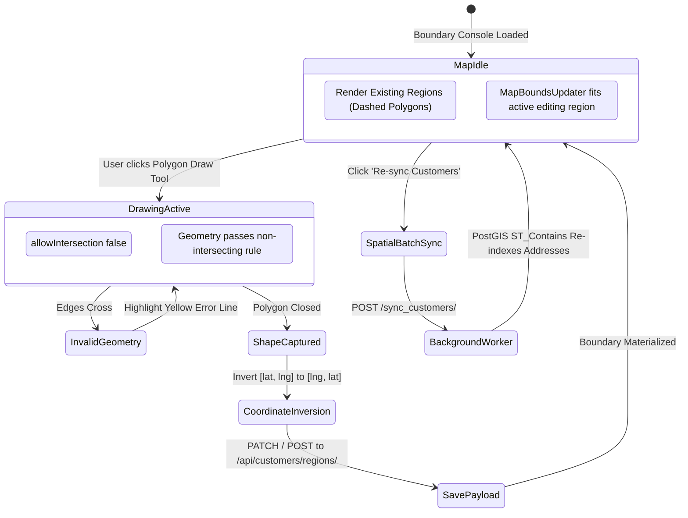

# Frontend Execution Unit Architecture: FE-26 — RBAC Administration & Data Management

## 1. Domain Overview & Purpose
`FE-26` codifies the administrative security, identity lifecycle, role-based access control (RBAC), disaster recovery safeguards, and spatial GIS geocoding boundaries in Books3. It serves as the primary enforcement layer protecting systemic integrity, preventing unauthorized privilege escalation, securing production data during maintenance operations, and managing spatial territory boundaries for automated customer assignment.

### Member Files
1. `frontend/src/pages/settings/EmployeeManagement.jsx`
2. `frontend/src/pages/settings/EmployeeManagement.css`
3. `frontend/src/pages/settings/RolesPermissions.jsx`
4. `frontend/src/pages/settings/RolesPermissions.css`
5. `frontend/src/pages/settings/DataManagement.jsx`
6. `frontend/src/pages/settings/DataManagement.css`
7. `frontend/src/pages/settings/SystemInfo.jsx`
8. `frontend/src/pages/settings/SystemInfo.css`
9. `frontend/src/pages/settings/GeographicBoundaries.jsx`
10. `frontend/src/pages/settings/GeographicBoundaries.css`

---

## 2. Architectural Data Flow & Security Hierarchy

```mermaid
flowchart TD
    subgraph SecurityControllers ["Administration Interfaces"]
        EM["EmployeeManagement.jsx"]
        RP["RolesPermissions.jsx"]
        DM["DataManagement.jsx"]
        SI["SystemInfo.jsx"]
        GB["GeographicBoundaries.jsx"]
    end

    subgraph BackendEndpoints ["Security & Administrative Gateways"]
        EP_Users["/api/settings/users/"]
        EP_Roles["/api/settings/roles/"]
        EP_Perms["/api/settings/roles/permissions/"]
        EP_ToggleUser["/api/settings/users/{id}/toggle_activation/"]
        EP_GeoRegions["/api/customers/regions/"]
        EP_GeoSync["/api/customers/regions/sync_customers/"]
    end

    subgraph SecurityLatches ["In-Browser Security Latches"]
        AdminLockout["Admin Setting Lockout Latch"]
        MaintLatch["Maintenance Mode Restore Gate"]
        DrawNoCross["Leaflet-Draw Edge Crossing Ban"]
    end

    EM -->|"CRUD Employee & Role Binding"| EP_Users
    EM -->|"Atomic Status Toggle"| EP_ToggleUser
    RP -->|"Fetch Roles & Granular Matrix"| EP_Roles
    RP -->|"Categorized Permission Schema"| EP_Perms
    RP -.->|"Protects Admin Settings"| AdminLockout
    DM -.->|"Locks API Writes on Restore"| MaintLatch
    GB -->|"Spatial Boundary GeoJSON"| EP_GeoRegions
    GB -->|"Trigger Topological Re-clustering"| EP_GeoSync
    GB -.->|"Enforces allowIntersection: false"| DrawNoCross
```

---

## 3. Component Deep Dive & Invariant Mechanics

### 3.1 EmployeeManagement (`EmployeeManagement.jsx`, `EmployeeManagement.css`)
- **Staff Directory & Identity Management**: Manages employee profiles (`username`, `email`, `first_name`, `last_name`, `role_ids`).
- **Conditional Password Mutation**: Password input is mandatory during initial employee provisioning (`required={!currentUser}`) but optional during profile edits (`required={false}`), ensuring existing password hashes are preserved when updating staff metadata.
- **One-Click Activation Toggle**: Dispatches `POST /api/settings/users/{id}/toggle_activation/` to immediately revoke or restore system access without deleting historical transaction attribution logs.

### 3.2 RolesPermissions (`RolesPermissions.jsx`, `RolesPermissions.css`)
- **Granular Permission Matrix**: Groups backend permissions by operational domain (`orders`, `finance`, `customers`, `inventory`, `settings`).
- **Dynamic Array Reconciliation**: Modifying a checkbox dynamically adjusts the permission codename array and dispatches an immediate `PATCH` request to `/api/settings/roles/{id}/`.
- **The Ironclad Admin Lockout Guard**:
  - Code expression: `disabled={role.is_system && role.name === 'Admin' && perm.category === 'settings'}`.
  - Hard UI and API boundary: Prevents accidental revocation of settings permissions for the system `Admin` role, eliminating administrative self-lockout scenarios.

### 3.3 DataManagement (`DataManagement.jsx`, `DataManagement.css`)
- **The Maintenance Mode Latch**: Implements a safety circuit breaker (`maintenanceMode` boolean toggle).
- **Destructive Operation Gating**: Data restore actions (`handleRestore`) are strictly blocked unless Maintenance Mode is active (`if (!maintenanceMode) { showToast("Maintenance Mode must be enabled to restore data.", "error"); return; }`).
- **Production Air-Gap Safeguard**: Hardcodes safety stubs and confirmation toasts on destructive data operations (`Reset All Data`), preventing accidental catastrophic truncate operations.

### 3.4 SystemInfo (`SystemInfo.jsx`, `SystemInfo.css`)
- **Runtime Environment Telemetry**: Collects active application details including `version`, `environment` (`import.meta.env.MODE`), `buildDate`, and backend health status.
- **Client Diagnostic Vector**: Captures client hardware platform (`navigator.platform`) and browser user-agent string (`navigator.userAgent`) to facilitate rapid remote debugging of POS hardware terminals.

### 3.5 GeographicBoundaries (`GeographicBoundaries.jsx`, `GeographicBoundaries.css`)
- **Leaflet-Draw Vector Spatial Engine**: Interactive GIS boundary editor using `react-leaflet` and `leaflet-draw`.
- **Coordinate System Inversion**: PostGIS GeoJSON stores geometries in `[longitude, latitude]` format. Leaflet requires `[latitude, longitude]`. All coordinates are mathematically mapped during rendering:
  \\[
  \text{LeafletCoord} = [\text{GeoJSONCoord}[1], \text{GeoJSONCoord}[0]]
  \\]
- **No-Intersection Geometry Invariant**: Enforces `allowIntersection: false` within `L.Control.Draw`. Any drawn polygon whose edges self-cross triggers an immediate error tooltip (`drawError: { color: '#e1e100', message: 'polygon edges cannot cross!' }`), preventing invalid OGC/PostGIS polygons from entering the database.
- **Stable Callback References**: Uses React `useRef` for event handlers (`onCreatedRef`, `onEditedRef`, `onDeletedRef`) inside native Leaflet event listeners (`L.Draw.Event.CREATED`, `EDITED`, `DELETED`), preventing memory leaks and stale closure bugs across React re-renders.
- **Topological Customer Sync**: Exposes `handleSyncCustomers` triggering `POST /api/customers/regions/sync_customers/`, running PostGIS `ST_Contains` spatial joins in the backend to re-index all customer addresses into updated regional boundaries.

---

## 4. State Machines & Operational Flows

### Geographic Boundary Drawing & Spatial Sync Lifecycle

---

## 5. Security Guardrails & Edge Cases

1. **Leaflet Event Listener Stale State**: Because native Leaflet event listeners are registered outside the React virtual DOM lifecycle, closures can capture initial component state. Binding latest callback functions to `useRef` pointers guarantees that boundary edits always operate on current state.
2. **Admin Privilege Self-Revocation**: Without the hardcoded `disabled` latch in `RolesPermissions.jsx`, an admin could uncheck administrative permissions, causing permanent loss of system settings access.
3. **Single Active Polygon Constraint**: `onCreated` in `GeographicBoundaries.jsx` clears pre-existing layers in the `FeatureGroup` before appending a newly drawn polygon (`fg.getLayers().forEach(l => fg.removeLayer(l))`), ensuring each region maps strictly to a single `Polygon` geometry.
