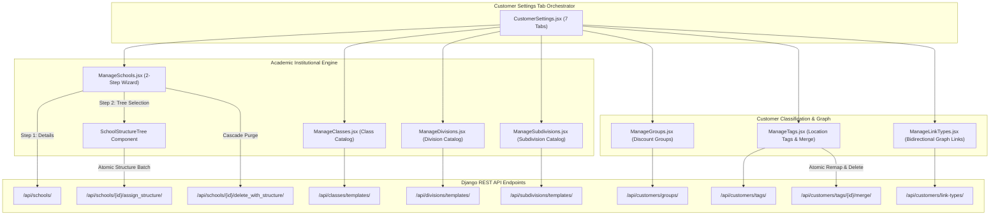
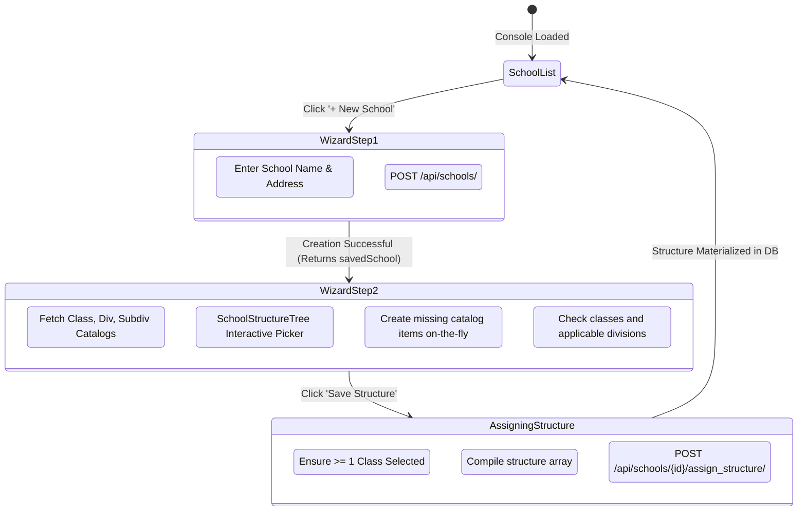

# Frontend Execution Unit Architecture: FE-27 — Academic & Customer Hierarchy Settings

## 1. Domain Overview & Purpose
`FE-27` codifies the academic institutional hierarchy and customer relationship taxonomy in Books3. It provides the structured foundation for managing educational institutional accounts (Schools, Classes, Divisions, Subdivisions), commercial customer segmentation (Customer Groups with discount percentage matrices), geographical delivery routing tags (with atomic merge operations), and complex social/commercial customer graph relationships (Bidirectional Link Types).

### Member Files
1. `frontend/src/pages/settings/CustomerSettings.jsx`
2. `frontend/src/pages/settings/CustomerSettings.css`
3. `frontend/src/pages/settings/ManageSchools.jsx`
4. `frontend/src/pages/settings/ManageClasses.jsx`
5. `frontend/src/pages/settings/ManageDivisions.jsx`
6. `frontend/src/pages/settings/ManageSubdivisions.jsx`
7. `frontend/src/pages/settings/ManageGroups.jsx`
8. `frontend/src/pages/settings/ManageTags.jsx`
9. `frontend/src/pages/settings/ManageLinkTypes.jsx`

---

## 2. Architectural Data Flow & Academic Structure Topology



---

## 3. Component Deep Dive & Invariant Mechanics

### 3.1 CustomerSettings Orchestrator (`CustomerSettings.jsx`, `CustomerSettings.css`)
- **Single-Page Tabbed Controller**: Houses the 7 discrete management panels under a unified navigation header.
- **Tab State Isolation**: Dynamic state mounting isolates sub-panel fetching, preventing parallel API flooding upon navigating to settings.

### 3.2 ManageSchools (`ManageSchools.jsx`)
- **Two-Step Onboarding Wizard**:
  - **Step 1 (School Details)**: Captures basic entity attributes (`name`, `address`). Upon initial creation (`POST /api/schools/`), transitions the interface directly to Step 2.
  - **Step 2 (Assign Structure)**: Renders `<SchoolStructureTree />`, enabling hierarchical selection of classes, divisions, and subdivisions.
- **Atomic Structure Assignment**: Compiles selected nodes into a nested JSON structure and dispatches `POST /api/schools/{id}/assign_structure/`:
  ```json
  {
    "structure": [
      {
        "class_name": "Class 10",
        "order": 10,
        "divisions": [
          { "name": "A", "subdivisions": ["Batch 1", "Batch 2"] },
          { "name": "B", "subdivisions": [] }
        ]
      }
    ]
  }
  ```
- **Cascade Purge Protection**: Provides `SCHOOL_DELETE_WITH_STRUCTURE(school.id)` (`DELETE` endpoint), which atomically clears all dependent student enrollments, academic classes, divisions, and subdivisions within an atomic database transaction.
- **Inline Catalog Ingestion**: Allows cashiers and managers to add missing class, division, or subdivision templates directly within the structure tree picker without navigating away from the school setup wizard.

### 3.3 Class, Division & Subdivision Catalog Management
- **ManageClasses (`ManageClasses.jsx`)**: Reusable catalog of grade levels. Enforces natural numeric sorting (`a.name.localeCompare(b.name, undefined, { numeric: true })`), ensuring `Class 2` renders before `Class 10`.
- **ManageDivisions (`ManageDivisions.jsx`)**: Reusable division letters/names (e.g. `A`, `B`, `Commerce`, `Science`) with optional `applicable_classes` foreign key filter bindings.
- **ManageSubdivisions (`ManageSubdivisions.jsx`)**: Granular lab batches or activity groups (e.g. `Biology Lab Group 1`, `Roll 1-30`) with `applicable_divisions` bindings.

### 3.4 Customer Groups & Commercial Discounting (`ManageGroups.jsx`)
- **Commercial Tiering**: Manages customer classification buckets (`Wholesale`, `Institutional`, `VIP Retail`).
- **Discount Percentage Invariant**: Defines `discount_percent` ($\ge 0\%$). When customers assigned to this group check out via POS terminals, the discount rate is automatically applied to eligible item lines.

### 3.5 Location Tags & Atomic Merge Engine (`ManageTags.jsx`)
- **Delivery Zone Segmentation**: Manages color-coded geographical tags (`Urban Central`, `Highway Belt`, `Industrial Zone`) attached to customer delivery addresses.
- **The Atomic Tag Merge Engine**:
  - Purpose: Resolves duplicate or consolidated delivery routes.
  - Lifecycle: Operator selects `mergeSource` and picks a `mergeTarget`.
  - Transactional Execution: The backend reassigns all customer addresses referencing `mergeSource` to `mergeTarget` and deletes `mergeSource` in a single atomic block, preventing dangling address references.

### 3.6 Bidirectional Customer Graph Links (`ManageLinkTypes.jsx`)
- **Dual-Name Relationship Definition**: Manages family and organizational graph edges.
- **Reciprocal Traversal Schema**: Requires both forward and reverse identifiers:
  - `name`: Forward relationship title (e.g. `Parent`, `Employer`, `School Head`).
  - `reverse_name`: Inverted relationship title (e.g. `Child`, `Employee`, `Student`).
- Enables graph queries across customer records (e.g. finding all children linked to a parent's credit account).

---

## 4. State Machines & Validation Protocols

### School Structure Onboarding & Assignment State Machine



---

## 5. Security Guardrails & Edge Cases

1. **Natural Numeric Class Ordering**: Standard string sorting places `Class 10` before `Class 2`. Natural alphanumeric comparison (`{ numeric: true }`) ensures accurate grade sequence display across all academic views.
2. **Atomic Tag Remapping**: Deleting a location tag without remapping would nullify address metadata. The merge engine guarantees that all customer addresses remain indexed before the source tag is removed.
3. **Empty Structure Assignment Latch**: In `ManageSchools.jsx`, if the user unchecks all classes, the submit action is rejected client-side (`if (structure.length === 0) { showToast('Select at least one class', 'error'); return; }`), preventing the creation of orphan school records with zero class attachments.
